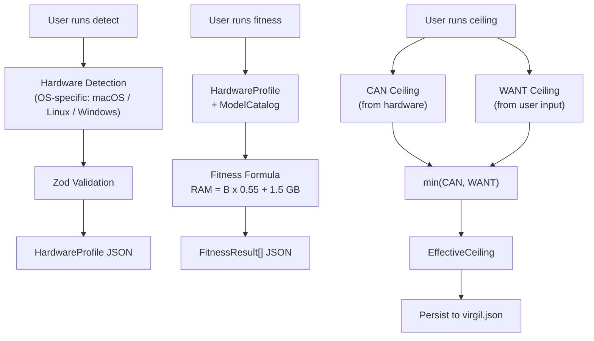
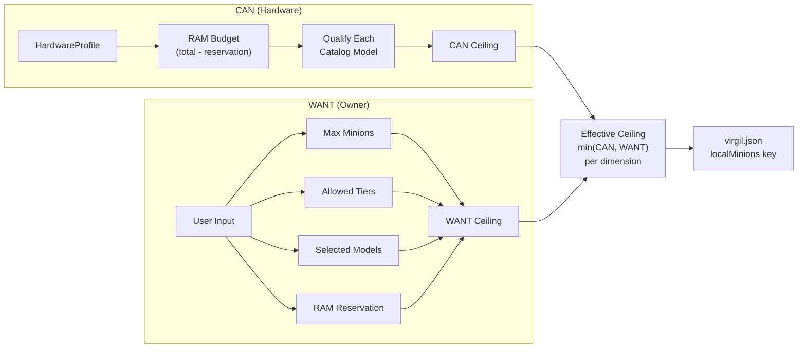
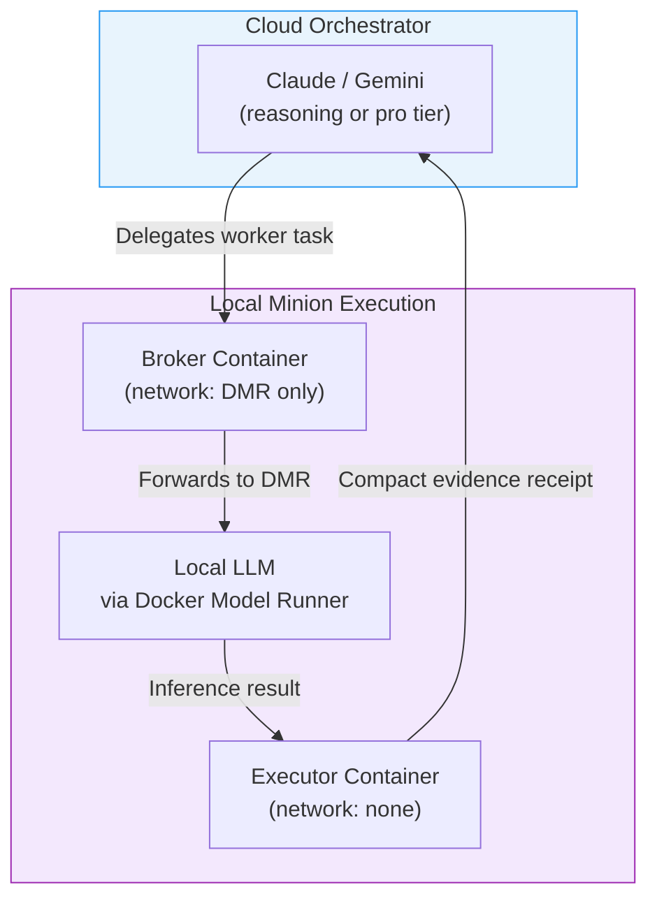

# AGENTS.md — Virgil Repository Agent Contract

## Menú

- [Purpose](#purpose)
- [Open Agentic Standard](#open-agentic-standard)
- [Language Policy](#language-policy)
- [Main Agent Rule](#main-agent-rule)
- [Agent Delegation Contract](#agent-delegation-contract)
- [Agent Acceptance Protocol](#agent-acceptance-protocol)
- [Orchestrator–Minion Model](#orchestratorminion-model)
- [Model-Tier Routing](#model-tier-routing)
- [Context Budget Governance](#context-budget-governance)
- [Capability Escalation](#capability-escalation)
- [Local Minions Probe](#local-minions-probe)
- [Handoff Rules](#handoff-rules)
- [Markdown Authoring Rules](#markdown-authoring-rules)
- [Repository Hygiene and Tool-Local State](#repository-hygiene-and-tool-local-state)
- [Development Commands](#development-commands)
- [Global Development Toolchain](#global-development-toolchain)
- [Exact Dependency Policy](#exact-dependency-policy)
- [Verification Policy](#verification-policy)
- [Commit Convention](#commit-convention)
- [Failure and Constraint Handling](#failure-and-constraint-handling)

---

## Purpose

This file is the canonical repository-level contract for agents working on **Virgil**.

It governs **how agents develop Virgil**.

It does not define the complete runtime orchestration behavior that Virgil will eventually provide to its users. Product-level agent orchestration belongs to the product architecture and its dedicated handoffs/specifications.

All agents operating in this repository must follow this file unless a more specific nested `AGENTS.md` narrows the rules for a subsystem.

`AGENTS.md` is owner-controlled canon. Agents must not modify it unless the project owner explicitly requests a change to the canon.

[↑ Menú](#menú)

---

## Open Agentic Standard

Virgil adopts the **AGENTS.md open standard** as its vendor-neutral repository instruction surface.

Canonical standard reference:

- https://agents.md/

The standard is stewarded by the **Agentic AI Foundation under the Linux Foundation** and is intended to provide a portable instruction surface across coding-agent ecosystems.

Repository rules:

1. Root `AGENTS.md` is the canonical project-wide agent contract.
2. Nested `AGENTS.md` files may narrow instructions for a subsystem only when genuinely necessary.
3. Tool-specific instruction files must not become independent policy sources.
4. If a harness does not natively discover `AGENTS.md`, a compatibility bridge may be introduced only to load or point to this file.
5. Compatibility bridges must not copy, fork, reinterpret, weaken, or override this contract.
6. Vendor-specific agent state is operational tooling, not repository canon.
7. A tool's inability to honor this contract must be reported as a harness limitation rather than silently worked around by creating a competing instruction system.

Acceptable compatibility strategies include a symlink, import/include mechanism, or minimal pointer supported by the active harness.

The objective is:

```text
one canonical open contract
→ many compatible agent harnesses
```

[↑ Menú](#menú)

---

## Language Policy

Human-facing communication with the project owner must default to:

```text
Spanish
```

Persistent project artifacts must use:

```text
International English
```

This includes:

- source code
- identifiers
- comments
- documentation
- schemas
- tests
- test descriptions
- reports
- handoffs
- architectural decisions
- commit-ready artifacts

The owner may explicitly override the conversation language for a particular interaction.

[↑ Menú](#menú)

---

## Main Agent Rule

The **Main Agent operates exclusively as a coordinator**.

The Main Agent must **never execute delegated work directly**.

The Main Agent may:

- clarify intent with the human
- decompose work
- define agent assignments
- instantiate or request minions/subagents
- route tasks
- maintain progress tracking
- inspect returned reports and evidence
- accept, reject, or request revision of agent output
- resolve conflicts between agent findings
- synthesize results from completed delegated work
- generate or update handoffs
- request human permission for gated capability escalation

The Main Agent must not directly:

- implement product code
- edit implementation files as a substitute for delegation
- perform repository-wide research
- crawl providers
- perform broad code search
- execute test suites as the acting worker
- perform QA work assigned to a QA agent
- perform implementation work assigned to an implementation agent
- silently absorb a rejected or failed minion assignment and execute it itself
- read repository files inline as a substitute for delegating a worker-tier reader
- accumulate raw tool output in its working context

If the active harness cannot create or delegate to subagents, the Main Agent must report the limitation instead of silently violating this rule.

[↑ Menú](#menú)

---

## Agent Delegation Contract

Every delegated agent must receive an explicit, auditable assignment.

Each agent must have:

1. **Name**
2. **Role**
3. **Persona**, when useful
4. **Bounded task**
5. **Scope**
6. **Out-of-scope boundaries**
7. **Expected deliverables**
8. **Acceptance criteria**
9. **Required evidence or verification**
10. **Applicable constraints**

Roles are intentionally open-ended.

Examples include, but are not limited to:

- QA Engineer
- Full-Stack Engineer
- Backend Engineer
- Frontend Engineer
- Tech Lead
- Scrum Master
- Security Reviewer
- SRE
- Researcher
- Technical Writer
- Release Engineer
- Photographer
- Clown
- Domain Specialist

There is no closed role taxonomy.

The Main Agent selects the role that best fits the assignment.

A whimsical or unconventional role is valid when it materially improves the task outcome. Roles must never be chosen merely for decoration.

A recommended assignment envelope is:

```yaml
agent:
  name: "<unique agent name>"
  role: "<task-appropriate role>"
  persona: "<optional task-helpful behavioral style>"

assignment:
  objective: "<one bounded objective>"
  scope:
    - "<included responsibility>"
  out_of_scope:
    - "<explicit exclusion>"
  inputs:
    - "<known input or reference>"
  deliverables:
    - "<required output>"
  acceptance_criteria:
    - "<auditable completion criterion>"
  evidence_required:
    - "<test, citation, report, diff, artifact, or other evidence>"
  constraints:
    - "<technical or policy constraint>"
```

Assignments should be small enough that success or failure can be determined from observable evidence.

[↑ Menú](#menú)

---

## Agent Acceptance Protocol

A delegated agent must be able to decide whether it can responsibly execute its assignment.

Before performing material work, the agent **must explicitly accept or reject** the assignment with one of:

```text
ACCEPTED
```

or:

```text
REJECTED: <reason>
```

Valid rejection reasons include:

- insufficient information
- missing access
- conflicting constraints
- task exceeds assigned authority
- task is not auditable as written
- dependency on unfinished upstream work
- unavailable required capability
- safety or policy conflict

A rejection is not a failure of orchestration.

It is structured feedback to the Main Agent.

The Main Agent may then:

- clarify the task
- narrow the scope
- add missing inputs
- change the assigned role
- create prerequisite work
- route the task to another agent

No material task execution begins before the assignment is accepted.

Agents must not silently broaden their assignment to compensate for missing requirements.

[↑ Menú](#menú)

---

## Orchestrator–Minion Model

Virgil repository work follows an **Orchestrator–Minion** operating model.

The Main Agent is the orchestrator.

Minions are bounded workers.

Conceptually:

```text
Human
  ↓
Main Agent / Orchestrator
  ├── Research Minion
  ├── Repository Minion
  ├── Implementation Minion
  ├── QA Minion
  ├── Documentation Minion
  └── Other task-specific Minions
        ↓
   compact evidence
        ↓
Main Agent / Orchestrator
```

The orchestrator owns:

- planning
- sequencing
- delegation
- coordination
- synthesis
- acceptance

Minions own:

- bounded execution
- evidence collection
- task-specific artifacts
- explicit status reporting

Independent assignments should be parallelized when the active harness supports it and doing so does not create coordination risk.

### Delegation Budget Declaration

Every delegated assignment must declare its resource envelope before launch. The assignment is incomplete without:

1. **Tier** — the capability tier and justification (per Model-Tier Routing).
2. **Scope** — bounded file/path/topic scope the minion may touch.
3. **Expected output size** — a ceiling on the deliverable (e.g., "structured report under 2 000 tokens", "diff under 500 lines").
4. **Turn limit** — maximum tool-call turns the minion may consume before returning a result or a bounded status report.

The orchestrator must not launch a minion whose assignment omits any of these declarations.

A minion that reaches its turn limit must stop, return what it has, and report the limit as a constraint — not silently continue, escalate, or restart.

[↑ Menú](#menú)

---

## Model-Tier Routing

Architecture and repository policy must use vendor-neutral capability tiers.

Initial tiers:

```text
worker
reasoning
pro
```

### Worker

Use for repetitive, mechanical, search-heavy, or token-heavy work.

Examples:

- crawling
- grep/search
- inventory
- extraction
- normalization
- classification
- metadata gathering
- repository triage
- document triage
- mechanical summarization

Concrete implementations may use small, cheap, fast, local, mini, flash, Haiku-class, or equivalent models.

### Reasoning

Use for:

- architecture
- synthesis
- conflict resolution
- non-trivial code reasoning
- implementation planning
- complex review
- handoff design

This is the normal tier for high-value reasoning.

### Pro

Reserve for exceptional cases where materially stronger reasoning is justified.

Model names must not be encoded into domain contracts.

### Default Tier Selection

The default tier for any task is the cheapest that covers its complexity.

The orchestrator must justify tier selection above `worker` for any delegated assignment. Absent explicit justification, the assignment runs at `worker`.

Common routing:

| Task | Tier |
| --- | --- |
| File reading, grep, search, inventory | worker |
| Documentation review | worker |
| Mechanical transformation, extraction | worker |
| Code implementation, test writing | reasoning |
| Architecture, synthesis, conflict resolution | reasoning |
| Adversarial review of implementation | reasoning |
| Novel design under high ambiguity | pro (requires escalation) |

### Tier Accountability

The orchestrator must record the tier selected for each delegated assignment and the justification for that selection.

Assignments that could run at `worker` but are dispatched at `reasoning` or higher without justification are a policy violation equivalent to the Main Agent executing work directly — both waste budget on the wrong actor.

When a session includes more than one `reasoning`-tier assignment in flight concurrently, the orchestrator must have estimated and reported the aggregate cost per Pre-Flight Cost Estimation before any launched.

[↑ Menú](#menú)

---

## Context Budget Governance

Context is a limited working set, not permanent storage.

Agents must actively protect signal density.

Prefer:

```text
bounded worker exploration
→ compact evidence
→ orchestrator synthesis
```

over:

```text
raw crawl output
→ raw crawl output
→ raw crawl output
→ giant orchestrator context
```

Agents should:

- delegate noisy exploration
- summarize completed exploration
- preserve provenance
- query Virgil/shared RAG before repeating discovery
- avoid copying large tool outputs between agents
- retain architectural decisions
- retain unresolved questions
- retain risks
- retain evidence references
- discard transient repetition when no longer useful

### Fleet and Session Budget Governance

The orchestrator must track cumulative token consumption across all active and completed minions within the session.

Hard rules:

1. **Concurrent fleet cap.** No more than three minions may be in flight simultaneously without explicit owner approval. The existing Pre-Flight Cost Estimation requirement applies at this threshold.
2. **Sequential launch.** When a coordinated task requires more minions than the concurrent cap, the orchestrator must launch them in bounded waves, synthesize results between waves, and present a progress checkpoint to the owner before the next wave.
3. **Session consumption awareness.** If the orchestrator estimates that cumulative session consumption has crossed 50% of the session budget, it must report remaining capacity and pending work to the owner before launching additional agents.
4. **No silent recovery.** A failed, timed-out, or budget-exhausted minion must not be silently relaunched, duplicated, or absorbed by the orchestrator. The failure is reported, and the owner decides the next action.
5. **Compact evidence only.** Minion results entering the orchestrator context must be compact evidence — status, deliverable references, affected paths, bounded diagnostics, and next action. Raw tool output, full file contents, and verbose logs are prohibited in the orchestrator thread.

These rules apply to all delegated work regardless of runtime — cloud, local, or hybrid. They strengthen and extend the Pre-Flight Cost Estimation requirement below.

### Pre-Flight Cost Estimation

Before launching three or more agents for a coordinated task, the orchestrator must:

1. estimate the total token cost of the planned agent fleet,
2. report the estimate to the owner,
3. wait for approval before launching.

This requirement applies to both simultaneous and sequential fleet launches within the same task. A task that will require six agents launched in two waves of three is a six-agent coordinated task and requires the full fleet estimate up front, not three separate approvals.

This prevents runaway token consumption from unreviewed multi-agent deployments.

The orchestrator must summarize sub-agent results into compact evidence. Raw tool output must not persist in the orchestrator thread.

Mechanical token-heavy work should preferentially use the `worker` tier.

Reasoning-tier agents should consume compact evidence whenever possible.

The objective is both:

- lower repeated token consumption
- higher reasoning signal quality

[↑ Menú](#menú)

---

## Capability Escalation

Escalation must be explicit and auditable.

Conceptual routing:

```text
worker → reasoning
```

may occur automatically when the assignment genuinely exceeds worker capability.

Escalation from:

```text
reasoning → pro
```

requires explicit human permission.

Before requesting `pro`, the agent must state:

1. what remains unresolved,
2. why the current tier is insufficient,
3. what additional capability is expected from `pro`,
4. why the expected value justifies escalation.

The agent must wait for approval.

No silent pro-tier escalation is allowed.

[↑ Menú](#menú)

---

## Local Minions Probe

The local minions probe system detects hardware capabilities and determines which local LLM models can serve as minions alongside cloud orchestrators. It enforces a dual-ceiling architecture: the hardware determines what **can** run, the owner declares what they **want**, and the effective ceiling is the minimum of both.

### Probe Flow



### CAN/WANT Ceiling Resolution



### Orchestrator-Minion Model with Local Models



### Tier Equivalence Catalog

| Virgil Tier | Cloud Class | Local Models |
| --- | --- | --- |
| worker | Haiku-class | Llama 3.1 (8B), Mistral 7B, Gemma 2 (9B) |
| reasoning | Sonnet/Fable-class | Qwen 3 (32B), Phi-4 (14B) |
| pro | Opus-class | Llama 3.3 (70B), Qwen 3 (72B), DeepSeek V3 |

### Fitness Formula

The RAM requirement for running a model locally is:

```text
RAM Required (GB) = (Parameters in Billions x 0.55) + 1.5
```

A model fits when the available RAM budget (total RAM minus the OS/application reservation) exceeds its computed requirement.

[↑ Menú](#menú)

---

## Handoff Rules

Significant implementation work should begin from a handoff.

A handoff must be:

- bounded
- auditable
- independently understandable
- evidence-oriented
- explicit about scope
- explicit about completion criteria

A receiving agent should not repeat discovery already represented in shared knowledge.

Handoffs should reference reusable knowledge rather than embedding uncontrolled context dumps.

Every handoff Markdown file must contain a **Progress Tracker** using checkboxes.

Example:

```md
## Progress Tracker

- [ ] Assignment accepted
- [ ] Preconditions verified
- [ ] Implementation complete
- [ ] Static verification passed
- [ ] Dynamic verification passed
- [ ] Evidence recorded
- [ ] Handoff completion report produced
```

The exact tracker may be adapted to the handoff, but a handoff without a progress tracker is incomplete.

[↑ Menú](#menú)

---

## Markdown Authoring Rules

Every project-owned Markdown file must contain a navigable menu near the beginning.

The heading must be:

```md
## Menú
```

or, when document hierarchy requires it:

```md
# Menú
```

Every authored section must end with:

```md
[↑ Menú](#menú)
```

This applies to:

- `AGENTS.md`
- handoffs
- architecture documents
- development documentation
- decision records
- reports intended to persist in the repository

Generated third-party Markdown, vendored content, package-generated reports, and externally sourced documents are exempt unless Virgil takes ownership of the file.

Handoffs have the additional Progress Tracker requirement defined above.

[↑ Menú](#menú)

---

## Repository Hygiene and Tool-Local State

Agent harnesses and helper tools may create local operational state.

That state must not become part of Virgil's source tree accidentally.

The bootstrap must create and maintain a root:

```text
.gitignore
```

before or atomically with the first tool-generated local state.

The following local state is explicitly ignored unless the project owner later promotes a specific artifact into versioned repository configuration:

```gitignore
# Agent/tool-local operational state
.atl/
.claude/
```

If any agent, minion, harness, plugin, CLI, IDE, test runner, or development tool introduces a new local-only file or directory:

1. classify whether the artifact is product source, deliberate shared configuration, generated output, cache, credentials, transcript, or local operational state,
2. if it is local/generated/private, update `.gitignore` in the same bounded change before or with its creation,
3. never commit credentials, tokens, sensitive transcripts, machine-local paths, caches, or disposable agent state,
4. do not promote tool-specific state into shared repository architecture merely because the active harness created it,
5. request explicit owner approval before committing a new vendor-specific agent configuration surface.

`.atl/` may be used locally by an agent or helper tool, but it is **not** a Virgil product dependency and must remain ignored by default.

`.claude/` is created by `gentle-ai install` and contains agent configuration, skills, and settings. It is agent-local operational state, analogous to `.atl/`. It must not become a second source of agent policy.

Shared compatibility configuration is allowed only when it materially improves interoperability and does not create a second source of agent policy.

`AGENTS.md` remains canonical.

Common build/test outputs must also be ignored rather than committed unless a handoff explicitly defines a versioned fixture.

[↑ Menú](#menú)

---

## Development Commands

Repository development uses pnpm.

Required root commands:

```text
pnpm i
pnpm build
pnpm test:static
pnpm test:dynamic
```

These are contributor/development requirements.

They are not prerequisites for end users consuming a released Virgil executable.

The preferred end-user distribution target is Node SEA.

[↑ Menú](#menú)

---

## Global Development Toolchain

Repository development requires global machine tools beyond the pnpm dependency graph.

These tools must be available on the development machine before repository bootstrap begins.

| Tool | Version | Purpose |
| --- | --- | --- |
| Node.js | 24.16.0 | Runtime |
| pnpm | 11.24.0 | Package manager |
| gentle-ai | 2.5.0 | Development quality toolchain |

All versions are exact, consistent with the Exact Dependency Policy. Upgrades are tracked changes.

### gentle-ai

`gentle-ai` provides receipt-driven development, agent configuration, and skill synchronization for the development workflow.

Rules:

1. `gentle-ai` is a machine-level prerequisite, like `node` or `pnpm`. It is not an npm dependency.
2. `gentle-ai` is not a Virgil runtime dependency. End users do not need it.
3. The `.claude/` directory created by `gentle-ai install` is agent-local operational state. It must be gitignored.
4. `AGENTS.md` remains the canonical open-standard agent contract. `.claude/` is a compatibility bridge, not a competing policy source.
5. Receipt-driven development is activated globally (`gentle-ai review mode enable --scope global`) and can be overridden to off per-clone (`gentle-ai review mode disable --scope clone`). The repository recommends but does not mandate activation.
6. `gentle-ai sync` aligns the agent configuration with the installed toolchain version. Synchronization is a developer maintenance operation, not an automated hook.

[↑ Menú](#menú)

---

## Exact Dependency Policy

All committed direct dependency specifications must use exact versions.

Forbidden examples:

```json
"package": "^1.2.3"
"package": "~1.2.3"
"package": ">=1.2.3"
"package": "*"
"package": "latest"
```

Required form:

```json
"package": "1.2.3"
```

The repository must configure pnpm so normal add/update workflows persist exact versions automatically.

The root `pnpm-workspace.yaml` must include the repository's exact-version persistence configuration.

Static verification must independently reject floating dependency specifications so manual edits cannot bypass the invariant.

Node and pnpm versions must themselves be pinned exactly.

[↑ Menú](#menú)

---

## Verification Policy

Development verification is mandatory for contributed implementation work.

### Static

`pnpm test:static` must include the repository's configured static gates, including:

- dependency/security audit with strict failure behavior
- ESLint
- Prettier verification
- TypeScript static verification
- exact dependency-spec validation

### Dynamic

`pnpm test:dynamic` must:

- exercise public behavior
- mock external systems at their boundaries
- verify external interactions when those interactions are part of the contract
- use assertions equivalent to `toHaveBeenCalledTimes(...)` and `toHaveBeenCalledWith(...)` where appropriate
- maintain greater than 97% meaningful production-code coverage
- emit machine-readable JSON artifacts
- emit a standalone human-readable HTML/SPA report
- validate normal Node runtime behavior
- validate the Node SEA artifact where packaging can materially change behavior

Coverage must not be inflated through meaningless exclusions.

### Testing Policy (Mandatory)

All tests must be app-level integration tests that bootstrap the application container (NestJS `Test.createTestingModule` or `CommandFactory.run`). Tests prove the system works through the dependency injection graph, not that isolated pieces parse correctly in a vacuum.

Isolated unit tests are prohibited. This includes:

- Schema validation tests that call `schema.parse()` / `schema.safeParse()` outside a container
- Factory function tests (e.g. `createUlid()`, `createTimestamp()`) in isolation
- Mock adapter tests not registered in a NestJS module
- Enum completeness assertions
- Barrel export verification
- Any `*.spec.ts` file co-located inside `src/` directories

Test files live in `test/` at the package root, never inside `src/`. Every test bootstraps the module under test and validates behavior through the DI container. For non-NestJS packages, "app-level" means testing through the package's public API entry point, not individual private functions.

GitHub Actions is authoritative.

Husky provides fast local guardrails.

### Review (Receipt-Driven Development)

When receipt-driven development is active (`gentle-ai review mode status` reports `on`), implementation changes pass through the review pipeline before delivery:

1. All source-mutating normalizers complete first.
2. All static and dynamic gates pass.
3. `gentle-ai review start` freezes the candidate.
4. The review lifecycle runs to completion or bounded correction.
5. The review receipt serves as delivery evidence.

Review is a quality layer, not a blocking gate when disabled. The developer controls activation per-clone.

Review does not replace static or dynamic verification. It adds an additional dimension that evaluates the change as a cohesive unit.

[↑ Menú](#menú)

---

## Commit Convention

Every commit message follows **Conventional Commits**.

### Format

```text
<type>: <title>

Brief description.

- Action item 1
- Action item n.
```

### Types

| Type | Use |
| --- | --- |
| `feat` | New features or capabilities |
| `fix` | Bug fixes |
| `chore` | Tooling, configuration, dependencies, CI |
| `task` | Changes to existing functionality |
| `spike` | Research or exploration |
| `release` | Version bumps generated by release automation |

### Rules

- Subject line uses imperative mood.
- Subject line is lowercase.
- Subject line has no trailing period.
- Subject line is at most 72 characters.
- Body is brief and followed by bullets describing concrete changes when useful.
- Do not add `Co-Authored-By` lines attributing work to AI agents.

[↑ Menú](#menú)

---

## Failure and Constraint Handling

Agents must surface constraints instead of hiding them.

When work cannot be completed, report:

- status
- blocker
- evidence
- affected acceptance criteria
- recommended next action

Do not fabricate successful verification.

Do not silently weaken acceptance criteria.

Do not silently expand scope.

Do not convert architectural uncertainty into an undocumented permanent decision.

The Main Agent must route unresolved uncertainty into:

- clarification,
- a spike,
- a dedicated handoff,
- or an explicit architectural decision.

[↑ Menú](#menú)
