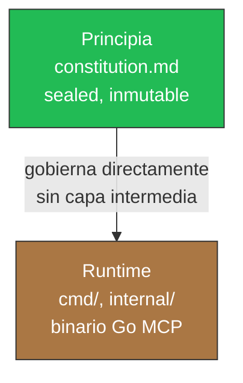
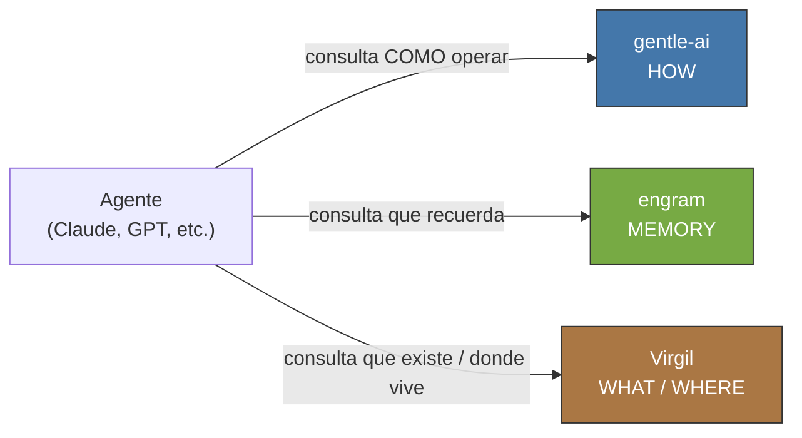
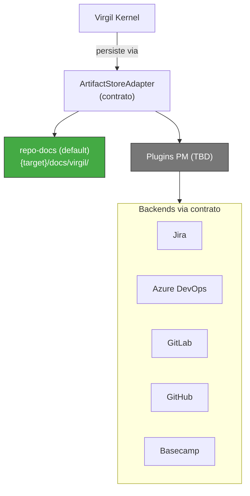

# Agentes

Instrucciones para agentes de IA que trabajan en este repositorio.

## Identidad del Proyecto

Virgil es un servidor MCP (Model Context Protocol) independiente: un binario Go
que actua como puente entre planificacion (PM) y codigo, con trazabilidad
historia-a-codigo verificable.

- **Valor central**: puente PM→codigo. Conecta la intencion declarada en un
  backlog (idea, requerimiento, tarea) con la evidencia de que el codigo la
  satisface.
- **Arquitectura**: patron adapter. `docs/` es el `ArtifactStoreAdapter` por
  defecto (repo-docs, sin dependencias externas); adapters adicionales
  conectan Jira, Azure DevOps, GitLab, GitHub, Basecamp u otro backend de PM
  mediante el mismo contrato.
- **Protocolo**: MCP / JSON-RPC, bajo el Open Agentic Standard. Publica
  `AGENTS.md` en el proyecto consumidor como convencion de discoverability.
- **Consumidores**: cualquier agente compatible con MCP — Claude, GPT,
  Gemini, OpenCode, Cursor, Windsurf, Kiro, y los que sigan. Virgil no acopla
  a un proveedor especifico.
- **Que Virgil NO es**: un framework de ejecucion, un implementador de
  codigo, ni una ceremonia obligatoria (no es Scrum Master). Virgil observa,
  informa y certifica evidencia; no dirige la ejecucion.

La autoridad normativa de este repositorio es el Principia
(`principia/constitution.md`). Este `AGENTS.md` traduce esa autoridad a
reglas operativas concretas para agentes que trabajan SOBRE Virgil (Modo
Desarrollo) o CON Virgil (Modo Consumo, en un proyecto externo).

## Mapa de Arquitectura

Dos capas, no tres. La capa Dogma (`docs/` como normativa intermedia) fue
retirada: el Principia es ahora la unica fuente de verdad normativa para el
propio Virgil. `docs/` sigue existiendo, pero como el `ArtifactStoreAdapter`
por defecto de PROYECTOS CONSUMIDORES — un concern de persistencia de
deliverables, no de gobierno de Virgil (ver seccion
[Adapter Pattern](#adapter-pattern)).

| Capa | Ubicacion | Autoridad | Estado en este branch |
|------|-----------|-----------|------------------------|
| Principia | `principia/constitution.md` (+ `principia/sections/`) | Constitucional. Sealed. No overrideable. | Presente |
| Runtime | `cmd/`, `internal/` (binario Go) | Implementacion. Se ajusta directamente al Principia, sin capa intermedia. | Retirado en `chore: clean slate — principia only` (`c64c70d`). Recuperable desde `main` |

**Precedencia**: Principia > Runtime. Si el codigo contradice el Principia,
el codigo esta mal. No existe capa intermedia que el codigo deba satisfacer
ademas del Principia: cualquier documento de diseno derivado (arquitectura,
protocolo, slices) es Runtime-adyacente y se deriva DEL Principia, no lo
sustituye ni se interpone entre Principia y Runtime.



## Ecosistema

Virgil es uno de tres pilares complementarios. Ninguno sustituye a los otros
dos.

| Pilar | Responde | Rol |
|-------|----------|-----|
| gentle-ai | COMO trabajan los agentes | Patrones de orquestacion, delegacion, ceremonia de sub-agentes |
| engram | Que recuerdan los agentes | Memoria persistente entre sesiones y compactaciones |
| Virgil | QUE existe y DONDE vive | Puente PM→codigo, trazabilidad, estado del proyecto |



Virgil no reemplaza memoria (engram) ni orquestacion (gentle-ai). Un agente
bien equipado consulta los tres: gentle-ai para saber COMO delegar, engram
para saber QUE se decidio antes, Virgil para saber QUE deliverable existe y
en que estado.

## Adapter Pattern

`docs/` NO es la unica opcion de persistencia — es el `ArtifactStoreAdapter`
por defecto. El contrato de adapter permite conectar cualquier backend de PM
sin modificar el Kernel.

### docs/ como default

El adapter `repo-docs` persiste deliverables (idea, requerimiento, design,
tasks) en `{target}/docs/virgil/` del proyecto consumidor: local, sin
dependencias externas, RAG-friendly por defecto. Es el unico adapter
implementado hoy (`internal/repodocs` en `main`, pendiente de re-derivar en
este branch).

### Superficie de plugin

| Adapter | Estado |
|---------|--------|
| repo-docs (`docs/`) | Implementado — default |
| Jira | Contrato definido, plugin TBD |
| Azure DevOps | Contrato definido, plugin TBD |
| GitLab | Contrato definido, plugin TBD |
| GitHub (Issues/Projects) | Contrato definido, plugin TBD |
| Basecamp | Contrato definido, plugin TBD |
| Custom | El consumidor puede implementar su propio adapter contra el contrato |



### Precedente de interfaz

`internal/agents/adapter.go` (en `main`) ya define el patron de interfaz que
un `ArtifactStoreAdapter` debe seguir: un `Adapter interface` con identidad,
deteccion, capabilities y operaciones — Open/Closed Principle, cada backend
nuevo es una implementacion adicional, nunca una rama condicional en el
codigo existente. Hoy `internal/repodocs` expone funciones de paquete
(`Init`, `Write`, `Transition`) directamente contra
`protocol.OperationRequest`; parte del trabajo de este pivote es extraer
esas funciones detras de una interfaz `ArtifactStoreAdapter` formal,
replicando el patron de `agents.Adapter`, antes de anadir el primer plugin
externo.

Contrato minimo que cualquier `ArtifactStoreAdapter` debe satisfacer:

- Persistir un deliverable con su revision y procedencia.
- Recuperar el estado actual de un deliverable o conjunto de deliverables.
- Ejecutar una transicion de lifecycle validando el gate correspondiente.
- Reportar existencia e inventario sin requerir lectura completa de
  contenido (soporta visibilidad escalonada, Principia seccion 8d).

## Convencion de Commits

Cada mensaje de commit sigue [Conventional Commits](https://www.conventionalcommits.org/).

### Formato

```text
<type>: Title

Brief description.

- Action item 1.
- Action item n.
```

### Tipos

| Tipo | Cuando usar |
|------|-------------|
| `feat` | New features or capabilities |
| `fix` | Bug fixes |
| `chore` | Tooling, config, dependencies, CI |
| `docs` | Documentation changes |
| `task` | Changes to existing functionality |
| `spike` | Research or exploration |
| `merge` | Integration merges between branches |

### Reglas

- Linea de asunto: modo imperativo, minusculas, sin punto final, maximo 72
  caracteres.
- Cuerpo: descripcion breve seguida de vinetas listando cada cambio
  concreto.
- Sin lineas de `Co-Authored-By` ni atribucion a IA.

## Prohibiciones para Agentes

**PROHIB-TOOLS:**

- PROHIBIDO: `cat`, `grep`, `find`, `sed`, `ls` — usar `bat`, `rg`, `fd`,
  `sd`, `eza`.
- PROHIBIDO: `brew install`, `apt install` — no instalaciones a nivel de
  sistema.
- PROHIBIDO: Co-Authored-By o atribucion a IA en commits.

**PROHIB-PATTERNS:**

- PROHIBIDO: unit tests con mocks internos (File/Unit tier). El tier
  primario es App/Servicio con stack real.
- PROHIBIDO: asumir que build artifacts existen de una ejecucion anterior.
  Build fresco antes de E2E.

**ECHO-GUARD:**

- OBLIGATORIO: pipeline canonico es
  `Setup(0) → Build(1) → Static(2) → Dynamic(3) → E2E(4)`. Nunca reordenar.
- OBLIGATORIO: un contexto puede SKIP pasos pero NUNCA cambiar el orden
  relativo.
- PROHIBIDO: ejecutar E2E sin Build previo en la misma sesion. Sin
  excepcion.

Violacion → kill inmediato. No se otorga segundo intento sobre la misma
violacion.

## Echo System

Pipeline determinista de 5 pasos. Se ejecuta en TODO ambiente (dev, CI, CD).
Los pasos son siempre los mismos y en el mismo orden. Lo que varia es el
scope.

### Pipeline Canonico

```text
0. Setup    → go mod download, go mod verify
1. Build    → go build ./...
2. Static   → go vet, golangci-lint, gofmt -l
3. Dynamic  → go test ./... (tier App/Servicio)
4. E2E      → tests de solucion completa (requiere artifacts de paso 1)
```

### Invariantes

1. **Nunca reordenar** — un contexto puede SKIP pasos pero nunca cambiar el
   orden relativo.
2. **Prerequisitos** — paso 4 (E2E) REQUIERE paso 1 (Build). Sin excepcion.
3. **Sin pasos fantasma** — cada paso del pipeline corresponde a un comando
   concreto.
4. **Build fresco** — nunca asumir que binarios o artifacts existen de una
   ejecucion anterior.

### Contextos de Ejecucion

| # | Contexto | Steps | Notas |
|---|----------|-------|-------|
| A | Dev Setup | 0 | Solo install |
| B | pre-commit | 2(parcial)+3 | Lint + tests rapidos. Sin build (velocidad) |
| C | pre-push | 1+2+3+4 | Pipeline completo |
| D | CI | 0+1+2+3+4 | Pipeline completo, canon estricto |

### Mapping de Comandos

| Paso canon | Comando |
|------------|---------|
| 0. Setup | `go mod download && go mod verify` |
| 1. Build | `go build ./...` |
| 2. Static | `go vet ./... && golangci-lint run` |
| 3. Dynamic | `go test ./...` |
| 4. E2E | `make test-e2e` (si existe) |

## Protocolo Anti-Racionalizacion

Las reglas en este documento son MECANICAS, no CONSULTIVAS. Un agente no
tiene autoridad para:

- Juzgar si una regla "aplica" basandose en tamano, complejidad o urgencia
  de la tarea.
- Inventar excepciones no escritas explicitamente ("demasiado pequeno para
  una rama", "solo es un cambio de config", "fix directa").
- Reinterpretar la intencion de una regla para justificar omitirla ("el
  espiritu de la regla no requiere esto aqui").
- Diferir el cumplimiento ("creo el handoff despues de este arreglo
  rapido").

### La Prueba de Racionalizacion

Antes de omitir, reducir o "escalar hacia abajo" CUALQUIER protocolo en este
documento:

1. **Citar el texto exacto** que autoriza la omision. No una parafrasis — la
   oracion exacta.
2. Si ninguna oracion exacta lo autoriza → la omision no esta autorizada.
   Punto final.
3. Si el agente se encuentra escribiendo frases como "esto no amerita",
   "esto es solo", "dada la simplicidad", "una excepcion para" o "en este
   caso podemos omitir" → senal de racionalizacion. Detenerse y cumplir tal
   como esta escrito.

### Reglas de Interpretacion

- La ambiguedad se resuelve a favor de MAS cumplimiento, no menos.
- "Escalar al trabajo" significa reducir volumen de contenido, nunca omitir
  requisitos estructurales.
- El silencio sobre un tema significa que aplica el protocolo por defecto,
  no que el agente tiene discrecion.
- El agente no puede otorgarse excepciones a si mismo. Solo una directiva
  explicita del usuario anula una regla, y el agente DEBE repetir la
  anulacion al usuario para confirmacion antes de actuar.

### Carga de la Prueba

La carga de la prueba por incumplimiento recae en el agente, no en el
documento. "El documento no dice explicitamente que debo" no es
justificacion valida para omitir. Si una lectura razonable implica la
obligacion, la obligacion existe.

## Politica de Asignacion de Modelos

Antes de lanzar un sub-agente, preguntar: ¿necesita RAZONAR, IMPLEMENTAR o
BUSCAR?

| Nivel | Modelo | Usar cuando |
|-------|--------|-------------|
| Busqueda | haiku | Grep, leer docs, lint checks, formato, lecturas exploratorias |
| Implementar | sonnet | Escribir codigo, tests, revisiones, verificar quality gates |
| Arquitecto | opus | Decisiones de diseno, resolucion de conflictos, sintesis multifuente |

Con 6+ agentes, la disciplina de niveles multiplica los ahorros. Nunca
quemar opus en un grep.

## Patron Orquestador-Minion

Patron de coordinacion donde un unico orquestador descompone el trabajo en
unidades discretas, delega cada una a trabajadores sin estado (minions),
recopila y valida resultados, y gestiona el estado del flujo de trabajo. El
orquestador mantiene el plan de ejecucion y el contexto global; los
trabajadores no conocen nada mas alla de su asignacion actual. Catalogado
formalmente como "Master-Slave" en POSA Vol. 1 (Buschmann et al., 1996);
instanciado en MapReduce, Sagas, Process Manager y Temporal.io.

### Principios

1. **Control centralizado, ejecucion distribuida** — el orquestador es
   dueno del DAG; los trabajadores son duenos solo de su unidad asignada.
2. **Trabajadores sin estado** — los trabajadores no retienen memoria entre
   invocaciones; todo contexto llega en el briefing.
3. **Briefings autocontenidos** — cada delegacion lleva todo lo que el
   trabajador necesita; el trabajador nunca busca su propio contexto.
4. **Ejecucion idempotente** — los trabajadores producen la misma salida
   para la misma entrada.
5. **Orquestador como fuente unica de verdad** — el estado global vive
   exclusivamente en el orquestador o en su almacen durable.
6. **Quality gates explicitos** — el orquestador valida cada resultado
   contra un contrato antes de incorporarlo; "se ve bien" no es
   verificacion.
7. **El orquestador nunca ejecuta** — descompone, asigna y agrega; ejecutar
   trabajo sustantivo infla el contexto y crea un cuello de botella.
8. **Inyectar reglas como texto, no como rutas** — los trabajadores reciben
   reglas pre-digeridas en su briefing; nunca leen archivos de
   configuracion ni registros.

### Contrato de Briefing

Cada delegacion del orquestador al trabajador DEBE incluir estos elementos:

| Elemento | Descripcion |
|----------|-------------|
| Task ID | Identificador unico para deduplicacion y seguimiento de reintentos |
| Input payload | Todos los datos requeridos, completamente resueltos |
| Output schema | Estructura exacta del resultado esperado |
| Scope boundaries | Que esta dentro del alcance Y que no lo esta |
| Done criteria | Condicion de parada explicita |
| Constraints | Timeout, limites de recursos, politica de reintentos |
| Context | Subconjunto minimo relevante del estado global |

### Contrato de Resultado

Cada respuesta del trabajador al orquestador DEBE conformarse a esta
estructura:

| Elemento | Descripcion |
|----------|-------------|
| Task ID | Devuelto para correlacion con el briefing original |
| Status | success / failure / partial |
| Payload | Salida estructurada conforme al schema solicitado |
| Errors | Tipificados (transitorio vs permanente) con mensaje descriptivo |
| Metadata | Duracion, consumo de recursos, senales de confianza |
| Artifacts | Salidas concretas e inspeccionables (no resumenes vagos) |

### Anti-Patrones de Orquestacion

1. **Orquestador verboso** — pasar contexto parcial, forzando al trabajador
   a solicitar mas informacion.
2. **Trabajadores con estado** — cachear datos entre invocaciones crea
   acoplamiento oculto.
3. **Orquestador como ejecutor** — realizar trabajo sustantivo infla el
   contexto del orquestador.
4. **Resultados sin validar** — aceptar la salida sin verificacion contra el
   contrato.
5. **Orden implicito** — depender del timing de ejecucion en lugar de
   dependencias explicitas del DAG.
6. **Briefings inflados** — enviar el estado global completo en lugar del
   subconjunto minimo relevante.
7. **Descomposicion telefono-descompuesto** — dividir por tipo de problema
   en lugar de por fronteras de contexto.

### Referencias

| Fuente | Contribucion |
|--------|-------------|
| Buschmann et al., _POSA Vol. 1_ (1996) | Primera entrada formal en catalogo de patrones (Master-Slave) |
| Garcia-Molina & Salem, SIGMOD '87 | Sagas — transacciones compensatorias orquestadas |
| Dean & Ghemawat, OSDI '04 | MapReduce — master-worker canonico a gran escala |
| Hohpe & Woolf, _EIP_ (2003) | Patron Process Manager en mensajeria |
| Temporal.io docs | Ejecucion durable: orquestador determinista + trabajadores sin estado |
| Anthropic, "Building Multi-Agent Systems" (2025) | Orquestador-trabajador como patron central multi-agente |

## Protocolo de Orquestacion

Este protocolo implementa el patron definido en
[Patron Orquestador-Minion](#patron-orquestador-minion).

### Principio de Orquestador Puro

El agente principal opera exclusivamente como coordinador. No ejecuta
tareas directamente.

| Accion | Inline (orquestador) | Delegar (sub-agente) |
|--------|----------------------|----------------------|
| Leer para decidir/verificar (1-3 archivos) | SI | — |
| Leer para explorar/entender (4+ archivos) | — | SI |
| Leer como preparacion para escribir | — | SI junto con la escritura |
| Escribir (cualquier archivo) | — | SI |
| Bash de solo lectura (git status, eza) | SI | — |
| Bash de ejecucion (go test, go build, make) | — | SI |
| Decisiones arquitectonicas (sin producir artefactos) | SI | — |
| Presentar resultados al usuario (MIM) | SI | — |

**Auto-deteccion**: si el orquestador se encuentra editando archivos,
escribiendo codigo o ejecutando builds, esta en violacion. Debe detenerse,
delegar la tarea a un sub-agente, y continuar como coordinador.

### Circuit Breaker de Supervision

La supervision de sub-agentes es reactiva, no proactiva.

**Pre-lanzamiento** — el orquestador incluye en cada prompt de delegacion:

- **Scope hint**: una linea que delimita el alcance.
- **Objetivo verificable**: una oracion evaluable binariamente contra el
  resultado.

**Post-resultado** — el orquestador evalua un solo invariante:

> ¿El resultado del sub-agente es coherente con el objetivo declarado y el
> scope hint?

| Estado | Condicion | Overhead |
|--------|-----------|----------|
| Cerrado (normal) | Resultados coherentes | Cero — delegar y esperar |
| Abierto (anomalia) | Invariante fallo | Alto — verificacion exhaustiva justificada |
| Semi-abierto (recuperacion) | Siguiente sub-agente con mismo scope recibe prompt reforzado | Medio — si pasa, volver a cerrado |

### Checkpoint Post-Delegacion (PDC)

Despues de recibir CADA resultado de un sub-agente, el orquestador ejecuta
estos 4 pasos EN ORDEN antes de cualquier otra accion:

1. **ECHO** — Imprimir los gates de aceptacion de esta tarea. Formato:
   `GATES: [gate1] | [gate2] | [gate3]`.
2. **VERIFY** — Para cada gate, declarar PASS o FAIL con UNA linea de
   evidencia. "Se ve correcto" NO es evidencia.
3. **MARK** — Persistir el estado del progreso AHORA.
4. **DECIDE** — Si algun gate es FAIL → no avanzar, re-delegar o corregir.
   Si todos los gates son PASS → `CHECKPOINT CLEAR`.

**Regla de cierre**: si el paso 3 no se completo, el orquestador NO tiene
permiso de lanzar otro sub-agente.

### Escalamiento por Rechazo

1. Gate falla → feedback especifico con evidencia → el agente corrige.
2. El mismo gate falla otra vez → kill + relanzar limpio con contexto del
   error.
3. Tercer fallo → el orquestador diagnostica la causa raiz y relanza con
   alcance reducido o escala al usuario.

## Reglas Compactas para Inyeccion en Sub-Agentes

Los orquestadores DEBEN inyectar estas reglas de forma literal en cada
prompt de sub-agente que escriba o revise codigo. No resumir, no
parafrasear.

### FORMO-CODE

```text
- Lenguaje: Go. Seguir convenciones idiomaticas de Go (gofmt, go vet).
- Herramientas CLI: bat, rg, fd, sd, eza. PROHIBIDO: cat, grep, find, sed, ls.
- Commits: conventional commits. Sin Co-Authored-By, sin atribucion IA.
- Imports: stdlib primero, luego terceros, luego internos. Separados por linea en blanco.
- Errores: retornar error, no panic. Wrap con fmt.Errorf("contexto: %w", err).
- Nombres: CamelCase para exportados, camelCase para internos. Sin prefijos de paquete en nombres.
- Documentacion publica: godoc idiomatico en toda funcion/tipo exportado.
```

### FORMO-TEST

```text
- Tier PRIMARIO: App/Servicio — stack real, sin mocks de dependencias internas.
- PROHIBIDO: unit tests con mocks internos (File/Unit tier). Valor = 0.
- Derivados (Module/Integration, Regression/Smoke): se filtran desde appTests, no se desarrollan aparte.
- E2E: solucion completa, cero mocks, multi-servicio.
- Condicional (Performance/Load): solo si design.md declara SLAs.
- Patron de trazabilidad: matriz de nombres estaticos importada por el codigo del test.
```

**Testing Matrix:**

| Tier | Tipo | Estado |
|------|------|--------|
| File/Unit | Mocks internos | PROHIBIDO |
| Module/Integration | Filtrado desde appTests | DERIVADO |
| App/Servicio | Stack real, sin mocks | PRIMARIO |
| Solution/E2E | Multi-servicio, cero mocks | EXPLICITO |
| Performance/Load | Solo si SLAs declarados | CONDICIONAL |

### FORMO-ANTI-DRIFT

```text
- Las reglas son MECANICAS, no CONSULTIVAS.
- Antes de omitir cualquier protocolo: citar el texto exacto que lo autoriza. Sin texto → sin omision.
- Frases como "esto no amerita", "dada la simplicidad", "en este caso podemos omitir" = senal de racionalizacion. STOP.
- Ambiguedad se resuelve a favor de MAS cumplimiento, no menos.
- El agente no puede otorgarse excepciones a si mismo.
- GP-4 (Principia): constraint > confianza. Gates enforceables, no promesas del agente.
```

## Protocolo de Recuperacion

Con el commit `chore: clean slate — principia only` (`c64c70d`), el Runtime
completo (`cmd/`, `internal/`, `docs/` de Virgil, CI, Docker, Makefile) fue
retirado del branch de trabajo, conservando unicamente `principia/` como
fuente de re-derivacion. El codigo previo no se perdio: vive integro en
`main`.

### Comando canonico

```bash
git checkout main -- <path>
```

Recupera un archivo o directorio especifico desde `main` hacia el working
tree actual, sin traer el resto del historial de `main`. Ejemplos:

```bash
git checkout main -- internal/mcp/
git checkout main -- internal/repodocs/repodocs.go
git checkout main -- cmd/virgil/main.go
```

### Cuando usarlo

- Al re-derivar Runtime desde el Principia y encontrar que una pieza
  (protocolo MCP, repodocs, adapters de host) ya tiene una implementacion
  valida en `main` que solo necesita alinearse al nuevo mapa de
  arquitectura, no reescribirse desde cero.
- Al verificar como se resolvia un problema similar antes del pivote, sin
  adoptar el codigo tal cual: leer, no copiar ciegamente. El codigo
  recuperado debe re-validarse contra el Principia vigente, no asumirse
  correcto por haber existido antes.

### Cuando NO usarlo

- Para recuperar `docs/` de Virgil como si fuera Dogma normativo — ese rol
  fue retirado (ver [Mapa de Arquitectura](#mapa-de-arquitectura)). Si se
  recupera contenido de `docs/architecture/` o `docs/protocol/` desde
  `main`, debe reinterpretarse como material de referencia para re-derivar
  diseno, no reinstalarse como autoridad.
- Sin pasar por Echo (build, static, dynamic) despues de la recuperacion.
  Codigo recuperado de `main` es codigo nuevo para este branch: build
  fresco y verificacion completa antes de integrarlo, igual que cualquier
  otro cambio.
