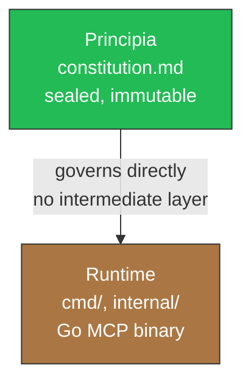

# Agents

Instructions for AI agents working in this repository.

## Project Identity

Virgil is an independent MCP (Model Context Protocol) server: a Go binary
that acts as a bridge between planning (PM) and code, with verifiable
story-to-code traceability.

- **Core value**: PM→code bridge. Connects the intent declared in a
  backlog (idea, requirement, task) with evidence that the code
  satisfies it.
- **Architecture**: adapter pattern. `docs/` is the default
  `ArtifactStoreAdapter` (repo-docs, no external dependencies); additional
  adapters connect Jira, Azure DevOps, GitLab, GitHub, Basecamp, or another PM
  backend through the same contract.
- **Protocol**: MCP / JSON-RPC, under the Open Agentic Standard. Publishes
  `AGENTS.md` in the consuming project as a discoverability convention.
- **Consumers**: any MCP-compatible agent — Claude, GPT,
  Gemini, OpenCode, Cursor, Windsurf, Kiro, and whatever follows. Virgil does
  not couple to a specific provider.
- **What Virgil is NOT**: an execution framework, a code implementer,
  or a mandatory ceremony (it is not a Scrum Master). Virgil observes,
  reports, and certifies evidence; it does not direct execution.

The normative authority of this repository is the Principia
(`principia/constitution.md`). This `AGENTS.md` translates that authority into
concrete operational rules for agents working ON Virgil (Development
Mode) or WITH Virgil (Consumption Mode, in an external project).

## Architecture Map

Two layers, not three. The Dogma layer (`docs/` as intermediate normative
authority) was retired: the Principia is now the sole normative source of
truth for Virgil itself. `docs/` still exists, but as the default
`ArtifactStoreAdapter` for CONSUMER PROJECTS — a deliverable-persistence
concern, not a Virgil governance concern (see the
[Adapter Pattern](#adapter-pattern) section).

| Layer | Location | Authority | State in this branch |
|------|-----------|-----------|------------------------|
| Principia | `principia/constitution.md` (+ `principia/sections/`) | Constitutional. Sealed. Not overrideable. | Present |
| Runtime | `cmd/`, `internal/` (Go binary) | Implementation. Conforms directly to the Principia, with no intermediate layer. | Retired in `chore: clean slate — principia only` (`c64c70d`). Recoverable from `main` |

**Precedence**: Principia > Runtime. If the code contradicts the Principia,
the code is wrong. There is no intermediate layer the code must satisfy
besides the Principia: any derived design document (architecture,
protocol, slices) is Runtime-adjacent and is derived FROM the Principia, it
does not replace it nor sit between Principia and Runtime.



## Ecosystem

Virgil is one of three complementary pillars. None replaces the other
two.

| Pillar | Answers | Role |
|-------|----------|------|
| gentle-ai | HOW agents work | Orchestration patterns, delegation, sub-agent ceremony |
| engram | What agents remember | Persistent memory across sessions and compactions |
| Virgil | WHAT exists and WHERE it lives | PM→code bridge, traceability, project state |


Virgil does not replace memory (engram) or orchestration (gentle-ai). A
well-equipped agent consults all three: gentle-ai to know HOW to delegate,
engram to know WHAT was decided before, Virgil to know WHAT deliverable
exists and in what state.

## Adapter Pattern

`docs/` is NOT the only persistence option — it is the default
`ArtifactStoreAdapter`. The adapter contract allows connecting any PM
backend without modifying the Kernel.

### docs/ as default

The `repo-docs` adapter persists deliverables (idea, requirement, design,
tasks) in `{target}/docs/virgil/` of the consuming project: local, with no
external dependencies, RAG-friendly by default. It is the only adapter
implemented today (`internal/repodocs` on `main`, pending re-derivation
in this branch).

### Plugin Surface

| Adapter | Status |
|---------|--------|
| repo-docs (`docs/`) | Implemented — default |
| Jira | Contract defined, plugin TBD |
| Azure DevOps | Contract defined, plugin TBD |
| GitLab | Contract defined, plugin TBD |
| GitHub (Issues/Projects) | Contract defined, plugin TBD |
| Basecamp | Contract defined, plugin TBD |
| Custom | The consumer can implement its own adapter against the contract |


### Interface Precedent

`internal/agents/adapter.go` (on `main`) already defines the interface
pattern an `ArtifactStoreAdapter` must follow: an `Adapter interface` with
identity, detection, capabilities, and operations — Open/Closed Principle,
each new backend is an additional implementation, never a conditional
branch in existing code. Today `internal/repodocs` exposes package
functions (`Init`, `Write`, `Transition`) directly against
`protocol.OperationRequest`; part of the work of this pivot is to extract
those functions behind a formal `ArtifactStoreAdapter` interface,
replicating the `agents.Adapter` pattern, before adding the first external
plugin.

Minimum contract any `ArtifactStoreAdapter` must satisfy:

- Persist a deliverable with its revision and provenance.
- Retrieve the current state of a deliverable or set of deliverables.
- Execute a lifecycle transition validating the corresponding gate.
- Report existence and inventory without requiring full content
  reading (supports tiered visibility, Principia section 8d).

## Commit Convention

Every commit message follows [Conventional Commits](https://www.conventionalcommits.org/).

### Format

```text
<type>: Title

Brief description.

- Action item 1.
- Action item n.
```

### Types

| Type | When to use |
|------|-------------|
| `feat` | New features or capabilities |
| `fix` | Bug fixes |
| `chore` | Tooling, config, dependencies, CI |
| `docs` | Documentation changes |
| `task` | Changes to existing functionality |
| `spike` | Research or exploration |
| `merge` | Integration merges between branches |

### Rules

- Subject line: imperative mood, lowercase, no trailing period, maximum 72
  characters.
- Body: brief description followed by bullet points listing each concrete
  change.
- No `Co-Authored-By` lines or AI attribution.

## Prohibitions for Agents

**PROHIB-TOOLS:**

- FORBIDDEN: `cat`, `grep`, `find`, `sed`, `ls` — use `bat`, `rg`, `fd`,
  `sd`, `eza`.
- FORBIDDEN: `brew install`, `apt install` — no system-level
  installations.
- FORBIDDEN: Co-Authored-By or AI attribution in commits.

**PROHIB-PATTERNS:**

- FORBIDDEN: unit tests with internal mocks (File/Unit tier). The
  primary tier is App/Service with a real stack.
- FORBIDDEN: assuming build artifacts exist from a previous run.
  Fresh build before E2E.

**ECHO-GUARD:**

- MANDATORY: the canonical pipeline is
  `Setup(0) → Build(1) → Static(2) → Dynamic(3) → E2E(4)`. Never reorder.
- MANDATORY: a context may SKIP steps but NEVER change the relative
  order.
- FORBIDDEN: running E2E without a prior Build in the same session. No
  exceptions.

Violation → immediate kill. No second attempt is granted on the same
violation.

## Echo System

Deterministic 5-step pipeline. Runs in EVERY environment (dev, CI, CD).
The steps are always the same and in the same order. What varies is the
scope.

### Canonical Pipeline

```text
0. Setup    → go mod download, go mod verify
1. Build    → go build ./...
2. Static   → go vet, golangci-lint, gofmt -l
3. Dynamic  → go test ./... (App/Service tier)
4. E2E      → full-solution tests (requires artifacts from step 1)
```

### Invariants

1. **Never reorder** — a context may SKIP steps but never change the
   relative order.
2. **Prerequisites** — step 4 (E2E) REQUIRES step 1 (Build). No exceptions.
3. **No phantom steps** — each pipeline step corresponds to a concrete
   command.
4. **Fresh build** — never assume binaries or artifacts exist from a
   previous run.

### Execution Contexts

| # | Context | Steps | Notes |
|---|----------|-------|-------|
| A | Dev Setup | 0 | Install only |
| B | pre-commit | 2(partial)+3 | Lint + fast tests. No build (speed) |
| C | pre-push | 1+2+3+4 | Full pipeline |
| D | CI | 0+1+2+3+4 | Full pipeline, strict canon |

### Command Mapping

| Canon step | Command |
|------------|---------|
| 0. Setup | `go mod download && go mod verify` |
| 1. Build | `go build ./...` |
| 2. Static | `go vet ./... && golangci-lint run` |
| 3. Dynamic | `go test ./...` |
| 4. E2E | `make test-e2e` (if it exists) |

## Anti-Rationalization Protocol

The rules in this document are MECHANICAL, not CONSULTATIVE. An agent
does not have the authority to:

- Judge whether a rule "applies" based on the size, complexity, or
  urgency of the task.
- Invent exceptions not explicitly written ("too small for a branch",
  "it's just a config change", "quick fix").
- Reinterpret the intent of a rule to justify skipping it ("the
  spirit of the rule doesn't require this here").
- Defer compliance ("I'll create the handoff after this quick fix").

### The Rationalization Test

Before skipping, reducing, or "scaling down" ANY protocol in this
document:

1. **Cite the exact text** that authorizes the omission. Not a
   paraphrase — the exact sentence.
2. If no exact sentence authorizes it → the omission is not authorized.
   Full stop.
3. If the agent finds itself writing phrases like "this doesn't
   warrant", "this is just", "given the simplicity", "an exception for"
   or "in this case we can skip" → a sign of rationalization. Stop and
   comply exactly as written.

### Interpretation Rules

- Ambiguity resolves in favor of MORE compliance, not less.
- "Scaling to the work" means reducing content volume, never skipping
  structural requirements.
- Silence on a topic means the default protocol applies, not that the
  agent has discretion.
- The agent cannot grant itself exceptions. Only an explicit user
  directive overrides a rule, and the agent MUST repeat the
  override back to the user for confirmation before acting.

### Burden of Proof

The burden of proof for non-compliance falls on the agent, not on the
document. "The document doesn't explicitly say I must" is not
valid justification for skipping. If a reasonable reading implies the
obligation, the obligation exists.

## Model Assignment Policy

Before launching a sub-agent, ask: does it need to REASON, IMPLEMENT, or
SEARCH?

| Level | Model | Use when |
|-------|--------|-------------|
| Search | haiku | Grep, reading docs, lint checks, formatting, exploratory reads |
| Implement | sonnet | Writing code, tests, reviews, verifying quality gates |
| Architect | opus | Design decisions, conflict resolution, multi-source synthesis |

With 6+ agents, tier discipline multiplies the savings. Never
burn opus on a grep.

## Orchestrator-Minion Pattern

Coordination pattern in which a single orchestrator decomposes work into
discrete units, delegates each one to stateless workers (minions),
collects and validates results, and manages workflow state. The
orchestrator holds the execution plan and the global context; the
workers know nothing beyond their current assignment. Formally
cataloged as "Master-Slave" in POSA Vol. 1 (Buschmann et al., 1996);
instantiated in MapReduce, Sagas, Process Manager, and Temporal.io.

### Principles

1. **Centralized control, distributed execution** — the orchestrator
   owns the DAG; workers own only their assigned unit.
2. **Stateless workers** — workers retain no memory between
   invocations; all context arrives in the briefing.
3. **Self-contained briefings** — every delegation carries everything the
   worker needs; the worker never searches for its own context.
4. **Idempotent execution** — workers produce the same output
   for the same input.
5. **Orchestrator as single source of truth** — global state lives
   exclusively in the orchestrator or its durable store.
6. **Explicit quality gates** — the orchestrator validates every result
   against a contract before incorporating it; "looks good" is not
   verification.
7. **The orchestrator never executes** — it decomposes, assigns, and
   aggregates; executing substantive work inflates the context and
   creates a bottleneck.
8. **Inject rules as text, not as paths** — workers receive
   pre-digested rules in their briefing; they never read configuration
   files or registries.

### Briefing Contract

Every delegation from the orchestrator to the worker MUST include these
elements:

| Element | Description |
|----------|-------------|
| Task ID | Unique identifier for deduplication and retry tracking |
| Input payload | All required data, fully resolved |
| Output schema | Exact structure of the expected result |
| Scope boundaries | What is in scope AND what is not |
| Done criteria | Explicit stopping condition |
| Constraints | Timeout, resource limits, retry policy |
| Context | Minimum relevant subset of global state |

### Result Contract

Every response from the worker to the orchestrator MUST conform to this
structure:

| Element | Description |
|----------|-------------|
| Task ID | Returned for correlation with the original briefing |
| Status | success / failure / partial |
| Payload | Structured output conforming to the requested schema |
| Errors | Typed (transient vs. permanent) with a descriptive message |
| Metadata | Duration, resource consumption, confidence signals |
| Artifacts | Concrete, inspectable outputs (not vague summaries) |

### Orchestration Anti-Patterns

1. **Verbose orchestrator** — passing partial context, forcing the
   worker to request more information.
2. **Stateful workers** — caching data between invocations creates
   hidden coupling.
3. **Orchestrator as executor** — performing substantive work inflates
   the orchestrator's context.
4. **Unvalidated results** — accepting output without verification against
   the contract.
5. **Implicit ordering** — relying on execution timing instead of
   explicit DAG dependencies.
6. **Bloated briefings** — sending the full global state instead of the
   minimum relevant subset.
7. **Broken-telephone decomposition** — splitting by problem type
   instead of by context boundaries.

### References

| Source | Contribution |
|--------|-------------|
| Buschmann et al., _POSA Vol. 1_ (1996) | First formal pattern-catalog entry (Master-Slave) |
| Garcia-Molina & Salem, SIGMOD '87 | Sagas — orchestrated compensating transactions |
| Dean & Ghemawat, OSDI '04 | MapReduce — canonical master-worker at scale |
| Hohpe & Woolf, _EIP_ (2003) | Process Manager pattern in messaging |
| Temporal.io docs | Durable execution: deterministic orchestrator + stateless workers |
| Anthropic, "Building Multi-Agent Systems" (2025) | Orchestrator-worker as the central multi-agent pattern |

## Orchestration Protocol

This protocol implements the pattern defined in
[Orchestrator-Minion Pattern](#orchestrator-minion-pattern).

### Pure Orchestrator Principle

The main agent operates exclusively as a coordinator. It does not
execute tasks directly.

| Action | Inline (orchestrator) | Delegate (sub-agent) |
|--------|----------------------|----------------------|
| Read to decide/verify (1-3 files) | YES | — |
| Read to explore/understand (4+ files) | — | YES |
| Read as preparation for writing | — | YES together with the writing |
| Write (any file) | — | YES |
| Read-only Bash (git status, eza) | YES | — |
| Execution Bash (go test, go build, make) | — | YES |
| Architectural decisions (producing no artifacts) | YES | — |
| Presenting results to the user (MIM) | YES | — |

**Self-detection**: if the orchestrator finds itself editing files,
writing code, or running builds, it is in violation. It must stop,
delegate the task to a sub-agent, and continue as coordinator.

### Supervision Circuit Breaker

Sub-agent supervision is reactive, not proactive.

**Pre-launch** — the orchestrator includes in every delegation prompt:

- **Scope hint**: one line that bounds the scope.
- **Verifiable objective**: one sentence that can be evaluated as a
  binary against the result.

**Post-result** — the orchestrator evaluates a single invariant:

> Is the sub-agent's result consistent with the stated objective and the
> scope hint?

| State | Condition | Overhead |
|--------|-----------|----------|
| Closed (normal) | Consistent results | Zero — delegate and wait |
| Open (anomaly) | Invariant failed | High — exhaustive verification warranted |
| Half-open (recovery) | Next sub-agent with the same scope receives a reinforced prompt | Medium — if it passes, return to closed |

### Post-Delegation Checkpoint (PDC)

After receiving EACH result from a sub-agent, the orchestrator executes
these 4 steps IN ORDER before any other action:

1. **ECHO** — Print this task's acceptance gates. Format:
   `GATES: [gate1] | [gate2] | [gate3]`.
2. **VERIFY** — For each gate, state PASS or FAIL with ONE line of
   evidence. "Looks correct" is NOT evidence.
3. **MARK** — Persist the progress state NOW.
4. **DECIDE** — If any gate is FAIL → do not proceed, re-delegate or
   correct. If all gates are PASS → `CHECKPOINT CLEAR`.

**Closure rule**: if step 3 was not completed, the orchestrator does NOT
have permission to launch another sub-agent.

### Rejection Escalation

1. Gate fails → specific feedback with evidence → the agent corrects.
2. The same gate fails again → kill + relaunch clean with the error's
   context.
3. Third failure → the orchestrator diagnoses the root cause and relaunches
   with reduced scope or escalates to the user.

## Compact Rules for Sub-Agent Injection

Orchestrators MUST inject these rules literally into every sub-agent
prompt that writes or reviews code. Do not summarize, do not
paraphrase.

### FORMO-CODE

```text
- Language: Go. Follow idiomatic Go conventions (gofmt, go vet).
- CLI tools: bat, rg, fd, sd, eza. FORBIDDEN: cat, grep, find, sed, ls.
- Commits: conventional commits. No Co-Authored-By, no AI attribution.
- Imports: stdlib first, then third-party, then internal. Separated by a blank line.
- Errors: return an error, do not panic. Wrap with fmt.Errorf("context: %w", err).
- Names: CamelCase for exported, camelCase for internal. No package prefixes in names.
- Public documentation: idiomatic godoc on every exported function/type.
```

### FORMO-TEST

```text
- PRIMARY tier: App/Service — real stack, no internal dependency mocks.
- FORBIDDEN: unit tests with internal mocks (File/Unit tier). Value = 0.
- Derived (Module/Integration, Regression/Smoke): filtered from appTests, not developed separately.
- E2E: full solution, zero mocks, multi-service.
- Conditional (Performance/Load): only if design.md declares SLAs.
- Traceability pattern: static-name matrix imported by the test code.
```

**Testing Matrix:**

| Tier | Type | Status |
|------|------|--------|
| File/Unit | Internal mocks | FORBIDDEN |
| Module/Integration | Filtered from appTests | DERIVED |
| App/Service | Real stack, no mocks | PRIMARY |
| Solution/E2E | Multi-service, zero mocks | EXPLICIT |
| Performance/Load | Only if SLAs declared | CONDITIONAL |

### FORMO-ANTI-DRIFT

```text
- Rules are MECHANICAL, not CONSULTATIVE.
- Before skipping any protocol: cite the exact text that authorizes it. No text → no omission.
- Phrases like "this doesn't warrant", "given the simplicity", "in this case we can skip" = a sign of rationalization. STOP.
- Ambiguity resolves in favor of MORE compliance, not less.
- The agent cannot grant itself exceptions.
- GP-4 (Principia): constraint > confidence. Enforceable gates, not agent promises.
```

## Recovery Protocol

With the commit `chore: clean slate — principia only` (`c64c70d`), the
entire Runtime (`cmd/`, `internal/`, Virgil's `docs/`, CI, Docker, Makefile)
was retired from the working branch, keeping only `principia/` as
the re-derivation source. The previous code was not lost: it lives intact
on `main`.

### Canonical Command

```bash
git checkout main -- <path>
```

Recovers a specific file or directory from `main` into the current
working tree, without bringing in the rest of `main`'s history. Examples:

```bash
git checkout main -- internal/mcp/
git checkout main -- internal/repodocs/repodocs.go
git checkout main -- cmd/virgil/main.go
```

### When to Use It

- When re-deriving the Runtime from the Principia and finding that a
  piece (MCP protocol, repodocs, host adapters) already has a valid
  implementation on `main` that only needs to be aligned to the new
  architecture map, not rewritten from scratch.
- When checking how a similar problem was solved before the pivot, without
  adopting the code as-is: read, do not blindly copy. Recovered code
  must be re-validated against the current Principia, not assumed
  correct simply because it existed before.

### When NOT to Use It

- To recover Virgil's `docs/` as if it were normative Dogma — that role
  was retired (see [Architecture Map](#architecture-map)). If
  content from `docs/architecture/` or `docs/protocol/` is recovered from
  `main`, it must be reinterpreted as reference material for re-deriving
  design, not reinstated as authority.
- Without going through Echo (build, static, dynamic) after the recovery.
  Code recovered from `main` is new code for this branch: a fresh build
  and full verification before integrating it, just like any
  other change.
