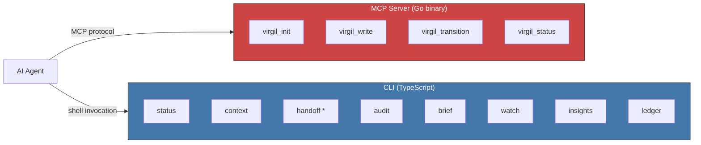
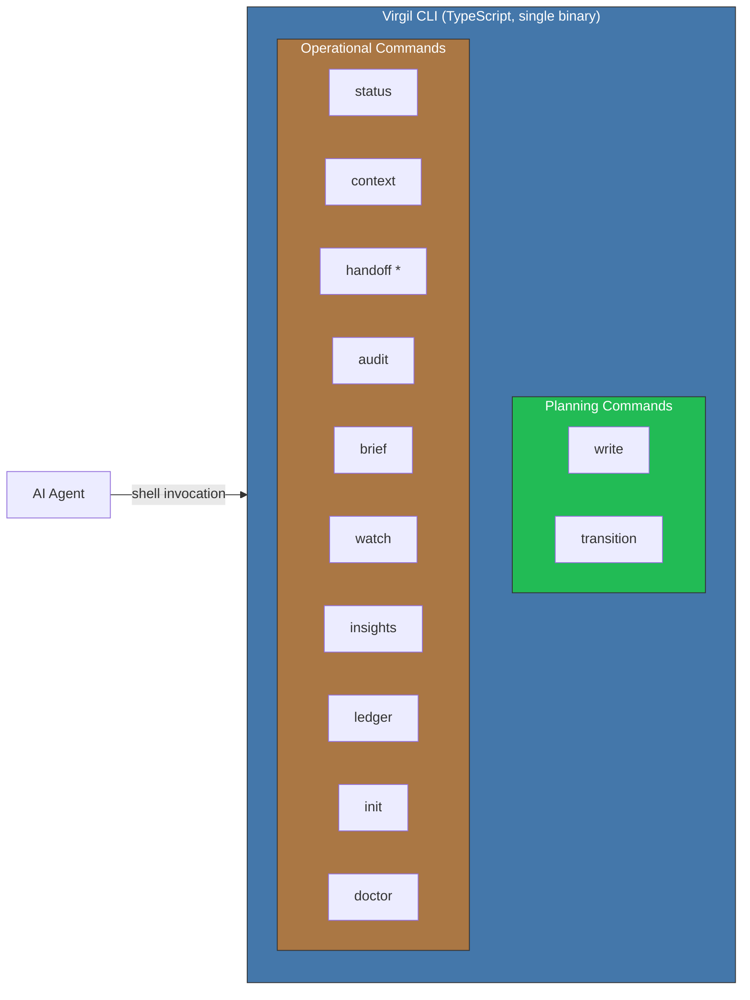
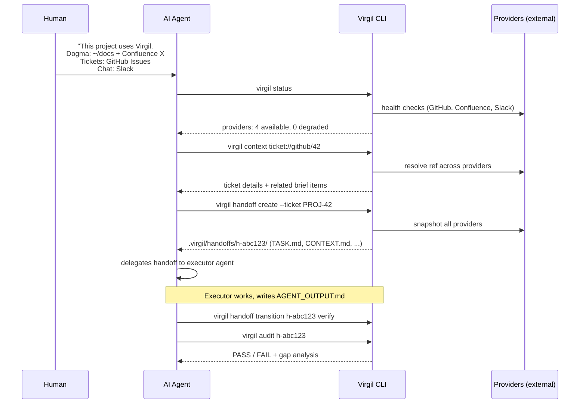
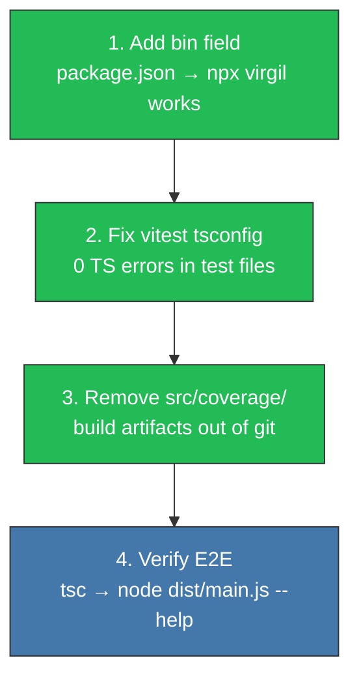
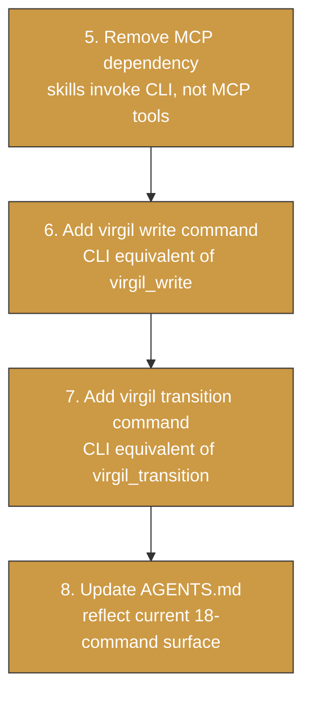
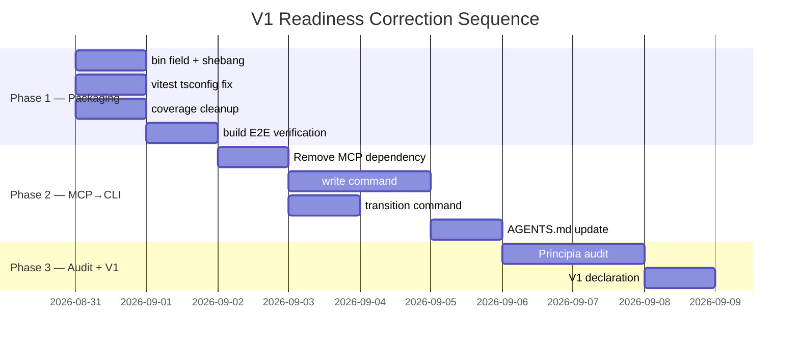

# Course Correction — V1 Readiness

Directional document. Captures architectural corrections required before
Virgil can be declared v1. Written 2026-08-31 after dogfooding session
exposed gaps in packaging, tooling, and interface boundaries.

- [Decision](#decision)
- [Before vs After](#before-vs-after)
- [Interaction Model](#interaction-model)
- [Correction Items](#correction-items)
- [Sequence](#sequence)

## Decision

Virgil is an **independent project that manages other projects**. It does not
couple into them. It does not inject itself as a server, plugin, or MCP
endpoint. An agent clones Virgil, installs it, and invokes it via CLI against
a target project's resources.

Two prior decisions converge here:

1. **Runtime MCP dropped** (decided during the Go → TypeScript pivot). The
   roadmap already lists "MCP server mode" as a Non-Goal for V1.
2. **Planning MCP dropped** (decided 2026-08-31). The MCP server that
   provided `virgil_init`, `virgil_write`, `virgil_transition`, and
   `virgil_status` is removed. These operations become CLI commands in the
   same binary.

Rationale for dropping planning MCP:

- Hardcoded absolute paths in `virgil.json` (doxes OS + username, breaks on
  any other machine)
- Overwrites hand-crafted `AGENTS.md` with a generic template
- Only covers 4 of 20+ operations — maintaining two interfaces for partial
  overlap
- Virgil's value is in the CLI tool, not in being an MCP server

[↑ Back to top](#course-correction--v1-readiness)

## Before vs After

### Before — Two Interfaces

Two interfaces, two languages, partial overlap. The agent must know which
interface to use for which operation.

### After — Single CLI

One interface, one language, one invocation pattern. Planning and operational
commands live in the same binary.

[↑ Back to top](#course-correction--v1-readiness)

## Interaction Model

How an agent uses Virgil on a target project:

Key properties:

- Virgil is invoked via shell — `virgil <command> [args]`
- Resources are configured via `.virgilrc.yaml` or env vars
- The agent tells Virgil WHERE things are; Virgil knows HOW to read them
- Handoffs are the output — structured context packages for other agents
- Virgil never executes code or modifies the target project

[↑ Back to top](#course-correction--v1-readiness)

## Correction Items

### Phase 1 — Packaging (do first, no architectural risk)

| # | Item | What | Risk |
|---|------|------|------|
| 1 | `bin` field | Add `"bin": {"virgil": "./dist/main.js"}` + shebang | Low |
| 2 | vitest tsconfig | Configure vitest globals → 0 TS errors | Low |
| 3 | coverage cleanup | `git rm -r --cached src/coverage/` + .gitignore | Trivial |
| 4 | build verify | `tsc && node dist/main.js --help` + 188 tests | Verification |

### Phase 1b — AGENTS.md Restoration (completed 2026-08-31)

AGENTS.md lost all orchestration, token economy, and sub-agent management
sections during the Go → TypeScript pivot. Restored from git history
(commit `9e1df9f`) and adapted:

- **Model Assignment Policy** — generic tier names (search/implement/architect)
  instead of vendor model names
- **Orchestrator-Minion Pattern** — briefing contract, result contract,
  anti-patterns, references (POSA, MapReduce, Sagas, Temporal)
- **Orchestration Protocol** — pure orchestrator, circuit breaker, PDC
- **FORMO-CODE** — adapted Go → TypeScript/NestJS
- **FORMO-TEST** — adapted Go → TypeScript/Vitest (zero-mock, app-level)
- **FORMO-ANTI-DRIFT** — language-agnostic, restored verbatim
- **Echo System** — adapted Go → TypeScript/npm pipeline
- **Anti-Rationalization Protocol** — restored verbatim
- **Architecture Map** — Principia > Dogma > Runtime precedence
- **Commit Conventions** — conventional commits, no AI attribution

### Phase 2 — MCP Removal + CLI Planning Commands (architectural)

| # | Item | What | Risk |
|---|------|------|------|
| 5 | MCP removal | Update virgil skills to invoke CLI instead of MCP tools | Medium |
| 6 | `write` command | Create/update docs (idea, requirement, design, task) via CLI | Medium |
| 7 | `transition` command | Task lifecycle transitions via CLI | Low |
| 8 | AGENTS.md update | Reflect full command surface including new planning commands | Low |

### Phase 3 — Principia Audit + V1 (deferred)

| # | Item | What | Risk |
|---|------|------|------|
| 9 | Principia adversarial audit | Verify all 12 sections against current implementation | High |
| 10 | V1 declaration | Version bump, npm publish readiness, changelog | Medium |

[↑ Back to top](#course-correction--v1-readiness)

## Sequence

Phase 1 items are independent and parallelizable. Phase 2 depends on Phase 1
completion (need working CLI first). Phase 3 depends on Phase 2 (need
complete command surface before auditing compliance).

[↑ Back to top](#course-correction--v1-readiness)
