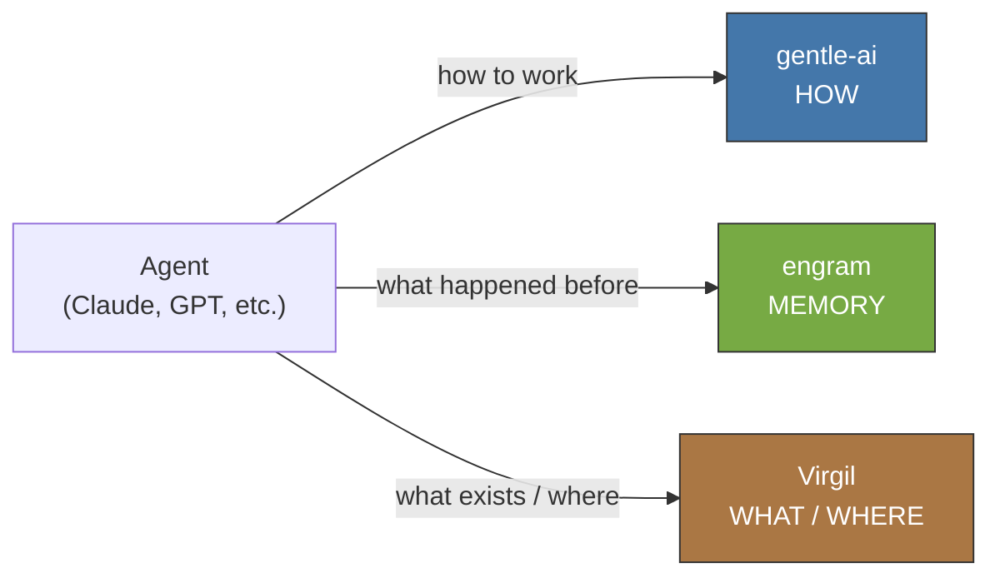
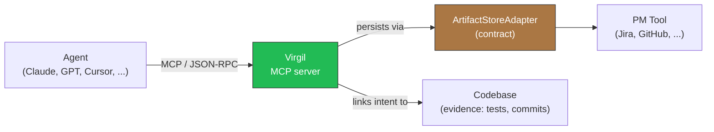

# Virgil

Virgil is an independent MCP server — a Go binary distributed as an autonomous process that any
MCP-compatible host can discover and invoke without additional coupling. It is the planning-to-codebase
bridge for AI-assisted development: it knows what a project's declared intent is (an idea, a requirement,
a task) and where in the codebase that intent gets satisfied, and it keeps the link between the two
traceable end to end. Virgil does not execute code, does not adopt ceremonial roles, and is not a
framework — it maintains identity, context, and lifecycle transitions, then gets out of the way.

## The Three Pillars

Virgil is one of three complementary pillars in the AI-assisted development ecosystem. None replaces
the other two.

| Pillar | Answers | Role |
| ------ | ------- | ---- |
| gentle-ai | HOW agents work | Review, receipt-driven development, orchestration patterns |
| engram | WHAT agents remember | Persistent memory across sessions and compactions |
| Virgil | WHAT exists and WHERE it lives | Planning-to-codebase bridge, with traceability |



## How It Works

Any MCP-compatible agent talks to Virgil over the Model Context Protocol. Virgil resolves the
project's declared intent through a `HostAdapter` and persists deliverables through an
`ArtifactStoreAdapter`, keeping a `TraceabilityGraph` that links intent to decision to work to evidence.



## Adapter Pattern

`docs/` is the default `ArtifactStoreAdapter` — repo-docs, zero external dependencies, RAG-friendly by
construction. External adapters (Jira, Azure DevOps, GitLab, GitHub Projects, Basecamp, and others) are
first-class extension points, not provisional features: their implementation status is independent of
their strategic priority.

| Adapter | Status |
| ------- | ------ |
| repo-docs (`docs/`) | Implemented — default |
| Jira | Contract defined, plugin TBD |
| Azure DevOps | Contract defined, plugin TBD |
| GitLab | Contract defined, plugin TBD |
| GitHub (Issues/Projects) | Contract defined, plugin TBD |
| Basecamp | Contract defined, plugin TBD |
| Custom | Consumers can implement their own adapter against the contract |

Whatever satisfies the `ArtifactStoreAdapter` contract can be plugged in — persist a deliverable with its
revision and provenance, retrieve current state, execute a validated lifecycle transition, and report
inventory without requiring a full content read.

## MCP Tools

| Tool | Description |
| ---- | ------------ |
| `virgil_init` | Initialize a Virgil-managed project — creates `virgil.json` and `AGENTS.md` |
| `virgil_status` | Report current project state: initialization, active task, lifecycle step |
| `virgil_write` | Create or update a planning document (idea, requirement, design, task) |
| `virgil_transition` | Advance a task through its lifecycle status, validating the corresponding gate |

## Quick Start

Virgil's runtime is currently being re-derived from the sealed Principia on this branch — the commands
below describe the intended consumer experience, not a shipped release yet.

```bash
# Install the binary
curl -fsSL https://raw.githubusercontent.com/virgenherrera/virgil/main/install.sh | sh

# Or from source
go install github.com/virgenherrera/virgil/cmd/virgil@latest
```

```bash
# Wire Virgil into an agent host (detects Claude Code, Codex, etc.)
virgil install
```

Manual MCP configuration for hosts without auto-detection points at the `virgil` binary as a stdio MCP
server; consult your host's MCP configuration docs for the exact entry format.

## Project Status

Alpha. The Principia (`principia/constitution.md`) is sealed and constitutional — it is the sole
authority for what Virgil is, does, and why. The Go runtime (`cmd/`, `internal/`) is being re-derived
directly from the Principia on this branch, with no intermediate Dogma layer. See `AGENTS.md` for the
current state of each layer and the architecture map.

## Contributing

See `AGENTS.md` for repository conventions: commit format, prohibited tools and patterns, and the Echo
System pipeline that gates every change. The `ArtifactStoreAdapter` contract for plugin development is
documented in `AGENTS.md` under "Adapter Pattern".

## License

TBD.
