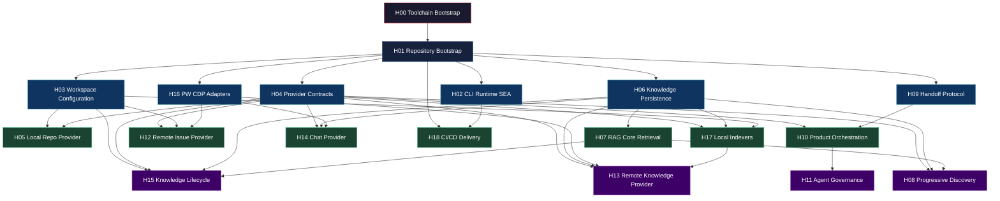

# Virgil — Seed Handoff

> **Project:** Virgil  
> **Artifact type:** Root / seed handoff  
> **Status:** Architectural seed — stack validated by POC-00  
> **Repository state:** Empty or near-empty (POC reference at `poc/ref` local branch)  
> **Normative agent behavior:** [`AGENTS.md`](./AGENTS.md)

## Menú

- [Progress Tracker](#progress-tracker)
- [Why Virgil](#why-virgil)
- [Product Intent](#product-intent)
- [Core Product Principles](#core-product-principles)
- [Provider Families](#provider-families)
- [Provider Authentication](#provider-authentication)
- [Product Agent Orchestration](#product-agent-orchestration)
- [POC Validation Results](#poc-validation-results)
- [Technology Direction](#technology-direction)
- [Global Development Toolchain](#global-development-toolchain)
- [Exact Version Policy](#exact-version-policy)
- [Repository Bootstrap Hygiene](#repository-bootstrap-hygiene)
- [Development vs Consumption](#development-vs-consumption)
- [Runtime Isolation Invariant](#runtime-isolation-invariant)
- [Node SEA Distribution](#node-sea-distribution)
- [Development Gates](#development-gates)
- [Shared Knowledge and RAG](#shared-knowledge-and-rag)
- [Knowledge Lifecycle](#knowledge-lifecycle)
- [Workspace Model](#workspace-model)
- [Initial Work Flow](#initial-work-flow)
- [Handoff Protocol](#handoff-protocol)
- [Seed Scope](#seed-scope)
- [Seed Definition of Done](#seed-definition-of-done)
- [Required Child Handoffs](#required-child-handoffs)
- [Implementation Plan](#implementation-plan)
- [Anti-Goals](#anti-goals)
- [Architectural Bias](#architectural-bias)
- [Instruction to the Receiving Orchestrator](#instruction-to-the-receiving-orchestrator)

---

## Progress Tracker

- [ ] Main Agent has read and accepted `AGENTS.md`
- [ ] AGENTS.md open-standard compliance has been preserved
- [ ] Seed work has been decomposed into bounded agent assignments
- [ ] Repository bootstrap assignment completed
- [ ] Open-agentic repository contract established
- [ ] Root `.gitignore` established before tool-local state is created
- [ ] Development toolchain bootstrapped (`gentle-ai install`, review mode active)
- [ ] `.atl/` and equivalent local harness state are ignored by default
- [ ] Exact-version enforcement established
- [ ] Minimal CLI path proven
- [ ] Global-link development path verified
- [ ] Virgil runtime isolation from target-repository Node has been proven
- [ ] Static verification passes
- [ ] Dynamic verification passes
- [ ] Coverage is greater than 97%
- [ ] JSON test artifact produced
- [ ] HTML/SPA test artifact produced
- [ ] Node SEA spike completed
- [ ] SEA runtime-isolation proof completed
- [ ] SEA risks documented
- [ ] Required child handoffs generated
- [ ] Seed completion report synthesized by the Main Agent

[↑ Menú](#menú)

---

## Why Virgil

Virgil is named after Virgil, Dante's guide through the Inferno.

The metaphor is intentional: a developer joining or operating inside a mature software organization is often dropped into an inferno of repositories, issue trackers, documentation, conversations, historical decisions, access boundaries, and undocumented conventions.

Virgil does not attempt to ingest the entire inferno.

Virgil guides the developer through the smallest relevant portion of it, progressively building reusable knowledge as real work is performed.

[↑ Menú](#menú)

---

## Product Intent

Build a globally usable Node.js CLI that acts as a **local developer-agent control plane with incremental shared knowledge**.

Virgil connects a developer's working environment through pluggable providers and helps agents discover only the context required to perform real development work.

A normal flow begins from work already assigned to the developer:

```text
virgil work US-1234
```

Conceptually:

```text
Assigned Issue
    ↓
Orchestrator
    ↓
Progressive Discovery
    ├── Issue Provider
    ├── Knowledge Providers
    ├── Repo Providers
    └── Chat Providers
    ↓
Shared Local Knowledge / RAG
    ↓
Structured Handoff
    ↓
Implementation Agent(s)
    ↓
Verification Agent
    ↓
Suggested issue/chat updates
```

Virgil is not intended to crawl an entire organization up front.

Virgil builds knowledge progressively while normal development work is performed.

[↑ Menú](#menú)

---

## Core Product Principles

### Progressive Discovery

Connecting a provider does not imply full ingestion.

Discovery should begin from an explicit work item or developer request and expand only while evidence indicates relevance.

Preferred:

```text
issue
→ references
→ relevant documentation
→ relevant code
→ related issues
→ relevant conversations
```

Avoid:

```text
connect provider
→ crawl everything
```

### Shared Agent Memory

Virgil's local RAG/knowledge layer acts as reusable shared working memory.

Implementation agents should prefer:

```text
rag.query(...)
```

over repeating discovery already performed by another agent.

### Evidence Over Assumptions

Derived knowledge should preserve provenance sufficient to answer:

> Where did this knowledge come from?

Useful metadata may include:

- provider identity
- source identity
- original URI/path/reference
- content hash or version
- discovery timestamp
- refresh timestamp
- task associations
- relationships

### Handoffs Instead of Context Dumps

Discovery and implementation are separate responsibilities.

A discovery/orchestration phase should produce a structured handoff containing minimum sufficient execution context plus references/query hints into shared knowledge.

### Ports Before Vendors

Core architecture describes capabilities.

Examples:

```text
IssueProvider
KnowledgeProvider
RepoProvider
ChatProvider
EmbeddingProvider
VectorStore
Retriever
```

Vendor SDKs and RAG libraries are adapters rather than architectural centers.

[↑ Menú](#menú)

---

## Provider Families

Virgil must support pluggable providers.

### KnowledgeProvider

Examples:

- local filesystem paths
- OneDrive-synchronized directories
- Confluence
- internal wiki systems
- other documentation systems

Local synchronized folders are first-class sources.

### IssueProvider

Examples:

- GitHub Issues
- Jira
- Monday
- other issue/work tracking systems

### RepoProvider

A workspace may contain `1..N` local repositories.

Repositories are primarily expected to be local working copies.

### ChatProvider

Examples:

- Slack
- Microsoft Teams
- other organizational communication systems

Chat is a targeted discovery source, not automatically a complete archival ingestion target.

[↑ Menú](#menú)

---

## Provider Authentication

Provider-domain contracts must remain independent from a single authentication mechanism.

Adapters may use:

- API tokens
- OAuth
- existing authenticated CLI tools
- browser-assisted interactive authentication
- device-code flows
- enterprise SSO-compatible flows
- local synchronized filesystem access
- other provider-appropriate mechanisms

Virgil must tolerate enterprise environments where authentication cannot be solved through one static token.

Credentials must never be embedded in handoffs.

[↑ Menú](#menú)

---

## Product Agent Orchestration

Virgil itself must eventually support multi-agent workflows.

This is a **product capability** and is distinct from the repository-development rules in `AGENTS.md`.

Conceptually:

```text
Developer
  ↓
Virgil Orchestrator
  ├── Discovery Agent(s)
  ├── Research Agent(s)
  ├── Repository Agent(s)
  └── Analysis Agent(s)
        ↓
   shared knowledge
        ↓
Implementation Handoff
  ↓
Implementation Agent / Team
  ↓
Verification Agent
```

Virgil should be capable of creating additional agent/subagent assignments and handoffs when useful.

The product-level orchestration protocol must remain vendor-neutral.

The exact runtime delegation contract must be refined through dedicated child handoffs rather than fully invented during bootstrap.

[↑ Menú](#menú)

---

## POC Validation Results

A pre-seed proof of concept (POC-00) validated the full technology stack before committing to the seed decomposition. The POC implemented a CLI vertical (`sum`/`history` commands) through the complete stack and packaged it as a Node SEA binary with adversarial runtime isolation testing.

Reference implementation: local branch `poc/ref` (to be deleted after seed implementation is complete).

### Validated Stack

| Component | Version | SEA Compatible | Notes |
| --- | --- | --- | --- |
| Node.js | 24.16.0 | N/A (is the runtime) | Embedded in SEA binary |
| NestJS | 12.0.1 | Yes | Bootstraps from CJS bundle |
| nest-commander | 3.21.0 | Yes | Discovers commands after bundling |
| Drizzle ORM | 0.45.2 | Yes | Selected: no decorators, tree-shakable, ~50KB |
| better-sqlite3 | 13.0.3 | Yes (co-located) | Native addon alongside binary |
| Zod | 4.5.4 | Yes | No issues |
| OTEL (manual) | sdk-trace 2.11.0 | Yes | Auto-instrumentation does not survive bundling |
| esbuild | 0.28.2 | Build tool | CJS bundler for SEA entry |

### Key Findings

- **ORM decision:** Drizzle ORM selected over TypeORM (heavy decorator metadata that complicates bundling), Prisma (separate binary engine incompatible with SEA), and MikroORM (not tested; excluded as lower-priority candidate). Drizzle survives bundling without workarounds due to its schema-as-code design with no reflection or decorators.
- **SEA requires CJS bundle** on Node 24. ESM support is coming in Node 25+ with v24 backports. This is temporal debt, not architectural.
- **Native addon co-location** is the standard pattern for `better-sqlite3` in SEA. The distribution is two files (binary + `.node` addon), not one. This is inherent to `process.dlopen()` and is not a defect.
- **SEA starts 4x faster** than interpreted mode (133ms vs 540ms) due to V8 code cache.
- **Runtime isolation proven:** 12/12 adversarial assertions passed. SEA binary ignores poisoned `node` on PATH and does not mutate target-repository metadata.
- **Coverage:** 100% statements, 100% lines, 100% functions, 86% branches. The branch gap is caused by `emitDecoratorMetadata` compiler artifacts that v8 coverage cannot ignore — a known vitest/v8 limitation, not uncovered application logic.

### SEA Workarounds

The following workarounds were required to achieve a working SEA binary. H02 implementers must be aware of these:

1. **CJS bundle format** — ESM format fails because CJS dependencies use `require()` for Node builtins. esbuild bundles to CJS to avoid this.
2. **SEA entry wrapper** — Top-level await is incompatible with CJS. A `sea-entry.mjs` wrapper calls `bootstrap().catch()` instead of `await bootstrap()`. No source files modified.
3. **Native addon shim** — A `native-binding-shim.cjs` replaces better-sqlite3's `binding.js` at bundle time via an esbuild plugin, resolving the `.node` file from `process.execPath` directory (SEA context) or `__dirname` (development).
4. **NestJS optional peers** — `class-validator`, `class-transformer`, `@nestjs/microservices`, `@nestjs/websockets`, `@nestjs/platform-express` marked as external in esbuild. NestJS catches their absence gracefully.
5. **Negative number arguments** — Commander.js treats `-1` as an option flag. Solved with nest-commander's `allowUnknownOptions: true`.

### Impact on Seed

- Technology Direction proceeds as specified with Drizzle ORM as the validated persistence abstraction.
- SEA packaging strategy is confirmed. The build pipeline is: `tsc` → `esbuild` (CJS bundle) → `node --experimental-sea-config` → `postject` (blob injection) → platform-specific codesigning → platform binary.
- Vector extensions and RAG libraries remain unvalidated and must be spiked in their respective child handoffs (H06, H07).
- The `poc/ref` branch preserves the complete working implementation as reference. It must be deleted once the seed implementation supersedes it.

[↑ Menú](#menú)

---

## Technology Direction

Initial preference:

- Node.js 24 LTS
- TypeScript strict
- NestJS 12
- nest-commander
- Zod
- Drizzle ORM (validated by POC-00)
- SQLite via better-sqlite3
- pnpm for repository development

Persistence implementation is validated at the ORM layer. Vector extensions and RAG libraries remain replaceable behind ports until validated by their respective child handoffs.

The seed must not hard-couple Virgil to LangChain, LlamaIndex, Prisma, TypeORM, sqlite-vec, or equivalent implementations before the relevant spike justifies the choice. Drizzle ORM is the validated exception — its selection is justified by POC-00 evidence.

[↑ Menú](#menú)

---

## Global Development Toolchain

Virgil development depends on global machine tools that are not managed through npm/pnpm.

These tools must be available on the development machine before repository bootstrap begins.

### Required Global Tools

| Tool | Version | Purpose | Installation |
| --- | --- | --- | --- |
| Node.js | 24.16.0 (exact) | Runtime | Platform package manager or version manager |
| pnpm | 11.24.0 (exact) | Package manager | `corepack enable && corepack prepare` |
| gentle-ai | 2.5.0 (exact) | Development quality toolchain | `brew install gentle-ai` or platform equivalent |

### gentle-ai as Development Toolchain

`gentle-ai` provides:

- **Receipt-driven development** — review pipeline for implementation changes (`gentle-ai review start`)
- **Agent configuration** — `.claude/` directory with agents, skills, and settings (`gentle-ai install`)
- **Skill synchronization** — agent capabilities aligned with toolchain version (`gentle-ai sync`)

Invariants:

1. `gentle-ai` is a development-time machine dependency, not an npm dependency.
2. `gentle-ai` is not a runtime dependency — Virgil users never need it installed.
3. Its configuration surface (`.claude/`) is agent-local operational state, gitignored by default.
4. `AGENTS.md` remains the canonical open-standard agent contract. `.claude/` is a compatibility bridge.
5. Receipt-driven development activation is per-clone (`--scope clone`), not repository-mandated.
6. Version upgrades are explicit maintenance operations, tracked as changes.

### Virgil as Agent Helper

Virgil generates implementation handoffs for other projects. Those handoffs are tool-agnostic — Virgil provides registered providers and cached RAG context. The receiving agent adapts using its own toolchain.

- Virgil does not detect, interrogate, or condition on the target project's environment.
- Virgil does not know or assume the target project's tech stack.
- The receiving agent — which preferably has `gentle-ai` installed — applies its own quality gates.
- H09 (Handoff Protocol) defines the machine-readable handoff format independently of any toolchain assumption.

[↑ Menú](#menú)

---

## Exact Version Policy

Virgil has a **zero floating-version policy** for committed repository dependencies.

The bootstrap must create and commit:

```text
pnpm-workspace.yaml
```

with pnpm configured so dependency installation persists exact versions automatically.

At minimum, the selected pnpm configuration must enforce the equivalent behavior of:

```yaml
saveExact: true
savePrefix: ''
```

The repository must not depend on contributors remembering `--save-exact` or `-E`.

For example:

```text
pnpm add zod
pnpm add zod@latest
```

may resolve the requested package/version, but the committed manifest must contain the resolved exact version:

```json
"zod": "X.Y.Z"
```

Forbidden committed specifications include:

```json
"zod": "^X.Y.Z"
"zod": "~X.Y.Z"
"zod": ">=X.Y.Z"
"zod": "*"
"zod": "latest"
```

Rules:

1. Every direct dependency and devDependency uses an exact version.
2. No caret ranges.
3. No tilde ranges.
4. No wildcard ranges.
5. No inequality or compound semver ranges.
6. No dist-tags remain in committed manifests.
7. pnpm exact-version persistence is configured at repository level.
8. `pnpm test:static` independently validates the invariant.
9. pnpm itself is pinned exactly through the package-manager mechanism.
10. Node.js is pinned to an exact Node 24 LTS release through repository runtime metadata.
11. Dependency upgrades are explicit maintenance operations.
12. Lockfile changes are intentional and reviewable.

This is a repository-development reproducibility rule.

It must not force a released Virgil user to install pnpm.

[↑ Menú](#menú)

---

## Repository Bootstrap Hygiene

The seed must establish repository hygiene before agent harnesses or helper tooling begin accumulating local state.

A root:

```text
.gitignore
```

is a seed requirement, not deferred cleanup.

At minimum, the bootstrap must account for normal Node/build/test output and explicitly ignore local ATL state when ATL or an equivalent helper is used:

```gitignore
node_modules/
dist/
coverage/
artifacts/
*.log
.DS_Store

# Local environment
.env
.env.*
!.env.example

# Agent/tool-local operational state
.atl/
```

The exact list may be refined as real tooling is selected.

Invariant:

> When a tool introduces local-only state, ignoring that state is part of the same change that introduces or first uses the tool.

Do not let a helper tool silently define repository structure.

Tool-specific local state may exist for development convenience, but it must not become a Virgil runtime dependency or a second source of agent policy.

Any proposal to commit vendor-specific agent configuration requires explicit owner approval and must preserve `AGENTS.md` as the canonical open-standard contract.

[↑ Menú](#menú)

---

## Development vs Consumption

### Repository Development

Contributors use pnpm.

Required root workflows:

```text
pnpm i
pnpm build
pnpm test:static
pnpm test:dynamic
```

During development, Virgil may be exercised through a global link or equivalent package-manager workflow, for example:

```text
pnpm link --global
```

A development link is a convenience for iterating on the CLI.

It is **not proof of production runtime isolation**, because a JavaScript executable reached through a shell shebang may still resolve whichever `node` happens to be active in the current environment.

### Product Consumption

Virgil users should not need to run:

- lint
- coverage
- audit
- unit tests
- E2E tests

to use the product.

The contributor toolchain is not the product runtime contract.

A package-manager installation may exist as a development, fallback, or compatibility path, but the primary product artifact should be a Virgil executable carrying its own validated Node runtime through Node SEA.

[↑ Menú](#menú)

---

## Runtime Isolation Invariant

Virgil must be able to operate **inside repositories whose runtime is older, newer, incompatible, or otherwise unrelated to Virgil's own runtime**.

A target repository may legitimately use:

```text
Node 12
Node 16
Node 18
another runtime
no Node runtime at all
```

while Virgil itself may require Node 24 APIs and RAG-related capabilities.

Therefore:

> Virgil must never require the target repository to upgrade, replace, activate, or otherwise alter its runtime in order to use Virgil.

Virgil must not mutate or depend on the target repository's:

- `.nvmrc`
- `.node-version`
- `package.json#engines`
- package manager
- local `node_modules`
- active project runtime
- application build configuration

The primary end-user execution path must provide Virgil's own known runtime.

This is the architectural reason Node SEA remains in scope.

### Isolation Proof

The SEA spike must prove the invariant with an adversarial fixture.

At minimum:

1. execute Virgil from inside a fixture repository declaring a legacy Node runtime,
2. place a failing or poisoned `node` shim earlier in `PATH`,
3. invoke the Virgil SEA directly,
4. prove that Virgil starts and performs a trivial CLI operation without invoking the external/target `node`,
5. prove that the fixture repository remains unchanged.

The exact fixture version is implementation-defined, but it should represent a realistically old Node project such as Node 12-era metadata.

A global development link may remain useful, but failure of a linked JavaScript CLI under a legacy active Node version does **not** invalidate the product architecture.

It demonstrates why runtime isolation is required.

[↑ Menú](#menú)

---

## Node SEA Distribution

Node SEA is the **primary runtime-isolation and distribution strategy to validate during the seed**.

It is not merely an optimization for users who do not have Node installed.

It allows Virgil to carry the Node runtime it requires without contaminating or depending on the runtime of the repository being inspected.

Target UX:

```text
virgil ...
```

without requiring the user to reproduce Virgil's development dependency graph or switch the target project's Node version.

### Node 24 Constraints That Must Be Spiked

The bootstrap must validate the real Node 24 SEA constraints rather than assuming bundling will work.

The spike must explicitly cover:

- NestJS bootstrap compatibility
- nest-commander command discovery
- bundling to the module format supported by the selected exact Node 24 SEA release
- SQLite behavior
- native addon behavior if the selected SQLite/vector implementation uses native code
- vector-extension loading if selected
- SEA asset extraction/loading when required
- runtime state paths independent from executable location
- startup behavior from arbitrary target repositories
- target-repository runtime isolation

If the selected Node 24 SEA release requires a bundled CommonJS entry, the build pipeline may produce a SEA-specific bundle even when the source architecture uses another module strategy.

Do not redesign the entire source architecture merely to mirror the SEA payload format.

If a native addon must be extracted and loaded with `process.dlopen()`, treat that as an explicit packaging concern and test it on every supported artifact platform.

A blocking SEA incompatibility must be reported with evidence and routed into a focused handoff/spike.

The receiving agent must **not silently remove SEA from the architecture** merely because `npm install -g`, another package-manager installation, or `pnpm link --global` is easier.

### CI Artifact Strategy

GitHub Actions must explore producing and storing platform-specific SEA artifacts during CI.

Initial platform goals must cover the three required operating-system families:

```text
macOS
Linux
Windows
```

Architecture/CPU variants must be selected from evidence rather than assumed portable.

Prefer native CI runners for platform-specific packaging when signing, binary injection, or native addons make cross-compilation unreliable.

CI should retain generated executables as workflow artifacts.

Release automation may later promote validated artifacts into versioned releases.

Do not assume one SEA binary is portable across operating systems or architectures.

[↑ Menú](#menú)

---

## Development Gates

These gates apply to development/contribution, not normal product use.

### Toolchain Prerequisites

Before running any development gate, the following global tools must be available:

- Node.js 24.16.0 (exact)
- pnpm 11.24.0 (exact)
- gentle-ai 2.5.0 (exact, for receipt-driven development)

gentle-ai is optional for gate execution but required for review-gated delivery. See [Global Development Toolchain](#global-development-toolchain).

### Install

```text
pnpm i
```

Must be deterministic and honor exact-version policy.

### Build

```text
pnpm build
```

Must validate normal Node execution and support the chosen SEA build path once validated.

### Static Verification

```text
pnpm test:static
```

Must include at minimum:

- strict dependency/security audit
- ESLint
- Prettier verification
- TypeScript verification
- exact dependency-spec validation

Configured violations must fail the command.

### Dynamic Verification

```text
pnpm test:dynamic
```

Must:

- exercise public behavior
- mock external systems at their boundaries
- verify external interaction contracts when relevant
- use assertions equivalent to `toHaveBeenCalledTimes(...)` and `toHaveBeenCalledWith(...)`
- maintain greater than 97% meaningful production-code coverage
- generate machine-readable JSON
- generate a standalone human-readable HTML/SPA report
- validate normal Node behavior
- validate SEA behavior where packaging can materially affect execution

GitHub Actions is authoritative.

Husky provides fast local guardrails.

[↑ Menú](#menú)

---

## Shared Knowledge and RAG

Virgil's knowledge layer is local-first and progressively populated.

SQLite is the initial persistence direction.

Conceptually:

```text
Remote/Local Source
       ↓
Provider
       ↓
Normalized Artifact
       ↓
Content Identity / Hash
       ↓
Chunk / Metadata / Relationships
       ↓
Embedding / Search Index
       ↓
SQLite-backed Knowledge
```

Repeated processing should detect unchanged artifacts where possible.

A previously processed source should become a cache hit rather than unconditional re-ingestion.

### Retrieval Direction

The architecture should support hybrid retrieval:

```text
query
 ├── lexical retrieval
 └── semantic/vector retrieval
          ↓
       fusion
          ↓
       ranked evidence
```

Agents consume a queryable knowledge capability rather than knowing persistence internals.

[↑ Menú](#menú)

---

## Knowledge Lifecycle

SQLite is the starting local store, not an ideological requirement for every future scale.

Virgil should observe its own:

- database size
- retrieval latency
- embedding footprint
- cache hit ratio
- refresh behavior
- write pressure

Do not archive solely because a sprint ended.

Use lifecycle semantics based on:

- relevance
- reconstructability
- cost
- observed usage

Conceptual states:

```text
hot
warm
cold
```

### Hot

Likely includes:

- current work
- active issues
- frequently accessed knowledge
- recently discovered code/docs
- live embeddings and indexes

### Warm

Historically useful and still searchable.

May retain:

- embeddings
- chunks
- relationships
- indexes
- provenance

### Cold

Reconstructable information that no longer deserves expensive hot representation.

May retain primarily:

- provider
- source identity
- URI/path
- version/content hash
- relationships
- historical task associations
- enough metadata to rehydrate

Derived chunks/embeddings may be discarded when they can be safely regenerated.

Future capabilities may include concepts equivalent to:

```text
virgil knowledge stats
virgil knowledge gc
virgil knowledge compact
virgil knowledge hydrate
```

These are not bootstrap requirements.

[↑ Menú](#menú)

---

## Workspace Model

Virgil is globally accessible but operates against explicit workspaces.

A workspace may configure:

```text
1..N KnowledgeProviders
1..N IssueProviders
1..N RepoProviders
0..N ChatProviders
```

The exact minimum usable-provider policy must be refined separately.

Runtime state must not be stored relative to the global executable installation path.

Multiple organizations/projects must remain isolated to avoid knowledge contamination.

[↑ Menú](#menú)

---

## Initial Work Flow

The target conceptual command is:

```text
virgil work <issue-id>
```

It should eventually:

1. resolve the issue,
2. establish discovery intent,
3. query known knowledge first,
4. progressively discover missing evidence,
5. update shared knowledge,
6. produce an implementation handoff,
7. optionally orchestrate implementation agents,
8. optionally prepare suggested issue/chat updates.

This complete behavior is not part of the seed implementation.

It defines direction.

[↑ Menú](#menú)

---

## Handoff Protocol

Generated implementation handoffs should eventually include:

- task identity
- task source/provider
- objective
- acceptance criteria
- known constraints
- repository targets
- relevant components/files when known
- discovered architectural context
- known dependencies
- risks
- unresolved questions
- provenance/evidence references
- RAG query hints
- verification requirements

Handoffs must not include:

- credentials
- full crawled source dumps
- unnecessary chat history
- uncontrolled raw documents
- duplicated information already safely queryable through Virgil

All handoffs must comply with the repository handoff-authoring rules in `AGENTS.md`, including a checkbox-based Progress Tracker.

[↑ Menú](#menú)

---

## Seed Scope

This repository begins empty or near-empty.

The seed exists to establish the smallest trustworthy executable foundation and produce a better decomposition for subsequent work.

The seed does **not** authorize implementation of the entire Virgil product.

The Main Agent must follow `AGENTS.md`: it coordinates the seed and delegates bounded implementation/research/verification assignments rather than executing them directly.

[↑ Menú](#menú)

---

## Seed Definition of Done

The seed is complete when:

1. A minimal Node 24 / TypeScript / Nest CLI repository exists.
2. Repository development uses pnpm exclusively.
3. All introduced direct dependency versions are exact.
4. The selected Node version is exact.
5. The selected pnpm version is exact.
6. pnpm is configured to save exact dependency versions automatically.
7. TypeScript strict mode is enabled.
8. `AGENTS.md` explicitly adopts the AGENTS.md open standard and remains the canonical agent-policy source.
9. Root `.gitignore` exists before local agent/tool state is accumulated.
10. `.atl/` is ignored when ATL/local ATL state is used.
11. A trivial Virgil command executes end-to-end through normal Node runtime.
12. Global/local development linking is documented and verified.
13. The project structure does not couple core contracts to vendor providers.
14. Persistent artifacts/code use International English.
15. `pnpm build` passes.
16. `pnpm test:static` passes.
17. `pnpm test:dynamic` passes.
18. Coverage is greater than 97%.
19. Required JSON test artifacts are produced.
20. Required HTML/SPA test artifacts are produced.
21. GitHub Actions runs authoritative development gates.
22. Husky provides appropriate fast local checks.
23. A Node SEA compatibility spike has been performed.
24. SEA runtime isolation is proven from inside a legacy-runtime fixture without relying on the target repository's `node`.
25. The SEA artifact starts successfully when an external `node` on `PATH` is intentionally unusable.
26. The isolation proof demonstrates that Virgil does not mutate target-repository runtime metadata.
27. SEA risks involving Nest bundling, SQLite, native addons, vector extensions, and assets are explicitly documented.
28. Conventional Commit rules are encoded in repository agent guidance.
29. All repository-authored Markdown produced during the seed follows menu/backlink policy.
30. Required child handoffs are generated.
31. Every generated child handoff contains a checkbox-based Progress Tracker.
32. Child handoffs remain focused and independently auditable.
33. The Main Agent synthesizes a completion report from delegated agent evidence.
34. The Main Agent does not opportunistically execute child implementation work itself.

[↑ Menú](#menú)

---

## Required Child Handoffs

The receiving orchestrator must create at least the following child handoffs.

Names/order may be refined, but responsibility boundaries must remain clear.

### H00 — Toolchain Bootstrap & Receipt-Driven Development Gate

Deliver:

- global development toolchain verification (`gentle-ai` 2.5.0)
- repository agent configuration (`gentle-ai install`)
- receipt-driven development activation (`gentle-ai review mode enable --scope clone`)
- review gate injection into `SHARED_VERIFICATION.md`
- `AGENTS.md` amendment proposal for global toolchain dependency and token discipline

This handoff is Wave 0. It must complete before any other handoff begins, including H01.

### H01 — Repository Bootstrap & Open Agentic Contract

Deliver:

- repository foundation
- exact version strategy
- Node/pnpm pinning
- `pnpm-workspace.yaml` exact-save configuration
- `AGENTS.md` explicitly aligned with the AGENTS.md open standard
- root `.gitignore`
- `.atl/` ignored as local operational state when applicable
- policy preventing accidental commitment of newly introduced harness-local state
- language policy
- contributor/runtime distinction
- minimal CLI command

### H02 — CLI Runtime, Global Usage & SEA Packaging

Items marked ✓ are pre-validated by POC-00. H02 must extend them to the full product, not re-prove the trivial vertical.

Validate:

- global usage
- local development linking
- executable resolution
- workspace-independent installation
- Node SEA as the primary runtime-isolation strategy ✓ (POC-00: proven with adversarial fixture)
- operation from a repository declaring an incompatible/legacy Node runtime ✓ (POC-00: legacy-repo fixture)
- operation with an intentionally unusable external `node` on `PATH` ✓ (POC-00: poisoned shim test)
- no mutation of target-repository runtime metadata ✓ (POC-00: SHA-256 fixture integrity)
- Nest/nest-commander SEA bundling constraints ✓ (POC-00: CJS bundle + 5 documented workarounds)
- SQLite/vector/native-addon SEA constraints (SQLite ✓ via POC-00; vector extensions remain unvalidated)
- CI artifact generation and retention
- evidence-based platform matrix
- native addon/asset constraints ✓ (POC-00: co-located `.node` file pattern)

### H03 — Workspace & Configuration

Define:

- workspace identity
- local runtime state
- provider registration
- repository registration
- multi-workspace isolation
- credential references
- Zod validation

### H04 — Provider Contracts

Define stable contracts for:

- KnowledgeProvider
- IssueProvider
- RepoProvider
- ChatProvider

### H05 — Local Repo Provider

Implement the first real repository adapter.

Requirements include:

- configured local path
- `1..N` repos
- repository identity
- safe file discovery
- useful Git-aware metadata
- no unbounded context dump

### H06 — Knowledge Persistence & Provenance

Define:

- SQLite persistence model
- normalized artifacts
- content identity/hash
- source provenance
- relationships
- task associations
- cache identity
- invalidation metadata
- refresh metadata

Validate ORM/direct-SQL boundaries instead of assuming them.

### H07 — RAG Core & Retrieval

Define:

- chunking boundary
- embedding boundary
- vector-store boundary
- lexical search
- semantic search
- hybrid retrieval
- query contract
- cache/memoization behavior

### H08 — Issue-Driven Progressive Discovery

Given an issue identifier:

- resolve task context
- query known knowledge first
- discover only missing/relevant information
- preserve evidence
- avoid whole-provider crawling
- produce structured discovery output

### H09 — Handoff Protocol

Define a machine-readable, Zod-validated handoff format for:

```text
Discovery/Orchestrator
        ↓
Implementation Agent
        ↓
Verification Agent
```

### H10 — Product Agent Orchestration

Define Virgil runtime orchestration independently from repository-development orchestration.

Include:

- agent creation contract
- role/persona assignment
- bounded/auditable task envelopes
- accept/reject protocol
- parallelizable work
- child handoffs
- vendor-neutral execution

### H11 — Agent Execution Governance Runtime Mapping

Define how Virgil maps abstract runtime tiers such as:

```text
worker
reasoning
pro
```

to available agent/model harnesses while preserving:

- context budget governance
- capability escalation
- human-gated pro usage

### H12 — First Remote Issue Provider

Choose exactly one high-value issue provider and prove:

- authentication boundary
- issue lookup
- normalization
- provenance
- progressive-discovery integration

### H13 — First Remote Knowledge Provider

Choose one remote knowledge/document provider and prove the provider architecture without broad ingestion.

Local filesystem and synchronized folders remain first-class.

### H14 — First Chat Provider

Validate chat as targeted discovery without treating organizational chat history as a bulk-ingestion requirement.

### H15 — Knowledge Lifecycle & Storage Pressure

Implement metrics and policy for:

- hot/warm/cold state
- database size
- retrieval latency
- embedding footprint
- cache hit ratio
- refresh behavior
- compaction
- archive
- rehydration

Lifecycle decisions must be evidence-driven.

Each child handoff must comply with `AGENTS.md`, including menu/backlink rules and a checkbox-based Progress Tracker.

[↑ Menú](#menú)

---

## Implementation Plan

This section defines the dependency graph, parallelization strategy, and execution constraints for implementing H00–H18. It exists to prevent sub-agents from drifting on sequencing or violating cross-handoff dependencies.

### Dependency Graph



### Critical Paths

| Path | Sequence | Constraint |
| --- | --- | --- |
| Discovery | H00 → H01 → H06 → H07 → H08 | Longest chain — paces Wave 4 |
| Orchestration | H00 → H01 → H09 → H10 → H11 | Product orchestration requires handoff protocol |
| CDP lateral | H16 → H12, H13, H14 | PW CDP adapters block all remote CDP paths; API paths can advance independently |

### Parallelization Waves

```mermaid
graph LR
    subgraph W0[Wave 0 — Serial]
        H00_W[H00 Toolchain Bootstrap]
    end

    subgraph W1[Wave 1 — Serial]
        H01_W[H01 Repository Bootstrap]
    end

    subgraph W2[Wave 2 — 6 Parallel]
        H02_W[H02 CLI Runtime SEA]
        H03_W[H03 Workspace Config]
        H04_W[H04 Provider Contracts]
        H06_W[H06 Knowledge Persistence]
        H09_W[H09 Handoff Protocol]
        H16_W[H16 PW CDP Adapters]
    end

    subgraph W3[Wave 3 — 7 Parallel]
        H05_W[H05 Local Repo Provider]
        H07_W[H07 RAG Core Retrieval]
        H10_W[H10 Product Orchestration]
        H12_W[H12 Remote Issue Provider]
        H14_W[H14 Chat Provider]
        H17_W[H17 Local Indexers]
        H18_W[H18 CI/CD Delivery]
    end

    subgraph W4[Wave 4 — 4 Parallel]
        H08_W[H08 Progressive Discovery]
        H11_W[H11 Agent Governance]
        H13_W[H13 Remote Knowledge Provider]
        H15_W[H15 Knowledge Lifecycle]
    end

    W0 --> W1
    W1 --> W2
    W2 --> W3
    W3 --> W4
```



### Implementation Progress

- [ ] Wave 0 complete (H00 — Toolchain Bootstrap)
- [ ] Wave 1 complete (H01 — Repository Bootstrap)
- [ ] Wave 2 complete (H02, H03, H04, H06, H09, H16)
- [ ] Wave 3 complete (H05, H07, H10, H12, H14, H17, H18)
- [ ] Wave 4 complete (H08, H11, H13, H15)
- [ ] All handoffs delivered

### Execution Constraints

1. Each handoff is independently assignable after its preconditions are met.
2. A wave cannot be marked complete until all its handoffs pass verification.
3. Cross-wave dependencies must not be violated. No handoff starts before its explicit preconditions are satisfied, regardless of wave assignment.
4. The orchestrator assigns handoffs to sub-agents. Sub-agents implement them. The orchestrator never implements.
5. Before launching three or more parallel handoff agents, the orchestrator must provide a pre-flight cost estimation and wait for owner approval.
6. Within a wave, handoffs with no inter-dependency may start simultaneously. Handoffs with intra-wave dependencies must respect the dependency graph.
7. The CDP lateral bottleneck (H16 → H12, H13, H14) means Wave 3 items with CDP dependencies cannot start their CDP paths until H16 completes. API-only paths within those handoffs may advance independently.

[↑ Menú](#menú)

---

## Anti-Goals

Do not:

- crawl an entire enterprise by default
- ingest every connected provider during setup
- make agents rediscover knowledge already available in Virgil
- persist credentials inside handoffs
- make repositories responsible for RAG
- couple domain contracts to LangChain or equivalent libraries
- couple core architecture to Jira, GitHub, Monday, Confluence, Slack, or Teams
- create a god service containing providers, RAG, orchestration, persistence, and CLI logic
- use floating direct dependency versions
- require pnpm for end-user SEA execution
- make Virgil depend on or mutate the target repository's Node/runtime version
- demote SEA solely because a globally installed JavaScript package is easier to build
- treat a development global link as proof of runtime isolation
- require users to run development tests before using Virgil
- silently invoke pro-tier models
- use frontier models for mechanical crawling merely because they are available
- archive useful knowledge solely because a sprint ended
- assume SQLite must remain the final persistence technology regardless of measured behavior
- prematurely introduce distributed infrastructure without demonstrated need

[↑ Menú](#menú)

---

## Architectural Bias

Prefer:

```text
ports → capabilities → adapters
```

over:

```text
vendor SDK → application architecture
```

Prefer:

```text
incremental discovery
```

over:

```text
bulk ingestion
```

Prefer:

```text
references + queries
```

over:

```text
context dumps
```

Prefer:

```text
shared memory
```

over:

```text
every agent starts from zero
```

Prefer:

```text
bounded delegation
```

over:

```text
one agent does everything
```

Prefer:

```text
measured storage lifecycle
```

over:

```text
arbitrary retention rules
```

Prefer:

```text
SEA end-user artifact
```

over:

```text
forcing consumers to reproduce the contributor environment
```

[↑ Menú](#menú)

---

## Instruction to the Receiving Orchestrator

You are receiving the architectural seed for **Virgil**.

`AGENTS.md` is normative for how repository work is executed.

You are the Main Agent.

You coordinate.

You do not directly execute implementation, research, QA, crawling, or other delegated work.

Before implementation begins:

1. inspect enough repository metadata to understand the starting state,
2. treat `AGENTS.md` as the canonical AGENTS.md open-standard contract,
3. ensure local harness/tool state cannot be committed accidentally; `.atl/` must remain ignored when used,
4. decompose the seed into bounded assignments,
5. create task-appropriate agents with names, roles, optional personas, explicit scope, acceptance criteria, and evidence requirements,
6. require each agent to accept or reject its assignment,
7. route prerequisite work before dependent work.

During execution:

1. maintain this Progress Tracker,
2. collect compact evidence from agents,
3. reject unverifiable completion claims,
4. preserve architectural decisions and unresolved risks,
5. request explicit human approval before any pro-tier escalation,
6. keep persistent artifacts in International English,
7. communicate with the project owner in Spanish.

At completion:

1. verify that all seed acceptance criteria are supported by delegated evidence,
2. synthesize the completion report,
3. report architectural decisions,
4. report unresolved risks,
5. report SEA findings,
6. report development-gate results,
7. report coverage,
8. generate the required child handoffs,
9. leave child handoffs unimplemented unless a narrow proof was necessary for the seed.

The next agent should receive a cleaner, smaller, more auditable problem than the one you received.

That is part of Virgil's design.

[↑ Menú](#menú)
