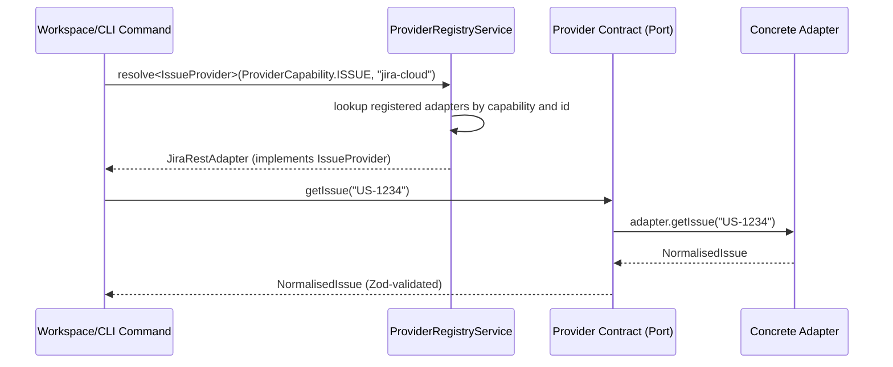

# Port/Adapter Architecture

This document illustrates Virgil's hexagonal port/adapter architecture for
the provider contracts defined in `src/contracts/` (handoff H04). The
domain core exposes seven capability-scoped ports plus a registry; every
external system interaction flows through one of these ports rather than a
vendor SDK surface.

## Domain Core and Adapter Families

The inner hexagon is the stable domain contract boundary (`src/contracts/`).
The outer ring shows the three adapter implementation families and example
concrete adapters each family would host. None of these concrete adapters
are implemented by this handoff — H05 and H12–H14 implement them against the
contracts shown here.

```mermaid
graph TB
    subgraph Domain["Virgil Domain Core — src/contracts/ (stable ports)"]
        direction TB
        KP["KnowledgeProvider"]
        IP["IssueProvider"]
        RP["RepoProvider"]
        CP["ChatProvider"]
        EP["EmbeddingProvider"]
        VS["VectorStore"]
        RT["Retriever"]
        REG["ProviderRegistry"]
    end

    subgraph API["API Adapters (packages/cli/) — H12-H14"]
        direction TB
        API_Jira["Jira REST Adapter"]
        API_GH["GitHub Issues Adapter"]
        API_Conf["Confluence REST Adapter"]
        API_Slack["Slack Web API Adapter"]
        API_OAI["Embedding API Adapter"]
    end

    subgraph CDP["PW CDP Browser Adapters (packages/pw-cdp/) — H16"]
        direction TB
        CDP_Jira["Jira CDP Adapter"]
        CDP_Conf["Confluence CDP Adapter"]
        CDP_Teams["Teams CDP Adapter"]
        CDP_SSO["Enterprise SSO Flow"]
    end

    subgraph FS["Local Filesystem Adapters (packages/local-indexers/) — H05, H17"]
        direction TB
        FS_Local["Local Folder Indexer"]
        FS_Sync["Cloud-Sync Folder Adapter"]
        FS_Git["Local Git Adapter"]
    end

    API_Jira --> IP
    API_GH --> IP
    API_Conf --> KP
    API_Slack --> CP
    API_OAI --> EP

    CDP_Jira --> IP
    CDP_Conf --> KP
    CDP_Teams --> CP
    CDP_SSO -.->|"auth session"| CDP_Jira
    CDP_SSO -.->|"auth session"| CDP_Conf
    CDP_SSO -.->|"auth session"| CDP_Teams

    FS_Local --> KP
    FS_Sync --> KP
    FS_Git --> RP

    REG -->|"resolves"| KP
    REG -->|"resolves"| IP
    REG -->|"resolves"| RP
    REG -->|"resolves"| CP
    REG -->|"resolves"| EP
    REG -->|"resolves"| VS
    REG -->|"resolves"| RT
```

## Adapter Resolution Flow

The registry is the only concrete implementation in `src/contracts/`
(`ProviderRegistryService` / `ProviderRegistryModule`). Every capability
port is resolved through it, never constructed directly by a consumer.

## Contract-to-File Map

| Port | Contract file | Primary DTOs |
| --- | --- | --- |
| `KnowledgeProvider` | `src/contracts/knowledge-provider.types.ts` | `KnowledgeDocument` |
| `IssueProvider` | `src/contracts/issue-provider.types.ts` | `NormalisedIssue`, `IssueReference` |
| `RepoProvider` | `src/contracts/repo-provider.types.ts` | `FileEntry`, `FileContent`, `RepoMetadata`, `GitContext` |
| `ChatProvider` | `src/contracts/chat-provider.types.ts` | `ChatMessage`, `ChatThread`, `ChatChannel` |
| `EmbeddingProvider` | `src/contracts/embedding-provider.types.ts` | `EmbeddingResult`, `EmbeddingModelInfo` |
| `VectorStore` | `src/contracts/vector-store.types.ts` | `VectorEntry`, `VectorSearchResult` |
| `Retriever` | `src/contracts/retriever.types.ts` | `RetrievalResult` |
| `ProviderRegistry` | `src/contracts/provider-registry.types.ts` | `ProviderRegistrationConfig`, `AggregatedProviderHealth` |

Shared primitives used by every contract above (`ProviderHealth`,
`PaginatedResult<T>`, `ProviderError`, `ContentIdentity`, `DiscoveryScope`,
`AdapterType`) live in `src/contracts/common.types.ts`. The foundational
`Provider` base interface, `ProviderCapability`, and `ProviderStatus` live in
the shared layer at `src/shared/provider.types.ts` and are not duplicated
here.

## Boundary Rules

- Contracts describe **what** data an adapter returns, never **how** it is
  obtained. A PW CDP adapter, an API client, and a filesystem walker can all
  satisfy the same `KnowledgeProvider` port.
- No file under `src/contracts/` imports a vendor SDK (see
  `src/contracts/vendor-isolation.spec.ts` for the enforced check).
- `ProviderRegistryService` is the sole concrete implementation in this
  module — every other export in `src/contracts/` is a pure interface or a
  Zod schema.
- Adapter handoffs (H05, H12–H14, H16) implement these ports; they must not
  widen a port's method signatures without a documented contract amendment.
