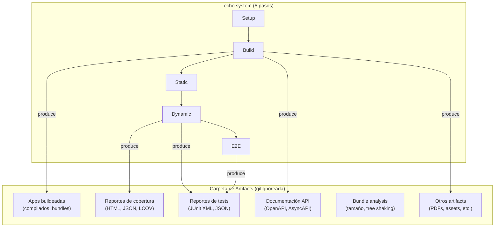
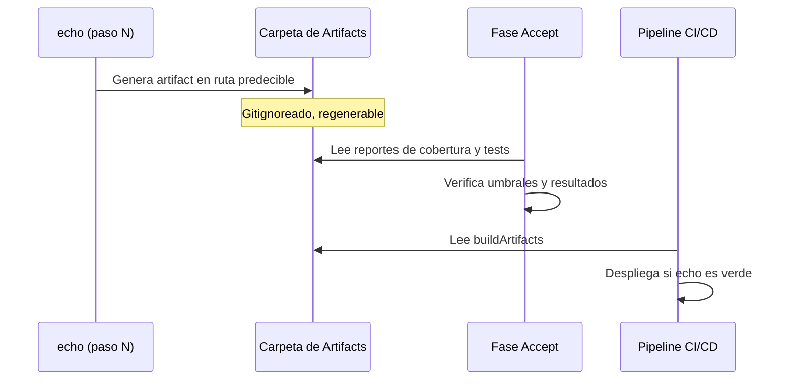

# Sistema de Artifacts

← [Índice](README.md)

> El sistema de artifacts es una convención que declara DÓNDE aparecen
> los outputs generados por el proyecto (builds, reportes de cobertura,
> documentación API, etc.) y QUÉ scripts los producen. Es el complemento
> del [echo system](echo-system.md): el echo define los pasos, el
> sistema de artifacts define dónde aterrizan los resultados.

---

## Contenido

- [Distinción Semántica](#distinción-semántica)
- [El Artifact handoff.md](#el-artifact-handoffmd)
- [La Convención](#la-convención)
- [Catálogo de Tipos](#catálogo-de-tipos)
- [Mapa de Generación](#mapa-de-generación)
- [Conexión con el Framework](#conexión-con-el-framework)
- [Obligatorio en Principio, Flexible en Implementación](#obligatorio-en-principio-flexible-en-implementación)
- [Dónde Se Configura](#dónde-se-configura)

---

## Distinción Semántica

En este framework, "artifact" tiene dos significados que no deben
confundirse:

| Tipo | Qué es | Dónde vive | Quién lo gestiona |
|------|--------|------------|-------------------|
| **Artifact de planificación** | Documentos de planning (idea.md, spec.md, design.md, tasks.md, handoff.md, ops-runbook.md) | [artifactStore](planning/artifacts/README.md) (fuera del repo) | [TPM](overview.md) |
| **buildArtifact** | Outputs generados por el echo (compilados, reportes, documentación API) | Carpeta gitignoreada dentro del repo | Sistema de artifacts (este documento) |

Este documento define el segundo tipo. Cuando el resto de la
documentación dice "artifact" sin calificador, se refiere al primer
tipo (planificación). Cuando se refiere a outputs de build, se usa
"buildArtifact" o se referencia este documento.

[↑ Contenido](#contenido)

---

## El Artifact handoff.md

`handoff.md` es un artifact de planificación (ver
[Distinción Semántica](#distinción-semántica)), pero Dogma le añade
dos propiedades que lo distinguen del resto de los artifacts de
planning.

### Validación Mecánica: `virgil handoff lint`

La transición de planning a execution ya no depende solo de la
aprobación humana del SM. `virgil handoff lint` valida mecánicamente
que `handoff.md` es autocontenido, referencia artefactos existentes y
cumple el schema mínimo, antes de habilitar el arranque de execution.
Un `handoff.md` que no pasa el lint no habilita la Fase Contratos — sin
excepción manual. Es un gate determinístico (Dogma, principio 6), no
un juicio de aprobación.

### Execution State: Claiming por Tarea

Cuando `handoff.md` habilita ejecución paralela (un handoff, múltiples
subAgents/lanes), cada tarea del DAG lleva un estado de ejecución
independiente del estado de aprobación del artefacto:

| Estado | Significado |
|--------|-------------|
| `pending` | Tarea disponible para ser tomada por un subAgent |
| `claimed` | Un subAgent la tomó; otros no deben tomarla |
| `done` | Completada y verificada |

Este execution state es lo que permite que varios subAgents trabajen en
paralelo sobre el mismo `handoff.md` sin colisionar: cada uno hace
claim de su tarea antes de empezar, y la marca `done` al terminar (Dogma,
principio 5). Ver [glosario](glossary.md) — `claiming`,
`executionState`.

[↑ Contenido](#contenido)

---

## La Convención

El sistema de artifacts establece tres elementos:

1. **Una carpeta gitignoreada** como destino único y predecible para
   todos los outputs generados.
2. **Un catálogo de tipos** que enumera qué artifacts produce el
   proyecto.
3. **Un mapa de generación** que vincula cada tipo de artifact con el
   script o comando que lo produce.



### Ubicación de la carpeta

La ubicación la define el proyecto en
[`design.md`](planning/artifacts/schemas.md) (sección "Restricciones de
infraestructura"). El nombre y la ruta son decisión del proyecto — el
framework solo exige que:

- Sea una carpeta dedicada y gitignoreada.
- Esté documentada en `design.md`.
- Todo output generado apunte a ella (o a un subdirectorio dentro de
  ella).

[↑ Contenido](#contenido)

---

## Catálogo de Tipos

Los siguientes tipos de artifacts son comunes en la mayoría de
proyectos. El catálogo concreto de cada proyecto se define en
`design.md`.

| Tipo | Descripción | Producido por (paso del echo) | Consumido por |
|------|-------------|------------------------------|---------------|
| **Apps buildeadas** | Código compilado, transpilado, bundleado, listo para deploy o distribución | Paso 2 (Build) | Pipeline de deployment, operation |
| **Reportes de cobertura** | Cobertura de tests por archivo y agregada. Formatos: HTML para lectura, JSON/LCOV para procesamiento | Paso 4 (Dynamic Test) | [Fase Accept](execution/accept.md) (QA verifica umbral), SOC 2 (evidencia de controles) |
| **Reportes de tests** | Resultados de ejecución de tests. Formato estructurado para parsing automatizado | Paso 4 (Dynamic Test) + Paso 5 (E2E) | [Fase Accept](execution/accept.md) (QA verifica que todos pasan) |
| **Documentación API** | Especificaciones de API generadas desde contratos o código. OpenAPI, AsyncAPI, GraphQL schema | Paso 2 (Build) | Consumidores de la API, [prePhase Contratos](execution/contracts.md) |
| **Bundle analysis** | Análisis de tamaño de bundles, tree shaking, dependencias incluidas | Paso 2 (Build) | [Fase Refactor](execution/refactor.md) (revisión de performance) |
| **Otros outputs** | Cualquier output generado que el proyecto necesite rastrear (PDFs, assets procesados, etc.) | Variable | Variable |

[↑ Contenido](#contenido)

---

## Mapa de Generación

El mapa de generación es una tabla que el proyecto declara en
`design.md`, vinculando cada tipo de artifact con:

- El script o comando que lo genera.
- La ruta de destino dentro de la carpeta de artifacts.
- El paso del echo donde se produce.

```markdown
| Artifact | Script | Destino | Paso del echo |
|----------|--------|---------|--------------|
| App backend | {comando de build} | {carpeta}/backend | 2. Build |
| App frontend | {comando de build} | {carpeta}/frontend | 2. Build |
| Coverage | {comando de test} | {carpeta}/coverage | 4. Dynamic |
| Test report | {comando de test} | {carpeta}/reports | 4. Dynamic |
| OpenAPI spec | {comando de generación} | {carpeta}/api | 2. Build |
```

El mapa no es prescriptivo en su contenido (cada proyecto tiene
diferentes artifacts) — es prescriptivo en su existencia: todo proyecto
que adopte el sistema de artifacts DEBE tener este mapa documentado.

[↑ Contenido](#contenido)

---

## Conexión con el Framework

### Lo que el framework ya exige y este sistema formaliza

El framework menciona reportes y outputs en múltiples lugares sin
definir dónde viven ni en qué formato se producen:

| Referencia existente | Documento | Qué formaliza el sistema de artifacts |
|---------------------|-----------|---------------------------------------|
| "Coverage report" como input de QA | [accept.md](execution/accept.md) | Ubicación y formato del reporte de cobertura |
| "Test reports" como evidencia | [accept.md](execution/accept.md) | Ubicación y formato de los reportes de tests |
| "Reporte de cobertura" como evidencia SOC 2 | [red.md](execution/red.md) | Dónde se genera y persiste el reporte |
| Herramienta de coverage "debe reportar por archivo y agregada" | [red.md](execution/red.md) | Dónde aterriza ese reporte |
| "droppableCode" identificado via coverage report | [accept.md](execution/accept.md) | El reporte vive en ubicación conocida |

### Ciclo de vida de un buildArtifact



Los buildArtifacts son **efímeros y regenerables**. No se versionan
en git — se regeneran en cada ejecución del echo. La fuente de verdad es
el código fuente + el echo, no los artifacts generados.

[↑ Contenido](#contenido)

---

## Obligatorio en Principio, Flexible en Implementación

El sistema de artifacts es **obligatorio** en su requisito central: todo
proyecto DEBE saber dónde están sus artifacts y qué los genera. El mapa
de generación y la documentación de ubicaciones son prescriptivos.

Lo que es **flexible** es la implementación de la carpeta centralizada
— la convención de una única carpeta gitignoreada como destino. Esta
convención es la recomendación por defecto, pero no siempre puede
aplicarse tal cual. Existen limitaciones conocidas:

### Limitaciones de stack

Algunos stacks hardcodean la ubicación de sus outputs y no permiten
redireccionarlos sin efectos secundarios:

- Frameworks con directorio de build fijo que rompen al moverlo.
- Herramientas que generan outputs en la raíz del proyecto sin opción
  de redireccionamiento.

### Limitaciones de proyecto

Algunos proyectos producen outputs que no encajan en el modelo de
carpeta gitignoreada:

- Repositorios que auto-generan archivos trackeados (READMEs dinámicos,
  assets procesados que deben committearse).
- Proyectos donde el output ES el repositorio (sites estáticos,
  generadores de documentación).

### Artifacts remotos

Algunos proyectos producen artifacts cuyo destino no es el filesystem
local sino un registro o almacén externo:

- Imágenes Docker/OCI pusheadas a un registry.
- Packages publicados a un registry de paquetes (npm, PyPI, crates.io).
- Binarios de apps móviles subidos a app stores.
- Helm charts pusheados a chart repositories.

Estos artifacts se documentan en el mapa de generación con su destino
remoto (ej: `{registry}:{tag}`) en vez de una ruta local. El principio
se mantiene: el proyecto SABE dónde está cada artifact y qué lo genera.

### Multi-target

Para proyectos con múltiples targets de compilación (cross-platform,
multi-arch, library + CDN bundle), cada target se documenta como una
fila separada en el mapa de generación. El paso del echo es el mismo;
el script y destino varían por target.

### Cómo manejar las limitaciones

Cuando el sistema de artifacts no puede aplicarse limpiamente:

1. **Documentar la excepción** en `design.md` — qué artifact no puede
   redireccionarse y por qué.
2. **Documentar la ubicación real** — dónde aparece el artifact
   efectivamente.
3. **Mantener el mapa de generación** — el mapa sigue existiendo, solo
   cambia la columna de destino para reflejar la ubicación real en vez
   de la carpeta centralizada.

La excepción no elimina el sistema — lo adapta. Lo que no puede variar
es que el proyecto SEPA dónde están sus artifacts y qué los genera.

[↑ Contenido](#contenido)

---

## Dónde Se Configura

| Qué | Dónde | Cuándo |
|-----|-------|--------|
| Nombre y ruta de la carpeta de artifacts | `design.md` — Restricciones de infraestructura | Fase 3 (Diseñar) |
| Catálogo de tipos del proyecto | `design.md` — Restricciones de infraestructura | Fase 3 (Diseñar) |
| Mapa de generación (script → destino) | `design.md` — Restricciones de infraestructura | Fase 3 (Diseñar) |
| Excepciones documentadas | `design.md` — Restricciones de infraestructura | Fase 3 (Diseñar) |
| Entrada en `.gitignore` | Working tree del repo | execution (prePhase o Green) |

[↑ Contenido](#contenido)

---

## Índice de Documentos Relacionados

| Documento | Relación con este |
|-----------|-------------------|
| [echo system](echo-system.md) | El echo produce los artifacts; este sistema define dónde aterrizan |
| [Fase Red](execution/red.md) | Define requisitos de cobertura y reportes que se convierten en artifacts |
| [Fase Accept](execution/accept.md) | QA consume los reportes de cobertura y tests como inputs de certificación |
| [Fase Refactor](execution/refactor.md) | Revisión de performance consume bundle analysis; revisión de seguridad consume audit reports |
| [Contratos](execution/contracts.md) | Contract-first puede generar documentación API como artifact |
| [Schemas](planning/artifacts/schemas.md) | `design.md` es donde se configura el sistema de artifacts |
| [Artefactos de planificación](planning/artifacts/README.md) | Distinción semántica: artifacts de planificación ≠ buildArtifacts |
