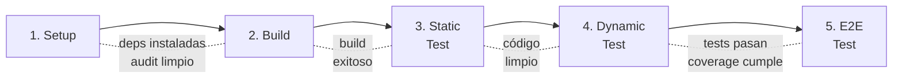
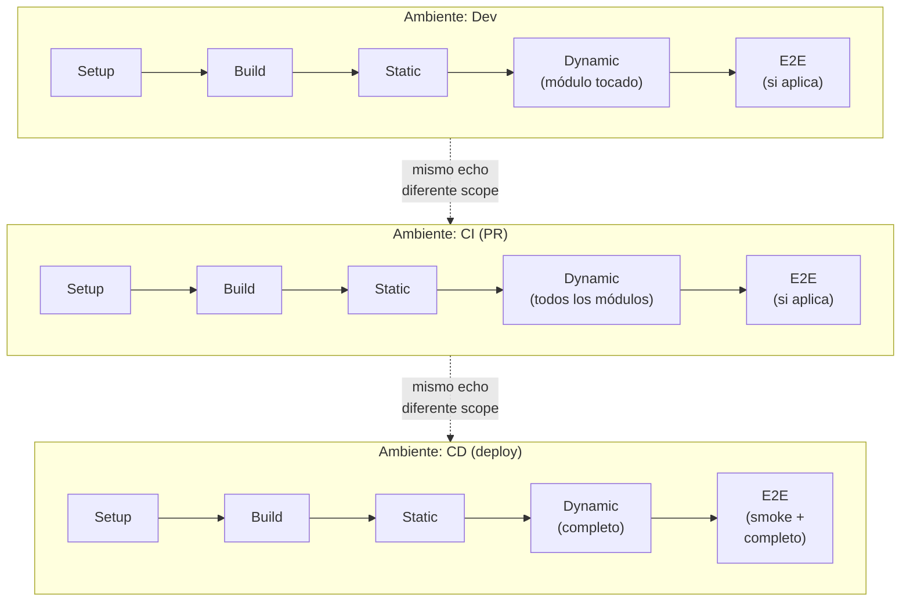
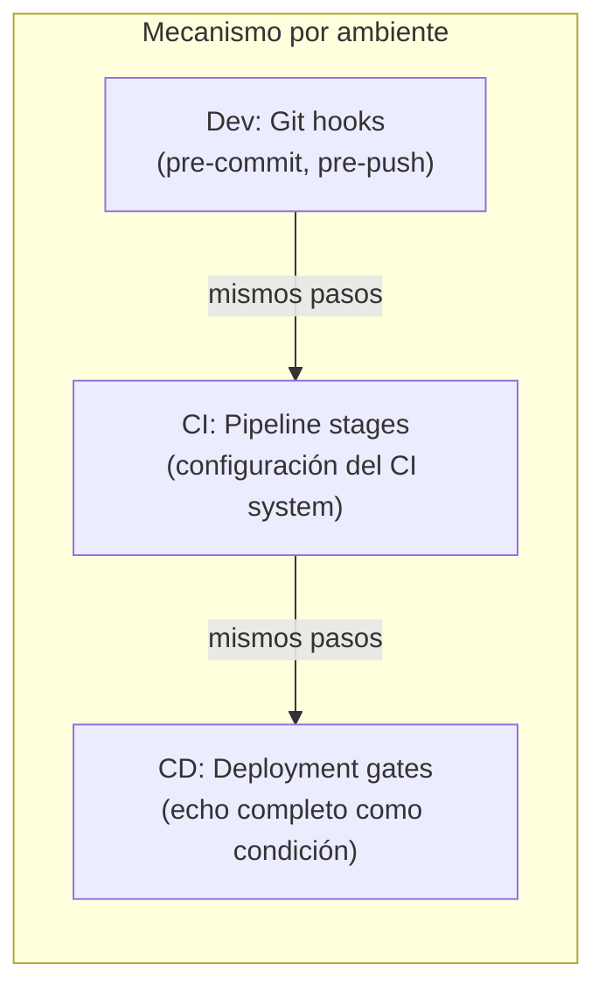
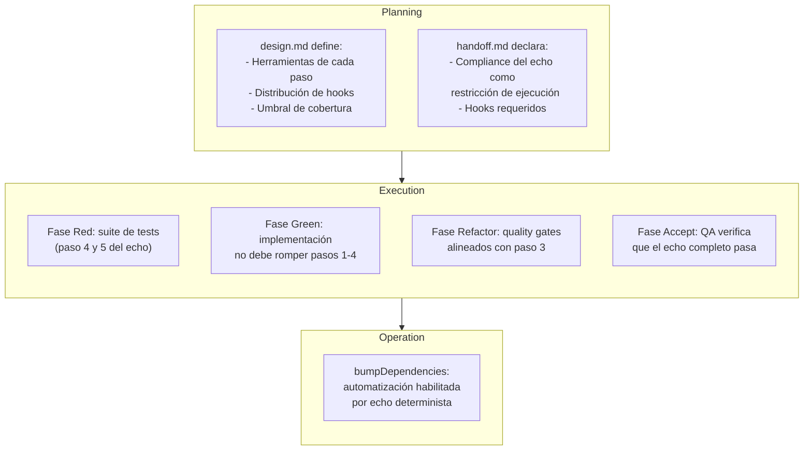
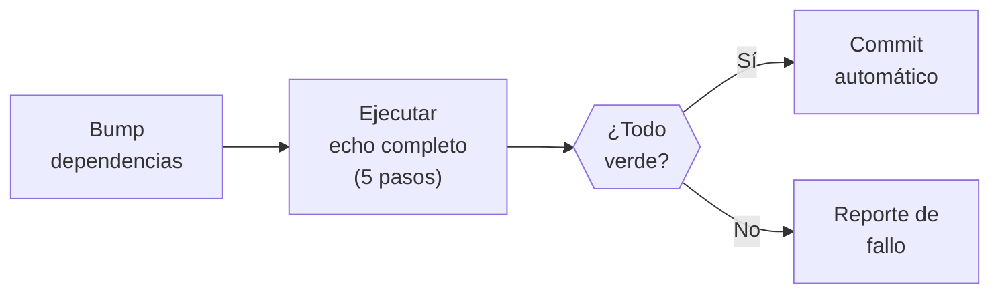

# Echo System

← [Índice](README.md)

> Un echo es una secuencia determinista de 5 pasos que se ejecuta en
> todo ambiente — dev, QA, CI, CD. La garantía es estructural: los
> mismos pasos corren en el mismo orden en cada ambiente. Lo que varía
> es el **scope** (dev prioriza feedback rápido, CI prioriza
> completitud) — pero ningún paso se omite ni se reordena.

---

## Contenido

- [Por Qué Existe](#por-qué-existe)
- [Los 5 Pasos](#los-5-pasos)
- [Homogeneidad de Ambientes](#homogeneidad-de-ambientes)
- [Enforcement](#enforcement)
- [Conexión con el Framework](#conexión-con-el-framework)
- [Automatización Habilitada: bumpDependencies](#automatización-habilitada-bumpdependencies)
- [Orquestación de Métricas (Virgil)](#orquestación-de-métricas-virgil)
- [Adaptabilidad](#adaptabilidad)
- [Gaps que Este Sistema Resuelve](#gaps-que-este-sistema-resuelve)

---

## Por Qué Existe

El framework define qué construir (planning), cómo construirlo (execution) y
cómo operarlo (operation). Pero ninguno de esos modos define **cómo
verificar que el entorno de trabajo es confiable** en cada ambiente donde
el código se ejecuta.

Sin un pipeline determinista compartido entre ambientes:

- Un test puede pasar en dev porque las dependencias están cacheadas,
  y fallar en CI porque no se ejecutó el setup.
- Un linter puede correr en dev pero no en CI, permitiendo que código
  con violaciones llegue a producción.
- Un build puede funcionar localmente con una versión flotante de una
  dependencia, y romperse cuando CI instala una versión diferente.

El echo elimina estas discrepancias. No es un "nice to have" de DevOps
— es infraestructura fundacional que habilita la confiabilidad de todo
lo que el framework promete.

[↑ Contenido](#contenido)

---

## Los 5 Pasos

El echo siempre tiene 5 pasos, siempre en este orden. Cada paso tiene un
propósito, una entrada, una salida y un criterio de fallo binario: pasa
o no pasa.

### Paso 1 — Setup

| Atributo | Valor |
|----------|-------|
| Propósito | Garantizar que las dependencias están instaladas y libres de vulnerabilidades conocidas |
| Entrada | Manifiesto de dependencias + lockfile |
| Salida | Dependencias instaladas, sin vulnerabilidades conocidas de severidad crítica |
| Fallo | Dependencia faltante, lockfile desactualizado, vulnerabilidad crítica sin fix disponible |

El setup incluye la instalación de dependencias y, cuando el ecosistema
lo soporte, la auditoría de seguridad (equivalente a `audit fix`). En
ecosistemas sin herramienta de auditoría para dependencias, el paso se
limita a instalación y verificación de lockfile — la ausencia de
auditoría se documenta en `design.md` como limitación de stack. Este
paso se ejecuta siempre. En proyectos sin dependencias externas, el paso
valida que el manifiesto refleja esa decisión (o ejecuta un no-op
documentado).

### Paso 2 — Build

| Atributo | Valor |
|----------|-------|
| Propósito | Transformar el código fuente en artifacts ejecutables o distribuibles |
| Entrada | Código fuente + dependencias instaladas |
| Salida | buildArtifacts (compilados, transpilados, bundleados) |
| Fallo | Error de compilación, error de tipos, error de bundling |
| Condicional | Proyectos puramente interpretados sin paso de build pueden marcar este paso como no-op documentado |

El build produce los artifacts que el
[sistema de artifacts](artifact-system.md) define dónde aterrizan.

### Paso 3 — Static Test

| Atributo | Valor |
|----------|-------|
| Propósito | Verificar que el código cumple las reglas de estilo, formato y análisis estático del proyecto |
| Entrada | Código fuente |
| Salida | Código sin violaciones de linting ni formato |
| Fallo | Violación de regla de linting, error de formato, warning tratado como error |

El análisis estático no es cosmético — es la primera línea de defensa
contra patrones problemáticos, imports no usados, variables sin
declarar, y violaciones de convenciones del equipo. La configuración
de las herramientas se define en
[`design.md`](planning/artifacts/schemas.md) (sección "Restricciones de
infraestructura").

### Paso 4 — Dynamic Test

| Atributo | Valor |
|----------|-------|
| Propósito | Ejecutar la suite de tests del proyecto y verificar cobertura |
| Entrada | buildArtifacts (o código fuente) + suite de tests |
| Salida | Reporte de tests + reporte de cobertura |
| Fallo | Test que falla, cobertura por debajo del umbral del proyecto |

Este paso ejecuta los tests definidos en la
[Fase Red](execution/red.md) — appTests como tier primario,
integración como derivado. El umbral de cobertura es obligatorio para
stacks con herramientas de coverage maduras y nunca puede bajarse (ver
[Fase Red](execution/red.md), sección "droppableCode"). Para
stacks donde coverage no es medible o semánticamente relevante (IaC,
data pipelines), `design.md` DEBE declarar la métrica de verificación
alternativa (ej: tasa de compliance de políticas, mutation testing
score, conformance de contratos). La métrica alternativa tiene la misma
regla: una vez establecida, no puede bajarse.

### Paso 5 — E2E Test

| Atributo | Valor |
|----------|-------|
| Propósito | Verificar la solución completa desplegada, multi-servicio, con cero mocks |
| Entrada | Solución desplegada en un ambiente accesible |
| Salida | Reporte de tests E2E |
| Fallo | Escenario E2E que falla |
| Condicional | Solo si el proyecto tiene superficie E2E. Si no aplica, se documenta como excepción |

E2E se ejecuta en deploys, tags y merges a ramas principales (ver
[tabla de pipeline placement](execution/red.md) para la distribución
detallada de qué corre cuándo).

[↑ Contenido](#contenido)

---

## Homogeneidad de Ambientes

La propiedad fundamental del echo es que los mismos 5 pasos se ejecutan
en todo ambiente, en el mismo orden. Lo que varía entre ambientes es el
**scope** de cada paso y el **trigger** que lo invoca — no los pasos ni
su secuencia. Dev prioriza feedback rápido (scope selectivo), CI
prioriza completitud (scope amplio), CD prioriza confianza total (scope
completo + smoke post-deploy).

### Diferencias por ambiente

| Aspecto | Dev (hooks) | CI (PR) | CD (deploy) |
|---------|-------------|---------|-------------|
| Trigger | Pre-commit / pre-push | Push a PR, merge request | Tag, merge a main/develop |
| Scope del paso 4 | Módulo tocado | Todos los módulos afectados | Suite completa |
| Scope del paso 5 | Opcional (subset smoke) | Suite E2E si aplica | Suite E2E completa + smoke post-deploy |
| Velocidad vs confianza | Prioriza feedback rápido | Balance | Prioriza confianza total |

La tabla de distribución detallada está en la
[Fase Red](execution/red.md) (sección "Pipeline placement").

[↑ Contenido](#contenido)

---

## Enforcement

El echo no es una recomendación — es obligatorio. El mecanismo de
enforcement depende del ambiente:

### En desarrollo (git hooks)

Los hooks de git son el enforcement local. La distribución entre
pre-commit y pre-push es una decisión de proyecto documentada en
[`design.md`](planning/artifacts/schemas.md) (sección "Restricciones de
infraestructura") y declarada en el
[`handoff.md`](planning/artifacts/schemas.md) (sección "Restricciones de
ejecución").

Distribución por defecto:

| Hook | Pasos que ejecuta | Justificación |
|------|-------------------|---------------|
| Pre-commit | 3 (static test) | Feedback inmediato sobre formato y lint |
| Pre-push | 1 → 2 → 3 → 4 (selectivo) | Verificación completa antes de compartir código |

Esta distribución es un default — la distribución exacta la decide el
proyecto y se documenta en `design.md`. Algunos proyectos pueden incluir
tests de App (paso 4, módulo tocado) en pre-commit para feedback más
rápido (ver [tabla de pipeline placement](execution/red.md)). El
principio invariante: **nunca pushear código que no pase el echo** (al
menos hasta el paso 4).

Los hooks del echo son **pre-\*** (pre-commit, pre-push): corren antes
de que el cambio se registre, bloqueando código que no pasa el paso
correspondiente. Virgil añade hooks **post-\*** (post-commit,
post-merge) para tareas de gobernanza que no bloquean el flujo local —
actualización del binding layer, cálculo de métricas de fortaleza. Los
dos conjuntos de hooks coexisten sin colisión porque operan en momentos
distintos del ciclo git: el echo controla el gate de calidad
determinista pre-cambio; Virgil controla la observabilidad y las
métricas post-cambio.

### Presupuesto de tiempo

Cuando el echo completo (pasos 1-4) excede un tiempo tolerable para el
workflow del desarrollador (ej: monorepos grandes, builds compilados),
el proyecto define un **presupuesto de tiempo** para el pre-push en
`design.md`. Los pasos que no caben en el presupuesto se difieren a CI,
documentando explícitamente el trade-off: el developer puede pushear
código que CI podría rechazar. El echo sigue corriendo completo en CI —
el presupuesto solo afecta la distribución local en hooks.

### En CI

El pipeline de CI ejecuta los 5 pasos. El scope de cada paso depende
del trigger: en PRs, el paso 5 puede limitarse al subset de seguridad;
en merges a ramas principales, la suite E2E completa (ver
[tabla de pipeline placement](execution/red.md)). Si algún paso falla,
el pipeline se detiene — no hay punto en correr tests dinámicos si el
build falló, ni E2E si los tests de App no pasan.

Además del pipeline de 5 pasos, `virgil health` y `virgil coverage
--min` pueden añadirse como gates de CI independientes, alineados con
Echo pero sin reemplazarlo: `virgil health` verifica el estado agregado
de trazabilidad y fortaleza del proyecto; `virgil coverage --min`
impone un umbral mínimo de cobertura ponderada por mutation testing.
Ambos corren en paralelo al echo — el echo verifica que el código
funciona, Virgil verifica que el código es rastreable y robusto.

### En CD

El deployment gate exige echo verde completo como precondición. Post-
deploy, un subset de E2E (smoke) verifica que el despliegue fue exitoso.

### Verificación de Paridad de Ambientes (recomendada)

Cuando staging y producción divergen en configuración, datos o estado
de infraestructura, un test puede pasar en staging (echo verde) y la
misma implementación comportarse distinto en producción. La
homogeneidad de ambientes (ver [sección anterior](#homogeneidad-de-ambientes))
ya cubre esto conceptualmente — mismos pasos, mismo orden — pero no
exige verificar que la CONFIGURACIÓN de cada ambiente coincide.

**Virgil no gestiona infraestructura** — no es su responsabilidad
provisionar ni mantener paridad entre ambientes. Lo que SÍ puede hacer
es orquestar un chequeo de paridad como parte del deployment gate:

| Aspecto verificable | Ejemplo de chequeo |
|----------------------|---------------------|
| Versión de runtime/dependencias | Misma versión de Node/Go/Python en staging y producción |
| Variables de entorno declaradas | Mismo set de env vars (sin comparar valores secretos) entre ambientes |
| Configuración de infraestructura | Mismos flags de feature/infra activos (drift de estado, ej. Terraform) |

Este chequeo es **RECOMENDADO, no obligatorio** — a diferencia de los 5
pasos del echo, que son TINA. El proyecto lo implementa como paso
adicional del deployment gate en CD (ver [En CD](#en-cd)) usando sus
propias herramientas de infraestructura; el echo lo orquesta pero no lo
prescribe.

[↑ Contenido](#contenido)

---

## Conexión con el Framework

El echo es transversal — se define, implementa, verifica y explota a lo
largo de los tres modos.

### Dónde se configura cada aspecto

| Qué | Dónde | Cuándo |
|-----|-------|--------|
| Herramientas de cada paso | `design.md` — Restricciones de infraestructura | Fase 3 (Diseñar) |
| Distribución de hooks | `design.md` — Restricciones de infraestructura | Fase 3 (Diseñar) |
| Umbral de cobertura | `design.md` — Restricciones de infraestructura | Fase 3 (Diseñar) |
| Compliance del echo | `handoff.md` — Restricciones de ejecución | Fase 5 (Handoff) |
| Implementación de hooks | Working tree del repo | execution (prePhase o Green) |
| Verificación del echo | Fase Accept | execution (Accept) |
| Explotación (bumpDeps) | Operación | operation |

[↑ Contenido](#contenido)

---

## Automatización Habilitada: bumpDependencies

Cuando el echo es determinista y confiable, habilita una automatización
fundamental: la actualización automatizada de dependencias.

El patrón es simple:

1. Actualizar una o más dependencias en los manifiestos del proyecto
2. Ejecutar el echo completo (los 5 pasos)
3. Si todo pasa → commit automático
4. Si algo falla → reporte para intervención manual

Este patrón aborda la tensión inherente del framework:

- La [Fase Red](execution/red.md) exige versiones exactas (pinned) para
  builds reproducibles.
- La [Fase Red](execution/red.md) exige dependencias modernas (última
  versión estable).
- La [Fase Refactor](execution/refactor.md) verifica dependencias sin
  CVEs conocidos.

Sin un mecanismo de actualización, las versiones pinneadas se vuelven
obsoletas y vulnerables. El echo determinista es lo que hace viable la
actualización automatizada — sin él, bumping es una apuesta.

### Consideraciones del patrón

| Aspecto | Guía |
|---------|------|
| Patch / minor | Automatizables — el echo verde confirma compatibilidad |
| Major (breaking) | Requieren migración manual — tratarlos como trabajo planificado (planning), no como bump automatizado |
| Peer dependencies | Deben bumpearse atómicamente como grupo (ej: react + react-dom + @types/react) |
| Proyectos polyglot | Cada package manager tiene su propio manifiesto; los bumps pueden necesitar coordinación entre managers |
| Frecuencia y agrupación | Decisión de proyecto documentada en `design.md` |

La mecánica concreta (herramienta de bump, estrategia de agrupación,
frecuencia) se porta a la plataforma del proyecto. El patrón es
universal; las decisiones de implementación no.

[↑ Contenido](#contenido)

---

## Orquestación de Métricas (Virgil)

Dogma (principios 2 y 3) exige verificar no solo que el código pasa
el echo, sino que tiene la fortaleza estructural adecuada y que el MIM
puede gestionar el proyecto desde un nivel superior sin revisar código
manualmente. Virgil resuelve esto orquestando herramientas externas de
métricas — no las implementa.

| Métrica | Herramienta (ejemplo por stack) | Qué mide | Cuándo corre |
|---------|----------------------------------|----------|--------------|
| Mutation testing | Stryker (JS/TS), PIT (JVM), mutmut/cosmic-ray (Python) | Si los tests detectan mutaciones deliberadas del código — fortaleza real, no solo cobertura de líneas | post-commit / CI (periódico — costoso para correr en cada commit) |
| CRAP score | crap4j y herramientas equivalentes | Complejidad ponderada por falta de cobertura — identifica código riesgoso y no testeado | post-commit / CI, junto con mutation testing (CRAP depende del mutation score) |
| Complejidad ciclomática | ESLint complexity, radon, gocyclo | Ramificación de cada función/módulo | Junto con CRAP (mismo hook post-\*) — alimenta el cálculo de CRAP y se reporta también como métrica independiente contra su propio threshold |
| Tamaño de módulo | Herramientas de linting/análisis estático | Módulos que exceden el tamaño manejable | post-commit / CI (periódico) |
| Estructura de dependencias | madge / dependency-cruiser (JS/TS), import-linter (Python), herramientas de arquitectura (Go, JVM) | Dependencias circulares y violaciones de dirección (inversión de dependencias) | **pre-commit o pre-push** (bloqueante) |

La estructura de dependencias es la excepción a la regla post-\*: a
diferencia de mutation testing, CRAP y complejidad — que requieren
correr o analizar la suite completa y son costosos por commit — un
chequeo de dependencias es barato y detecta un defecto binario (hay o
no hay ciclo/violación de dirección). Por eso corre como hook
pre-commit o pre-push, igual que el paso 3 (Static Test) del echo, y
bloquea el push si encuentra violaciones (ver [contrato de
métricas](execution/contracts.md#contrato-de-métricas)).

Virgil ejecuta estas herramientas, agrega los resultados, y los expone
vía `virgil health` (dashboard de 4 categorías: trazabilidad,
fortaleza de pruebas, estructura de código, salud de documentación) y
`virgil coverage --min` (gate de CI). El echo y Virgil son
complementarios: el echo certifica que el código funciona; Virgil
certifica que el código es sostenible.

> Detalle: [Gobernanza Metodológica](planning/artifacts/methodology.md)
> (sección "Verificación de métricas: trazabilidad y fortaleza").

[↑ Contenido](#contenido)

---

## Adaptabilidad

El echo es prescriptivo en su estructura (5 pasos, en orden) pero
adaptable en su contenido:

| Aspecto | Fijo | Adaptable |
|---------|------|-----------|
| Número de pasos | 5, siempre | — |
| Orden de pasos | Setup → Build → Static → Dynamic → E2E | — |
| Criterio de éxito | Binario (pasa / no pasa) | — |
| Herramientas de cada paso | — | Definidas en `design.md` por proyecto |
| Scope por ambiente | — | Dev (selectivo) vs CI (completo) |
| Distribución en hooks | — | Pre-commit vs pre-push vs ambos |
| Pasos condicionales | — | Cualquier paso puede ser no-op documentado cuando no aplica al stack |

### Unidad de ejecución

El echo opera a nivel de **unidad independientemente buildeable y
testeable**. En un proyecto simple, esa unidad es el proyecto completo.
En un monorepo con múltiples packages, cada package tiene su propia
instancia del echo. En un proyecto polyglot (ej: backend Go + frontend
TypeScript), cada stack tiene su propio echo con sus propias herramientas.

| Estructura | Unidad del echo | Orquestación |
|------------|----------------|--------------|
| Proyecto simple | El proyecto completo | Directa (1 echo) |
| Monorepo (workspaces) | Cada package independiente | El orchestrator del monorepo ejecuta echoes selectivamente por packages afectados |
| Polyglot | Cada stack | Cada stack define sus herramientas; el echo de proyecto los orquesta |

En dev (hooks), el echo corre solo para las unidades afectadas por el
cambio. En CI, corre para todas las unidades afectadas más sus
dependientes. En CD, corren todos los echoes.

### Stacks no convencionales

El modelo de 5 pasos está diseñado para proyectos de software con ciclo
build-test. Para stacks donde los pasos no mapean directamente (IaC,
data pipelines, generadores de sitios estáticos), el proyecto define en
`design.md` cómo cada paso del echo se traduce a su contexto:

| Paso del echo | IaC (ejemplo) | Data pipeline (ejemplo) |
|--------------|---------------|-------------------------|
| Setup | Instalar providers/plugins | Instalar dependencias de pipeline |
| Build | `plan` / `preview` (validación, no artifact distribuible) | Compilar DAGs / transformaciones |
| Static | Linting de HCL/YAML, policy-as-code (OPA, Sentinel) | Linting de scripts, validación de schemas |
| Dynamic | Policy compliance tests, validación de plan | Tests de transformación con datos de prueba |
| E2E | Deploy a ambiente efímero + verificación | Ejecución end-to-end con dataset de prueba |

El principio se mantiene: 5 pasos, en orden, binarios. Lo que cambia es
QUÉ ejecuta cada paso, no la estructura.

### Excepciones documentadas

Cuando un paso no aplica al proyecto (ej: una librería algorítmica pura
sin superficie E2E, o un proyecto IaC donde Build produce un plan en
vez de un artifact distribuible), se documenta como excepción en
`design.md` y se declara en `handoff.md`. La excepción sigue el formato
estándar del framework (ver
[excepciones documentadas](agile-adaptations.md)).

El paso se marca como no-op en el echo, no se elimina. Los 5 pasos
siempre existen conceptualmente — un paso que no aplica ejecuta un
no-op exitoso, no desaparece.

[↑ Contenido](#contenido)

---

## Gaps que Este Sistema Resuelve

| Gap identificado | Dónde existía | Cómo lo aborda el echo |
|------------------|---------------|----------------------|
| CI/CD integration TBD | [execution/README.md](execution/README.md) | El echo ES la definición del pipeline que CI ejecuta |
| Sin mención de análisis estático | 29 docs, 0 referencias a linting/formatting | Paso 3 (Static Test) lo formaliza como obligatorio |
| Hooks mencionados pero no especificados | [schemas.md](planning/artifacts/schemas.md) | Enforcement local del echo via pre-commit/pre-push |
| Sin concepto de homogeneidad de ambientes | Framework completo | Propiedad fundamental del echo: mismos pasos, todo ambiente |
| Tensión versiones pinned ↔ deps modernas | [red.md](execution/red.md) | bumpDependencies como patrón habilitado por echo determinista |
| CI como participante sin definición | [green.md](execution/green.md), [git-strategy.md](execution/git-strategy.md) | CI ejecuta el echo — ahora está definido |

[↑ Contenido](#contenido)

---

## Índice de Documentos Relacionados

| Documento | Relación con este |
|-----------|-------------------|
| [artifact system](artifact-system.md) | Paso 2 (Build) produce artifacts; pasos 4 y 5 producen reportes de tests y cobertura. El artifact system define DÓNDE aterrizan |
| [Fase Red](execution/red.md) | Define la suite de tests (paso 4 y 5) y la tabla de pipeline placement |
| [Fase Green](execution/green.md) | La implementación no debe romper los pasos 1-4 del echo |
| [Fase Refactor](execution/refactor.md) | Quality gates alineados con paso 3; verificación de CVEs |
| [Fase Accept](execution/accept.md) | QA verifica que el echo completo pasa como parte de la certificación |
| [Schemas](planning/artifacts/schemas.md) | `design.md` define las herramientas; `handoff.md` declara compliance |
| [Estrategia Git](execution/git-strategy.md) | Hooks y CI como participantes del lifecycle de worktrees |
