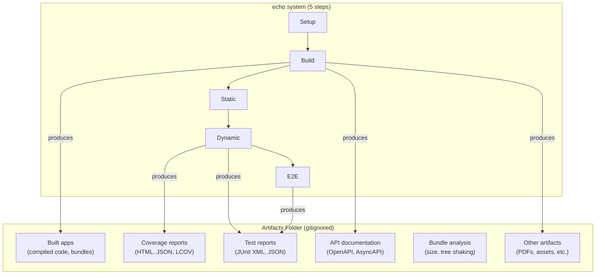
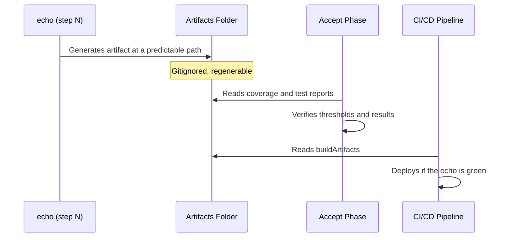

# Artifact System

← [Index](README.md)

> The artifact system is a convention that declares WHERE the outputs
> generated by the project appear (builds, coverage reports, API
> documentation, etc.) and WHAT scripts produce them. It is the
> complement to the [echo system](echo-system.md): the echo defines the
> steps, the artifact system defines where the results land.

---

## Contents

- [Semantic Distinction](#semantic-distinction)
- [The handoff.md Artifact](#the-handoffmd-artifact)
- [The Convention](#the-convention)
- [Type Catalog](#type-catalog)
- [Generation Map](#generation-map)
- [Connection to the Framework](#connection-to-the-framework)
- [Mandatory in Principle, Flexible in Implementation](#mandatory-in-principle-flexible-in-implementation)
- [Where It Is Configured](#where-it-is-configured)

---

## Semantic Distinction

In this framework, "artifact" has two meanings that must not be
confused:

| Type | What it is | Where it lives | Who manages it |
|------|------------|-----------------|-------------------|
| **Planning artifact** | Planning documents (idea.md, spec.md, design.md, tasks.md, handoff.md, ops-runbook.md) | [artifactStore](planning/artifacts/README.md) (outside the repo) | [TPM](overview.md) |
| **buildArtifact** | Outputs generated by the echo (compiled code, reports, API documentation) | Gitignored folder inside the repo | Artifact system (this document) |

This document defines the second type. When the rest of the
documentation says "artifact" without a qualifier, it refers to the
first type (planning). When it refers to build outputs, it uses
"buildArtifact" or references this document.

[↑ Contents](#contents)

---

## The handoff.md Artifact

`handoff.md` is a planning artifact (see
[Semantic Distinction](#semantic-distinction)), but Dogma adds two
properties that set it apart from the rest of the planning artifacts.

### Mechanical Validation: `virgil handoff lint`

The transition from planning to execution no longer depends solely on
the SM's human approval. `virgil handoff lint` mechanically validates
that `handoff.md` is self-contained, references existing artifacts, and
complies with the minimum schema, before enabling the start of
execution. A `handoff.md` that does not pass the lint does not enable
the Contracts Phase — no manual exception. It is a deterministic gate
(Dogma, principle 6), not an approval judgment.

### Execution State: Claiming by Task

When `handoff.md` enables parallel execution (one handoff, multiple
subAgents/lanes), each task in the DAG carries an execution state
independent of the artifact's approval state:

| State | Meaning |
|-------|---------|
| `pending` | Task available to be taken by a subAgent |
| `claimed` | A subAgent has taken it; others should not take it |
| `done` | Completed and verified |

This execution state is what allows several subAgents to work in
parallel on the same `handoff.md` without colliding: each one claims
its task before starting, and marks it `done` when finished (Dogma,
principle 5). See [glossary](glossary.md) — `claiming`, `executionState`.

[↑ Contents](#contents)

---

## The Convention

The artifact system establishes three elements:

1. **A gitignored folder** as the single, predictable destination for
   all generated outputs.
2. **A type catalog** that enumerates which artifacts the project
   produces.
3. **A generation map** that links each artifact type with the script
   or command that produces it.



### Folder Location

The location is defined by the project in
[`design.md`](planning/artifacts/schemas.md) (section "Infrastructure
Constraints"). The name and path are a project decision — the
framework only requires that:

- It be a dedicated, gitignored folder.
- It be documented in `design.md`.
- Every generated output point to it (or to a subdirectory within it).

[↑ Contents](#contents)

---

## Type Catalog

The following artifact types are common in most projects. Each
project's concrete catalog is defined in `design.md`.

| Type | Description | Produced by (echo step) | Consumed by |
|------|-------------|----------------------------|----------------|
| **Built apps** | Compiled, transpiled, bundled code, ready for deploy or distribution | Step 2 (Build) | Deployment pipeline, operation |
| **Coverage reports** | Test coverage per file and aggregated. Formats: HTML for reading, JSON/LCOV for processing | Step 4 (Dynamic Test) | [Accept Phase](execution/accept.md) (QA verifies threshold), SOC 2 (control evidence) |
| **Test reports** | Test execution results. Structured format for automated parsing | Step 4 (Dynamic Test) + Step 5 (E2E) | [Accept Phase](execution/accept.md) (QA verifies everything passes) |
| **API documentation** | API specifications generated from contracts or code. OpenAPI, AsyncAPI, GraphQL schema | Step 2 (Build) | API consumers, [Contracts prePhase](execution/contracts.md) |
| **Bundle analysis** | Bundle size analysis, tree shaking, included dependencies | Step 2 (Build) | [Refactor Phase](execution/refactor.md) (performance review) |
| **Other outputs** | Any generated output the project needs to track (PDFs, processed assets, etc.) | Variable | Variable |

[↑ Contents](#contents)

---

## Generation Map

The generation map is a table the project declares in `design.md`,
linking each artifact type with:

- The script or command that generates it.
- The destination path within the artifacts folder.
- The echo step where it is produced.

```markdown
| Artifact | Script | Destination | Echo step |
|----------|--------|--------------|-------------|
| Backend app | {build command} | {folder}/backend | 2. Build |
| Frontend app | {build command} | {folder}/frontend | 2. Build |
| Coverage | {test command} | {folder}/coverage | 4. Dynamic |
| Test report | {test command} | {folder}/reports | 4. Dynamic |
| OpenAPI spec | {generation command} | {folder}/api | 2. Build |
```

The map is not prescriptive in its content (each project has different
artifacts) — it is prescriptive in its existence: every project that
adopts the artifact system MUST have this map documented.

[↑ Contents](#contents)

---

## Connection to the Framework

### What the framework already requires and this system formalizes

The framework mentions reports and outputs in multiple places without
defining where they live or in what format they are produced:

| Existing reference | Document | What the artifact system formalizes |
|------------------------|-----------|------------------------------------------|
| "Coverage report" as QA input | [accept.md](execution/accept.md) | Location and format of the coverage report |
| "Test reports" as evidence | [accept.md](execution/accept.md) | Location and format of test reports |
| "Coverage report" as SOC 2 evidence | [red.md](execution/red.md) | Where the report is generated and persisted |
| Coverage tool "must report per file and aggregated" | [red.md](execution/red.md) | Where that report lands |
| "droppableCode" identified via coverage report | [accept.md](execution/accept.md) | The report lives in a known location |

### Lifecycle of a buildArtifact



buildArtifacts are **ephemeral and regenerable**. They are not
versioned in git — they are regenerated on every echo run. The source
of truth is the source code + the echo, not the generated artifacts.

[↑ Contents](#contents)

---

## Mandatory in Principle, Flexible in Implementation

The artifact system is **mandatory** in its central requirement: every
project MUST know where its artifacts are and what generates them. The
generation map and the documentation of locations are prescriptive.

What is **flexible** is the implementation of the centralized folder —
the convention of a single gitignored folder as the destination. This
convention is the default recommendation, but it cannot always be
applied as-is. Known limitations exist:

### Stack limitations

Some stacks hardcode the location of their outputs and do not allow
redirecting them without side effects:

- Frameworks with a fixed build directory that break when moved.
- Tools that generate outputs at the project root with no
  redirection option.

### Project limitations

Some projects produce outputs that do not fit the gitignored folder
model:

- Repositories that auto-generate tracked files (dynamic READMEs,
  processed assets that must be committed).
- Projects where the output IS the repository (static sites,
  documentation generators).

### Remote artifacts

Some projects produce artifacts whose destination is not the local
filesystem but a remote registry or store:

- Docker/OCI images pushed to a registry.
- Packages published to a package registry (npm, PyPI, crates.io).
- Mobile app binaries uploaded to app stores.
- Helm charts pushed to chart repositories.

These artifacts are documented in the generation map with their remote
destination (e.g., `{registry}:{tag}`) instead of a local path. The
principle remains: the project KNOWS where each artifact is and what
generates it.

### Multi-target

For projects with multiple compilation targets (cross-platform,
multi-arch, library + CDN bundle), each target is documented as a
separate row in the generation map. The echo step is the same; the
script and destination vary by target.

### Handling the limitations

When the artifact system cannot be applied cleanly:

1. **Document the exception** in `design.md` — which artifact cannot be
   redirected and why.
2. **Document the actual location** — where the artifact effectively
   appears.
3. **Maintain the generation map** — the map still exists, only the
   destination column changes to reflect the actual location instead
   of the centralized folder.

The exception does not eliminate the system — it adapts it. What
cannot vary is that the project KNOWS where its artifacts are and what
generates them.

[↑ Contents](#contents)

---

## Where It Is Configured

| What | Where | When |
|------|-------|------|
| Name and path of the artifacts folder | `design.md` — Infrastructure Constraints | Phase 3 (Design) |
| Project's type catalog | `design.md` — Infrastructure Constraints | Phase 3 (Design) |
| Generation map (script → destination) | `design.md` — Infrastructure Constraints | Phase 3 (Design) |
| Documented exceptions | `design.md` — Infrastructure Constraints | Phase 3 (Design) |
| `.gitignore` entry | Repo working tree | execution (prePhase or Green) |

[↑ Contents](#contents)

---

## Related Documents Index

| Document | Relationship to this one |
|----------|-----------------------------|
| [echo system](echo-system.md) | The echo produces the artifacts; this system defines where they land |
| [Red Phase](execution/red.md) | Defines coverage and report requirements that become artifacts |
| [Accept Phase](execution/accept.md) | QA consumes coverage and test reports as certification inputs |
| [Refactor Phase](execution/refactor.md) | Performance review consumes bundle analysis; security review consumes audit reports |
| [Contracts](execution/contracts.md) | Contract-first can generate API documentation as an artifact |
| [Schemas](planning/artifacts/schemas.md) | `design.md` is where the artifact system is configured |
| [Planning artifacts](planning/artifacts/README.md) | Semantic distinction: planning artifacts ≠ buildArtifacts |
