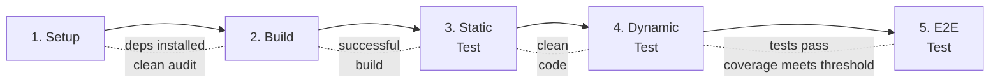
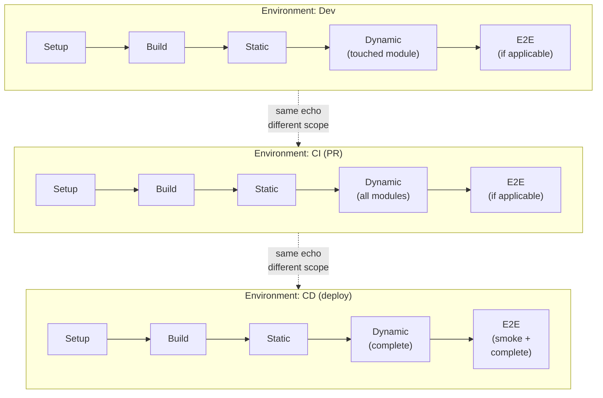
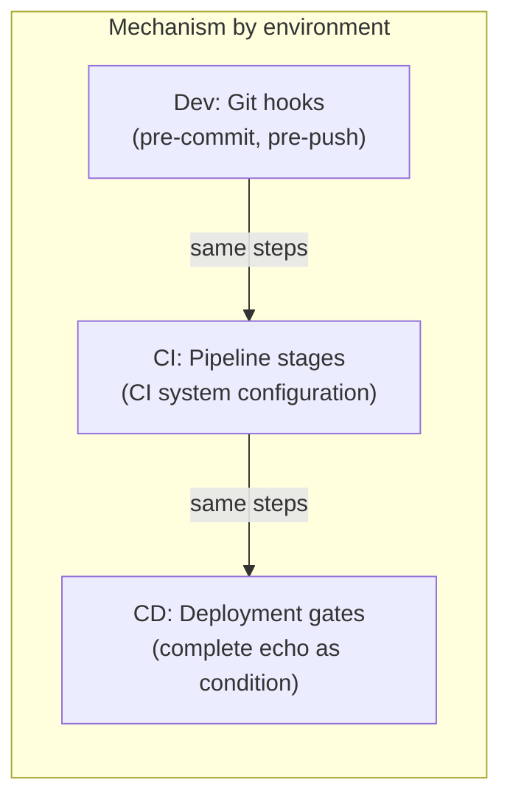
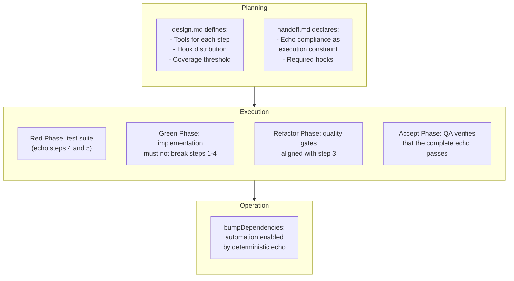
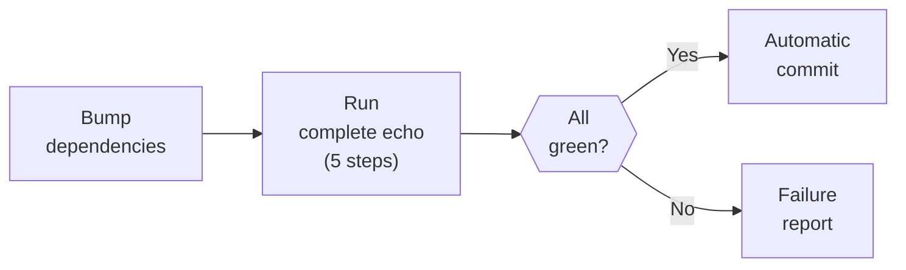

# Echo System

← [Index](README.md)

> An echo is a deterministic sequence of 5 steps that runs in every
> environment — dev, QA, CI, CD. The guarantee is structural: the same
> steps run in the same order in every environment. What varies is the
> **scope** (dev prioritizes fast feedback, CI prioritizes
> completeness) — but no step is ever skipped or reordered.

---

## Contents

- [Why It Exists](#why-it-exists)
- [The 5 Steps](#the-5-steps)
- [Environment Homogeneity](#environment-homogeneity)
- [Enforcement](#enforcement)
- [Connection to the Framework](#connection-to-the-framework)
- [Automation Enabled: bumpDependencies](#automation-enabled-bumpdependencies)
- [Metrics Orchestration (Virgil)](#metrics-orchestration-virgil)
- [Adaptability](#adaptability)
- [Gaps This System Resolves](#gaps-this-system-resolves)

---

## Why It Exists

The framework defines what to build (planning), how to build it (execution)
and how to operate it (operation). But none of those modes defines **how
to verify that the working environment is reliable** in every environment
where the code runs.

Without a deterministic pipeline shared across environments:

- A test may pass in dev because dependencies are cached, and fail in CI
  because setup was not run.
- A linter may run in dev but not in CI, allowing code with violations to
  reach production.
- A build may work locally with a floating version of a dependency and
  break when CI installs a different version.

The echo eliminates these discrepancies. It is not a DevOps "nice to
have" — it is foundational infrastructure that enables the reliability
of everything the framework promises.

[↑ Contents](#contents)

---

## The 5 Steps

The echo always has 5 steps, always in this order. Each step has a
purpose, an input, an output, and a binary failure criterion: it passes
or it doesn't.

### Step 1 — Setup

| Attribute | Value |
|-----------|-------|
| Purpose | Ensure dependencies are installed and free of known vulnerabilities |
| Input | Dependency manifest + lockfile |
| Output | Dependencies installed, no known critical-severity vulnerabilities |
| Failure | Missing dependency, outdated lockfile, critical vulnerability with no fix available |

Setup includes dependency installation and, when the ecosystem supports
it, security auditing (equivalent to `audit fix`). In ecosystems without
a dependency auditing tool, the step is limited to installation and
lockfile verification — the absence of auditing is documented in
`design.md` as a stack limitation. This step always runs. In projects
with no external dependencies, the step validates that the manifest
reflects that decision (or executes a documented no-op).

### Step 2 — Build

| Attribute | Value |
|-----------|-------|
| Purpose | Transform source code into executable or distributable artifacts |
| Input | Source code + installed dependencies |
| Output | buildArtifacts (compiled, transpiled, bundled) |
| Failure | Compilation error, type error, bundling error |
| Conditional | Purely interpreted projects with no build step may mark this step as a documented no-op |

The build produces the artifacts whose landing location is defined by
the [artifact system](artifact-system.md).

### Step 3 — Static Test

| Attribute | Value |
|-----------|-------|
| Purpose | Verify that the code complies with the project's style, formatting, and static analysis rules |
| Input | Source code |
| Output | Code with no linting or formatting violations |
| Failure | Linting rule violation, formatting error, warning treated as error |

Static analysis is not cosmetic — it is the first line of defense
against problematic patterns, unused imports, undeclared variables, and
violations of team conventions. Tool configuration is defined in
[`design.md`](planning/artifacts/schemas.md) (section "Infrastructure
Constraints").

### Step 4 — Dynamic Test

| Attribute | Value |
|-----------|-------|
| Purpose | Run the project's test suite and verify coverage |
| Input | buildArtifacts (or source code) + test suite |
| Output | Test report + coverage report |
| Failure | Failing test, coverage below the project's threshold |

This step runs the tests defined in the [Red Phase](execution/red.md) —
appTests as the primary tier, integration as derived. The coverage
threshold is mandatory for stacks with mature coverage tooling and can
never be lowered (see [Red Phase](execution/red.md), section
"droppableCode"). For stacks where coverage is not measurable or
semantically relevant (IaC, data pipelines), `design.md` MUST declare an
alternative verification metric (e.g., policy compliance rate, mutation
testing score, contract conformance). The alternative metric follows
the same rule: once established, it can never be lowered.

### Step 5 — E2E Test

| Attribute | Value |
|-----------|-------|
| Purpose | Verify the fully deployed, multi-service solution, with zero mocks |
| Input | Solution deployed in an accessible environment |
| Output | E2E test report |
| Failure | Failing E2E scenario |
| Conditional | Only if the project has E2E surface. If not applicable, it is documented as an exception |

E2E runs on deploys, tags, and merges to main branches (see the
[pipeline placement table](execution/red.md) for the detailed
distribution of what runs when).

[↑ Contents](#contents)

---

## Environment Homogeneity

The fundamental property of the echo is that the same 5 steps run in
every environment, in the same order. What varies between environments
is the **scope** of each step and the **trigger** that invokes it — not
the steps or their sequence. Dev prioritizes fast feedback (selective
scope), CI prioritizes completeness (broad scope), CD prioritizes full
confidence (complete scope + post-deploy smoke).

### Differences by environment

| Aspect | Dev (hooks) | CI (PR) | CD (deploy) |
|--------|-------------|---------|--------------|
| Trigger | Pre-commit / pre-push | Push to PR, merge request | Tag, merge to main/develop |
| Step 4 scope | Touched module | All affected modules | Full suite |
| Step 5 scope | Optional (smoke subset) | E2E suite if applicable | Full E2E suite + post-deploy smoke |
| Speed vs confidence | Prioritizes fast feedback | Balance | Prioritizes full confidence |

The detailed distribution table is in the [Red Phase](execution/red.md)
(section "Pipeline placement").

[↑ Contents](#contents)

---

## Enforcement

The echo is not a recommendation — it is mandatory. The enforcement
mechanism depends on the environment:

### In development (git hooks)

Git hooks are the local enforcement. The distribution between
pre-commit and pre-push is a project decision documented in
[`design.md`](planning/artifacts/schemas.md) (section "Infrastructure
Constraints") and declared in [`handoff.md`](planning/artifacts/schemas.md)
(section "Execution Constraints").

Default distribution:

| Hook | Steps it runs | Rationale |
|------|----------------|-----------|
| Pre-commit | 3 (static test) | Immediate feedback on formatting and linting |
| Pre-push | 1 → 2 → 3 → 4 (selective) | Full verification before sharing code |

This distribution is a default — the exact distribution is decided by
the project and documented in `design.md`. Some projects may include
App tests (step 4, touched module) in pre-commit for faster feedback
(see [pipeline placement table](execution/red.md)). The invariant
principle: **never push code that does not pass the echo** (at least
through step 4).

The echo's hooks are **pre-\*** (pre-commit, pre-push): they run before
the change is recorded, blocking code that does not pass the
corresponding step. Virgil adds **post-\*** hooks (post-commit,
post-merge) for governance tasks that do not block the local flow —
bindingLayer updates, strength metrics calculation. The two sets of
hooks coexist without collision because they operate at different
moments of the git cycle: the echo controls the deterministic
pre-change quality gate; Virgil controls post-change observability and
metrics.

### Time Budget

When the complete echo (steps 1-4) exceeds a tolerable time for the
developer's workflow (e.g., large monorepos, compiled builds), the
project defines a **time budget** for pre-push in `design.md`. Steps
that do not fit within the budget are deferred to CI, explicitly
documenting the trade-off: the developer may push code that CI could
reject. The echo still runs in full in CI — the budget only affects the
local hook distribution.

### In CI

The CI pipeline runs all 5 steps. The scope of each step depends on the
trigger: on PRs, step 5 may be limited to the safety subset; on merges
to main branches, the full E2E suite (see
[pipeline placement table](execution/red.md)). If any step fails, the
pipeline stops — there is no point running dynamic tests if the build
failed, or E2E if App tests do not pass.

In addition to the 5-step pipeline, `virgil health` and `virgil
coverage --min` can be added as independent CI gates, aligned with Echo
but not replacing it: `virgil health` verifies the project's aggregate
traceability and strength status; `virgil coverage --min` enforces a
minimum coverage threshold weighted by mutation testing. Both run in
parallel to the echo — the echo verifies that the code works, Virgil
verifies that the code is traceable and robust.

### In CD

The deployment gate requires a fully green echo as a precondition.
Post-deploy, an E2E subset (smoke) verifies that the deployment was
successful.

### Environment Parity Verification (recommended)

When staging and production diverge in configuration, data, or
infrastructure state, a test may pass in staging (green echo) and the
same implementation behave differently in production. Environment
homogeneity (see [previous section](#environment-homogeneity)) already
covers this conceptually — same steps, same order — but does not
require verifying that the CONFIGURATION of each environment matches.

**Virgil does not manage infrastructure** — provisioning or maintaining
parity between environments is not its responsibility. What it CAN do
is orchestrate a parity check as part of the deployment gate:

| Verifiable aspect | Example check |
|---------------------|----------------|
| Runtime/dependency version | Same Node/Go/Python version in staging and production |
| Declared environment variables | Same set of env vars (without comparing secret values) between environments |
| Infrastructure configuration | Same active feature/infra flags (state drift, e.g. Terraform) |

This check is **RECOMMENDED, not mandatory** — unlike the echo's 5
steps, which are TINA. The project implements it as an additional
deployment gate step in CD (see [In CD](#in-cd)) using its own
infrastructure tooling; the echo orchestrates it but does not
prescribe it.

[↑ Contents](#contents)

---

## Connection to the Framework

The echo is cross-cutting — it is defined, implemented, verified, and
exploited across all three modes.

### Where each aspect is configured

| What | Where | When |
|------|-------|------|
| Tools for each step | `design.md` — Infrastructure Constraints | Phase 3 (Design) |
| Hook distribution | `design.md` — Infrastructure Constraints | Phase 3 (Design) |
| Coverage threshold | `design.md` — Infrastructure Constraints | Phase 3 (Design) |
| Echo compliance | `handoff.md` — Execution Constraints | Phase 5 (Handoff) |
| Hook implementation | Repo working tree | execution (prePhase or Green) |
| Echo verification | Accept Phase | execution (Accept) |
| Exploitation (bumpDeps) | Operation | operation |

[↑ Contents](#contents)

---

## Automation Enabled: bumpDependencies

When the echo is deterministic and reliable, it enables a fundamental
automation: automated dependency updates.

The pattern is simple:

1. Update one or more dependencies in the project's manifests
2. Run the complete echo (the 5 steps)
3. If everything passes → automatic commit
4. If something fails → report for manual intervention

This pattern addresses the framework's inherent tension:

- The [Red Phase](execution/red.md) requires exact (pinned) versions
  for reproducible builds.
- The [Red Phase](execution/red.md) requires modern dependencies
  (latest stable version).
- The [Refactor Phase](execution/refactor.md) verifies dependencies
  with no known CVEs.

Without an update mechanism, pinned versions become outdated and
vulnerable. The deterministic echo is what makes automated updating
viable — without it, bumping is a gamble.

### Pattern Considerations

| Aspect | Guidance |
|--------|----------|
| Patch / minor | Automatable — a green echo confirms compatibility |
| Major (breaking) | Require manual migration — treat them as planned work (planning), not as an automated bump |
| Peer dependencies | Must be bumped atomically as a group (e.g., react + react-dom + @types/react) |
| Polyglot projects | Each package manager has its own manifest; bumps may need coordination across managers |
| Frequency and grouping | Project decision documented in `design.md` |

The concrete mechanics (bump tool, grouping strategy, frequency) are
ported to the project's platform. The pattern is universal; the
implementation decisions are not.

[↑ Contents](#contents)

---

## Metrics Orchestration (Virgil)

Dogma (principles 2 and 3) requires verifying not only that the code
passes the echo, but that it has adequate structural strength and that
the MIM can manage the project from a higher level without manually
reviewing code. Virgil solves this by orchestrating external metrics
tools — it does not implement them.

| Metric | Tool (example by stack) | What it measures | When it runs |
|--------|---------------------------|-------------------|---------------|
| Mutation testing | Stryker (JS/TS), PIT (JVM), mutmut/cosmic-ray (Python) | Whether tests detect deliberate code mutations — real strength, not just line coverage | post-commit / CI (periodic — expensive to run on every commit) |
| CRAP score | crap4j and equivalent tools | Complexity weighted by lack of coverage — identifies risky, untested code | post-commit / CI, together with mutation testing (CRAP depends on the mutation score) |
| Cyclomatic complexity | ESLint complexity, radon, gocyclo | Branching of each function/module | Together with CRAP (same post-\* hook) — feeds the CRAP calculation and is also reported as an independent metric against its own threshold |
| Module size | Linting/static analysis tools | Modules that exceed a manageable size | post-commit / CI (periodic) |
| Dependency structure | madge / dependency-cruiser (JS/TS), import-linter (Python), architecture tools (Go, JVM) | Circular dependencies and direction violations (dependency inversion) | **pre-commit or pre-push** (blocking) |

Dependency structure is the exception to the post-\* rule: unlike
mutation testing, CRAP, and complexity — which require running or
analyzing the full suite and are expensive per commit — a dependency
check is cheap and detects a binary defect (there is or is not a
cycle/direction violation). That's why it runs as a pre-commit or
pre-push hook, just like echo step 3 (Static Test), and blocks the push
if it finds violations (see
[metrics contract](execution/contracts.md#metrics-contract)).

Virgil runs these tools, aggregates the results, and exposes them via
`virgil health` (a 4-category dashboard: traceability, test strength,
code structure, documentation health) and `virgil coverage --min` (CI
gate). The echo and Virgil are complementary: the echo certifies that
the code works; Virgil certifies that the code is sustainable.

> Detail: [Methodology Governance](planning/artifacts/methodology.md)
> (section "Metrics verification: traceability and strength").

[↑ Contents](#contents)

---

## Adaptability

The echo is prescriptive in its structure (5 steps, in order) but
adaptable in its content:

| Aspect | Fixed | Adaptable |
|--------|-------|-----------|
| Number of steps | 5, always | — |
| Step order | Setup → Build → Static → Dynamic → E2E | — |
| Success criterion | Binary (pass / fail) | — |
| Tools for each step | — | Defined in `design.md` per project |
| Scope by environment | — | Dev (selective) vs CI (complete) |
| Hook distribution | — | Pre-commit vs pre-push vs both |
| Conditional steps | — | Any step can be a documented no-op when it does not apply to the stack |

### Execution Unit

The echo operates at the level of an **independently buildable and
testable unit**. In a simple project, that unit is the entire project.
In a monorepo with multiple packages, each package has its own echo
instance. In a polyglot project (e.g., Go backend + TypeScript
frontend), each stack has its own echo with its own tools.

| Structure | Echo unit | Orchestration |
|-----------|-----------|-----------------|
| Simple project | The entire project | Direct (1 echo) |
| Monorepo (workspaces) | Each independent package | The monorepo orchestrator runs echoes selectively by affected packages |
| Polyglot | Each stack | Each stack defines its tools; the project echo orchestrates them |

In dev (hooks), the echo runs only for the units affected by the
change. In CI, it runs for all affected units plus their dependents. In
CD, all echoes run.

### Unconventional Stacks

The 5-step model is designed for software projects with a build-test
cycle. For stacks where the steps do not map directly (IaC, data
pipelines, static site generators), the project defines in `design.md`
how each echo step translates to its context:

| Echo step | IaC (example) | Data pipeline (example) |
|-----------|-----------------|----------------------------|
| Setup | Install providers/plugins | Install pipeline dependencies |
| Build | `plan` / `preview` (validation, not a distributable artifact) | Compile DAGs / transformations |
| Static | HCL/YAML linting, policy-as-code (OPA, Sentinel) | Script linting, schema validation |
| Dynamic | Policy compliance tests, plan validation | Transformation tests with test data |
| E2E | Deploy to an ephemeral environment + verification | End-to-end run with test dataset |

The principle remains: 5 steps, in order, binary. What changes is WHAT
each step runs, not the structure.

### Documented Exceptions

When a step does not apply to the project (e.g., a pure algorithmic
library with no E2E surface, or an IaC project where Build produces a
plan instead of a distributable artifact), it is documented as an
exception in `design.md` and declared in `handoff.md`. The exception
follows the framework's standard format (see
[documented exceptions](agile-adaptations.md)).

The step is marked as a no-op in the echo, not removed. The 5 steps
always exist conceptually — a step that does not apply executes a
successful no-op, it does not disappear.

[↑ Contents](#contents)

---

## Gaps This System Resolves

| Identified gap | Where it existed | How the echo addresses it |
|-------------------|---------------------|------------------------------|
| CI/CD integration TBD | [execution/README.md](execution/README.md) | The echo IS the definition of the pipeline that CI runs |
| No mention of static analysis | 29 docs, 0 references to linting/formatting | Step 3 (Static Test) formalizes it as mandatory |
| Hooks mentioned but not specified | [schemas.md](planning/artifacts/schemas.md) | Local echo enforcement via pre-commit/pre-push |
| No concept of environment homogeneity | Entire framework | Fundamental echo property: same steps, every environment |
| Tension between pinned versions ↔ modern deps | [red.md](execution/red.md) | bumpDependencies as a pattern enabled by the deterministic echo |
| CI as an undefined participant | [green.md](execution/green.md), [git-strategy.md](execution/git-strategy.md) | CI runs the echo — now it is defined |

[↑ Contents](#contents)

---

## Related Documents Index

| Document | Relationship to this one |
|----------|-----------------------------|
| [artifact system](artifact-system.md) | Step 2 (Build) produces artifacts; steps 4 and 5 produce test and coverage reports. The artifact system defines WHERE they land |
| [Red Phase](execution/red.md) | Defines the test suite (steps 4 and 5) and the pipeline placement table |
| [Green Phase](execution/green.md) | The implementation must not break echo steps 1-4 |
| [Refactor Phase](execution/refactor.md) | Quality gates aligned with step 3; CVE verification |
| [Accept Phase](execution/accept.md) | QA verifies that the complete echo passes as part of certification |
| [Schemas](planning/artifacts/schemas.md) | `design.md` defines the tools; `handoff.md` declares compliance |
| [Git Strategy](execution/git-strategy.md) | Hooks and CI as participants in the worktree lifecycle |
