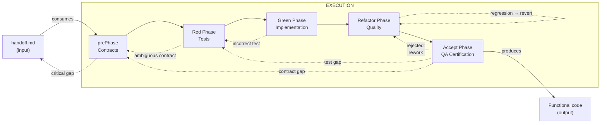
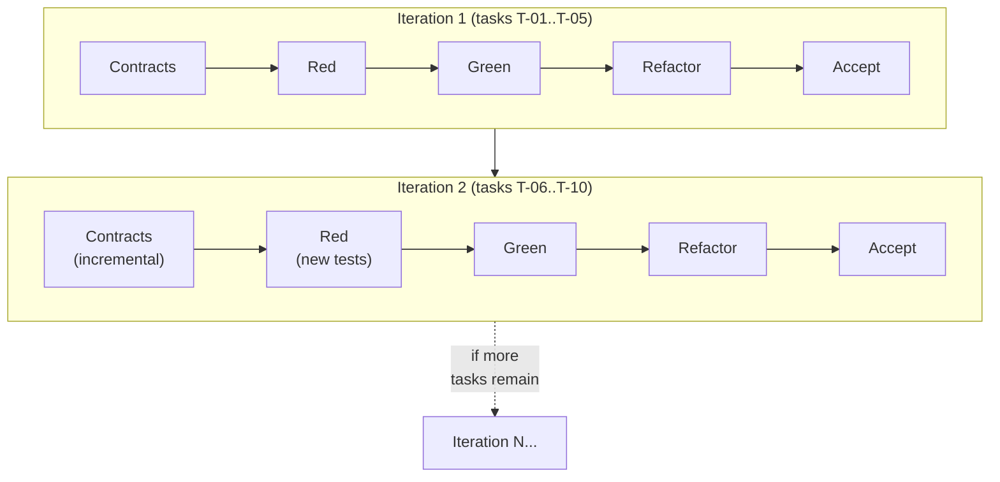
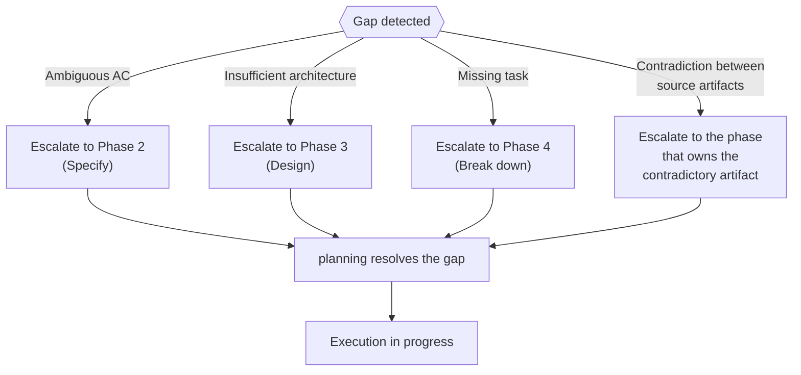
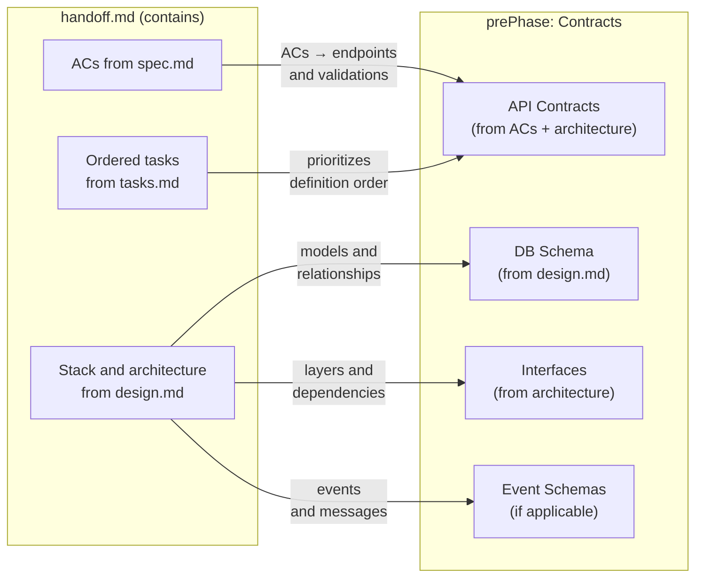
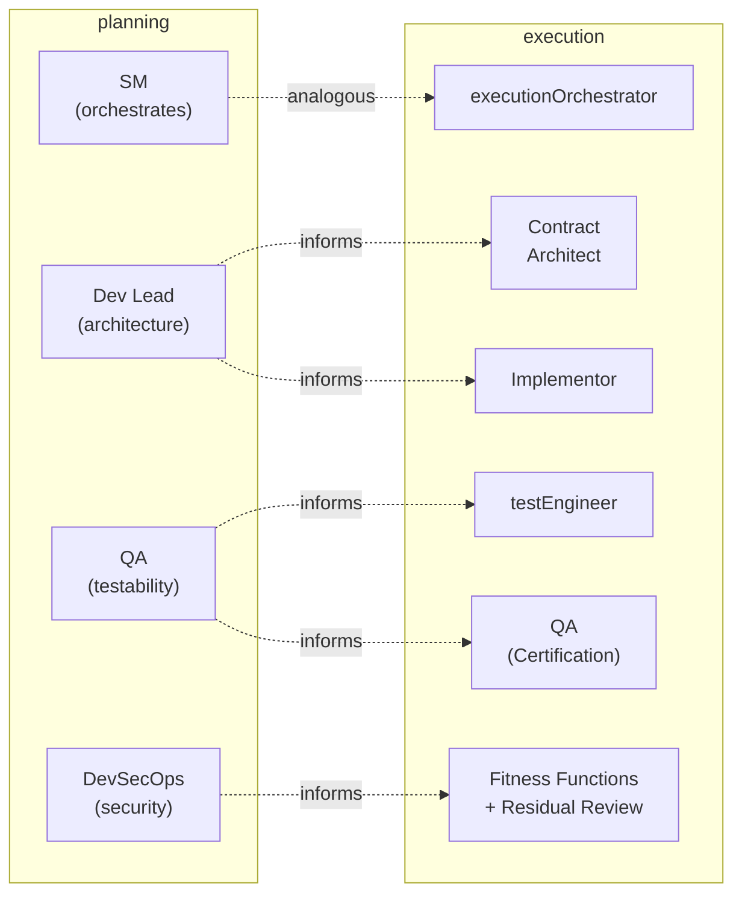
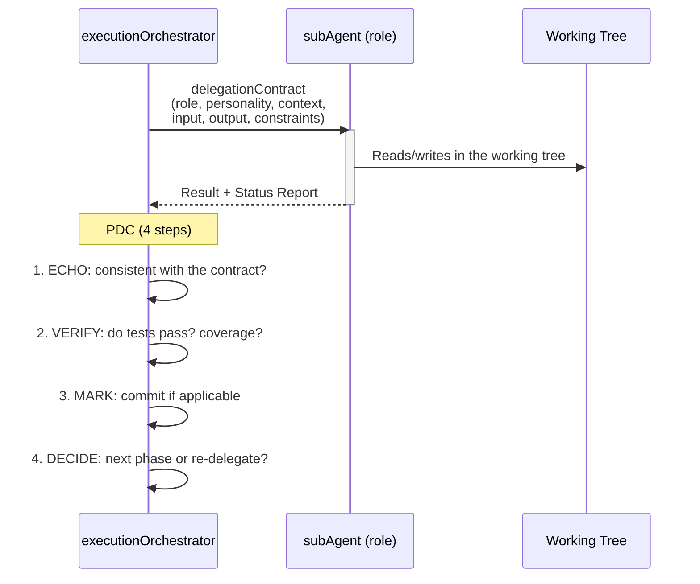

# Execution Model

← [Main Index](../README.md)

> From handoff to functional code. This mode consumes the contract produced
> by planning and produces code that is implemented, tested, and
> refactored in the working tree of the target repository.

---

## Contents

- [Overview](#overview)
- [Iterative Cycle](#iterative-cycle)
- [Connection with Planning](#connection-with-planning)
- [Execution Roles](#execution-roles)
- [Orchestrator Delegation Model](#orchestrator-delegation-model)
- [Parallel Execution and Deterministic Resumption](#parallel-execution-and-deterministic-resumption)
- [What Comes Next](#what-comes-next)
- [Contents of This Section](#contents-of-this-section)

---

## Overview

Execution transforms an approved `handoff.md` into functional code
through five structural phases. The sequence **Contract - Red -
Green - Refactor - Accept** is not a micro cycle per function --- it is
the macro backbone of the entire execution.

> **Batch-level TDD, not micro**: This framework reinterprets
> Red-Green-Refactor as macro phases — first the entire test suite,
> then all the implementation, then all the refactoring. This is batch
> TDD, not function-by-function (micro) TDD. The trade-off: fast
> feedback between an individual test and its implementation is lost,
> but a complete executable specification is gained, along with the
> ability to parallelize the work of the testEngineer and the Contract
> Architect. For tasks with high algorithmic complexity, the
> Implementor may use micro TDD within the Green Phase as a
> complementary tool.
>
> **Mechanically validated input**: execution does not start from a
> freely interpreted `handoff.md`. It starts from a handoff that passed
> `virgil handoff lint` — the mechanical validation that verifies the
> contract is well-formed (complete ACs, referenceable contracts,
> consistent task DAG) before delegating any work to the prePhase. A
> handoff that does not pass the lint does not enable execution.

### Phase Table

| Phase | Input | Output | Actors |
|------|---------|--------|---------|
| prePhase: Contracts | `handoff.md` (spec, design, tasks) | Formal contracts (API, DB, interfaces) | Orchestrator + Contract Architect |
| Red | Contracts + ACs from `spec.md` | testPlan + testContract + testImplementation (all fail) + configured coverage | testEngineer |
| Green | Red tests + contracts | Code that passes all tests | Implementor |
| Refactor | Green code + tests | Clean code, mechanically verified, aligned with `design.md` | Fitness functions + residual review |
| Accept: QA Certification | Refactored code + test reports + metrics reports + handoff.md + operational documentation (if required by the handoff) | Formal certification of handoff compliance | QA (execution) |

[↑ Contents](#contents)

---

## Iterative Cycle

### Red-Green-Refactor within an Iteration

The macro cycle (Contract → Red → Green → Refactor) can run multiple
times within a project:

### When to Re-enter Red

| Situation | Action |
|-----------|--------|
| New ACs discovered during Green | Return to Red: write tests for the new ACs |
| New contract needed (unforeseen integration) | Return to prePhase: define the contract, then Red |
| Bug discovered during Refactor | Write a test that reproduces the bug (Red), fix it (Green) |
| Requirement changed by the MIM | Escalate to planning if structural. If minor: update the contract, Red, Green |

### Escalation to Planning

> **Note**: If the contradiction is between ACs in the spec → Phase 2.
> If it is between design decisions → Phase 3. If it is between tasks →
> Phase 4. Phase 5 is re-run AFTER the upstream contradiction is
> resolved to regenerate the handoff with the corrected artifacts.

The executionOrchestrator does NOT resolve planning gaps --- it
escalates them. planning has the roles and the ceremony to resolve
them. execution operates with what it receives; if what it receives is
insufficient, it returns it.

[↑ Contents](#contents)

---

## Connection with Planning

### How the Handoff Feeds the prePhase

> **Note**: The `Testing strategy` feeds the Red Phase (not the
> prePhase). The `DAG + lanes` feeds the Orchestrator for
> parallelism decisions (see [git-strategy.md](git-strategy.md)). They
> are not included in the prePhase diagram because they do not directly
> feed the definition of contracts.

### Planning Artifacts that Inform Execution

| Planning Artifact | How Execution Uses It |
|-------------------|----------------------|
| `spec.md` (ACs) | Each AC becomes one or more tests. Direct traceability. |
| `design.md` (architecture) | Defines the code structure. Refactor verifies alignment. |
| `design.md` (ADRs) | Technical decisions that constrain the implementation. |
| `tasks.md` (DAG) | Execution order. Parallel lanes. Critical path. |
| `tasks.md` (workItems) | Each L3/L4 is a unit of work in Green. |
| `handoff.md` | Self-contained contract. Entry point for execution. |

### Feedback Loop: Execution → Planning

| Event in Execution | Feedback to Planning |
|---------------------|---------------------------|
| AC not implementable as written | `spec.md` needs rewording (Phase 2) |
| Architecture insufficient for an AC | `design.md` needs an additional ADR (Phase 3) |
| Missing task discovered | `tasks.md` needs an update (Phase 4) |
| Contradiction between ACs | `spec.md` has an internal conflict (Phase 2) |
| Undocumented external dependency | `design.md` needs a component (Phase 3) |

[↑ Contents](#contents)

---

## Execution Roles

### Roles Table

| Role | Personality | Active Phase | Responsibility | Input | Output |
|-----|-------------|-------------|-----------------|-------|--------|
| **executionOrchestrator** | Methodical, flow-oriented. Delegates, does not execute. Analogous to the SM in planning. | All | Reads the handoff, coordinates the 5 phases, delegates to subAgents, validates results, manages commits. | `handoff.md` + repo AGENTS.md | Code implemented in the working tree |
| **Contract Architect** | Precise, interface-oriented. Thinks in terms of contract consumers. | prePhase | Defines formal contracts based on the architecture and ACs. | `design.md` + `spec.md` (via handoff) | Typed contracts (OpenAPI, schemas, interfaces) |
| **testEngineer** | Skeptical, focused on real coverage. Prioritizes appTests (real stack) over any form of mocking; unit tests forbidden, integration derived by filtering. | Red | Writes the complete test suite mapped to ACs and contracts. | Contracts + ACs | testPlan + testContract + testImplementation (all fail) + coverage config |
| **Implementor** | Pragmatic, focused on "making it work". No premature perfectionism. | Green | Writes code that passes the tests. Frequent commits. | Red tests + contracts | Code that passes the tests |
| **Fitness Functions** | Mechanical, deterministic. Measure, don't opine. | Refactor | Run mechanical verification: mutation score, CRAP, complexity, dependency structure, module size, security scanners. | Green code + design.md + metrics tier | Metrics report (pass/fail per tier threshold) |
| **Residual Review** | On demand, only for what cannot be mechanized. | Refactor | Verifies aspects that no tool can measure: authorization logic, DDD modeling. Documented and escalated — not a gate. | Green code + spec.md | Documented observations (non-blocking) |
| **QA (execution)** | Exhaustive verifier. Checks the product against the handoff. Does not assume "tests pass" is sufficient. | Accept | Verifies that EVERY AC in the handoff is met in the product, that coverage did not drop, that product behavior is as expected, and that the operational documentation declared in the handoff exists. Formally certifies. | Refactored code + test reports + handoff.md + operational documentation (if required by the handoff) | Formal certification (mechanism defined by the framework's consumer) |
| **MIM** | Human. Decides, approves, unblocks. | All (on demand) | Approves contracts, resolves ambiguities, accepts the final result. | Orchestrator reports | Decisions and approvals |

### Mapping to Planning Roles

Execution roles are NOT the same as planning roles. In planning, the
roles are **review lenses** that evaluate artifacts. In execution, the
roles are **executors** that produce code. The relationship is one of
**influence** (planning decisions guide execution), not identity.

[↑ Contents](#contents)

---

## Orchestrator Delegation Model

The executionOrchestrator follows the same delegation pattern
documented in
[SM Behavior](../planning/behavior/README.md):
delegationContracts with mandatory fields, Status Report, and PDC
(Post-Delegation Checkpoint).

### Differences from the Planning SM

| Aspect | SM (planning) | Orchestrator (execution) |
|---------|-------------|------------------------|
| Where it writes | artifactStore (outside the repo) | Repo working tree |
| What it produces | Planning artifacts | Code, tests, commits |
| Roles it convenes | Team (lenses) | Executors (code writers) |
| Validation | Artifact gates | Tests pass + coverage |
| Escalation | To the MIM | To the MIM or back to planning |

[↑ Contents](#contents)

---

## Parallel Execution and Deterministic Resumption

A handoff with multiple independent lanes is not executed lane by
lane sequentially — it runs in parallel, with claiming semantics to
prevent two lanes from taking the same task:

| State | Meaning |
|--------|-------------|
| `pending` | The task exists in the DAG but no lane has claimed it |
| `claimed` | A lane has claimed the task and is working on it |
| `done` | The task is finished, with its commit SHA recorded |

This execution state (claiming + timestamps + commit SHAs, see
[contracts.md](contracts.md#execution-state-contract)) is
persisted outside the context of any individual agent. This
enables **deterministic resumption**: if a lane fails, the process is
interrupted, or the context is compacted, the Orchestrator reconstructs
which tasks are in progress, which finished, and which remain pending
by reading the persisted state — without re-asking the MIM or
re-deriving work already done.

[↑ Contents](#contents)

---

## What Comes Next

Areas within execution that require further definition:

| Area | Status | Description |
|------|--------|-------------|
| Detailed delegationContracts | TBD | Complete templates for each execution role (like `roles/` in planning) |
| ~~Execution parallelism~~ | DEFINED | See [git-strategy.md](git-strategy.md) — worktrees per lane, conflict detection, controlled merge |
| ~~Commit strategy~~ | DEFINED | See [git-strategy.md](git-strategy.md) — per-phase convention, AC→test→commit traceability, squash policy |
| ~~CI/CD integration~~ | DEFINED | See [echo system](../echo-system.md) — deterministic 5-step pipeline, enforcement via hooks and CI, environment homogeneity |
| Execution metrics | TBD | Coverage thresholds, cycle times, re-delegation rate |
| operation | DEFINED | Optional and reactive. The MIM operates the product with agent assistance. See [operation model](../operation/README.md) |

[↑ Contents](#contents)

---

## Contents of This Section

This document is split into seven pages:

| Page | Contents |
|--------|-----------|
| **README.md** (this document) | Overview, iterative cycle, connection with planning, roles, delegation model |
| [Contracts](contracts.md) | prePhase: contract-first, contract types, parallel development, validation |
| [Red Phase](red.md) | boundaryModel, 3-layer architecture, derived tests and droppableCode |
| [Green Phase](green.md) | Implementation rules, commit strategy, test vs code |
| [Refactor Phase](refactor.md) | Quality gate, review dimensions, checklist |
| [Accept Phase](accept.md) | QA Certification: what it verifies, against what, how it certifies |
| [Git Strategy](git-strategy.md) | Gitflow, worktrees for parallelism, commits, merge strategy |

[↑ Contents](#contents)

---

## Related Documents Index

| Document | Relation to This One |
|-----------|-------------------|
| [Overview](../overview.md) | Map of the complete framework |
| [Operational Model](../planning/operational-model.md) | Defines the two modes and their boundaries |
| [Artifacts](../planning/artifacts/README.md) | Defines `handoff.md` (input to this mode) and the 6 artifacts |
| [SM Behavior](../planning/behavior/README.md) | Delegation pattern and PDC that the Orchestrator adapts |
| [Roles](../planning/roles/README.md) | Planning roles that inform the execution roles |
| [echo system](../echo-system.md) | Deterministic 5-step pipeline that CI runs; enforcement via hooks |
| [artifact system](../artifact-system.md) | Where echo outputs land (builds, reports, coverage) |

[↑ Contents](#contents)
