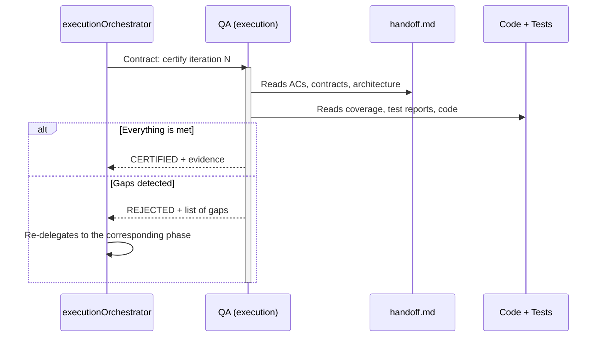

# Accept Phase — QA Certification

← [Main Index](../README.md) | [Execution](README.md)

> The Accept Phase is the final gate before closing an iteration.
> QA verifies that the implemented product fulfills EVERYTHING the
> handoff stipulates — not just that the tests pass.

---

## Contents

- [Principle](#principle)
- [What QA Verifies](#what-qa-verifies)
- [Mechanical Verification (Dogma)](#mechanical-verification-dogma)
- [What QA Does NOT Do in This Phase](#what-qa-does-not-do-in-this-phase)
- [Certification Mechanism](#certification-mechanism)
- [Phase Flow](#phase-flow)
- [Result](#result)
- [External Validation (recommended)](#external-validation-recommended)
- [Multi-Cycle Interaction Testing (Feature Flags)](#multi-cycle-interaction-testing-feature-flags)

---

## Principle

QA does not validate code — it validates PRODUCT against CONTRACT
(handoff). "Tests pass" is a necessary but NOT sufficient condition. QA
certifies that:

- Every AC in `spec.md` is functionally met.
- The prePhase contracts are respected.
- Coverage has not dropped relative to the baseline.
- Product behavior is as expected (not just code behavior).

[↑ Contents](#contents)

---

## What QA Verifies

| Dimension | Source of Truth | What Is Verified |
|-----------|-------------------|------------------|
| Functional ACs | `spec.md` (via handoff) | Every AC has passing test(s) AND the observable behavior is correct |
| Contracts | prePhase contracts | APIs, schemas, interfaces respect what was defined |
| Coverage | Project threshold | Has not dropped. New code is covered. |
| droppableCode | Coverage report | Code with 0% coverage identified and reported |
| Architecture | `design.md` (via handoff) | Refactor aligned the implementation with architectural decisions |
| Security | Security scanners (govulncheck, npm audit, trivy) | Critical vulnerabilities resolved before certifying |
| Full echo | [echo system](../echo-system.md) | The 5 echo steps pass (setup, build, static, dynamic, E2E). Precondition for certification |
| Operational documentation | `handoff.md` "Expected Operational Documentation" section | If the handoff requires it: documentation exists, is usable, covers what was declared. If the handoff says "not required": skip verification. |
| Metrics (Dogma) | `virgil health` | Mutation score, CRAP, complexity, and binding coverage meet the active tier threshold |

[↑ Contents](#contents)

---

## Mechanical Verification (Dogma)

In addition to the dimensions in the table above, Accept certification
includes the `virgil health` report, which aggregates four categories:

1. **Binding coverage** — percentage of ACs with a binding in
   `verified` state (requirement → test → code, see
   [contracts.md](contracts.md#binding-layer-contract)).
2. **Mutation score** — real strength of the test suite.
3. **CRAP score** — change risk per module.
4. **Cyclomatic complexity** — size and complexity of the modules.

`virgil coverage --min` acts as a CI gate: a build that does not reach
the configured minimum coverage fails before reaching Accept — QA
never certifies over a build that was already broken at that gate.

> **Deterministic gate**: unlike a manual review, the Accept gate in
> Dogma is deterministic — it is approved when binding coverage and
> `virgil health` metrics reach the active tier threshold (see
> [refactor.md](refactor.md#metrics-based-verification)), not when a
> human "thinks it looks good." "Tests pass" remains a necessary but
> not sufficient condition: the metrics are the sufficient condition.

[↑ Contents](#contents)

---

## What QA Does NOT Do in This Phase

- Does not write tests (that is Red).
- Does not fix code (that is Green/Refactor).
- Does not define contracts (that is prePhase).
- Does not resolve planning gaps (escalates to planning).

[↑ Contents](#contents)

---

## Certification Mechanism

> **Agnostic by design**: The framework defines WHAT QA certifies, not
> HOW it is formalized. The framework's consumer chooses the mechanism
> appropriate to their context:
>
> - Signed git tag (`qa/approved/iter-1`)
> - Merge commit trailer (`Certified-By: QA`)
> - CI/CD pipeline gate
> - artifactStore artifact (acceptance report)
> - Approval in a management tool (Jira, Linear, etc.)
>
> What the framework REQUIRES is that the certification be **formal,
> traceable, and auditable** — not an informal "yes, looks good."

[↑ Contents](#contents)

---

## Phase Flow

[↑ Contents](#contents)

---

## Result

| Result | Next Action |
|-----------|-------------------|
| CERTIFIED | Orchestrator closes the iteration (merge → develop) |
| REJECTED — implementation gap | Re-delegate to Green |
| REJECTED — quality gap | Re-delegate to Refactor |
| REJECTED — test gap | Re-delegate to Red |
| REJECTED — contract gap | Re-delegate to prePhase |
| REJECTED — planning gap | Escalate to planning |

[↑ Contents](#contents)

---

## External Validation (recommended)

Accept certification is internal: QA validates the product against the
handoff, not against a real user's experience. The framework
RECOMMENDS, without requiring it, that after a CERTIFIED result someone
outside the agent team — the MIM, a stakeholder, a pilot user — sees
the software working before closing the iteration. That external
signal is the "Measure" in Build-Measure-Learn: it feeds the next
Phase 1 (Define the Idea) or Phase 8 (Retrospective) with real
evidence, not just the team's own perception. It does not block the
iteration's closure — it is a recommended ceremony, not a gate.

[↑ Contents](#contents)

---

## Multi-Cycle Interaction Testing (Feature Flags)

When two or more active cycles deliver features behind feature flags,
each feature can pass its own Accept in isolation and still interact
unexpectedly when both flags are enabled simultaneously. No test from
an individual cycle covers the combined state.

**Expected behavior**: if the file scopes of two active cycles
overlap (same module, same domain), QA recommends integration testing
with both flags enabled. This is **advisory, not blocking** — it does
not prevent the individual certification of each feature, but it is
recorded as an observation in the Accept report.

| Condition | QA Action |
|-----------|---------------|
| Cycles with disjoint file scopes | No additional action |
| Cycles with overlapping scopes, independent flags | Recommend an integration test with both flags ON. Does not block. |
| Cycles with overlapping scopes, known functional dependency | Recommend a mandatory integration test before the next joint deploy. Still does not block the individual Accept. |

This verification depends on `verifyConsistency` exposing which
cycles are active and which files each one touches — see
[semanticDrift detection](../planning/artifacts/state-machine.md#semanticdrift-detection)
for the mechanism that detects overlap between artifacts.

[↑ Contents](#contents)

---

## Related Documents Index

| Document | Relation to This One |
|-----------|-------------------|
| [echo system](../echo-system.md) | QA verifies that the full echo passes as a precondition for certification |
| [artifact system](../artifact-system.md) | Defines where the coverage and test reports that QA consumes live |
| [Red Phase](red.md) | Defines the test suite and coverage threshold that QA verifies |
| [Refactor Phase](refactor.md) | QA verifies that the fitness functions passed and there are no pending critical residual observations |

[↑ Contents](#contents)
