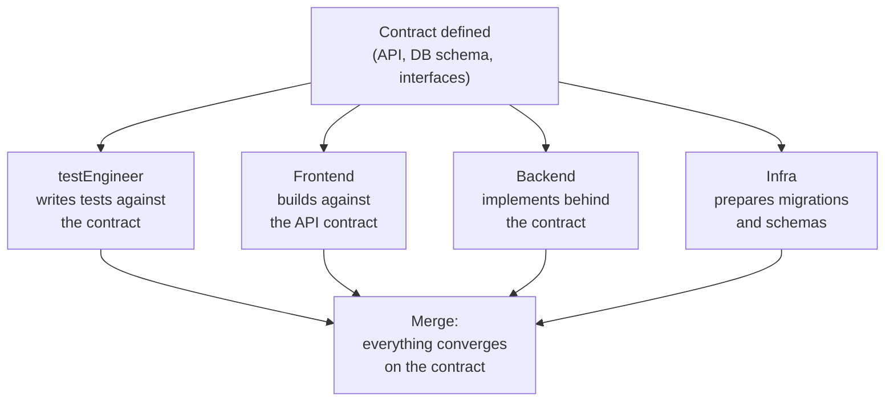
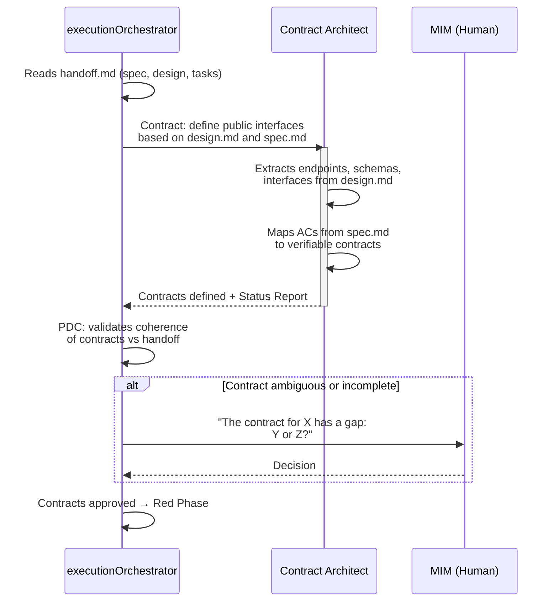
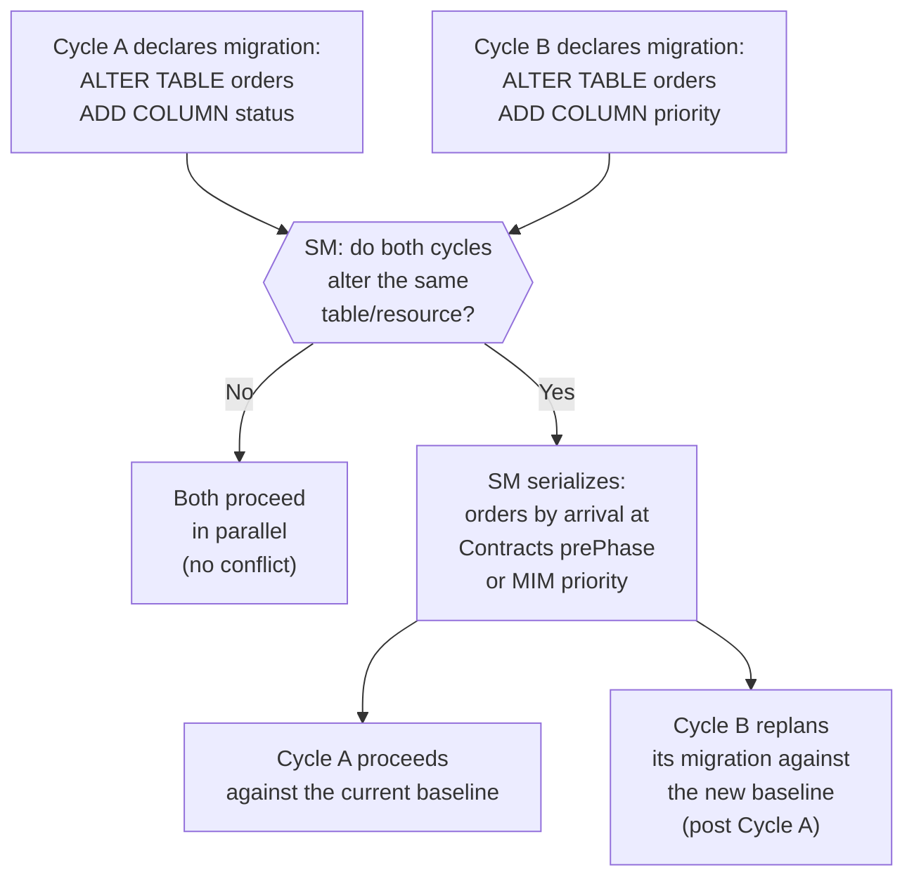

# prePhase: Contract Definition

← [Main Index](../README.md) | [Execution](README.md)

---

## Contents

- [Why Contract-First](#why-contract-first)
- [Contract Types](#contract-types)
- [Binding Layer Contract](#binding-layer-contract)
- [Metrics Contract](#metrics-contract)
- [Execution State Contract](#execution-state-contract)
- [Contract Definition Flow](#contract-definition-flow)
- [Contract Validation Criteria](#contract-validation-criteria)
- [Contract Collision Between Concurrent Cycles](#contract-collision-between-concurrent-cycles)

---

## Why Contract-First

The contract is the shared source of truth among all execution actors.
Before writing a single line of test or implementation, the team
defines the system's public interface. This enables **agile parallel
development**:

> **Note**: The "Frontend", "Backend", and "Infra" roles in the diagram
> are illustrative --- they represent implementation domains, not
> formal execution roles. In the execution model, these domains are
> covered by instances of the Implementor assigned to different lanes.

**Principle: Contract over Methodology.** The contract matters more
than the process. How you implement behind the contract is your
problem --- but you MUST fulfill it. The contract is the verifiable
agreement; the methodology is the ceremony around it.

[↑ Contents](#contents)

---

## Contract Types

| Type | Format (example) | When It Applies | Example |
|------|---------|----------------|---------|
| API Contract | OpenAPI 3.x / AsyncAPI | Project with HTTP endpoints or events | `POST /auth/login` with request/response schema |
| SDK / Library Interface | TypeScript interfaces, Rust traits | Libraries, reusable modules | `interface AuthService { login(credentials): Token }` |
| Database Schema | SQL DDL + migrations | Project with persistence | `CREATE TABLE users (...)` with constraints |
| Event Schema | JSON Schema / AsyncAPI | Event-driven systems | `UserCreatedEvent { id, email, timestamp }` |
| Component Interface | Typed props/inputs | Frontend with components | `LoginFormProps { onSubmit, initialValues }` |
| Connector / Adapter Interface | Ports & adapters | Third-party integrations | `interface PaymentGateway { charge(amount): Receipt }` |
| Binding Layer | requirement ↔ test ↔ code manifest | Every project using Virgil | `AC-01 ↔ AuthTestCase.loginSuccess ↔ src/auth/login.service.ts` |

> The formats are illustrative. Any formal specification that meets the
> contract requirements (typed, machine-verifiable, schema-complete) is
> valid.

[↑ Contents](#contents)

---

## Binding Layer Contract

The binding layer is the contract that connects an AC from `spec.md`
with its test and with the code that satisfies it. Unlike the
contracts in the table above (defined once in the prePhase), the
binding layer evolves during execution — it is not static:

| State | Phase Where It's Reached | What It Guarantees |
|--------|-------------------------|----------------|
| `declared` | Red | The test exists and references an AC (see [red.md](red.md#traceability-ac-testplan-testcontract-implementation-coverage)) |
| `inferred` | Green | A post-commit hook detected that the code exercises the declared test (see [green.md](green.md#binding-inference)) |
| `verified` | Refactor | Mutation testing confirmed the test's real strength (see [refactor.md](refactor.md#metrics-based-verification)) |

[↑ Contents](#contents)

---

## Metrics Contract

Each tier defines a threshold contract that the code must meet before
Accept certifies it (see
[refactor.md](refactor.md#metrics-based-verification)):

| Tier | Minimum Mutation Score | Maximum CRAP | Maximum Cyclomatic Complexity | Maximum Module Size |
|------|------------------------|-------------|--------------------------------|--------------------------|
| strict | ≥ 80% | ≤ 30 | ≤ 10 per function | ≤ 300 LOC per module |
| standard | ≥ 60% | ≤ 45 | ≤ 15 per function | ≤ 500 LOC per module |
| relaxed | ≥ 40% | ≤ 60 | ≤ 20 per function | ≤ 800 LOC per module |

**Dependency structure**: direction rules (no circular dependencies,
dependency inversion respected), with a **zero violations** threshold
across all tiers — unlike the metrics above, this does not admit
grading: a circular dependency is not "more or less acceptable"
depending on the project's rigor, it is a binary structural defect.

The active tier is part of the handoff contract — it is not
renegotiated mid-execution without MIM re-approval.

[↑ Contents](#contents)

---

## Execution State Contract

Parallel execution by lanes (see
[execution model](README.md#parallel-execution-and-deterministic-resumption))
requires an explicit state contract, not just product contracts:

| Field | What It Records |
|-------|----------------|
| **claiming** | The state of each task: `pending`, `claimed`, or `done`. Prevents two lanes from taking the same task. |
| **timestamps** | When each task was claimed and when it was completed. |
| **commit SHAs** | The commit that closed each task, for traceability and resumption. |

This state is what enables deterministic resumption after a crash or a
context compaction: the Orchestrator reconstructs which tasks are in
progress, which finished, and which remain pending by reading the
persisted state, without re-asking the MIM or re-deriving work already
done.

[↑ Contents](#contents)

---

## Contract Definition Flow

[↑ Contents](#contents)

---

## Contract Validation Criteria

A contract is ready when:

1. Every AC in `spec.md` can be mapped to at least one contract
2. Every contract has defined types (request, response, error)
3. The contracts are consistent with each other (no contradictions)
4. Dependencies between contracts are explicit
5. The MIM approved the contracts that require business decisions

[↑ Contents](#contents)

---

## Contract Collision Between Concurrent Cycles

When two concurrent cycles (or a cycle and a hotfix) define contracts
that modify the same resource — typically the same database schema —
the Contracts prePhase is where the SM detects the collision, before
both cycles reach the Red Phase with incompatible migrations.

**Serialization criterion**: the SM orders by the cycle that arrived
first at the Contracts prePhase with the declared contract, or by
explicit MIM priority in case of a tie. The cycle that goes second
does NOT lose its work — its migration is replanned against the new
baseline that the first cycle established.

**Where it's detected**: during contract validation (see
[contract validation criteria](#contract-validation-criteria)), the SM
extends criterion 3 ("the contracts are consistent with each other")
to include consistency BETWEEN active cycles, not just within a single
cycle.

**Record**: the SM annotates the serialization as `[COLLISION]` in the
`plan.md`/`idea.md` of the cycle that replans, with a reference to the
cycle that took precedence.

[↑ Contents](#contents)
