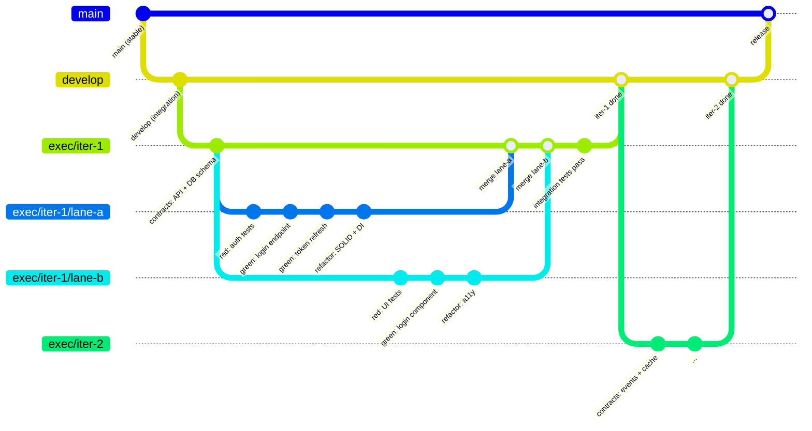
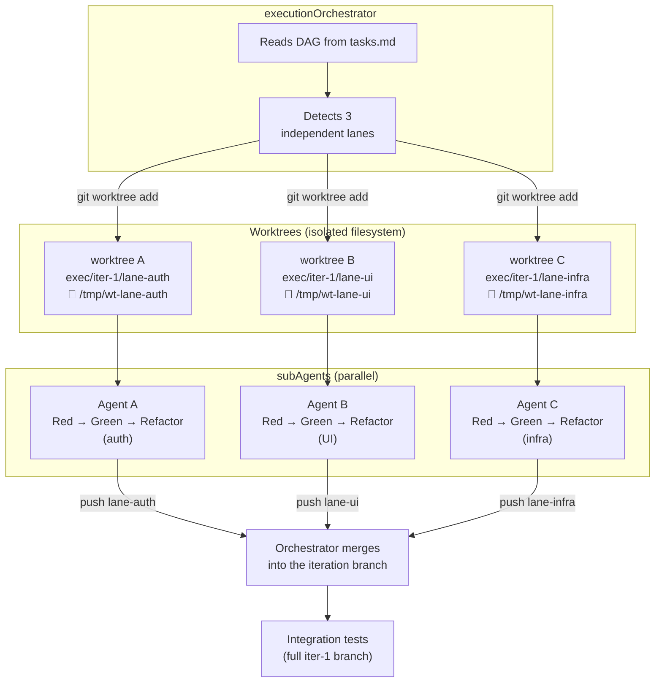
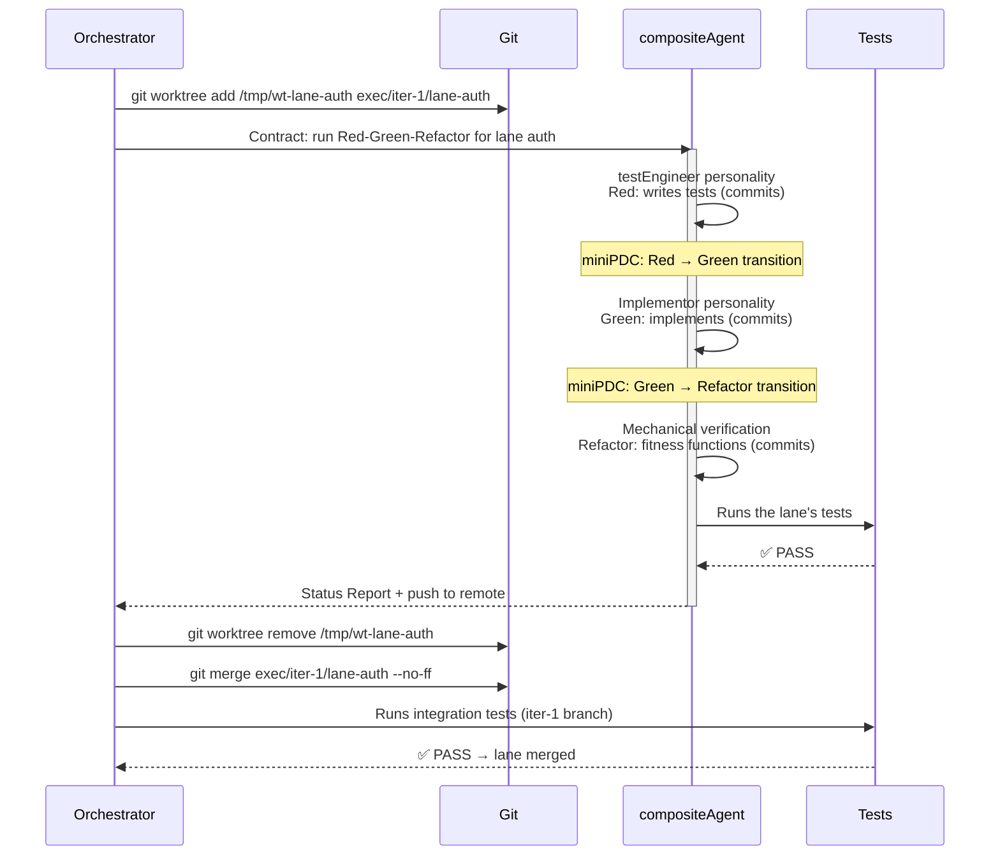
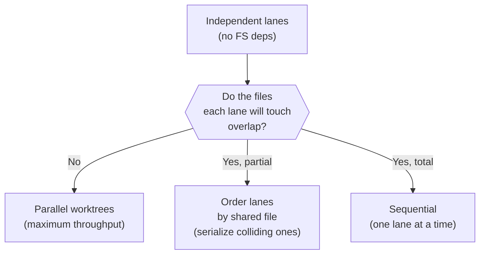
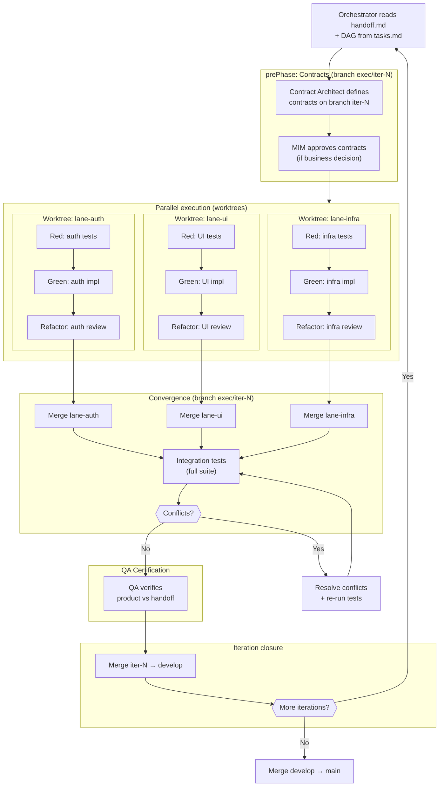
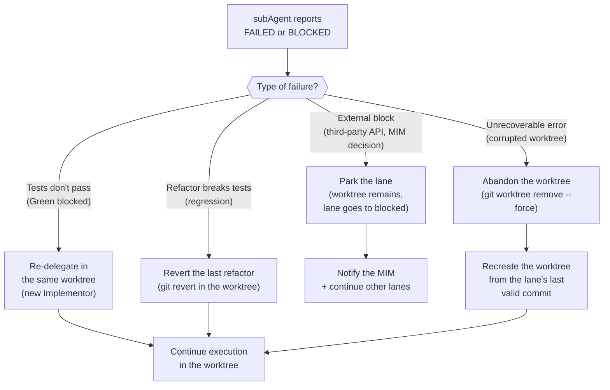
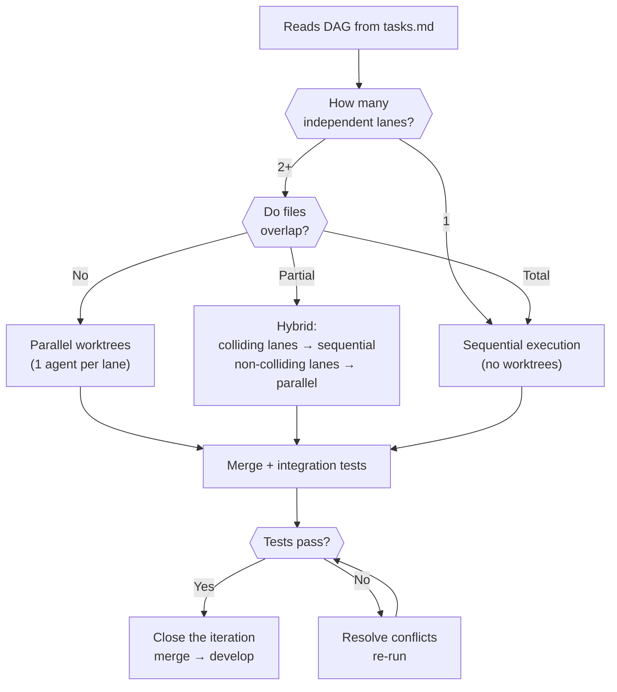

# Git Strategy and Parallelism

← [Main Index](../README.md) | [Execution](README.md)

> Defines how the executionOrchestrator uses branches, worktrees, and
> commits to run the Red-Green-Refactor cycle with real parallelism.
> Resolves the TBDs for "Execution parallelism" and "Commit strategy".

> **Note on WHAT vs HOW.** This document defines the REQUIREMENTS that
> any branching strategy must meet for execution (isolation between
> lanes, traceability to iterations, non-destructive merge, support for
> parallel execution). The reference implementation uses Gitflow
> adapted with worktrees, but any strategy that satisfies these
> requirements is acceptable (trunk-based with feature flags, stacked
> PRs, etc.).

---

## Contents

- [Branch Model](#branch-model)
- [Worktrees for Parallelism](#worktrees-for-parallelism)
- [Commit Strategy](#commit-strategy)
- [Complete Flow of an Iteration](#complete-flow-of-an-iteration)
- [Handling Post-Merge Conflicts](#handling-post-merge-conflicts)
- [Handling Mid-Lane Failures](#handling-mid-lane-failures)
- [Orchestrator Decision Diagram](#orchestrator-decision-diagram)

---

## Branch Model

execution adapts Gitflow to the phased execution context. Each
iteration of the cycle (a batch of tasks from the DAG) operates on a
dedicated branch. Parallel lanes run in isolated worktrees.



### Branch Anatomy

| Branch | Purpose | Who Creates It | When It's Merged |
|------|-----------|---------------|------------------|
| `main` | Stable code, ready for operation | — | When develop passes acceptance |
| `develop` | Continuous integration between iterations | Orchestrator (once) | Into main at release |
| `exec/iter-N` | One iteration of the Red-Green-Refactor cycle | Orchestrator (per iteration) | Into develop when all lanes converge |
| `exec/iter-N/lane-X` | One parallel lane of the DAG | Orchestrator (per lane) | Into exec/iter-N when Refactor completes |

### Naming Rule

```text
exec/iter-{N}/lane-{descriptive-name}

Examples:
  exec/iter-1/lane-auth
  exec/iter-1/lane-ui-login
  exec/iter-1/lane-infra-redis
  exec/iter-2/lane-payments
```

[↑ Contents](#contents)

---

## Worktrees for Parallelism

When the DAG in `tasks.md` has independent lanes (no FS dependencies
between them), the Orchestrator launches subAgents in **isolated
worktrees**. Each agent operates its own working directory without
file conflicts.



### Role Model Within a Worktree

> **Roles ↔ worktrees reconciliation**: In sequential execution (1
> lane), the Orchestrator launches separate roles per phase —
> testEngineer (Red), Implementor (Green), fitness functions + residual
> review (Refactor) — as distinct subAgents with different
> personalities.
>
> In parallel execution with worktrees, each lane is assigned to a
> **compositeAgent** that takes on the personalities sequentially
> within the same worktree. The reason: launching multiple subAgents
> per lane within the same worktree would create filesystem access
> conflicts. The compositeAgent switches personality between phases:
>
> 1. **testEngineer personality** → writes the test suite (Red)
> 2. **Implementor personality** → writes code that passes the tests (Green)
> 3. **Mechanical verification** → runs fitness functions (mutation,
>    CRAP, complexity, dependencies, module size, security scanners).
>    Residual review (authorization, DDD) is documented and escalated
>    without blocking the gate.
>
> The Orchestrator validates each personality transition with a
> miniPDC between phases.

### Lifecycle of a Worktree



> **Note**: This diagram covers the lifecycle of an individual worktree
> (Red-Green-Refactor). The Accept phase (QA Certification) does NOT
> happen per worktree — it runs once per iteration, after ALL lanes
> converge on `exec/iter-N` and integration tests pass, and BEFORE the
> merge of `exec/iter-N` into `develop`. See the "Complete Flow of an
> Iteration" diagram below.

### When to Use Worktrees vs Sequential

| Condition | Strategy | Reason |
|-----------|-----------|-------|
| 2+ lanes with no FS dependencies between them | Parallel worktrees | No file conflicts — maximum throughput |
| Lanes with an SS (start-start) dependency | Worktrees with partial merge | Lane B starts when A starts, but needs A's setup |
| Lanes with an FS (finish-start) dependency | Sequential | B needs A's complete output |
| Single lane or fewer than 5 tasks | Sequential in branch | Worktree overhead is not justified |
| File conflict detected between lanes | Forced sequential | Parallel worktrees would produce merge conflicts |

### Pre-Worktree Conflict Detection

Before launching parallel worktrees, the Orchestrator verifies that
the lanes do not touch the same files:



The analysis is based on the files listed in each workItem in
`tasks.md` (the `files` field of the workItem schema). If the field
does not exist, the Orchestrator assumes overlap and serializes.

[↑ Contents](#contents)

---

## Commit Strategy

### Convention Per Phase

| Phase | Prefix | Example | Frequency |
|------|---------|---------|------------|
| Contracts | `contract:` | `contract: define auth API (OpenAPI 3.1)` | 1 per contract type |
| Red | `test:` | `test: auth-login-success (AC-01)` | 1 per test or small group |
| Green | `feat:` | `feat: implement login endpoint (passes auth-login-success)` | 1 per passing test |
| Refactor | `refactor:` | `refactor: extract AuthService (SOLID-SRP)` | 1 per atomic refactor |

### AC → test → commit Traceability

Every commit in Green references which test(s) it passes. Every commit
in Red references which AC it covers. The complete chain is:

```text
AC-01 (spec.md)
  → test: auth-login-success (AC-01)        [Red]
    → feat: implement login (passes auth-login-success)  [Green]
      → refactor: extract AuthService (SOLID-SRP)        [Refactor]
```

### Squash Policy

| Moment | Strategy | Reason |
|---------|-----------|-------|
| Within a lane | Granular commits | Red→Green→Refactor traceability |
| Merge lane → iter-N | `--no-ff` (merge commit) | Preserves lane history |
| Merge iter-N → develop | `--no-ff` (merge commit) | Preserves iteration history |
| Merge develop → main | Optional squash | The MIM decides: clean history vs complete history |

[↑ Contents](#contents)

---

## Complete Flow of an Iteration



[↑ Contents](#contents)

---

## Handling Post-Merge Conflicts

When two lanes modified related files (not the same file, but with
logical dependencies), integration tests detect them:

| Scenario | Symptom | Resolution |
|-----------|---------|------------|
| Two lanes defined the same endpoint | Integration test fails (duplicate route) | Orchestrator merges manually, removes the duplicate |
| Lane A changed an interface that lane B consumes | B's test fails post-merge | Orchestrator adjusts B for A's updated interface |
| Lane A and B modified the same file | Git merge conflict | Orchestrator resolves it, re-runs tests |
| Tests pass in isolation but fail integrated | State interference (DB, cache) | Orchestrator isolates the problem, creates a fix on the iter-N branch |

[↑ Contents](#contents)

---

## Handling Mid-Lane Failures

When a subAgent fails during execution within a worktree:



### Impact on Other Lanes

| Scenario | Impact | Action |
|-----------|---------|--------|
| Failed lane has no dependents | None | Other lanes continue normally |
| Failed lane is a partial prerequisite (SS) | Dependent lane can continue with what it already has | Orchestrator evaluates whether the partial result is sufficient |
| Failed lane is a full prerequisite (FS) | Dependent lane is blocked | Orchestrator marks the dependent lane as `blocked`, parks its worktree |
| Multiple lanes fail | Possible systemic problem | Orchestrator escalates to the MIM before re-delegating |

### Worktree Cleanup

The Orchestrator is responsible for cleaning up worktrees at iteration
close:

1. Successfully completed lanes → `git worktree remove` after the merge
2. Parked lanes → worktree remains until the block is resolved
3. Abandoned lanes → `git worktree remove --force` + branch deleted

[↑ Contents](#contents)

---

## Orchestrator Decision Diagram



[↑ Contents](#contents)
