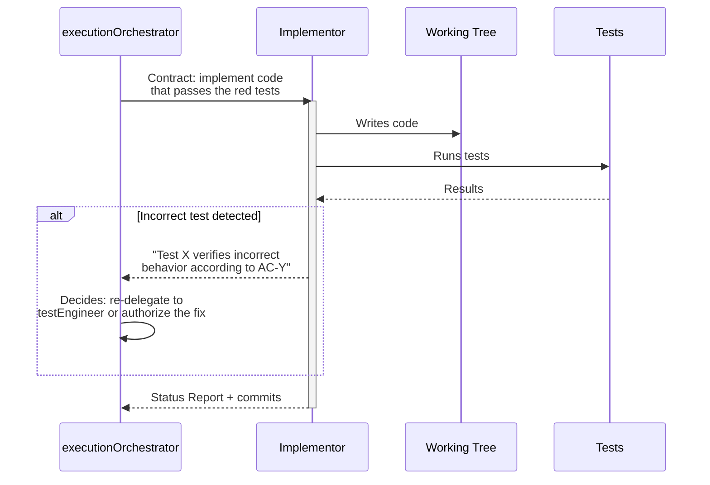
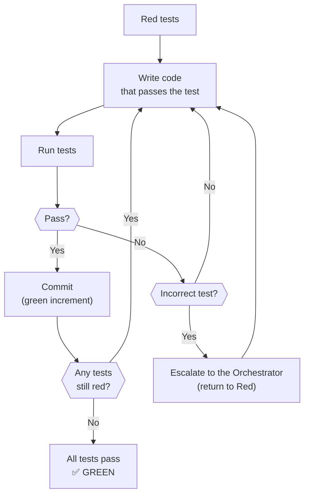
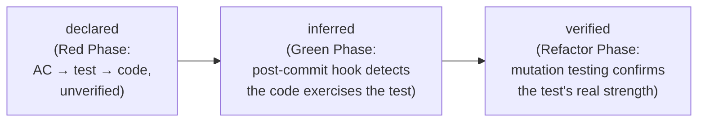
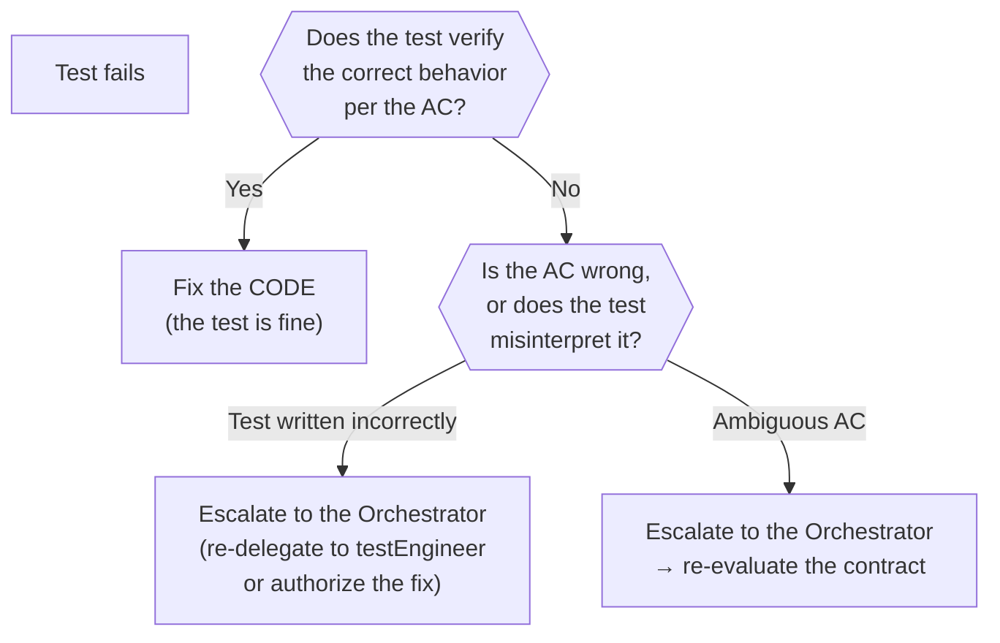

# Green Phase — Implementation

← [Main Index](../README.md) | [Execution](README.md)



> **Red's Input**: The Implementor receives Layer 3 (testImplementation)
> as direct input — the executable tests it must make pass. Layers 1
> (testPlan) and 2 (testContract) provide traceability but are not
> Green's operational input.

---

## Contents

- [Rules of Green](#rules-of-green)
- [Commit Strategy](#commit-strategy)
- [Binding Inference](#binding-inference)
- [When to Fix Tests vs Fix Code](#when-to-fix-tests-vs-fix-code)

---

## Rules of Green

The only goal is to make the tests pass. Nothing else.



| Rule | Description |
|-------|-------------|
| **First thing that works** | Ugly code, duplication, magic numbers --- anything goes as long as the tests pass |
| **No premature optimization** | Do not abstract, generalize, or "improve." That is the next phase |
| **Honor contracts** | The code MUST respect the contracts defined in the prePhase |
| **Frequent commits** | Every passing test = a possible commit. Small green increments |
| **Incorrect test → fix the test** | If a test verifies something wrong, fix it BEFORE implementing |

> **Exception: micro TDD for algorithmic complexity**: For tasks with
> high algorithmic complexity (algorithms, parsers, financial
> calculations), the Implementor may use micro TDD
> (test-implement-test per function) as a complementary tool within
> Green. This exception does not apply to standard application code
> (CRUD, endpoints, UI flows).

[↑ Contents](#contents)

---

## Commit Strategy

```plaintext
feat: implement login endpoint (passes auth-login-success test)
feat: implement login validation (passes auth-login-invalid-credentials test)
feat: implement token refresh (passes auth-token-refresh test)
```

Every commit references which test(s) it passes. This creates
traceability between implementation and executable specification.

[↑ Contents](#contents)

---

## Binding Inference

The binding layer declared in Red (see
[red.md](red.md#traceability-ac-testplan-testcontract-implementation-coverage))
is not updated by hand during Green. A post-commit hook analyzes every
green commit and updates the corresponding binding when it detects
that the commit's code actually exercises the referenced test.

The binding moves through three confidence levels:



| State | When It's Reached | What It Guarantees |
|--------|--------------------|----------------|
| `declared` | Red Phase | The test exists and references an AC. Does not imply the code fulfills it. |
| `inferred` | Green Phase (post-commit hook) | The commit's code exercises the declared test. Does not imply the test is strong. |
| `verified` | Refactor Phase (`virgil metrics`) | Mutation testing confirmed the test detects real mutants — the signal is reliable. |

[↑ Contents](#contents)

---

## When to Fix Tests vs Fix Code



> **Separation of responsibilities**: The Implementor does NOT fix
> tests directly. If it suspects a test is incorrect, it escalates to
> the Orchestrator with evidence (which test, which AC it contradicts,
> why). The Orchestrator decides whether to re-delegate to the
> testEngineer or authorize the fix in place.

[↑ Contents](#contents)
