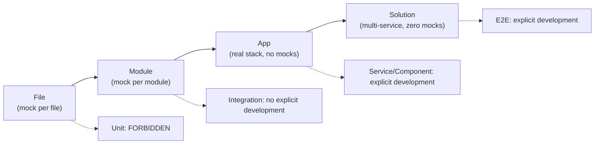
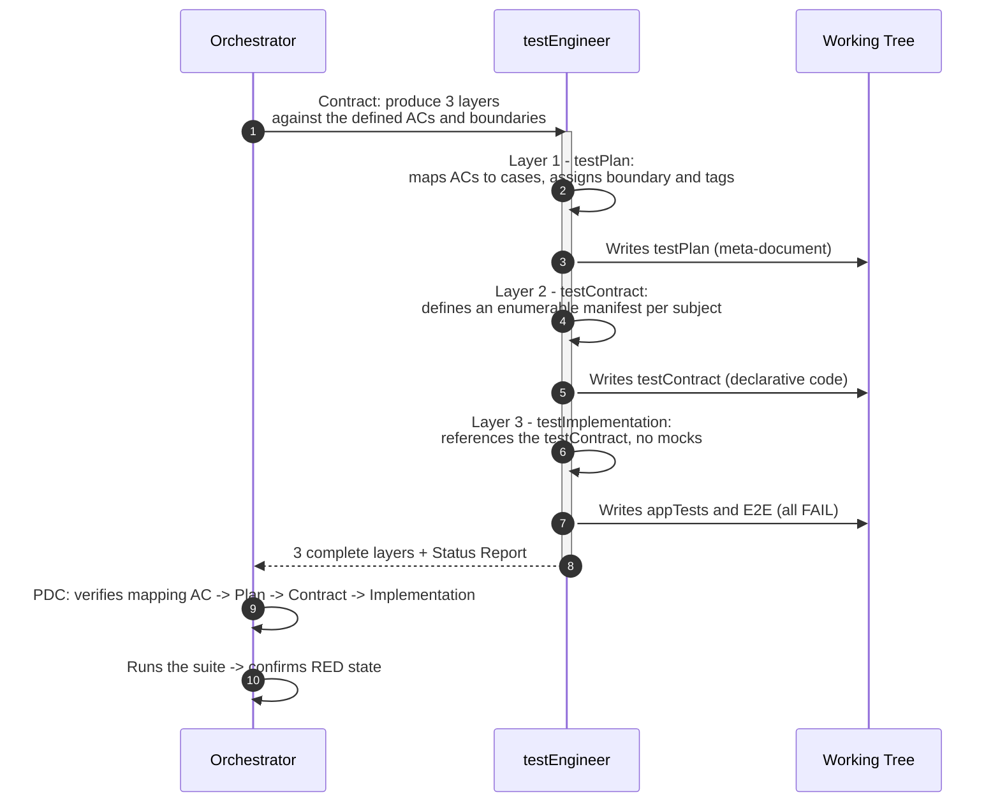
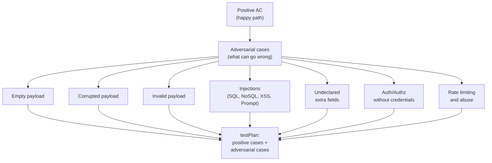
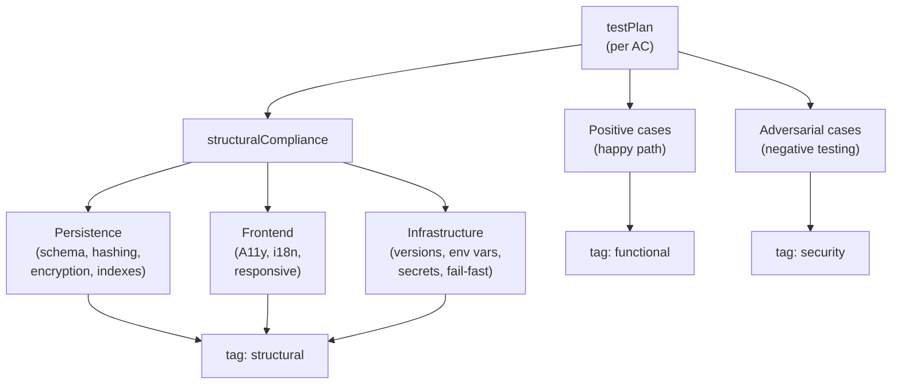
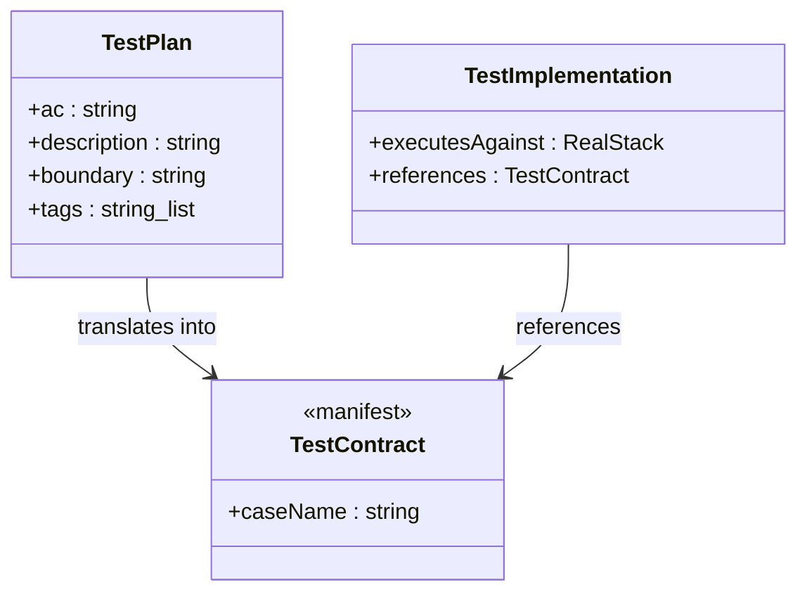
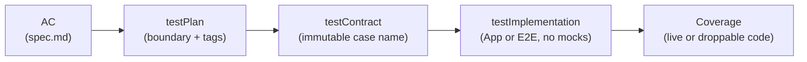
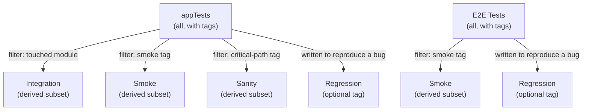
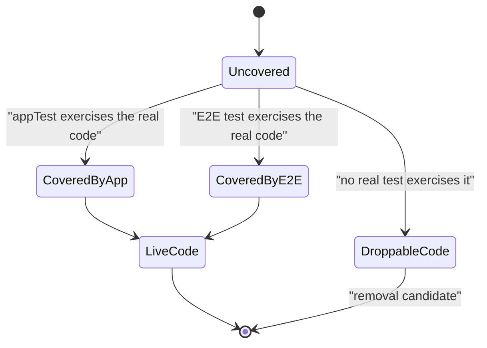
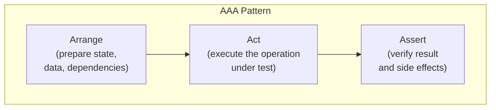
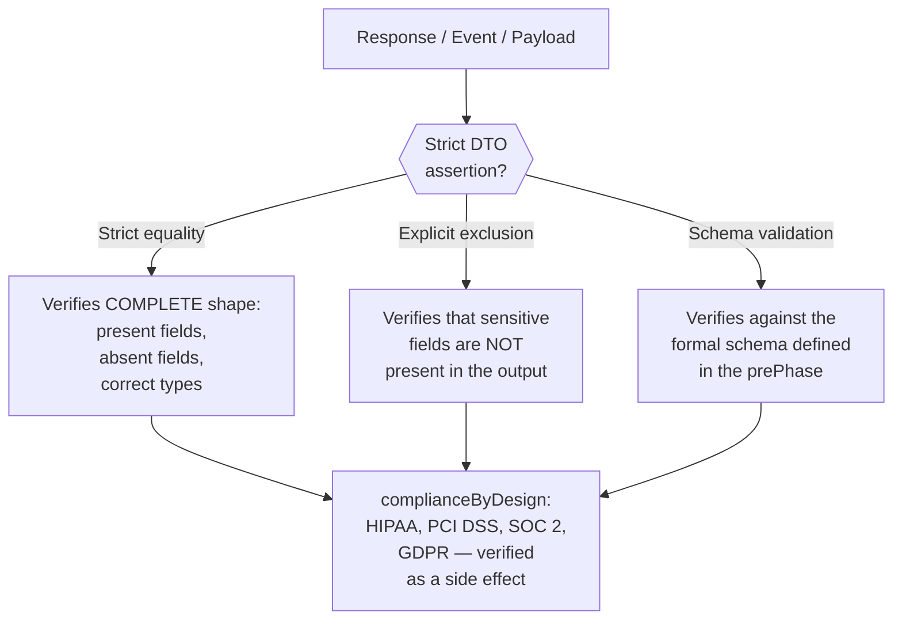

# Red Phase — Testing Architecture

← [Main Index](../README.md) | [Execution](README.md)

This document defines the Red Phase testing model: what types of tests
exist, who writes them explicitly, who derives them by filtering, and
how each test traces back to an AC in `spec.md`. The model is agnostic
of language, framework, and tooling — it defines the WHAT, not the
HOW. The concrete stack is decided by `design.md` during planning.

---

## Contents

- [Philosophy: highValueTesting](#philosophy-highvaluetesting)
- [boundaryModel](#boundarymodel)
- [Testing Policy](#testing-policy)
- [Red Phase Architecture — 3 Layers](#red-phase-architecture-3-layers)
- [Traceability: AC → testPlan → testContract → Implementation → Coverage](#traceability-ac-testplan-testcontract-implementation-coverage)
- [Derived Tests and Pipeline Placement](#derived-tests-and-pipeline-placement)
- [droppableCode](#droppablecode)
- [Tools and Configuration](#tools-and-configuration)
- [Test Code Discipline](#test-code-discipline)
- [What "Red" Means Operationally](#what-red-means-operationally)

---

## Philosophy: highValueTesting

The criterion that determines a test's type is not the classic pyramid
nor its inversion — it is **where the mock boundary sits**. The closer
a test runs to the real stack, the higher its verification value; the
more isolated it is via mocks, the more redundant it becomes compared
to a higher-level test with good coverage.

From this criterion follows a structural consequence: **only two
testing tiers have explicit development**. Everything else —
integration, smoke, regression, sanity — is obtained by intelligent
filtering over those two tiers, not by writing additional suites.

> **highValueTesting**: a test is only written if it exercises a real
> product interaction (real database, real HTTP, real dependency
> injection container). A test that only verifies that a function
> returns a value, isolated from the system via mocks, adds no
> additional signal when the App level already has high coverage — it
> is maintenance with no return.

[↑ Contents](#contents)

---

## boundaryModel

| Boundary | Type | Policy |
|----------|------|----------|
| File | Unit | **FORBIDDEN** — zero value, redundant when appTests have high coverage |
| Module | Integration | **No explicit development** — derived by filtering from appTests when a module is touched |
| App (real stack, no mocks) | Service/Component | **EXPLICIT DEVELOPMENT** — primary tier, high coverage mandatory, real interactions with the product, droppableCode detection |
| Solution (multi-service, zero mocks) | E2E | **EXPLICIT DEVELOPMENT** — for deploys, tags, merges to main/develop |
| Any | Performance/Stress/Load | **CONDITIONAL** — activated when `design.md` declares latency, throughput, or concurrency SLAs. The testPlan includes load profiles derived from the ACs. Pipeline placement: separate CI stage, non-blocking for the Red-Green-Refactor cycle |
| Any | Regression/smoke/sanity | **No explicit development** — derived by tags/naming from the existing appTests + E2E |

> **Exception: libraries without runtime infrastructure.** For projects
> without a server, database, or DI container (algorithmic libraries,
> pure utilities, parsers), the App boundary collapses to the module's
> public API. Tests against this public API with real inputs and
> outputs ARE the appTests — they exercise the product's real
> interaction. The File boundary prohibition (private internal
> functions in isolation) still applies.



As the boundary moves away from the isolated file and closer to the
complete solution, the mock disappears and the verification signal
increases. The two intermediate boundaries (File, Module) do not
require their own suite: File is forbidden, Module is derived from the
App boundary.

[↑ Contents](#contents)

---

## Testing Policy

### Explicit Development (the only 2 tiers written)

- **appTests** — App boundary, full real stack, high coverage
  mandatory. Primary tier.
- **E2E Tests** — Solution boundary, multi-service, zero mocks. Run
  on deploys, tags, and merges to `main`/`develop`.

### Forbidden

- **Unit Tests** (File boundary) — never written under any
  circumstance in this framework. If a test needs to mock the very
  file under test in order to pass, that is the signal that the test
  does not belong in this model. See the exception for libraries
  without runtime infrastructure in [boundaryModel](#boundarymodel)
  and the specific exception for libraries and CLIs below.

#### Exception for Libraries and CLIs

Libraries and CLIs that ARE the product (not projects that consume
Virgil as a dependency) may test domain logic at the boundary of the
package's public API. A repository tested against a real
implementation (including an in-memory one, if it faithfully
implements the interface's contract) is an appTest, not a unit test —
the criterion is whether the test exercises real behavior or mocks it,
not whether the implementation is "in-memory" or "on-disk." An
in-memory implementation of the repository that fulfills the
interface's contract is a real implementation, not a mock.

The prohibition still applies without exception to: testing private
functions or methods, testing with mocked external dependencies (HTTP,
external databases), and testing implementation details instead of
observable behavior.

This exception applies when the package under test has no user
interface and the App boundary IS the package's public API.

### No Explicit Development (derived by filtering)

- **Integration** (Module boundary) — a repository hook detects the
  touched module and runs the subset of appTests that cover it. Same
  tests, different filter.
- **Regression / Smoke / Sanity** — subsets of the existing appTests
  and E2E, selected by tag or naming. See
  [Derived Tests and Pipeline Placement](#derived-tests-and-pipeline-placement).

### Conditional

- **Performance / Stress / Load** — activated when `design.md`
  declares latency, throughput, or concurrency SLAs. The testPlan
  includes load profiles derived from the ACs. Pipeline placement:
  separate CI stage, non-blocking for the Red-Green-Refactor cycle.

[↑ Contents](#contents)

---

## Red Phase Architecture — 3 Layers

The testEngineer does not write "a test suite" — it produces three
chained layers, each tool-agnostic. Only Layer 3 is executable code;
Layers 1 and 2 are traceability artifacts.



### Layer 1: testPlan

Meta-document, not code. Answers "what will be tested":

- Maps each AC from `spec.md` to one or more test cases.
- Assigns each case a boundary (App or E2E — the only two valid ones
  for explicit development).
- Assigns filtering tags (`smoke`, `critical-path`, `regression`) that
  later feed the derivation of tests in the pipeline.
- Identifies test matrices when applicable (combinations, edge cases).
- **For each AC, produces adversarial cases** (see the next section).

#### Adversarial Cases (Negative Testing)

For every positive AC ("the user can log in"), the testPlan must
include its adversarial counterpart: "what happens when someone tries
to break it?" This discipline is known as **abuseCases** (OWASP) or
**Abuser Stories** — the systematic counterpart to User Stories.

> **"Think badly and you'll be right"**: the testEngineer assumes that
> every endpoint, every form, every data input will be attacked with
> malicious intent. It is not paranoia — it is defensive design.

| Category | What Is Tested | Example |
|-----------|---------------|---------|
| **Empty payload** | The system gracefully rejects a request with no data | `POST /login` with body `{}` → 400, not 500 |
| **Corrupted payload** | The system handles malformed data without exposing internals | Invalid JSON, broken encoding, incorrect Content-Type → controlled error |
| **Invalid payload** | Validation rejects incorrect types, ranges, and formats | Email without `@`, negative age, future date → error with useful detail |
| **SQL injection** | Inputs with SQL fragments do not alter queries | `'; DROP TABLE users; --` in a search field → no effect |
| **NoSQL injection** | NoSQL operators in inputs do not alter queries | `{"$gt": ""}` in a filter field → no effect |
| **XSS** | Injected scripts do not execute in outputs | `<script>alert(1)</script>` in a name field → renders as text |
| **Prompt injection** | AI instructions in inputs do not alter system behavior | `"Ignore previous instructions..."` in a text field → treated as data |
| **Undeclared extra fields** | The system ignores fields that don't belong to the schema | `POST /login` with `{"user":"a","pass":"b","role":"admin"}` → `role` ignored |
| **Authentication/authorization** | Protected routes reject access without valid credentials | No token → 401. Another user's token → 403. Expired token → 401. |
| **Rate limiting / abuse** | The system limits excessive requests | 1000 requests/second to the same endpoint → throttling, not a crash |



**Rules for adversarial cases:**

1. **Not optional** — every AC with a data input has at least one
   adversarial case in the testPlan.
2. **Tagged as `security`** — derivable as a security suite without
   writing it separately.
3. **Asserted strictly** — the returned error is also verified by DTO
   (no exposing stack traces, internal paths, or system information in
   error messages).
4. **Complement, not replace** — adversarial cases are added to the
   positive ones in the testPlan, they do not replace them.
5. **complianceByDesign** — these tests demonstrate that the system
   handles malicious inputs correctly, without needing separate
   penetration audits for the covered scope.

> **Note**: the list of categories is not exhaustive — it is the
> minimum the framework requires. The testEngineer can add categories
> based on project context (e.g. CSRF for web applications with
> sessions, path traversal for file systems, insecure deserialization
> for APIs that accept complex objects).

#### structuralCompliance Dimensions

> **Conditional activation**: NONE of these dimensions is mandatory by
> default. Each one is activated ONLY when the nature of the project
> requires it, as defined in `design.md`:
>
> - Does the project have a database? → activates **Persistence**
> - Does the project have a visual interface? → activates **Frontend**
> - Does the project have deployable infrastructure? → activates
>   **Infrastructure**
> - Is it a library with no I/O? → probably none applies
>
> The principle is the same one governing role activation in planning
> and skill loading in agents: **only what's needed, when it's
> needed**. Nothing is loaded all at once.

When a dimension applies, the testPlan includes tests that verify the
**structure** of that architectural layer — not "what the system does"
but "how it is built." They are the evidence that `design.md`'s
decisions are respected in the implementation.

> **Execution frequency**: these tests are exhaustive and rarely fail
> after the initial setup. They run in CI (not pre-commit) and are
> tagged as `structural` for independent derivation.

##### Persistence (Data-at-Rest Compliance) — if the project has a DB

| What Is Verified | Why | How It's Detected |
|-----------------|---------|-----------------|
| **Normalized schema** | An unjustified denormalized schema is hidden technical debt | Structural test that inspects the schema (migrations, DDL) and validates relationships |
| **Hashed passwords** | Storing passwords in plaintext is the most severe and common vulnerability | Test that inserts a user and verifies the password field is NOT equal to the input (it's hashed) |
| **Encrypted sensitive data** | PHI, PII, financial data must be encrypted at rest | Test that verifies columns marked sensitive in the schema do not contain readable text |
| **No obsolete fields** | Columns no endpoint reads/writes are droppableCode at the schema level | Schema coverage: columns untouched by any appTest = removal candidates |
| **Indexes for frequent queries** | Queries without an index on large tables are latent performance problems | Structural test that verifies the execution plan's queries use indexes |

##### Frontend (UI Compliance) — if the project has a visual interface

| What Is Verified | Standard | How It's Detected |
|-----------------|----------|-----------------|
| **Accessibility (A11y)** | WCAG 2.1 AA (minimum) | Automated audit of contrast, ARIA roles, keyboard navigation, alt text, visible focus |
| **Internationalization (i18n)** | ISO 639 / ICU | No hardcoded strings, localizable date/number formats, text direction (RTL/LTR) |
| **Mobile-first / Responsive** | — | Minimum viewports rendered correctly. If the design is mobile-first, breakpoints scale upward. If it's desktop-first (graceful degradation), they scale downward. |
| **HTML Semantics** | W3C | Correct use of landmarks, hierarchical headings, forms with associated labels |

> **A11y is not optional** — it is a legal requirement in many
> jurisdictions (ADA, EAA, Section 508). A failing accessibility test
> is a compliance defect, not a nice-to-have.

##### Infrastructure (IaC Compliance) — if the project deploys services

| What Is Verified | Why | How It's Detected |
|-----------------|---------|-----------------|
| **Exact versions** | Floating versions (`latest`, `^`, `~`) produce non-reproducible builds | Test that parses config files and verifies every version is exact (pinned) |
| **Validated environment variables** | Reading environment variables without validation produces silent errors | Test that verifies the app fails fast if a required variable is `undefined`, empty, or invalid |
| **No secrets in code** | Hardcoded secrets in the repo are the #1 source of security breaches | Test that scans the codebase for secret patterns (API keys, tokens, passwords in code) |
| **Deployment configuration** | A deployment configuration file (container, orchestrator, IaC) with bad practices is an attack vector | Test that verifies: base image with exact tag, non-root user, defined health checks, limited resources |
| **Fail-fast at startup** | An app that starts with invalid configuration and fails at runtime is worse than one that won't start | Test that verifies the app refuses to start if the configuration fails schema validation |



**Rules for structuralCompliance:**

1. **Tagged as `structural`** — derivable as a compliance suite without
   writing it separately.
2. **Run in CI, not pre-commit** — they are exhaustive and change
   infrequently.
3. **QA does not design them, but endorses them** — the testEngineer
   includes them in the testPlan; QA verifies in the Accept Phase that
   they exist and pass.
4. **Only what's needed** — if `design.md` does not declare a layer,
   its structural tests are not included. A library with no DB or UI
   loads neither Persistence nor Frontend.
5. **complianceByDesign** — these tests are the EVIDENCE for audits.
   When an auditor asks "how do you know you don't store passwords in
   plaintext?", the answer is the test, not a document.

### Layer 2: testContract

> **Terminology note**: "testContract" in this context is a manifest of
> test cases, not an API/interface contract. API, DB, and interface
> contracts are defined in the prePhase (see
> [contracts.md](contracts.md)). The two meanings coexist in the
> framework with distinct definitions.

Code, but declarative — it contains no test logic, it only enumerates
it. A manifest per subject under test, where each entry is a case with
an immutable name, human-readable and tied to an AC.

> The framework defines the CONCEPT, not the implementation. In
> nest-base/fullstack-base this concept was materialized as classes
> with `static readonly` properties, but any mechanism in the consuming
> language that produces an enumerable, immutable, referenceable
> manifest satisfies the contract.



The testContract is the bridge between the testPlan and the
implementation. Its purpose is twofold: it prevents an AI agent from
writing test names as loose, scattered strings (test-naming spaghetti),
and it enables IDE traceability — the test subject and its case
surface are visible at a glance.

### Layer 3: testImplementation

Executable tests that reference the testContract — never inline
strings for a case name.

- **appTests**: real interactions against the stack (real database,
  real HTTP, real dependency injection container). Zero mocks of the
  product itself.
- **E2E Tests**: against the deployed solution, multi-service.
- **Coverage as truth**: high threshold, never reduced. Code with no
  coverage is a droppable candidate (see
  [droppableCode](#droppablecode)).

[↑ Contents](#contents)

---

## Traceability: AC → testPlan → testContract → Implementation → Coverage



Every link in the chain is independently verifiable: given an AC, its
entry in the testPlan can be found; given that entry, its case in the
testContract; given that case, its implementation; given that
implementation, the production file it covers and its coverage
percentage.

```text
AC-01 (spec.md)
  → testPlan: case "successful login", boundary: App, tags: [smoke, critical]
    → testContract: AuthTestCase.loginSuccess = "Should authenticate..."
      → it(AuthTestCase.loginSuccess, ...) → real HTTP + real DB
        → Coverage: src/auth/login.service.ts → 95% (live code)
        → Coverage: src/auth/legacy-adapter.ts → 0% (droppable)
```

> Illustrative example, not prescriptive. The concrete syntax
> (`it(...)`, the contract class name, the file path) depends on the
> stack defined by `design.md`. What the framework requires is that the
> chain be reconstructible in both directions: from AC to coverage
> line, and from coverage line back to AC.

If an AC cannot complete the chain — no testPlan case covers it, or
the testContract has no entry, or the implementation does not
reference the contract — there is a gap that is escalated to the
prePhase.

> **Declared binding**: each link AC → testPlan → testContract →
> testImplementation is the initial declaration of the binding layer
> (requirement ↔ test ↔ code) that Virgil tracks (see
> [contracts.md](contracts.md#binding-layer-contract)). In Red, the
> binding is left in `declared` state — it has not yet been verified
> that the test has real strength. That verification comes later, in
> the Refactor Phase, via mutation testing (see
> [refactor.md](refactor.md#metrics-based-verification)).

[↑ Contents](#contents)

---

## Derived Tests and Pipeline Placement

No test type outside App and E2E is written. All others are obtained
by filtering those two sets by touched module, by tag, or by pipeline
placement.

| Need | How It's Resolved |
|-----------|-------------------|
| "Unit tests" | Do not exist. High-coverage appTests make them redundant. |
| "Integration tests" | A git hook detects the touched module → runs the subset of appTests for that module. Same tests, different filter. |
| "Smoke tests" | E2E selected by tag. Post-deploy: "did it deploy correctly?" |
| "Regression" | Every appTest/E2E written to reproduce a bug IS regression. Optional tag. |
| "Sanity" | Minimal subset of appTests (critical path), selectable by tag. |
| "Performance/stress/load" | Conditional — activated when `design.md` declares SLAs. Separate CI stage, non-blocking for Red-Green-Refactor. |



### Pipeline Placement

> The placement of these tests in the pipeline is framed within the
> [echo system](../echo-system.md), which defines the full 5 pipeline
> steps and their distribution across environments.

| What Runs | When | Purpose |
|-----------|--------|-----------|
| appTests (touched module only) | Pre-commit / pre-push | Fast feedback on what changed |
| appTests (all affected modules) | CI (on PR) | Full confidence before merge |
| appTests + E2E (tag `security`) | CI (on PR) | Derived security suite — adversarial cases |
| appTests (tag `structural`) | CI (on PR) | structuralCompliance suite — persistence, frontend, IaC |
| E2E Tests | Deploys, tags, merges to develop/main | Full-solution-level confidence |
| E2E subset (tag smoke) | Post-deploy to an environment | "Did it deploy correctly?" |

[↑ Contents](#contents)

---

## droppableCode

Coverage is not a vanity metric — it is a TOOL for identifying dead
code.



- The coverage threshold is mandatory and **can never be lowered**.
- Code that no appTest exercises through real product interactions has
  no justification to exist.
- The framework calls this **droppableCode**: code that can be safely
  removed because no high-value test touches it.
- The concept of **selective coverage collection** (measuring only
  files with real logic, excluding boilerplate and configuration)
  applies universally, but the framework's consumer defines which
  files enter that collection based on their own stack.

[↑ Contents](#contents)

---

## Tools and Configuration

This document defines REQUIREMENTS, not tools. The concrete testing
stack (test framework, assertion library, coverage tool) is defined by
`design.md` during planning. The Red Phase requires that stack to meet
the following capabilities, regardless of which one it is:

### Test Runner Requirements

- Must allow running tests against a real stack (real database, real
  HTTP server, real DI container) without substituting those pieces
  with test doubles.
- Must support mocking limited to third-party dependencies within E2E
  tests — never mocking of the product itself.
- Must support a tag or naming mechanism that allows selecting subsets
  of the suite (to derive integration, smoke, sanity, and regression
  without writing new suites).
- Must be runnable both in a narrow scope (specific module, for
  pre-commit/pre-push) and in full (the whole suite, for CI).

### Coverage Tool Requirements

- Must report coverage per file and in aggregate.
- Must be configurable with a minimum threshold that fails the build if
  not reached.
- Must support selective file inclusion/exclusion (the
  `collectCoverageFrom` concept), so droppableCode detection measures
  only real logic and not boilerplate or configuration.
- The configured threshold is what the Refactor Phase uses as a gate —
  it is not negotiated downward in any later phase.

[↑ Contents](#contents)

---

## Test Code Discipline

The patterns in this section apply to EVERY test written in Layer 3,
regardless of boundary (App or E2E). They define the internal quality
of test code — not what is tested, but how each test is written. They
are language- and tool-agnostic.

### Structural Patterns

Every test follows a predictable structure that separates setup,
execution, and verification:

| Pattern | Applies To | Rule |
|--------|----------|-------|
| **AAA** (Arrange-Act-Assert) | All tests | Three separate blocks, never mixed. Arrange prepares state and data. Act executes the operation under test. Assert verifies the result. If a test needs more than one Act, it's two tests. |
| **POM** (Page Object Model) | Tests with an interface (UI, CLI) | Abstract interface interactions into reusable objects. The test describes intent ("login with valid credentials"), the POM executes the mechanics ("fill field X, click button Y"). |
| **builderPattern** | Test data | Build test data via builders or factories, never hardcoded in the test body. A builder centralizes creation and allows varying only what's relevant to the case. |
| **One logical assertion** | All tests | Every test verifies ONE thing. Multiple assertions are allowed only if they verify facets of the same logical result (e.g. status code + body of the same response). |



### Mock Hygiene

Within the boundary model, appTests do not use mocks of the product
itself (real stack). E2E tests only mock third-party dependencies.
This section defines the rules for those allowed mocks:

| Rule | What It Prevents |
|-------|-------------|
| **Mandatory verification** | Every mock is verified: was it called? How many times? With what exact arguments? An unverified mock is an invisible mock — it hides failures instead of detecting them. |
| **Reset between tests** | Every test starts with clean mocks. No residual state from previous tests. A mock that accumulates calls across tests produces false positives. |
| **Negative verification** | Mocks that must NOT be called are explicitly verified (e.g. "the payment service was NOT invoked when the user canceled"). The absence of a call is as important as its presence. |
| **Exact arguments** | Don't just verify that it "was called" — verify WHAT it was called WITH. A mock called with incorrect arguments is worse than one that wasn't called at all. |

### Strict DTO Assertions (schemaStrictAssertions)

> **Scope**: This discipline covers exclusively the DATA layer of
> compliance (data minimization, field-by-field access control, shape
> validation). It does not replace the organizational, physical, legal,
> or procedural controls each regulation requires (HIPAA requires BAAs,
> training, physical security; PCI DSS requires network segmentation,
> quarterly scans; GDPR requires DPIAs, consent management). Consult a
> compliance professional for the full requirements.

This is the most important rule in the framework's test discipline. It
has direct implications for regulatory compliance.

> **complianceByDesign**: if every test asserts the EXACT shape of the
> response object (not just "contains these fields" but "contains ONLY
> these fields"), compliance verification is obtained as a side
> effect — without separate compliance suites, without rewrites,
> without extra work.

**The rule**: every assertion on a response object, an emitted event, a
payload sent to third parties, or a persisted record must verify the
DTO's **complete shape** — present fields, absent fields, and types.

| Assertion Type | Use | Conceptual Example |
|------------------|-----|--------------------|
| **Strict equality** (whole DTO) | Response bodies, events, payloads | "The response is EXACTLY `{id, name, email}` — nothing more, nothing less" |
| **Explicit exclusion** | Sensitive data | "The response does NOT contain `password`, `ssn`, `cardNumber`" |
| **Schema validation** | API contracts | "The response conforms to the OpenAPI/JSON Schema defined in the prePhase" |



**Why this matters for compliance:**

| Regulation | What It Requires | How Strict Assertion Covers It |
|------------|-----------|-----------------------------------|
| **HIPAA** | Not exposing PHI (Protected Health Information) outside authorized contexts | If the response DTO exposes an undeclared field, the test fails. PHI fields that don't belong to the endpoint are detected automatically. |
| **PCI DSS** | Not transmitting card data outside scope | A payload with `cardNumber` where the schema does not declare it breaks the strict assertion. No manual audit needed. |
| **GDPR** | Data minimization — only collecting/exposing what's necessary | Strict equality detects extra fields (personal data that shouldn't be in the response). |
| **SOC 2** | Evidence of data controls | Tests with strict assertions ARE the evidence. The coverage report demonstrates every endpoint was verified against its schema. |

> **No rewrites**: when a compliance audit requests evidence that an
> endpoint does not expose out-of-scope data, the appTest with strict
> DTO assertion already demonstrates it. No additional suites are
> needed, no scanning tools are needed, nothing needs to be rewritten.
> Tests that verify functionality also verify compliance — by design,
> not by accident.

### Modern Dependencies

The testEngineer uses current versions of the testing ecosystem for the
stack defined in `design.md`. No legacy dependencies, no polyfills for
obsolete APIs, no backward-compatibility patterns.

| Rule | Reason |
|-------|-------|
| **Latest stable version** of the test framework | Modern APIs = less boilerplate, better error messages, better performance |
| **No legacy wrappers** | If the test framework offers a native API for something, use it. Don't write custom utilities that reimplement framework functionality. |
| **Strict types in tests** | If the language supports types, the tests use them. A test without types can pass with incorrect data without the compiler catching it. |

[↑ Contents](#contents)

---

## What "Red" Means Operationally

- The three layers exist: testPlan, testContract, testImplementation.
- All Layer 3 tests run and all FAIL (no implementation exists).
- The coverage tool is operational and reporting.
- Every test traces to a specific AC through the testPlan and the
  testContract.
- No File-boundary (Unit) tests exist in the repository.
- Every test follows AAA (Arrange-Act-Assert) without exception.
- Every assertion on response objects is strict by DTO
  (complianceByDesign).
- The allowed mocks (external dependencies only) are verified: calls,
  arguments, frequency.
- Every AC with a data input has at least one adversarial case in the
  testPlan (negative testing / abuseCases).
- Adversarial cases are tagged as `security` for derivation as a
  security suite.
- structuralCompliance tests (persistence, frontend, IaC) are tagged
  as `structural` and apply according to project context.
- If a test cannot be written, there is a gap in the contract or the AC
  (escalate to the prePhase).
- Every AC → test → code binding is declared (`declared`) in the
  binding layer; its real strength is verified later in Refactor via
  mutation testing.

[↑ Contents](#contents)
