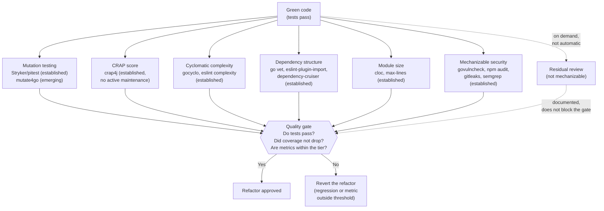

# Refactor Phase — Quality Gate

← [Main Index](../README.md) | [Execution](README.md)

---

## Contents

- [Principle](#principle)
- [Mechanical Verification Dimensions](#mechanical-verification-dimensions)
- [Mechanical Verification Checklist](#mechanical-verification-checklist)
- [Metrics-Based Verification](#metrics-based-verification)
- [Refactor Rules](#refactor-rules)

---

## Principle

Green code works but can be ugly. The Refactor Phase applies all
quality disciplines WITHOUT breaking tests. If tests fail after a
refactor, the refactor introduced a regression and is reverted.

[↑ Contents](#contents)

---

## Mechanical Verification Dimensions

> **Dogma principle 3**: "You don't review agent code — you measure
> metrics." Uncle Bob puts it this way: "I don't review code written by
> agents. I measure test coverage, dependency structure, cyclomatic
> complexity, module size, mutation testing." (July 2026). Virgil does
> not relocate code review from a human to a sub-agent — it ELIMINATES
> it and replaces it with mechanical tools. A sub-agent reading code and
> issuing a "review report" is still code review, just relocated.
> That is exactly what the dogma prohibits.

Each quality dimension is verified with a tool that produces a
comparable number against a threshold, not with a subjective reading of
the code:



[↑ Contents](#contents)

---

## Mechanical Verification Checklist

| Dimension | What It Measures | Tool | Status | Criterion |
|-----------|----------|--------------|--------|----------|
| **Cyclomatic complexity** | Decision branches per function/method (mechanical proxy for SRP and KISS). | gocyclo, eslint `complexity`, radon | Established | Independent threshold per tier (see [thresholds](#thresholds-per-tier)) |
| **Module size** | Lines of code per file/module (mechanical proxy for SRP at the module level). | cloc, `wc -l`, eslint `max-lines` | Established | Independent threshold per tier |
| **Dependency structure** | Dependency direction, cycles, dependency inversion (hexagonal architecture, DI). | go vet, eslint-plugin-import, dependency-cruiser, ArchUnit | Established | Zero violations, across all tiers |
| **Duplication (DRY)** | Repeated code blocks. | jscpd, dupl (Go), PMD CPD | Established | Referential — does not block the gate on its own |
| **Test strength** | Mutation score + CRAP (penalizes complexity without coverage; indirectly rewards testable design). | Stryker, pitest (established); mutate4go, crap4go (emerging, see [table by language](#virgil-metrics)) | Mixed | See [thresholds](#thresholds-per-tier) |
| **Mechanizable security** | CVEs in dependencies, hardcoded secrets, insecure patterns detectable by SAST. | govulncheck, npm audit, gitleaks, semgrep | Established | Critical vulnerabilities = 0 |

### Residual Review

Uncle Bob does not replace every quality dimension with a metric — he
replaces the ones that ARE mechanizable. What is not stays as an
explicit exception, not the rule:

- **Non-mechanizable security** — correct authorization logic, threat
  modeling, security design decisions. No linter certifies that the
  business rule "only the resource owner can edit it" is correctly
  implemented.
- **DDD modeling** — whether a bounded context or an aggregate is well
  designed is a semantic decision, not one a static analysis tool can
  score.

These cases do not block the automatic refactor gate. They are
documented as a finding and, if the risk justifies it, escalated to an
on-demand focused review (human or agent) — the EXCEPTION, not the
phase's default mechanism.

[↑ Contents](#contents)

---

## Metrics-Based Verification

Virgil replaces manual code review with metrics-based verification
(see the dogma quoted above in
[Mechanical Verification Dimensions](#mechanical-verification-dimensions)).
The binding layer (declared in
[Red Phase](red.md#traceability-ac-testplan-testcontract-implementation-coverage),
inferred in [Green Phase](green.md#binding-inference)) tracks
requirement → code → test; the tools in this section verify the real
STRENGTH of those tests and the code they produce, not just their
existence.

### virgil metrics

During or after the refactor, `virgil metrics` runs the check for:

- **Mutation score** — percentage of mutants detected by the test
  suite. A low mutation score means tests that pass but don't detect
  real changes in code behavior.
- **CRAP score** — Change Risk Anti-Patterns (see formula below).
- **Cyclomatic complexity** — per function/method. Feeds the CRAP
  score AND is also verified as an independent threshold: a function
  can have a low CRAP score from being well covered and still be too
  complex to maintain.
- **Dependency structure** — direction of dependencies between
  modules/layers. Detects cycles and violations of the dependency rule
  (inner layers do not depend on outer ones). This is the mechanical
  verification of what, in Dogma v1, the Architecture reviewer role
  covered (see [Residual Review](#residual-review)).
- **Module size** — lines of code per file/module. A module that grows
  without limit is the mechanical signal of a responsibility that
  stopped being single.

Virgil **orchestrates** specialized external tools per language — it
does not build or reimplement them. Not all are at the same maturity
level: it explicitly marks which are **established** (maintained, with
verifiable adoption) and which are **emerging/unverified** (existence
or active maintenance unconfirmed):

| Language | Mutation Testing | Cyclomatic Complexity | CRAP | Dependencies |
|----------|-------------------|--------------------------|------|--------------|
| Go | mutate4go — emerging, custom adapter required | gocyclo — established | crap4go — emerging, custom adapter required | go vet, depguard — established |
| JavaScript / TypeScript | Stryker — established | eslint (`complexity`) — established | pending evaluation — no mature equivalent tool | eslint-plugin-import, dependency-cruiser — established |
| Java | pitest — established | — | crap4j — established but without recent active maintenance, evaluate before adopting | ArchUnit — established |

Module size is language-agnostic (cloc, `wc -l`, or the stack's linter
`max-lines` rule) and does not require a column per language in this
table.

> **Graceful degradation**: Virgil orchestrates external tools. Where
> no mature tool exists for a cell in the table above, Virgil reports
> "not available" for that dimension and the tier degrades to the
> available metrics (coverage + cyclomatic complexity) instead of
> blocking the gate over a nonexistent tool. Graceful degradation is a
> design feature, not a limitation — see the graceful degradation
> acceptance criterion in the metrics contract (AC-10.6).

### CRAP Score

```text
CRAP = comp^2 * (1 - cov/100)^3 + comp
```

Where `comp` is the function's cyclomatic complexity and `cov` is its
test coverage percentage. A complex, uncovered method produces a high
CRAP score; the same method, well covered, keeps it low. The CRAP
score penalizes the combination of complexity and lack of tests, not
complexity on its own.

### Thresholds Per Tier

| Tier | Minimum Mutation Score | Maximum CRAP | Maximum Cyclomatic Complexity | Maximum Module Size (LOC) | Dependency Violations |
|------|------------------------|-------------|----------------------------------|----------------------------------|-------------------------------|
| strict | ≥ 80% | ≤ 30 | ≤ 10 | ≤ 300 | 0 |
| standard | ≥ 60% | ≤ 45 | ≤ 15 | ≤ 500 | 0 |
| relaxed | ≥ 40% | ≤ 60 | ≤ 20 | ≤ 800 | 0 |

Dependency violations are zero-tolerance across all three tiers: a
cycle or a dependency-rule inversion is not a matter of degree, it is a
binary architectural violation — it exists or it doesn't.

> The active tier is part of the handoff contract (see
> [contracts.md](contracts.md#metrics-contract)). `virgil health`
> reports against that tier in Accept — the binding moves from
> `inferred` to `verified` only when the metrics reach their threshold.

[↑ Contents](#contents)

---

## Refactor Rules

1. **Tests MUST keep passing** after every refactor --- if they fail,
   the refactor introduced a regression
2. **Coverage must not drop** --- the refactor does not remove tests
   or reduce coverage
3. **Alignment with `design.md`** --- the refactor moves the code
   closer to the defined architecture, not further away
4. **One commit per refactor** --- each refactor is a separate commit
   to ease reversion
5. **Metrics within the tier threshold** --- mutation score, CRAP,
   cyclomatic complexity, module size, and dependency violations meet
   the threshold defined for the active tier before the refactor is
   considered approved (see
   [Metrics-Based Verification](#metrics-based-verification))

> The refactor's quality gates align with step 3 (Static Test) of the
> [echo system](../echo-system.md) — static analysis is the first line
> of defense that the echo formalizes as mandatory.

[↑ Contents](#contents)
