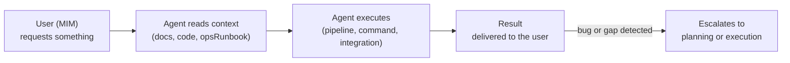
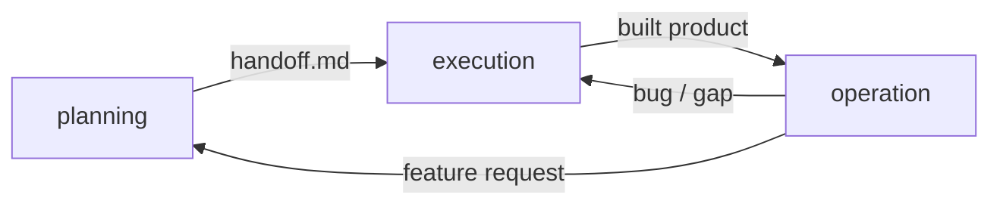

# Operation Model

← [Main Index](../README.md)

> The built product delivers value: the MIM moves from directing to
> using, the agent moves from building to assisting.

---

## Contents

- [Principle](#principle)
- [When It Activates](#when-it-activates)
- [Adapter Pattern](#adapter-pattern)
- [Actors](#actors)
- [Input](#input)
- [Types of Operation](#types-of-operation)
- [Flow](#flow)
- [What Operation Is NOT](#what-operation-is-not)
- [Connection with Planning and Execution](#connection-with-planning-and-execution)
- [Operational Documentation](#operational-documentation)

---

## Principle

operation starts where execution ends: the product already exists in
the working tree, certified by QA. From there, the MIM stops being the
project's director and becomes a **user** of the product. The agent
stops being the construction orchestrator and becomes an
**operationalAssistant**: it executes what the user asks for within the
context of the already-built product.

Unlike planning and execution, operation has no phases, does not
convene a scrum team, and does not produce planning artifacts. It is
**reactive**: the agent responds to concrete user requests, consulting
the project's documentation and code to understand what it can do and
how to do it.

operation is **optional**. Not every project has an operational
surface — a library is published, not operated; a one-shot deliverable
is delivered, not operated.

> **operation as a facade, not as a mandatory phase**: the methodology
> covers the full idea → operation cycle, but operation works as a
> facade or plugin that activates on top of the already-built product —
> not as a mandatory link in the pipeline. Each project decides,
> according to its nature, **whether** to activate that facade and
> **with which adapter** (see [Adapter Pattern](#adapter-pattern)).

[↑ Contents](#contents)

---

## When It Activates

| Project type | Does operation apply? | Example |
|----------------|--------------------------|---------|
| CLI or tool with commands | Yes | Run commands, generate outputs |
| Service or API | Yes | Operate, invoke, interact with endpoints |
| Project with external integrations | Yes | Jira, Confluence, third-party systems |
| Library or package | No | It is published, not operated |
| One-shot deliverable | No | It is delivered, not operated |

[↑ Contents](#contents)

---

## Adapter Pattern

operation does not impose a single operational documentation format.
It behaves as a facade with interchangeable adapters: the project type
determines which adapter applies and which document planning produces
in its operational documentation phase:

| Project type | Adapter | Operational document |
|----------------|---------|--------------------------|
| Service or API | ops-runbook | `ops-runbook.md` |
| CLI or tool with commands | usage-guide | `usage-guide.md` |
| Library or package | api-reference | `api-reference.md` |

> The adapter is neither mandatory nor unique. A project may activate
> none (see [When It Activates](#when-it-activates)), and a project
> with mixed surfaces (a CLI that also exposes a library, for example)
> may combine more than one adapter. The choice is informed by
> `design.md` and produced by planning — operation only consumes the
> result.

[↑ Contents](#contents)

---

## Actors

| Actor | In planning | In execution | In operation |
|-------|-------------|---------------|-----------------|
| MIM | Directs | Approves/unblocks | **User** — consumes the product |
| Agent | SM (orchestrates planning) | Orchestrator (coordinates execution) | **operationalAssistant** — executes what the user asks for |

[↑ Contents](#contents)

---

## Input

- Built product (execution output, in the working tree)
- `ops-runbook.md` (if the project has one — operational reference)
- Project documentation (README, guides, API docs)
- `AGENTS.md` — the project's rules still apply

[↑ Contents](#contents)

---

## Types of Operation

This is not a taxonomy to follow rigidly — these are examples of what
"operating" a product means:

| Type | Example | What the agent does |
|------|---------|-------------------------|
| Artifact generation | "Generate a PDF with my profile" | Runs the project's pipeline, produces the output |
| Task execution | "Launch challenge X" | Configures and runs the flow defined by the project |
| Integration with external systems | "Go to Jira and comment on US-123" | Uses the project's integrations to interact |
| Operational query | "How many pending challenges do I have?" | Reads the project's state and reports |

[↑ Contents](#contents)

---

## Flow

[↑ Contents](#contents)

---

## What Operation Is NOT

- It is not SRE or infrastructure monitoring — that is covered by
  `ops-runbook.md` as a reference, not by operation itself.
- It is not planning — there are no planning phases or artifacts.
- It is not construction — there is no Red-Green-Refactor cycle.
- There is no team — the user operates directly with the agent's
  assistance, without convened review lenses.

[↑ Contents](#contents)

---

## Connection with Planning and Execution

| Event in operation | Action |
|------------------------|--------|
| Bug discovered | Escalate to execution (Red → Green) |
| Feature request | Escalate to planning (new planning cycle) |
| Documentation gap | Escalate to planning (Phase 6 — produce/update `ops-runbook.md`) |
| Deprecated project | Close operation — archive |

> For bug escalations from operation, the diagnostic context (bug
> description, reproduction steps, affected area) acts as the entry
> contract to execution instead of a formal `handoff.md`. See
> `fast-forward.md` for the mid-cycle fastForward mechanism.

[↑ Contents](#contents)

---

## Operational Documentation

operation consumes the operational documentation produced by the
previous cycle. `handoff.md` declares which documentation is expected
(conditional section). If that documentation does not exist or is
insufficient, operation can escalate back to planning to produce or
complete it.

[↑ Contents](#contents)
