# idea-to-mvp --- Framework Overview

← [Index](README.md)

> **Identity**: idea-to-mvp is a harness for AI-assisted software
> development. Primary case: 1 human (MIM) + N AI agents, from an
> idea to a working product. The framework prevents drift and agent
> hallucinations through validated artifacts, approval gates, and a
> deterministic pipeline (echo). Teams with human developers can
> adopt the phases and artifacts — the delegation model (SM,
> delegationContracts, PDC) adapts accordingly.
>
> This document is the navigation map. Diagrams are the primary
> communication; text is connective tissue.

---

## Contents

- [Governing Dogma](#governing-dogma)
- [Progressive Adoption](#progressive-adoption)
- [Actors and Roles](#actors-and-roles)
- [Operating Modes](#operating-modes)
- [Full Pipeline](#full-pipeline)
- [Artifacts](#artifacts)
- [Artifact State Machine](#artifact-state-machine)
- [Delegation Model](#delegation-model)
- [fastForward](#fastforward)
- [artifactStore and Adapters](#artifactstore-and-adapters)
- [What's Next (TBD Areas)](#whats-next-tbd-areas)

---

## Governing Dogma

The framework is governed by six non-negotiable principles (Dogma). Every
new design, tooling, or process decision must align with them.

1. **e2e Methodology** — the framework covers the full cycle from idea
   to certified code, with a mechanically verified deployment transition
   (pre/post-deploy gate and a rollback concept, see
   [Phase Detail](planning/behavior/phases.md#deployment--transition-between-execution-and-operation))
   toward an optional operation stage. Operation is a deliberately thin
   facade — reactive, with no phases of its own — over the end-to-end
   flow; it is not a mandatory macro-phase for closing the cycle, and
   the framework does not prescribe continuous monitoring, alerting, or
   SRE. "Idea → operation" describes the mechanical transition covered,
   not that the framework operates the service on behalf of the user.
2. **Traceability AND strength verified** — verifying the binding (the
   traceability between artifacts, which confirms that a link exists)
   is not enough. The actual strength of the code is also verified via
   orchestrated external tools (mutation testing, CRAP score,
   cyclomatic complexity).
3. **Management from a higher level** — the MIM manages the project
   through a health dashboard (`virgil health`), not through manual
   line-by-line code review.
4. **The agent operates under constraint, not under trust** —
   compliance is enforced through hooks and deterministic gates, not
   through the expectation that the agent "behaves well".
5. **One handoff, parallel execution with coordination semantics** —
   multiple subAgents execute against a single `handoff.md` via
   claiming (`pending` → `claimed` → `done`) and execution state,
   avoiding collisions without needing separate handoffs per subAgent.
6. **Deterministic gates at phase transitions** — every transition
   between phases is validated mechanically (`virgil handoff lint`),
   not through subjective approval.

> "I don't review code written by agents. I measure test coverage,
> dependency structure, cyclomatic complexity, module sizes, mutation
> testing. Humans need to disengage from code and manage from a higher
> level." — Robert C. Martin ("Uncle Bob"), July 2026.

> Detail: [Methodological Governance](planning/artifacts/methodology.md)
> (section "Metrics Verification: Traceability and Strength").

[↑ Contents](#contents)

---

## Progressive Adoption

Virgil's capabilities (binding layer, `virgil scan`, `virgil health`)
are usable **independently** of the full methodology. The 8-phase
methodology is the framework's opinionated default, not the entry toll
for benefiting from the binding layer.

| Level | Command | What it includes |
|-------|---------|-------------------|
| **Minimal** | `virgil init --minimal` | Binding graph + `virgil scan` + `virgil health`. No phases, no roles, no ceremony. |
| **Standard** | `virgil init` | Binding + echo hooks + handoff lint + orchestration of the metrics engine (mutation, CRAP, complexity). |
| **Full** | `virgil init --full` | Full 8-phase methodology, with the default team roles and approval gates. |

Each level adds value on its own; no level requires adopting the next
one. A team can remain at minimal adoption indefinitely and still
benefit from traceability and strength verification — just as a team
can adopt the full methodology without ever touching the binding
layer, though in that case it loses the "strength" half of the Dogma
(principle 2).

[↑ Contents](#contents)

---

## Actors and Roles

The framework operates with three layers of actors: the human (MIM),
the orchestration infrastructure (SM + TPM), and the productive roles
(default team + ad-hoc).

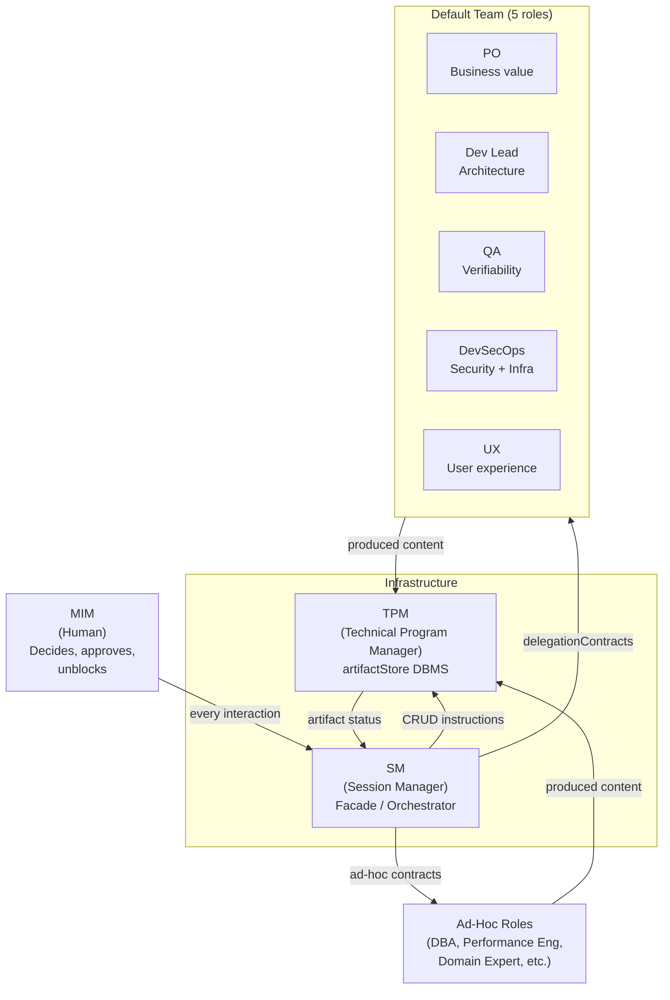

Key rules:

- The SM **never produces content** --- it only orchestrates, convenes, and validates gates.
- The TPM **is the only one that writes** to the artifactStore --- with editorial judgment.
- Roles are subAgents with a personality that **changes per phase**.
- The SM can **extend the team** with justified ad-hoc roles.

> Detail: [roles](planning/roles/README.md) (per-phase contracts) and
> [SM behavior](planning/behavior/README.md)
> (SM rules).

[↑ Contents](#contents)

---

## Operating Modes

The framework separates planning from execution with a formal contract
between the two modes: the handoff.

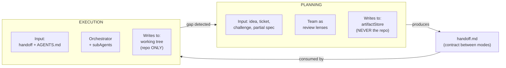

| Aspect | Planning | Execution |
|--------|----------|-----------|
| Purpose | Produce sources of truth | Implement code |
| Participants | Team (lenses) | Orchestrator + minions |
| Where it writes | artifactStore (outside the repo) | Repo working tree |
| Current status | **DEFINED** | **DEFINED** |

> **Note (Dogma)**: the monolithic `AGENTS.md` as the sole governance
> vehicle per repo is replaced by **progressive disclosure**: rules
> split into skills that activate by context, hooks that enforce
> deterministic constraints (principle 4), and MCP that exposes tools
> on demand — instead of a single file the agent must read in full
> every session.

> Detail: [operational model](planning/operational-model.md).

[↑ Contents](#contents)

---

## Full Pipeline

The cycle has 4 macro-phases, all defined. The post-execution phases
are defined as part of planning; the operation macro-phase is
operation: an optional, reactive facade over the full e2e cycle
(idea → operation) — it is not a requirement for closing the cycle
(Dogma, principle 1).

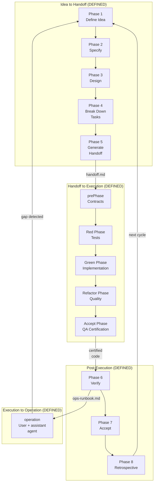

Alternative view: the timeline focuses on the **temporal order** of
phases within each macro-stage, instead of the dependencies between
sub-phases.

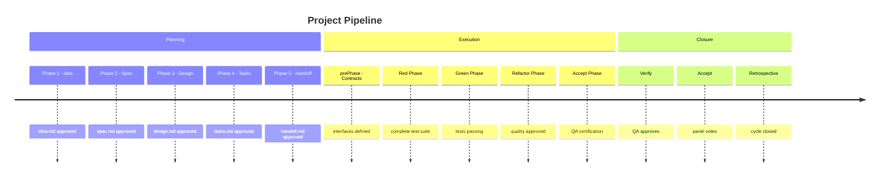

### Roles convened per phase

| Phase | Active Roles |
|-------|---------------|
| 1. Idea | PO |
| 2. Spec | PO + QA + UX (conditional) |
| 3. Design | Dev Lead + DevSecOps + UX (conditional) |
| 4. Tasks | Dev Lead + DevSecOps (cond) + QA (cond) |
| 5. Handoff | TPM (compiles under SM's instruction) |
| 6. Verify | QA + Dev Lead + DevSecOps (conditional) |
| 7. Accept | All active roles (parallel voting) |
| 8. Retro | All active roles |

> Detail: [SM behavior](planning/behavior/README.md)
> (phases 1-8) and [roles](planning/roles/README.md) (per-phase role
> contracts).
>
> **External validation (recommended, not a gate)**: both the Accept
> Phase (execution) and Phase 7 (planning) certify the deliverable
> **internally** — the agent team itself votes or certifies. The
> framework recommends, without requiring it, an **external
> validation** checkpoint: someone outside the agent team (the MIM, a
> stakeholder, a real user) sees the software working before closing
> the cycle. It is the equivalent of the "Measure" in
> Build-Measure-Learn — without that external signal, the
> Retrospective (Phase 8) only learns from the team's own perception.
> See [Accept Phase](execution/accept.md#external-validation-recommended).

[↑ Contents](#contents)

---

## Artifacts

The framework produces 6 universal artifacts backed by ISO/IEC/IEEE
standards. Each phase consumes the output of the previous one and
produces the parameters required for the next.

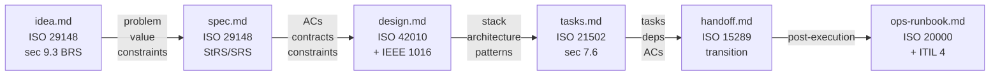

> **binding layer**: this artifact chain is, in Dogma terms
> (principle 2), the traceability graph maintained by the TPM — it
> links each downstream artifact to its upstream one (idea → spec →
> design → tasks → handoff → ops-runbook). `verifyConsistency` operates
> on this graph to detect semanticDrift. The binding layer confirms
> that the link exists; the strength of the link (whether the test
> actually catches regressions) is verified separately, via external
> tools orchestrated by Virgil (mutation testing, CRAP score,
> cyclomatic complexity).

### Who produces and who validates

| Artifact | Produces | Validates (gate) |
|----------|----------|-------------------|
| `idea.md` | PO | SM (structural via TPM) |
| `spec.md` | PO | QA (testability) + UX (experience) |
| `design.md` | Dev Lead + DevSecOps | SM (via TPM) + DevSecOps + UX |
| `tasks.md` | Dev Lead | QA (verifiability) + SM (via TPM) |
| `handoff.md` | TPM (compiles) | SM (self-containment) |
| `ops-runbook.md` | DevSecOps + Dev Lead | SM (gate) |

> Cardinal rule: **whoever produces never validates their own artifact**.
>
> DevSecOps contributes to the security assessment in Phase 3 (input
> to `design.md`) and evaluates the security posture in Phase 7
> (validation). These are distinct scopes: the Phase 3 input does not
> equate to producing the complete artifact.
>
> Detail: [artifacts](planning/artifacts/README.md) (schemas, minimum
> content, workItem hierarchy, persistence adapters).

[↑ Contents](#contents)

---

## Artifact State Machine

Every artifact transitions through a configurable state machine. The
`approved` state is what enables the next phase.

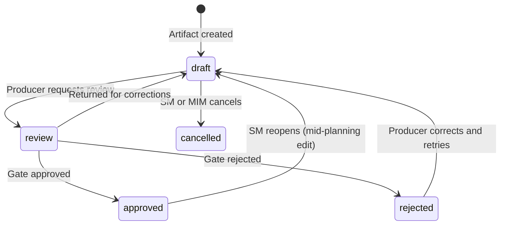

The **project's** state machine is derived from the artifact status in
the RAG. The SM does not persist state --- it reconstructs it by
querying the TPM:

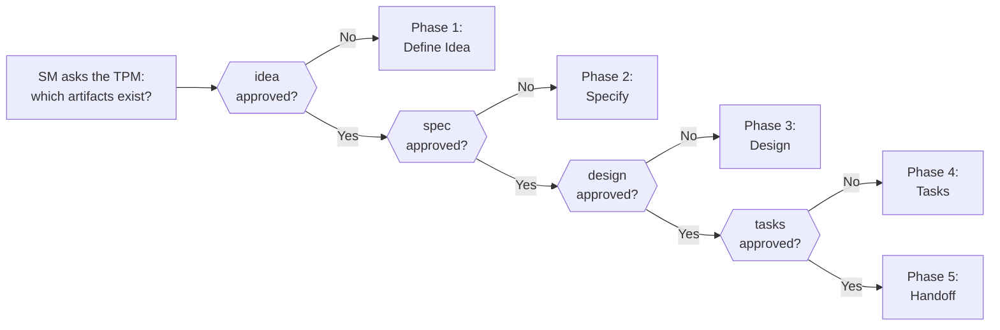

> Detail: [artifacts](planning/artifacts/README.md) (`transition`
> section) and [SM behavior](planning/behavior/README.md)
> (project state machine).

[↑ Contents](#contents)

---

## Delegation Model

The SM delegates work via **delegation contracts** with mandatory
fields. After every return, it runs the **PDC** (Post-Delegation
Checkpoint).

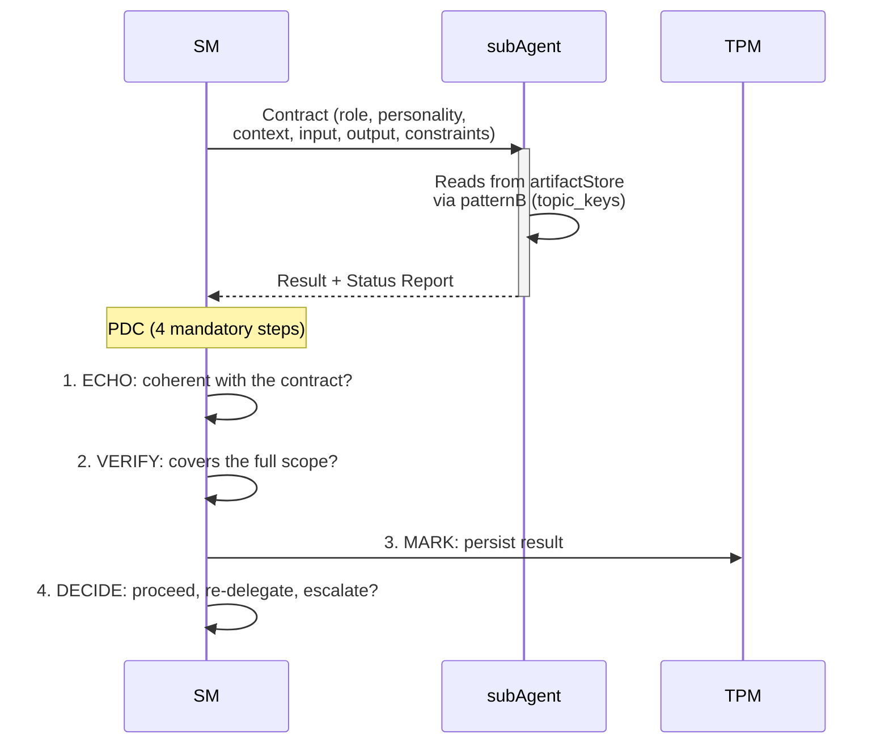

### patternA vs patternB (retrieval)

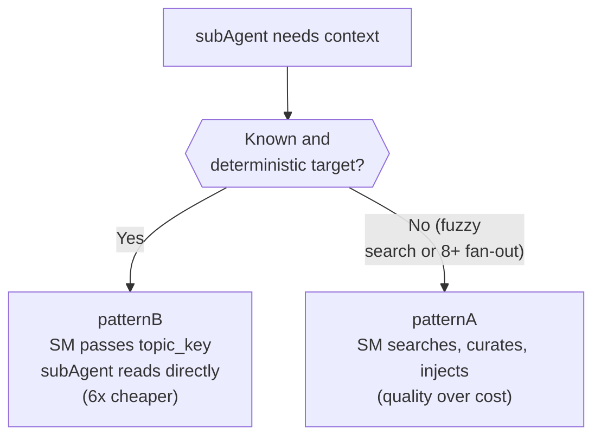

**circuitBreaker**: if 3 consecutive delegations to the same role fail, the SM stops the chain and escalates to the MIM.

> Detail: [SM behavior](planning/behavior/README.md)
> (PDC, circuitBreaker, context resilience) and
> [roles](planning/roles/README.md) (per-phase contracts).

[↑ Contents](#contents)

---

## fastForward

The SM does not always advance one phase at a time. It evaluates a
**certainty gradient** with 4 factors (F1-F4) and advances
proportionally.

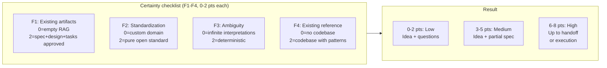

Examples:

| Input | Score | Certainty | Action |
|-------|-------|-----------|--------|
| "Build me the Uber of boats" | 0 | Low | Idea + questions |
| "Add JWT auth" (Express codebase) | 4 | Medium | Idea + partial spec |
| "Create an OTEL module" (NestJS codebase) | 6 | High | Up to handoff |
| Epic already groomed (everything in RAG) | 8 | High | fastForward to execution |

The SM records the F1-F4 score in `idea.md` for auditability.
fastForward also applies **mid-cycle** (production bugs, already
groomed epics).

> Detail: [SM behavior](planning/behavior/README.md)
> (contextual fastForward section).

[↑ Contents](#contents)

---

## artifactStore and Adapters

Artifacts are persisted via a **9-operation universalInterface**. The
adapter is pluggable --- the framework defines the interface, not the
implementation.

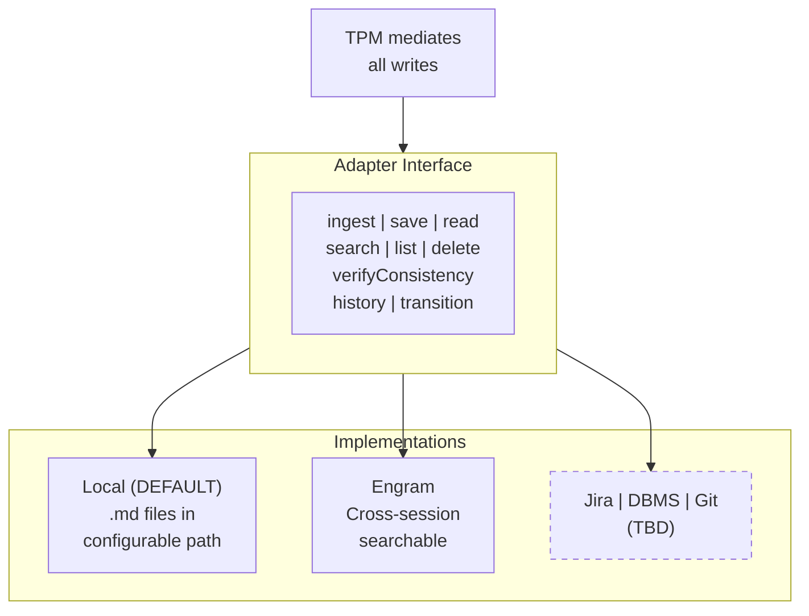

The TPM acts as a DBMS: it does not decide what data to create, but it
decides how it is stored, validates integrity, and serves queries with
editorial judgment.

> Detail: [artifacts](planning/artifacts/README.md) (universalInterface,
> behavior contract, ACID guarantees, adapters).

[↑ Contents](#contents)

---

## What's Next (TBD Areas)

The framework covers the planning macro-phase and the execution
macro-phase in detail. The following areas are identified but not yet
defined:

| Area | Status | Description |
|------|--------|-------------|
| Execution | **DEFINED** | 5 phases (Contracts → Red → Green → Refactor → Accept). Contract-first, boundaryModel (App + E2E), multi-dimensional review. See [execution model](execution/README.md). |
| Deployment | **DEFINED (dogma level)** | Transition between the Accept Phase (execution) and Operation. Defines the pre/post-deploy gate and the rollback concept at the dogma level; does NOT prescribe a deployment mechanism (CI/CD, blue-green, canary) — that is left to the project's decision. See [Phase Detail](planning/behavior/phases.md#deployment--transition-between-execution-and-operation). |
| Operation | **DEFINED** | Optional. For projects with an operational surface: the user consumes the product with agent assistance. Reactive, phaseless. See [operation model](operation/README.md). |
| Advanced adapters | TBD | Jira, DBMS, Git repo, MS Project as artifactStore adapters. |
| Non-Scrum routing | TBD | Routing tables for Kanban (WIP limits), Shape Up (bets), SAFe (PIs). Artifacts are universal; orchestration is not. |
| Activation tiers | TBD | How the planning mode scales down for simple projects or timeboxed challenges. |
| Adapter transactions | TBD | `begin`/`commit`/`rollback` primitives for adapters without native support. |

[↑ Contents](#contents)

---

## Detailed Documents Index

| Document | What it defines |
|----------|------------------|
| [Operational model](planning/operational-model.md) | Two modes, ownership, boundaries, default adapter |
| [Artifacts](planning/artifacts/README.md) | 6 artifacts, TPM, adapter interface, state machine, workItem hierarchy |
| [SM Behavior](planning/behavior/README.md) | SM as facade, project state machine, fastForward, PDC, circuitBreaker |
| [Roles](planning/roles/README.md) | delegationContracts per phase, personalities, conditional activation, ad-hoc roles |
| [Execution](execution/README.md) | Execution: contract-first, Red-Green-Refactor macro, execution roles, connection with planning |
| [Operation](operation/README.md) | Operation: optional and reactive, phaseless, user + assistant agent, connection with planning and execution |
| [echo system](echo-system.md) | Deterministic 5-step pipeline, environment homogeneity, enforcement, bumpDependencies |
| [artifact system](artifact-system.md) | Predictable-location convention for build outputs (compiled artifacts, reports, API documentation) |
