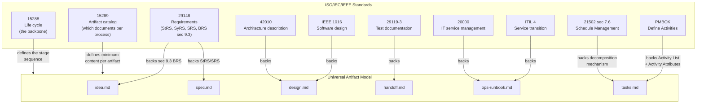
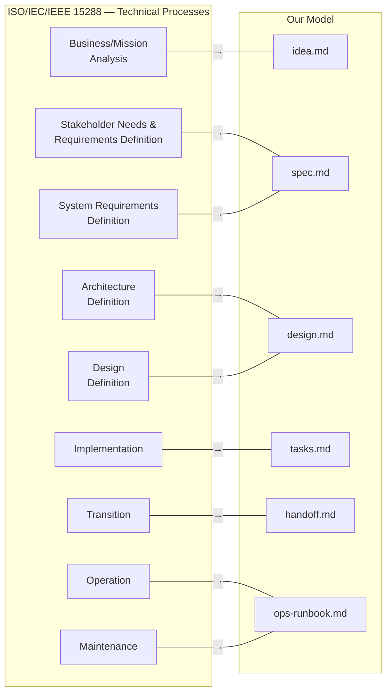
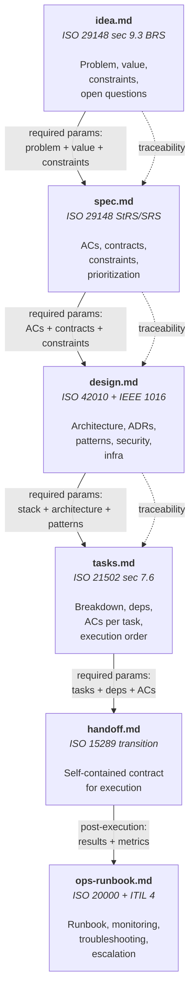
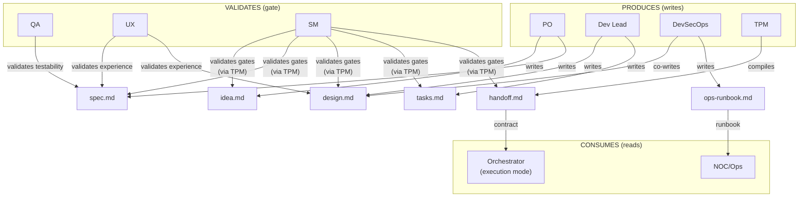
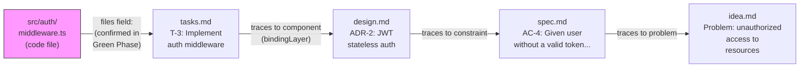

# Artifact Model

← [Main Index](../../README.md) | [Planning](../README.md)

> The artifact model defines WHAT documents a project produces and what
> each one contains. It is **independent of the methodology** (Scrum,
> Kanban, Shape Up, PI Planning, SAFe, etc.) and is backed by
> international ISO/IEC/IEEE standards.
>
> The methodology defines HOW work is organized (ceremony, cadence,
> roles). The artifacts are the same regardless of the chosen
> methodology.
>
> **Terminology note**: the *artifactStore* is the storage system
> (the TPM's backend). The *RAG* (Retrieval-Augmented Generation)
> pattern is HOW agents query the artifactStore. They are not
> synonyms: the artifactStore is the infrastructure; RAG is the access
> pattern.

---

## Contents

- [Why International Standards](#why-international-standards)
- [The Backbone: ISO/IEC/IEEE 15288](#the-backbone-isoiecieee-15288)
- [Model Documents](#model-documents)
- [Artifact Chain — Full Flow](#artifact-chain-full-flow)
- [Ownership — Who Produces, Who Consumes, Who Validates](#ownership-who-produces-who-consumes-who-validates)
- [Reverse Traceability — Code to Artifact](#reverse-traceability-code-to-artifact)
- [Open Questions](#open-questions)

---

## Why International Standards

The artifact model is NOT an invention of the framework. It is aligned
with ISO/IEC/IEEE standards because:

1. **Adapter portability** — if the artifacts follow a standard, any
   system that implements that standard can be an adapter: local
   files, Jira, Asana, Basecamp, MS Project, a DBMS, a remote RAG,
   engram, Confluence, Linear, or any future tool.

2. **Interoperability** — a `spec.md` that follows ISO/IEC/IEEE 29148
   is understandable by any team, tool, or process that knows the
   standard. It is not a proprietary format.

3. **Verifiable completeness** — the standards define which sections
   each artifact must have. That gives us a mechanically verifiable
   schema (the TPM can validate completeness against the standard).

4. **Methodology independence** — the standards describe
   *information items*, not ceremonies. A `spec.md` is a `spec.md`
   regardless of whether it was produced in a sprint planning or in a
   Shape Up bet.



> **All 6 artifacts are backed by international standards.**
> `idea.md` is backed by ISO/IEC/IEEE 29148 sec 9.3 (BRS). `tasks.md`
> has no standard that defines the artifact as such, but the
> decomposition mechanism it implements is backed by ISO 21502 sec 7.6
> and PMBOK "Define Activities." The others follow their ISO standards
> directly.

[↑ Contents](#contents)

---

## The Backbone: ISO/IEC/IEEE 15288

The 15288 standard (System Life Cycle Processes) defines the stages of
a system's life cycle. It is **methodology-agnostic** — it does not
mention sprints, backlogs, or cadences. It defines processes and their
outputs.

Our model maps directly to its technical processes:



**Note**: the standard defines more processes (Integration,
Verification, Validation, Disposal). Those map to the post-execution
stages (Verify, Accept, Retro) which are defined separately.

[↑ Contents](#contents)

---

## Model Documents

This model is documented across the following pages:

- [Schemas of the 6 Artifacts](schemas.md) — purpose, ISO backing,
  and minimum content of each artifact.
- [Methodology as an Interchangeable Layer](methodology.md) —
  methodology governance, per-iteration lock, and the change
  protocol.
- [TPM and universalInterface](tpm-adapter.md) — the TPM as the
  model's DBMS, artifact operations, and persistence adapters.
- [State Machine and Transitions](state-machine.md) — an artifact's
  states, the `transition()` operation, and semantic drift detection.
- [workItem Hierarchy](work-items.md) — L0-L4 levels, dependencies,
  and the execution DAG.
- [Retrieval Strategy](retrieval.md) — patternA vs. patternB for how
  subAgents query the RAG.

[↑ Contents](#contents)

---

## Artifact Chain — Full Flow



[↑ Contents](#contents)

---

## Ownership — Who Produces, Who Consumes, Who Validates



### Detailed Ownership Matrix

| Artifact | Produces | Co-produces | Validates (gate) | Consumes |
|-----------|---------|------------|---------------|---------|
| `idea.md` | PO | SM (questions) | SM (structural via TPM) + QA (verifiability of constraints) | Spec phase |
| `spec.md` | PO | — | QA (testability), UX (experience), SM (gate) | Design phase |
| `design.md` | Dev Lead | DevSecOps (security, infra) | SM (structural via TPM) + DevSecOps (security) + UX (experience, conditional) | Tasks phase |
| `tasks.md` | Dev Lead | QA (per-task verifiability) | SM (structural via TPM) + QA (per-task verifiability) | Handoff phase |
| `handoff.md` | TPM | — | SM (self-containment) | Execution mode |
| `ops-runbook.md` | DevSecOps | Dev Lead (troubleshooting) | SM (gate) | NOC/Ops |

### Ownership Rules

1. **Whoever produces NEVER validates their own artifact** — the PO
   writes the spec, QA validates it. The Dev Lead writes the design,
   UX and DevSecOps validate. Separation of concerns between
   production and validation. Cases with an added independent
   semantic validator: `idea.md` (SM structural via TPM + QA verifies
   verifiability of constraints), `design.md` (SM structural via TPM
   + DevSecOps validates security + UX validates experience
   conditionally), `tasks.md` (SM structural via TPM + QA validates
   per-task verifiability, instead of the Dev Lead self-validating).

2. **The SM never produces content** — it orchestrates, validates
   gates (via TPM), but does not write inside any artifact. A
   cardinal rule with no exceptions.

3. **The TPM is the ONLY one that WRITES to the RAG** — all write
   operations (create, update, delete, transition) go through the TPM
   with editorial judgment (format, completeness, consistency).
   **Reads are free** — any role can query the RAG directly via
   patternB (topic_keys) without an intermediary. See
   [Retrieval Strategy](retrieval.md).

4. **The handoff is compiled by the TPM, not a productive role** —
   it is a synthesis of prior artifacts, not new content. The TPM
   applies its editorial judgment to compile a self-contained
   document.

5. **opsRunbook is built incrementally** — it is not a single-phase
   artifact. It gets built as part of the artifacts relevant to the
   project being implemented: if it's a CLI → flags and help
   documentation, if it's an API → API docs, if it's gRPC → protos,
   if it's infrastructure → an operations runbook. DevSecOps
   contributes the security and monitoring part; Dev Lead the
   troubleshooting and operational architecture part. The final
   format depends on what the project IS, not on a rigid template.

[↑ Contents](#contents)

---

## Reverse Traceability — Code to Artifact

> The `bindingLayer` (see [glossary](../../glossary.md)) traces
> forward: which AC in `spec.md` is covered by which task in
> `tasks.md`. But given an already-written code file
> (`src/auth/middleware.ts`), there is no mechanical way to determine
> which task originated it, which design decision motivated it, or
> which business problem it solves. This section defines the reverse
> binding: code → artifact.

### Reverse Binding Graph



Given a `path`, the graph is walked in a single direction: from code
toward the business problem that justifies it. It is the reverse
complement of the [Artifact Chain](#artifact-chain-full-flow), which
traces forward (`idea.md` → ... → `handoff.md`).

### Three Complementary Mechanisms

No single mechanism resolves reverse binding on its own. All three
operate together:

| Mechanism | Where it lives | How it works |
|-----------|-----------|---------------|
| **Binding annotation** | The workItem's `files` field, in `tasks.md` and `handoff.md` | During planning, `files` is an estimate ("if known", see [Schemas](schemas.md)) used to detect overlap between lanes. During **Green Phase** (see [Commit Strategy](../../execution/git-strategy.md#commit-strategy)), the implementer CONFIRMS the field with the files actually created or modified. The planning estimate becomes the real binding record. |
| **Git integration** | Commit history | Green commits already reference the AC and test under the convention `type: description (references)` (see [Commit Strategy](../../execution/git-strategy.md#commit-strategy)). The task ID is added in the same parenthesis: `feat: implement auth middleware (T-3, passes auth-login-success)`. Secondary traceability via `git log --grep "T-3"`. |
| **Reverse query** | `verifyConsistency` in `--reverse` mode (see [universalInterface](tpm-adapter.md)) | Given a file path, it walks the `bindingLayer` backward: file → task (`files`) → design (component/ADR) → spec (AC) → idea (problem). It extends the existing `verifyConsistency(artifact[])` operation — it does not add a new operation to the `universalInterface`. |

### Rule — Traceability Lives in Artifacts and Git, Never in Code

Traceability is recorded in the artifacts (`files` field) and in git
(commit messages). **NEVER** in code comments:

```typescript
// ❌ NEVER — the comment goes out of sync with the artifact and no one audits it
// Task: T-3
// See spec AC-4
export function authMiddleware() { /* ... */ }
```

```typescript
// ✅ Code does not annotate its own origin. Traceability lives in
// handoff.md (files field) and in the commit that introduced it.
export function authMiddleware() { /* ... */ }
```

**Reason**: a code comment is not under the TPM's control — no one
validates it, no one updates it when the task is re-planned, and
`verifyConsistency` cannot read it as a source of truth. The
`bindingLayer` requires traceability to live where the TPM can write
it, validate it, and query it mechanically: the artifactStore and the
git history, never the source code.

[↑ Contents](#contents)

---

## Relationship to Other Documents

- [operational-model.md](../operational-model.md) — defines the two
  modes (planning and execution). This document defines the
  artifacts that the planning mode produces.
- [SM Behavior](../behavior/README.md) — defines how the SM
  orchestrates artifact production. The SM uses this model as a
  reference to know which artifacts must exist in each phase.

[↑ Contents](#contents)

---

## Open Questions

1. ~~**Should `ops-runbook.md` be produced in planning mode or
   post-execution?**~~ **RESOLVED**: post-execution. The opsRunbook
   is produced in Phase 6 (Verify) or Phase 7 (Accept), when
   deployable code already exists. DevSecOps writes it with input
   from design.md (infra) and the execution results (metrics,
   configs). The structure can be anticipated in Phase 3 (Design),
   but the content requires existing code.

2. **How does the model scale down?** — for a 45-minute challenge, are
   artifacts skipped or compressed into one? The activation tiers must
   define this.

3. **Should the TPM validate against the ISO standards mechanically?**
   — that is, should there be a formal schema per artifact that is
   validated automatically? Or is the TPM's editorial judgment
   enough?

[↑ Contents](#contents)
