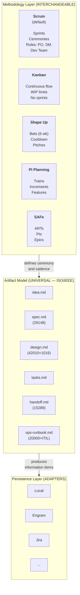
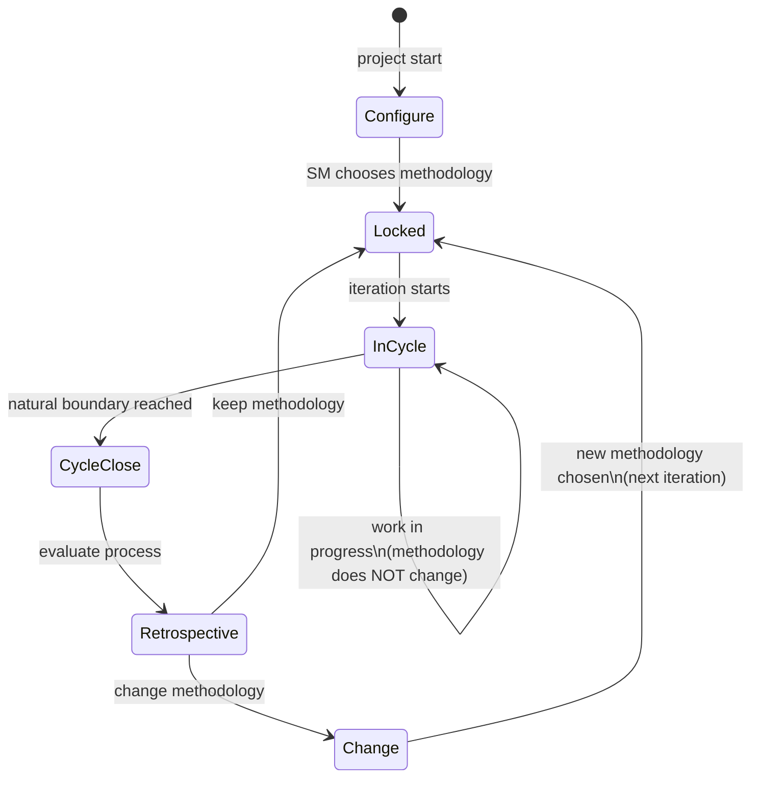
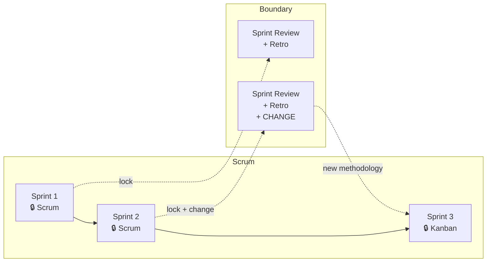
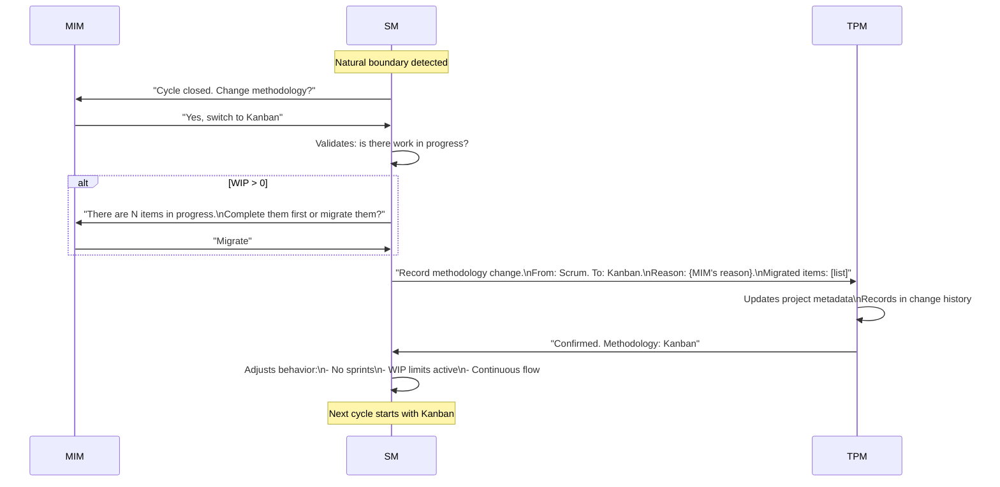
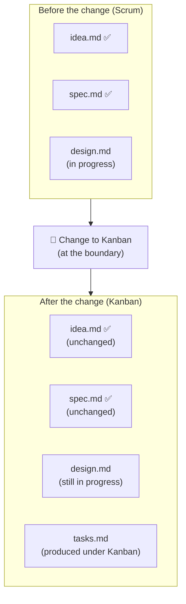
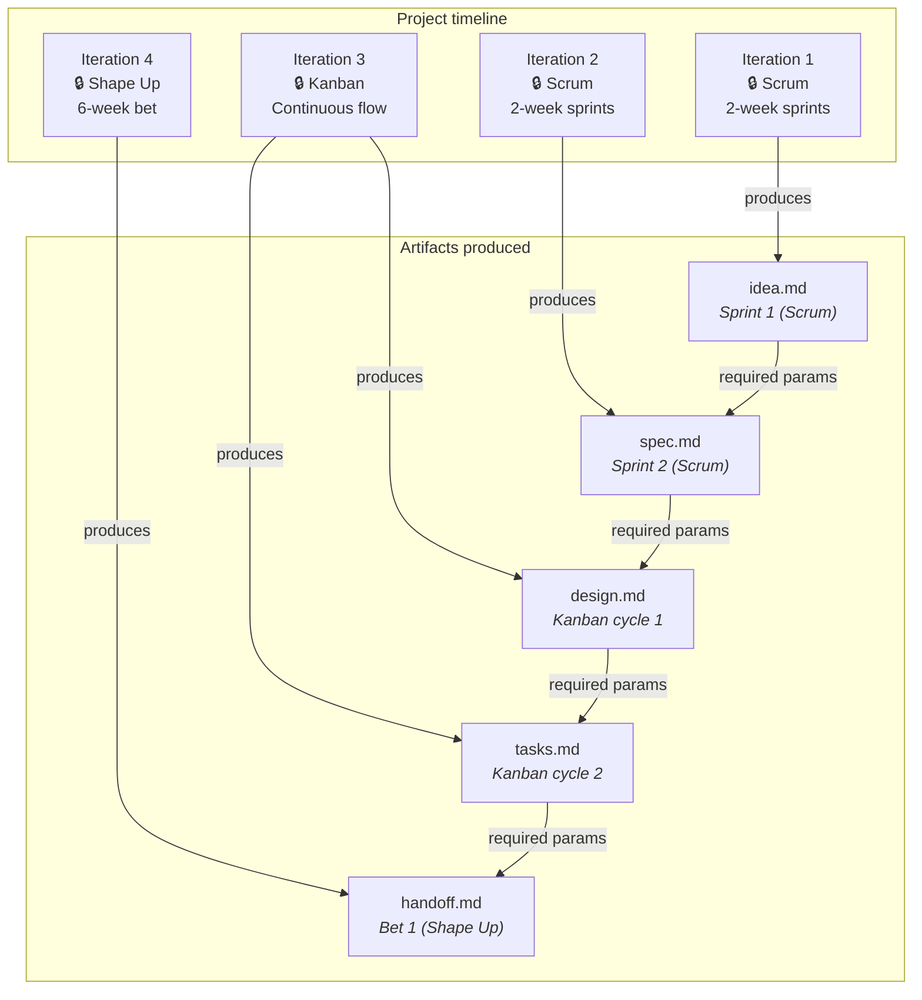

# Methodology as an Interchangeable Layer

← [Main Index](../../README.md) | [Planning](../README.md) | [Artifacts](README.md)

The methodology defines HOW work is organized. The artifacts define
WHAT gets produced. They are independent layers.

> **Scope of the claim**: interchangeability is **implemented at the
> artifact level** — the 6 artifacts are identical regardless of
> methodology. At the **orchestration level** (routing, gates,
> convocation), the framework implements **Scrum as the default**.
> Routing for Kanban, Shape Up, and SAFe is extensible but **not yet
> implemented** — it requires alternative routing tables (e.g.
> WIP-limit checks instead of sprint gates). The roles (PO, SM, Dev
> Lead, QA, DevSecOps, UX) are constant functions with
> methodology-specific names.

**Methodology as a meta-artifact**: the choice of methodology is
stored in the artifactStore as project configuration. It is not a
product artifact — it is a **meta-artifact** that configures the SM's
behavior.

- **When it is defined**: the SM asks the MIM during setup (Phase 1,
  initial configuration): "Which methodology do you prefer? Default:
  Scrum."
- **Where it is stored**: in the artifactStore, in the project's
  metadata section (not in a product artifact).
- **When it is reviewed**: during the retrospective (Phase 8), as a
  natural candidate for "start doing" or "stop doing" — e.g. "Start:
  use Kanban instead of Scrum for the next cycle."
- **What it affects**: routing tables, gates, convocation, the
  workItem state machine, ceremony. The artifacts do not change.



---

## Contents

- [What Changes With the Methodology, What Does NOT Change](#what-changes-with-the-methodology-what-does-not-change)
- [Quick Mapping: Same Artifacts, Different Ceremony](#quick-mapping-same-artifacts-different-ceremony)
- [Metrics Verification: Traceability and Strength](#metrics-verification-traceability-and-strength)
- [Methodology Governance — Lock, Change, and Traceability](#methodology-governance-lock-change-and-traceability)

---

## Metrics Verification: Traceability and Strength

The methodology defines HOW work is organized; metrics verification
is a cross-cutting layer that runs on top of whichever methodology is
chosen. It has two separate responsibilities:

- **The binding layer (TPM)** tracks **traceability**: which AC in
  `spec.md` is covered by which task in `tasks.md`, which task has at
  least one associated test. It is accounting — it confirms a link
  exists, not that the link is high quality.
- **External tools** verify **strength**: whether the test covering
  an AC actually detects regressions. This is measured with mutation
  testing, CRAP score, and cyclomatic complexity — metrics the
  binding layer cannot calculate on its own because they require
  running and analyzing the code, not just mapping references.

`virgil health` consolidates both dimensions into a 4-category
report: traceability, test strength, code structure, and
documentation health. Each category's thresholds are configurable
per tier (`strict`, `standard`, `relaxed`, `custom`) — a project in
the Light tier does not require the same mutation testing score as
one in the Full tier.

**Virgil orchestrates, it does not build**: Virgil does NOT implement
its own mutation testing engines, CRAP score calculation, or
cyclomatic complexity analyzers. It delegates those measurements to
specialized external tools per language (for example, Stryker for
JS/TS, mutmut or cosmic-ray for Python, PIT for JVM) and consolidates
their results in the `virgil health` report. This keeps the framework
language-agnostic: adding support for a new language is a matter of
defining the adapter to its metrics tool, not reimplementing the
analysis engine.

[↑ Contents](#contents)

---

## What Changes With the Methodology, What Does NOT Change

| Aspect | Does it change with the methodology? | Example |
|---------|---------------------------|---------|
| **Which artifacts are produced** | NO — always the same 6 | spec.md exists in Scrum, Kanban, and Shape Up |
| **What each artifact contains** | NO — content defined by ISO standards | The ACs in spec.md are the same regardless of whether they are defined in a sprint planning or in a pitch |
| **In what order they are produced** | NO — the idea→spec→design→tasks→handoff→ops chain is logical, not methodological | You cannot design without requirements, regardless of methodology |
| **How work is grouped** | YES | Scrum: sprints. Kanban: flow. Shape Up: bets |
| **What ceremony accompanies production** | YES | Scrum: sprint planning. Kanban: replenishment. Shape Up: betting table |
| **Which roles participate and how** | NO — the functions are constant; the **names** are methodology-specific | Scrum: PO + SM + Dev Team. Kanban: same functions without formal titles. Shape Up: shapers (≈PO+SM) + builders (≈Dev Lead+QA). The 6 functions (PO, SM, Dev Lead, QA, DevSecOps, UX) exist in every methodology; what changes is how they are named and how much ceremony accompanies their invocation. |
| **Review cadence** | YES | Scrum: every sprint. Kanban: continuous. PI Planning: every PI |
| **How tasks are managed** | YES | Scrum: sprint backlog. Kanban: board with WIP. Shape Up: hill chart |

[↑ Contents](#contents)

## Quick Mapping: Same Artifacts, Different Ceremony

| Artifact | In Scrum | In Kanban | In Shape Up | In PI Planning |
|-----------|----------|-----------|-------------|---------------|
| `idea.md` | Refined Product Backlog Item | Card in "Ideas" | Raw idea before the pitch | Feature in the backlog |
| `spec.md` | Sprint Planning output (ACs) | Definition of Ready | Pitch document | PI Objectives |
| `design.md` | Spike / Architecture Decision | Design at pull time | Solution sketch | Enabler |
| `tasks.md` | Sprint Backlog | Cards on the board | Scopes in the hill chart | Stories in the PI |
| `handoff.md` | Sprint Review package | — (continuous flow) | Hand-off post bet | System Demo package |
| `ops-runbook.md` | Post-release runbook | Post-release runbook | Post-release runbook | Post-PI runbook |

[↑ Contents](#contents)

---

## Methodology Governance — Lock, Change, and Traceability

### Initial Methodology Selection

In the project's first cycle, the SM must determine the methodology:

1. **If the MIM specifies it** → use the specified one.
2. **If the MIM does not specify it** → the SM applies **Scrum as the
   default** and informs the MIM: *"Scrum will be used as the
   methodology. You can switch to Kanban/Shape Up/PI Planning at the
   end of the first sprint."*
3. **If the MIM is unsure** → the SM presents the comparison table
   (the "Quick Mapping" section) and asks explicitly.

The decision is recorded in `idea.md` → "Decisions made" section →
`methodology_stamp` field.

### Principle: The Methodology Is LOCKED per Iteration

The current methodology **cannot change mid-cycle**. It is locked at
the start of each iteration and can only change when the cycle
closes. This prevents:

- Commitments broken mid-sprint/bet/PI
- Invalidated metrics (velocity, cycle time, throughput)
- Confusion about which rules apply
- Artifacts in ambiguous states



### Natural Boundary per Methodology

Each methodology has its own concept of a "closed cycle." The SM
detects the boundary and only then enables the change:

| Methodology | Natural boundary | When it can change | Typical duration |
|-------------|-----------------|------------------------|-----------------|
| **Scrum** | End of sprint (Sprint Review + Retro) | Before the next Sprint Planning | 1-4 weeks |
| **Kanban** | Replenishment meeting or WIP = 0 | At the next replenishment | Continuous (artificial boundary) |
| **Shape Up** | End of bet cycle + cooldown | At the next betting table | 6 + 2 weeks |
| **PI Planning** | End of Program Increment | At the next PI Planning | 8-12 weeks |
| **SAFe** | End of PI (System Demo + I&A) | At the next PI Planning | 8-12 weeks |

> **Special case — Kanban**: it has no sprints, so the boundary is
> fuzzier. Options: (1) the SM declares a "review point" every N
> days, (2) when WIP reaches zero, (3) at the periodic replenishment
> meeting. Any of these is valid — what matters is that an explicit
> boundary exists.



### Methodology Change — Protocol



### What Happens to Artifacts When the Methodology Changes

**Short answer: NOTHING.** The artifacts are the same. Only the
ceremony around their production changes.

This is validated by multiple industry frameworks:

| Framework | What it says about artifacts and methodology change |
|-----------|--------------------------------------------------|
| **Disciplined Agile (PMI)** | The goal is constant; the practice/artifact that implements it is the variable option. Changing WoW does not require recreating artifacts. |
| **Scrumban** | "Start with what you have" — the backlog and its items survive the transition. Only sprints → flow and velocity → cycle time change. |
| **SAFe** | Epic → Feature → Story keeps the same format across levels with different methodologies. Artifact identity is constant. |
| **PMBOK 7** | Artifacts are "tools you select per context" — independent of the delivery approach. |
| **Real-world practice (Jira)** | Migrating from a Scrum board to a Kanban board does not rewrite issues. Sprints are disabled, WIP limits are added. Items remain intact. |
| **ISO 15288/12207** | Process outcomes are fixed; the life-cycle model is variable and tailorable. The information items a process produces do not depend on the life-cycle model. |



### Metadata — Methodology Stamp per Artifact

Each artifact records UNDER WHICH methodology it was produced. This
does not change the content — it is traceability metadata.

```markdown
## Metadata
- Creation date: 2026-07-15
- Status: approved
- Iteration: Sprint 3
- Current methodology: scrum
- Reviewers: [PO, QA]
```

If the methodology changes and a new artifact is produced afterward:

```markdown
## Metadata
- Creation date: 2026-08-02
- Status: draft
- Iteration: Kanban cycle 1
- Current methodology: kanban
- Reviewers: [Dev Lead]
```

**The TPM stamps this automatically.** Roles do not need to know
about it or worry about it — the TPM is the DBMS and the stamp is
metadata, not content.

### Project Metadata — Methodology History

The project keeps a history of methodology changes in the RAG. This
is PROJECT metadata, not metadata of an individual artifact.

```markdown
# Project Metadata: {name}

## Current methodology
- Current: kanban
- Since: 2026-08-01
- Boundary: replenishment every 5 days

## Change history
| Date | From | To | Reason | Boundary |
|-------|------|--------|-------|----------|
| 2026-07-01 | — | scrum | Project start | 2-week sprint |
| 2026-08-01 | scrum | kanban | Team prefers continuous flow post-MVP | 5-day replenishment |

## Active roles
- [PO, SM, Dev Lead, QA] (UX disabled: CLI project)
```

### Mixed Artifacts — The Real Case

In practice, a project may have artifacts produced under different
methodologies. This is NOT a problem because the content is
universal (ISO-backed). What varies is only the ceremonial context
in which it was produced:



**The dependency chain (required params) is not broken.** A
`design.md` produced under Kanban consumes a `spec.md` produced under
Scrum without any issue, because both follow the same ISO schema.

### SM Rules for Methodology Governance

1. **LOCK at the start** — the SM establishes the methodology at the
   start of each iteration. During the iteration, the methodology does
   NOT change.

2. **Only changes at a boundary** — the SM only proposes a
   methodology change when it detects the current cycle's natural
   boundary.

3. **The MIM decides** — the SM can RECOMMEND a change based on
   observed metrics or friction, but the decision belongs to the MIM.

4. **WIP is resolved first** — if there is work in progress, the SM
   asks: complete it or migrate it? Work is never abandoned.

5. **The TPM records EVERYTHING** — every change is logged in the
   history with: date, previous methodology, new one, reason, affected
   items.

6. **No retroactive effect** — artifacts already produced keep their
   original metadata. They are not re-stamped.

7. **Emergency as the exception** — if the MIM declares an emergency
   (production down, deadline moved), the SM can do an "emergency
   break" of the lock. It is recorded as an exception in the history
   with justification.

### Novel Framework Contribution

> **Important note**: the granularity of "methodology as metadata per
> artifact" is a **genuine extension** beyond existing PM literature.
> Established frameworks (DA, SAFe, PMBOK) operate at team level,
> program level, or per deliverable — not per individual artifact.
>
> Our model takes this a step further: each artifact knows under
> which methodology it was produced, enabling full traceability even
> when the methodology changes multiple times during a project. This
> is possible because the artifact model is universal (ISO-backed)
> and the methodology is just metadata, not structure.
>
> **Validation precedent**: SAFe demonstrates that artifacts cross
> methodology boundaries without conversion (Epic → Feature → Story
> survives Scrum ↔ Kanban across different teams). Disciplined Agile
> demonstrates that the goal is constant and the practice is
> variable. Scrumban demonstrates that items survive the transition.
> Our model generalizes these patterns into explicit per-artifact
> metadata.

[↑ Contents](#contents)
