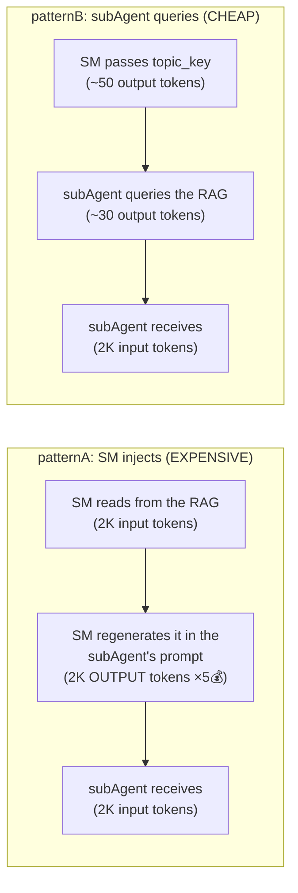
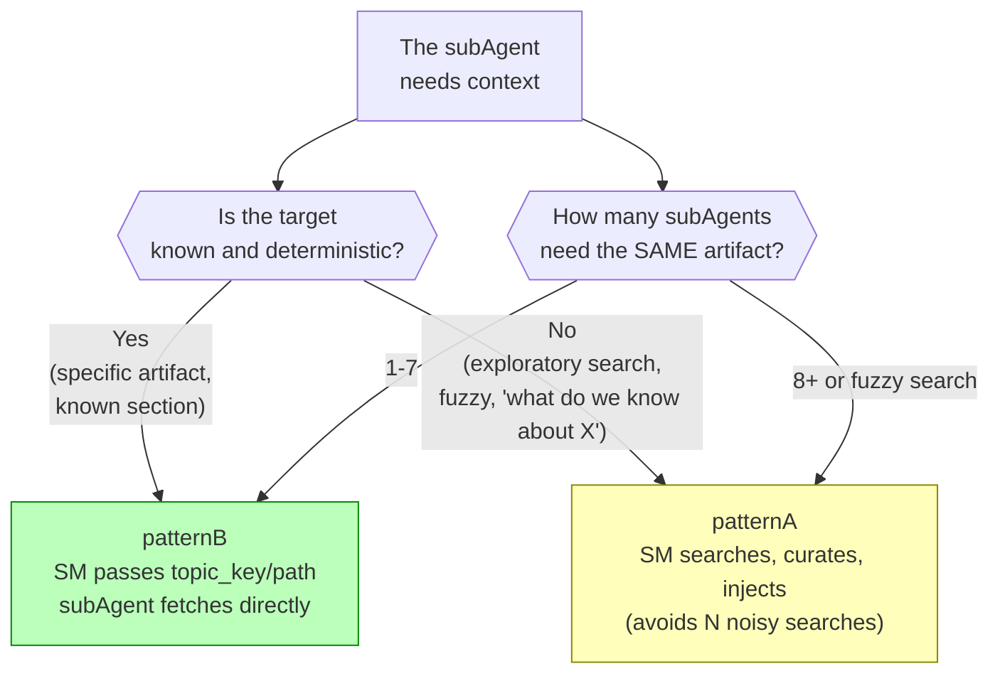
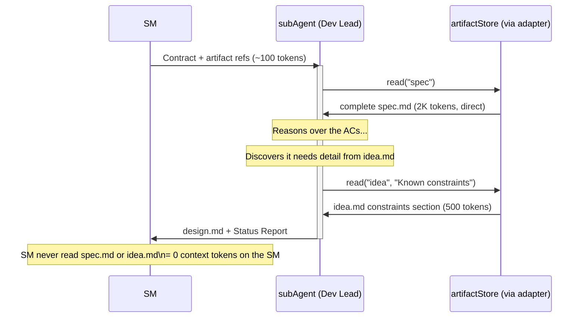

# Retrieval Strategy

← [Main Index](../../README.md) | [Planning](../README.md) | [Artifacts](README.md)

## Retrieval Strategy — Who Queries the RAG

### The Problem: The SM as Context Middleman Burns Tokens

When the SM reads content from the RAG and re-injects it into the
subAgent's prompt, it pays a **regeneration tax**: the content is
serialized as SM output tokens (~5x more expensive than input tokens)
before reaching the subAgent as input.



### Concrete Numbers

For **2,000 tokens of context** per delegation:

| Step | patternA (SM injects) | patternB (agent queries) |
|------|----------------------|---------------------------|
| SM reads from the RAG | 2,000 input tokens | — |
| SM regenerates it in the agent's prompt | 2,000 **output** tokens (5x cost) | ~50 output tokens (topic_key) |
| subAgent receives context | 2,000 input tokens | 2,000 input tokens |
| subAgent emits query to the RAG | — | ~30 output tokens |
| **Total cost (proportional)** | **~6x the baseline** | **baseline (1x)** |

For **20,000 tokens** (a complete `spec.md` or `design.md`), the same
proportion holds — **the difference scales linearly with the
artifact's size**.

> **The main driver is NOT "reading twice"** — it is that the SM has
> to GENERATE the content as output tokens to put it into the
> subAgent's prompt. Output tokens cost several times more than input
> tokens (typically ~5x) in most LLM models as of this writing. That
> regeneration tax is the bulk of patternA's extra cost.

### The Rule: Hybrid (Not Everything Is patternB)



| Situation | Pattern | Why |
|-----------|---------|-----|
| **Normal phase**: Dev Lead needs `spec.md` to design | **B** (topic_key) | Deterministic target. The agent fetches only what it needs. 6x cheaper. |
| **Verification**: QA needs `spec.md` + execution results | **B** (topic_keys) | Known targets. The agent can do incremental queries (first section 3, then section 3.2 if it needs detail). |
| **Exploratory search**: SM searches "what decisions were made about auth" | **A** (SM injects) | Fuzzy search. Results may be noisy. Better for the SM to curate once than for 5 agents to do the same vague search. |
| **High fan-out**: 8+ agents or a shared fuzzy search | **A** (SM injects) | Main justification: **quality, not cost**. When N agents independently run the same fuzzy search, they get noisy, divergent results. The SM curates once and distributes. Note: Phase 7 has 5 roles → patternB applies (under the threshold). patternA is reserved for real high fan-out scenarios (multi-team reviews, custom roles). |
| **Mid-task discovery**: subAgent discovers it needs more context | **B** (agent fetches) | The SM cannot anticipate what the agent will need mid-task. The agent makes precise queries as it reasons. |

### How patternB Works in Practice

The SM does NOT pass content — it passes **references to the
adapter**:

```plaintext
delegationContract:
─────────────────────────────────────────────
Role:          Dev Lead
Personality:   Architect (see role-profiles.md Phase 3)
Context:       Reads from the artifactStore using the universalInterface:
               - read("idea", "Known constraints")
               - read("spec")
               The active adapter resolves the operation:
               - Local: reads {store}/idea.md, {store}/spec.md
               - Engram: mem_search → mem_get_observation
               - DBMS: SELECT content FROM artifacts WHERE slug = ...
Input:         Design the architecture that satisfies the ACs
Output:        design.md (artifact model schema)
Status Report: Mandatory
─────────────────────────────────────────────
```

The subAgent receives ~100 tokens of instruction instead of ~5,000
tokens of injected context. It queries the artifactStore directly via
the universalInterface and gets exactly what it needs, when it needs
it.



> **Implementation note**: the universalInterface (`read`, `search`,
> etc.) is adapter-agnostic. For the engram adapter, `read("spec")`
> internally translates to `mem_search(query: "sdd/{project}/spec")`
>
> - `mem_get_observation(id)`. For the local adapter, it translates to
> reading `{store}/spec.md`. The delegationContract uses the
> universalInterface — the active adapter resolves the call.

### Adaptive Retrieval: The Agent Knows Best What It Needs

A key advantage of patternB: **the subAgent discovers its
information need WHILE reasoning**, not beforehand.

The SM cannot anticipate that the Dev Lead will need the "error
codes" section of `spec.md` — the Dev Lead discovers that while
designing error handling. With patternB, the agent makes incremental
queries as it progresses:

1. Reads the complete `spec.md` → identifies main ACs
2. Discovers it needs detail on constraints → reads the `idea.md`
   constraints section
3. Notices there is an AC about rate limiting → re-reads the
   `spec.md` non-functional section

Each query is precise and scoped. With patternA, the SM would have to
guess EVERYTHING the agent is going to need ahead of time — and, to
be safe, would inject too much.

### Auditability Requirement

To avoid losing visibility into what the agent read, the Status
Report must include a **sources consulted** field:

```plaintext
Status Report:
  Status: SUCCESS
  Progress: design.md complete (5/5 sections)
  Blocker: none
  Artifacts: design.md
  Sources:                          ← NEW
    - sdd/project/spec (obs:1234)
    - sdd/project/idea (obs:1230, constraints section)
```

This gives the SM an audit trail without paying the cost of reading
the content.

### Projected Impact Over a Full Cycle

Example: a project with 5 phases, ~3 delegations per phase with ~3K
tokens of average context per delegation:

| Metric | patternA (everything injected) | Hybrid (B default, A for fan-out) |
|---------|--------------------------|-------------------------------------|
| Delegations | 15 | 15 |
| Context tokens moved | 45K (15 × 3K) | 45K |
| Context cost (proportional) | ~6x the baseline (dominated by the output tax) | baseline (1x) |
| **Savings** | — | **~83%** in retrieval cost |

> The savings are in the RETRIEVAL LAYER, not in the project total.
> subAgents still consume tokens to reason and produce. But removing
> the context middleman eliminates the most absurd expense: paying 5x
> to regenerate content that already exists in the RAG.
