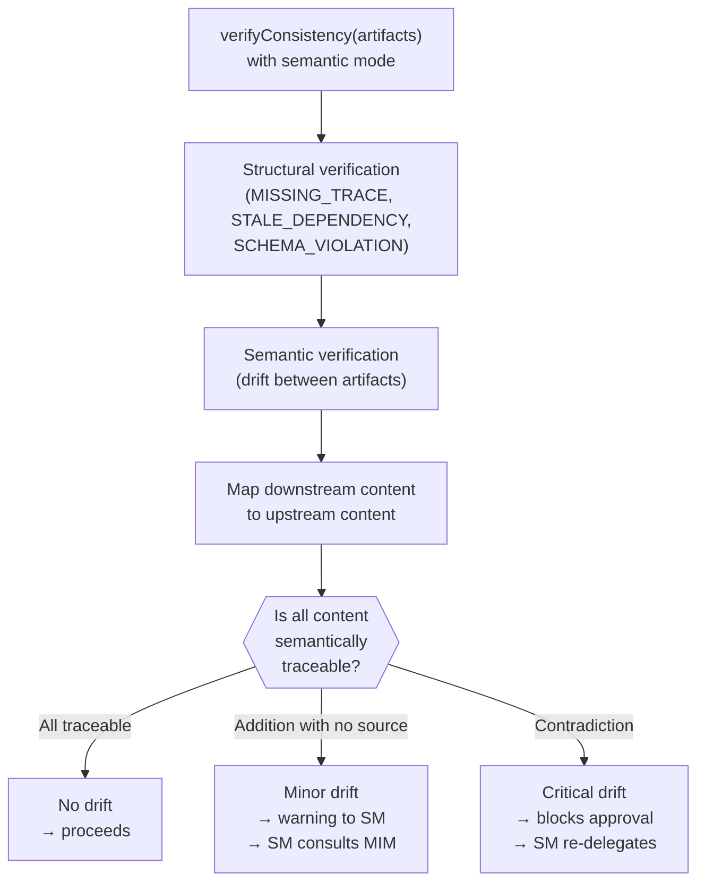

# State Machine and Transitions

← [Main Index](../../README.md) | [Planning](../README.md) | [Artifacts](README.md)

This page details the state machine that governs an artifact's
lifecycle (`idea.md`, `spec.md`, `design.md`, `tasks.md`,
`handoff.md`, `ops-runbook.md`), the [adapter](tpm-adapter.md)'s
`transition()` operation, the retired `markComplete` operation, and
semanticDrift detection between chained artifacts.

---

## Contents

- [State Machine Configuration](#state-machine-configuration)
- [Operation transition(artifact, newState, reason?)](#operation-transitionartifact-newstate-reason)
- [Operation ~~markComplete(artifact)~~ — Retired](#operation-markcompleteartifact-retired)
- [semanticDrift Detection](#semanticdrift-detection)

---

## State Machine Configuration

**Configurable state machine**: each project defines its own state
machine (which states exist and which transitions are valid). The
framework provides a **default** based on the universal pattern:

```plaintext
                    ┌──────────┐
              ┌────→│  review  │────┐
              │     └──────────┘    │
              │          │          │
              │          ▼          ▼
┌─────────┐   │   ┌──────────┐  ┌──────────┐
│  draft  │───┘   │ approved │  │ rejected │
└─────────┘       └──────────┘  └──────────┘
     │                 │
     │                 ▼
     │          ┌──────────┐
     └────────→ │cancelled │
                └──────────┘
```

Default states: `draft`, `review`, `approved`, `rejected`,
`cancelled`.

Default transitions:

| From | To | Who can |
|-------|-------|-------------|
| draft | review | Producer (requests review) |
| draft | cancelled | SM or MIM |
| review | approved | Gate validator |
| review | rejected | Gate validator |
| review | draft | Validator (returns for corrections) |
| rejected | draft | Producer (corrects and retries) |
| approved | draft | SM (reopen — via mid-planning edit protocol) |

> **Cost of a late change**: Reopening an already-approved upstream
> artifact triggers a cascade: the artifact returns to `draft`
> status, `verifyConsistency` re-runs on all downstream artifacts,
> downstream artifacts are flagged as "possibly outdated," and the
> current phase pauses until resolved. For minor changes that do not
> affect architecture (e.g. rewording an AC without changing its
> scope), consider a "lightweight change path" that updates the AC
> without invalidating the entire downstream chain.
>
> **TODO**: allow the MIM to define custom state machines during
> setup (Phase 1, initial configuration) or via a retrospective
> agreement. The adapter validates transitions against the
> configured state machine. Suggested format: adjacency list in
> project metadata.

[↑ Contents](#contents)

## Operation transition(artifact, newState, reason?)

| Aspect | Contract |
|---------|----------|
| Precondition | The artifact exists. `newState` is a valid state. The transition from the current state to `newState` is permitted by the configured state machine. |
| Postcondition | The artifact is in `newState`. `history()` records the transition with timestamp, actor, and reason. |
| Idempotency | Yes — transitioning to the current state is a no-op. |
| Given | `spec` in `draft` state with permitted transitions: `draft → review, draft → cancelled` |
| When | `transition("spec", "review", "PO finished ACs")` |
| Then | `spec.state` is `review`. `history()` records the transition. |
| Given | `spec` in `review` state with permitted transitions: `review → approved, review → draft` |
| When | `transition("spec", "draft", "QA found ambiguities")` |
| Then | `spec.state` is `draft` (backward transition permitted). |
| Given | `tasks` in `approved` state with no permitted transition to `draft` |
| When | `transition("tasks", "draft")` |
| Then | Error INVALID_TRANSITION. |
| Error: NOT_FOUND | The artifact does not exist. |
| Error: INVALID_STATE | `newState` is not a recognized state. |
| Error: INVALID_TRANSITION | The transition from the current state to `newState` is not permitted. |

[↑ Contents](#contents)

## Operation ~~markComplete(artifact)~~ — Retired

> **State unification (R004-C1)**: `markComplete` is retired as an
> independent operation. Artifact state management is unified under
> `transition`. What used to be `markComplete(artifact)` is now
> `transition(artifact, "approved", reason)`. SM gates check the
> `approved` state (not `complete`).
>
> **Migration**: replace every `markComplete(x)` call with
> `transition(x, "approved", "gate passed")`. See the previous
> section for the complete state machine.

[↑ Contents](#contents)

## semanticDrift Detection

Structural verification (`MISSING_TRACE`, `STALE_DEPENDENCY`,
`SCHEMA_VIOLATION`) detects gaps in the shape of artifacts.
semanticDrift detection verifies that **meaning** is preserved
throughout the idea → spec → design → tasks chain.

**Problem**: when different AI agents produce artifacts in sequence,
each one reinterprets the upstream artifact. After 4+
reinterpretations, the original intent can drift significantly
without any broken reference existing.

> **Drift severity levels**:
>
> - **Structural** (missing fields, invalid formats): **blocking**
>   gate. Deterministically detectable.
> - **Semantic** (logical contradictions, untraceable scope):
>   **advisory** gate by default. Current LLMs detect obvious
>   contradictions but do not guarantee full coverage. The SM reports
>   the drift found to the MIM, who decides whether to block or not.
>
> For high-risk projects, the MIM can explicitly promote semantic
> drift to blocking.

**Drift indicators** (what `verifyConsistency` checks in semantic
mode):

| Indicator | Example | Type |
|-----------|---------|------|
| AC in `spec.md` with no mapping to a problem or constraint in `idea.md` | Spec defines "offline support" but idea does not mention connectivity | `SEMANTIC_DRIFT_MINOR` |
| Decision in `design.md` that contradicts a `spec.md` constraint | Spec requires response < 200ms; design chooses 5s polling | `SEMANTIC_DRIFT_CRITICAL` |
| Task in `tasks.md` with no traceability to a `design.md` component | Task "implement Redis cache" with no ADR backing it | `SEMANTIC_DRIFT_MINOR` |
| New requirement that appeared mid-chain without MIM approval | Design adds biometric authentication no one asked for | `SEMANTIC_DRIFT_CRITICAL` |
| External API breaks a contract assumed in `design.md` (deprecated endpoint, new required field) | Payments API removes `POST /v1/charge`; `design.md` assumes that endpoint | `SEMANTIC_DRIFT_CRITICAL` |

> **Drift originating from external contracts**: a breaking change in
> a third-party API (removed endpoint, new required field, rate
> limit change) does not originate in the idea → spec → design →
> tasks chain, but produces the same cascade as internal drift: it
> invalidates the assumptions that `design.md` — and possibly
> `spec.md` — made about that contract. The SM treats the finding as
> critical drift: it blocks approval and re-delegates to `design.md`
> to reflect the new contract. If the change is backward-compatible
> (e.g. a new optional field), it is classified as minor drift and
> absorbed without a cascade. See [contract
> types](../../execution/contracts.md#contract-types) that these
> external dependencies must declare.

**Severity levels**:

| Level | Meaning | SM action |
|-------|-------------|---------------|
| **Critical drift** | Direct contradiction with upstream. The downstream artifact says something incompatible with what upstream approved. | Blocks approval. SM re-delegates to the producing role with the explicit contradiction. |
| **Minor drift** | Addition not present upstream. Does not contradict, but lacks traceability. | Warning. SM asks the MIM: "This was added without being in {upstream}. Do you approve it?" |
| **No drift** | All artifact content is traceable to approved upstream content. | Proceeds normally. |

**Verification flow**:



**Where it runs**:

- In the **VERIFY** step of the PDC (after every subAgent return)
- In gate validation (before `transition(artifact, "approved")`)
- The SM can delegate this check to QA, who already has the skeptical
  personality suited to challenging traceability

> **Semantic vs. structural traceability**: structural verification
> asks "does the reference exist?" Semantic verification asks "is the
> meaning compatible?" Both are necessary. An artifact can pass
> structural verification (all sections exist, all references point
> to real artifacts) and fail semantic verification (a decision
> contradicts an upstream constraint).

[↑ Contents](#contents)
