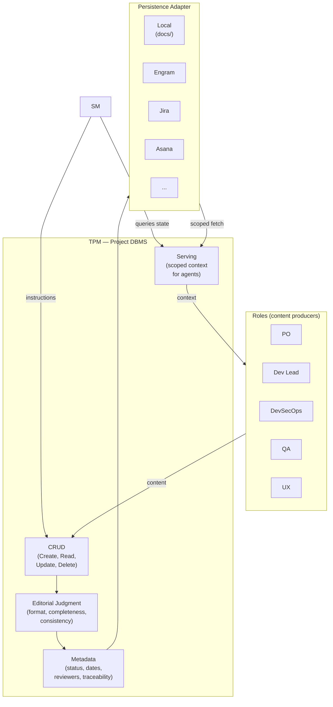
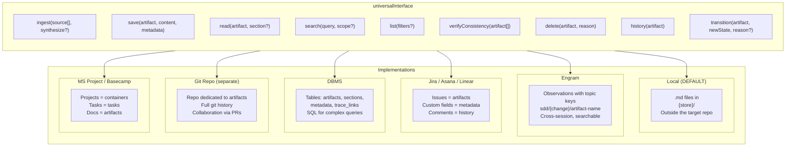
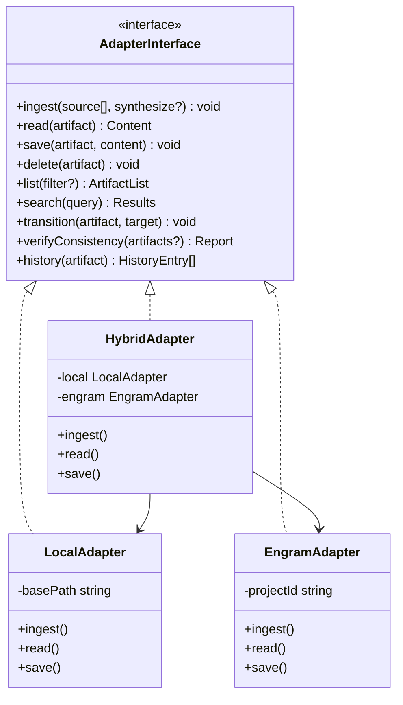
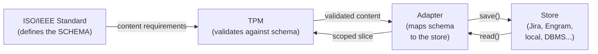

# TPM and universalInterface

← [Main Index](../../README.md) | [Planning](../README.md) | [Artifacts](README.md)

## The TPM as the Artifact Model's DBMS

The TPM (Technical Program Manager) is to the artifact model what a
DBMS is to data: it does not decide what data to create (that's what
the roles do), but it does decide HOW it is stored, validates
integrity, and serves queries.



### TPM Writing Standards

**TPM writing standards** (concrete checklist):

1. Every requirement or task is a single, complete sentence (not
   nested lists of fragments).
2. No TODOs, TBDs, or unresolved placeholders in artifacts in
   `approved` state.
3. Cross-references between artifacts use traceable IDs (not "see
   above" or "as mentioned").
4. Markdown formatting consistent with the artifact's schema as
   defined in this document.

**Anti-drift rule**: TPM edits are classified into two levels:

- **Level 1 — format**: whitespace, Markdown, renumbering, ordering.
  The TPM applies these without notifying. They do not change
  semantics.
- **Level 2 — structure/content**: rewriting sentences, removing
  sections, reorganizing requirements, changing IDs. The TPM MUST
  notify the original producer before applying. If the producer is
  unavailable (session closed), the TPM records the pending edit as
  metadata and presents it to the producer in the next session.

The SM checks this in the PDC's ECHO step: if the TPM reports level 2
edits, the SM confirms with the producer before marking the artifact
as complete.

### TPM Operations on the Model

| Operation | What it does | Who invokes it | Example |
|-----------|----------|-----------------|---------|
| **ingest** | Incorporates source material into the store (synthesized or verbatim), with citations to the original source. **Precondition**: `source` is a non-empty array. | SM (instruction), via TPM | "Ingest the 3 challenge files" |
| **save** | Creates or updates an artifact with its content and metadata (upsert). **Precondition**: verifies all upstream artifacts are approved before creating a new one. If an upstream is missing or not approved, rejects and reports to the SM. | SM (instruction) | "Save idea.md for project X" |
| **read** | Returns a scoped slice of the artifact | SM, Roles | "Give me the ACs section of spec.md" |
| **search** | Searches content by query within one or more artifacts | SM, Roles | "Search 'JWT' in the entire store" |
| **list** | Lists artifacts with filters (status, producer, date) | SM, Roles | "List artifacts in `review` status" |
| **delete** | Removes obsolete content (rare, with justification) | SM (instruction) | "Delete task T-07, it was discarded" |
| **verifyConsistency** | Verifies referential and semantic integrity between artifacts | SM (pre-gate) | "Do all spec ACs trace to ideas?" |
| **history** | Returns the version and action history of an artifact | SM (recovery, auditing) | "What happened to design.md in Phase 3?" |
| **transition** | Changes the artifact's state in the state machine (`draft` → `review` → `approved`/`rejected`). What used to be "mark complete" is now `transition(artifact, "approved", "gate passed")`. | SM (via gate) | "spec.md passed the gate: `transition('spec', 'approved', 'QA + SM gate passed')`" |

See [State Machine and Transitions](state-machine.md) for the full
detail of the `transition` operation.

### Optimization: Batch Writes per Phase

To reduce TPM dispatches in timeboxed projects (challenges, spikes),
the SM can group operations by phase:

| Tier | Dispatches per phase | When it applies |
|------|---------------------|-----------------|
| Normal | 1 Create + N Updates + 1 Transition | Projects without a timebox. Every interaction is a dispatch. |
| Compressed | 1 Create-with-content + 1 Transition | Timeboxed challenges. The subAgent produces the complete artifact in one delegation; the TPM receives it and persists it in a single dispatch. |
| Ultra-compressed | 1 transaction (Create + Transition) | Trivial artifacts or fastForward with high certainty. A single atomic transaction. |

**Rule for patternB + batch**: when the subAgent reads directly from
the RAG (patternB) and produces a complete artifact, the dispatch to
the TPM is only the final write. There are no intermediate read
dispatches. This reduces overhead to ~2 dispatches per phase in the
compressed tier.

**Threshold for small artifacts** (M14): if the artifact has fewer
than ~500 tokens, the agent's reasoning overhead to decide queries
(patternB) can dominate the cost. In that case, patternA (SM injects
directly) is more efficient. The SM decides automatically: artifact
< 500 tokens → patternA, >= 500 tokens → patternB. See [Retrieval
Strategy](retrieval.md) for the full detail of patternA vs. patternB.

---

## Persistence Adapters — universalInterface

Because the artifact model follows international standards, the
*information items* are portable. Any system that can store and
serve these items can be an adapter.



Visual complement: the class diagram shows the universalInterface as
a type contract — each implementation (`LocalAdapter`,
`EngramAdapter`, `HybridAdapter`) fulfills the same interface.



### Artifact Mapping by Adapter

| Artifact | Local (default) | Engram | Jira | DBMS | Git Repo |
|-----------|----------------|--------|------|------|----------|
| `idea.md` | .md file | observation `sdd/{name}/idea` | Epic description | row in `artifacts` | `ideas/name.md` |
| `spec.md` | .md file | observation `sdd/{name}/spec` | Epic + child stories (ACs) | row + child rows | `specs/name.md` |
| `design.md` | .md file | observation `sdd/{name}/design` | Linked Confluence page | row + JSON content | `designs/name.md` |
| `tasks.md` | .md file | observation `sdd/{name}/tasks` | Epic child issues | rows in `tasks` | `tasks/name.md` |
| `handoff.md` | .md file | observation `sdd/{name}/handoff` | Release ticket | row in `handoffs` | `handoffs/name.md` |
| `ops-runbook.md` | .md file | observation `sdd/{name}/ops` | Runbook page | row in `runbooks` | `runbooks/name.md` |

### Why Standards Enable Adapters

Without standard backing, each adapter would have to invent its own
structure. With standards:

1. **`spec.md` follows 29148** → a Jira adapter knows that "Functional
   requirements" maps to Stories with ACs, "Non-functional" to
   Labels, and "Traceability" to Links between issues.

2. **`design.md` follows 42010** → a Confluence adapter knows that
   each *viewpoint* is a section with a diagram, and each ADR is a
   *decision page*.

3. **`handoff.md` follows 15289 transition** → any adapter knows it
   must include: summary, stack, tasks, testing strategy, and
   acceptance criteria. If one is missing, the artifact is
   incomplete.



### Default Adapter: Local Files as RAG

- **Default path**: `~/.idea-to-mvp/projects/{name}/docs/` —
  **outside** the target repository. This guarantees planning mode
  never contaminates the target repo's working tree with process
  artifacts.
- **Format**: markdown files, one per artifact
- **Advantages**: zero dependencies, human-readable, optionally
  versionable with git (the store directory can be a separate repo)
- **Disadvantage**: no semantic search, no cross-machine access
- **Sufficient for**: individual projects, challenges, MVPs — which
  is the framework's default use case
- **Concurrency**: a single active session is assumed. Last-write-wins.
  Adapters with concurrency support (DBMS, Jira, Git repo) implement
  full ACID (see the "Cross-cutting Guarantees" section). The
  adapter contract defines a CONFLICT error on `save` when another
  writer has modified the artifact since the last `read` — this
  applies to ALL adapters with isolation support, not just "future"
  ones.

The other adapters are **TBD**. The artifact model enables them by
design, but the implementation is future work. The local adapter is
the persistence MVP.

### Adapter Behavior Contract

> **TODO: refine this contract with concrete types from the
> implementation language, exhaustive error codes, and conformance
> tests for each adapter. What follows is a draft of behavioral
> requirements — enough to design, not to implement.**

#### ingest(source[], synthesize?)

| Aspect | Contract |
|---------|----------|
| Precondition | `source` is a non-empty array. Each source has a `type` (file, url, text, image) and `content` or `path`. |
| Postcondition | The source material is available in the store, synthesized and with citations to the original source (path, line, URL, section). Queryable via `search()`. |
| Idempotency | Yes — ingesting the same material twice does not duplicate content. |
| `synthesize` | Default `true`. If `true`, the TPM extracts and condenses the relevant content with citations. If `false`, stores verbatim (for short or already-structured materials). |
| Given | MIM provides 3 files from a tech challenge |
| When | `ingest([{type: "file", path: "challenge/rules.md"}, {type: "file", path: "challenge/rubric.md"}, {type: "file", path: "challenge/starter.zip"}])` |
| Then | The store contains the synthesized content with citations: "Timebox: 4h [rules.md:12]", "Criterion: test coverage > 80% [rubric.md:5]". Any role can `search("timebox")` and get the data with its source. |
| Given | MIM pastes a wireframe screenshot |
| When | `ingest([{type: "image", content: <base64>}])` |
| Then | The store contains a synthesized description of the wireframe. If the adapter does not support images, returns UNSUPPORTED_SOURCE. |
| Error: EMPTY_SOURCE | The array is empty or all sources have empty content. |
| Error: UNSUPPORTED_SOURCE | The source type is not supported by this adapter. |

> **Note**: `ingest` is the entry gate for the MIM's material into
> the artifactStore. The SM NEVER reads sources directly — it
> instructs the TPM to ingest. The TPM synthesizes and cites. Any
> role accesses the result via `search()` or `read()`.

#### save(artifact, content, metadata)

| Aspect | Contract |
|---------|----------|
| Precondition | `artifact` is a valid slug (idea, spec, design, tasks, handoff, ops-runbook). `content` is not empty. `metadata` includes at least `producer` and `timestamp`. |
| Postcondition | The artifact exists in the store with the provided content and metadata. If it already existed, it is replaced (upsert). |
| Idempotency | Yes — calling twice with the same arguments produces the same state. |
| Given | An adapter with `idea` already saved |
| When | `save("idea", new_content, {producer: "PO", timestamp: T2})` |
| Then | The content of `idea` is `new_content`, metadata updated, previous version accessible via `history()`. |
| Error: INVALID_ARTIFACT | The slug does not belong to the valid artifact set. |
| Error: EMPTY_CONTENT | The content is empty or only whitespace. |
| Error: CONFLICT | (Concurrency-supporting adapters only) Another writer modified the artifact since the last read. Returns both versions. |

#### read(artifact, section?)

| Aspect | Contract |
|---------|----------|
| Precondition | `artifact` is a valid slug. |
| Postcondition | Returns the complete content, or the requested section if `section` is provided. |
| Idempotency | Yes — a pure read, no side effects. |
| Given | `spec` exists with sections "Functional requirements" and "Non-functional" |
| When | `read("spec", "Functional requirements")` |
| Then | Returns only that section's content. |
| Given | `design` does not exist |
| When | `read("design")` |
| Then | Error NOT_FOUND. |
| Error: NOT_FOUND | The artifact does not exist in the store. |
| Error: SECTION_NOT_FOUND | The artifact exists but the requested section does not. |

#### search(query, scope?)

| Aspect | Contract |
|---------|----------|
| Precondition | `query` is a non-empty string. `scope` is optional (default: all artifacts). |
| Postcondition | Returns a list of matches with: `artifact`, `section`, `snippet`, `relevance_score`. Empty list if no matches (NOT an error). |
| Idempotency | Yes. |
| Given | `spec` contains "JWT authentication with refresh tokens" |
| When | `search("JWT")` |
| Then | Returns at least one match in `spec` with a relevant snippet. |
| Given | Scope limited to `["design"]` |
| When | `search("JWT", {scope: ["design"]})` |
| Then | Only searches `design`. If there is no match, returns an empty list. |

#### list(filters?)

| Aspect | Contract |
|---------|----------|
| Precondition | None (an empty list is valid). |
| Postcondition | Returns a list of artifacts with: `artifact`, `status` (draft/review/approved/rejected/cancelled), `last_modified`, `producer`. |
| Filters | `status`, `producer`, `modified_after`, `modified_before`. |
| Given | Store with `idea` (approved) and `spec` (draft) |
| When | `list({status: "approved"})` |
| Then | Returns only `idea`. |

#### verifyConsistency(artifact[])

| Aspect | Contract |
|---------|----------|
| Precondition | At least one artifact in the array. All must exist. |
| Postcondition | Returns a list of inconsistencies: `{source, target, type, description}`. Empty list = consistent. |
| Inconsistency types | `MISSING_TRACE` (broken reference), `STALE_DEPENDENCY` (upstream modified after downstream), `SCHEMA_VIOLATION` (missing required section), `SEMANTIC_DRIFT_CRITICAL` (semantic contradiction with upstream — see [semanticDrift Detection](state-machine.md#semanticdrift-detection)), `SEMANTIC_DRIFT_MINOR` (new content with no traceability to upstream). |
| Given | `spec` references `idea` requirement R1, but R1 was removed from `idea` |
| When | `verifyConsistency(["idea", "spec"])` |
| Then | Returns `{source: "spec", target: "idea", type: "MISSING_TRACE", description: "R1 referenced in spec does not exist in idea"}`. |

> **Semantic vs. structural traceability**: structural verification
> asks "does the reference exist?" Semantic verification asks "is the
> meaning compatible?" Both are necessary. An artifact can pass
> structural verification (all sections exist, all references point
> to real artifacts) and fail semantic verification (a decision
> contradicts an upstream constraint). See the full detail in
> [semanticDrift Detection](state-machine.md#semanticdrift-detection).

#### delete(artifact, reason)

| Aspect | Contract |
|---------|----------|
| Precondition | `artifact` exists. `reason` is not empty (audit trail mandatory). |
| Postcondition | The artifact stops appearing in `list()` and `read()`. `history()` keeps the record with the deletion reason. |
| Idempotency | No — deleting a non-existent artifact is NOT_FOUND. |
| Given | `ops-runbook` exists |
| When | `delete("ops-runbook", "project cancelled")` |
| Then | `read("ops-runbook")` returns NOT_FOUND. `history("ops-runbook")` shows the record with the reason. |

#### history(artifact)

| Aspect | Contract |
|---------|----------|
| Precondition | `artifact` is a valid slug (may or may not currently exist). |
| Postcondition | Returns an ordered list (most recent first) of: `{version, timestamp, producer, action, content_hash}`. Entries with `action: "failure"` include additional fields (`type`, `phase`, and type-specific metadata). Empty list if the artifact never existed. |
| Actions | `created`, `updated`, `transitioned`, `deleted`, `read`, `failure`. |
| Failure metadata | Failure types: `pdc_rejection` (step, role, reason), `circuit_breaker` (role, consecutive), `escalation` (role, description, resolution), `redelegation` (role, reason, contract_delta). See [SM Behavior](../behavior/README.md) Failure History section. |
| Given | `idea` was created, updated twice, and approved via transition |
| When | `history("idea")` |
| Then | Returns 4 entries: transitioned(→approved) → updated → updated → created. |
| Given | `design` had 2 PDC rejections in the VERIFY step during Phase 3 |
| When | `history("design")` |
| Then | Includes entries `{action: "failure", type: "pdc_rejection", step: "VERIFY", role: "Dev Lead", phase: 3}`. The SM consults them in recovery to adjust strategy. |

See [State Machine and Transitions](state-machine.md) for the full
contract of the `transition(artifact, newState, reason?)` operation,
the configurable state machine, the retired `markComplete`
operation, and semanticDrift detection.

#### Cross-cutting Guarantees — ACID

The artifactStore is the process's **source of truth**. Operations
must satisfy ACID guarantees:

| Guarantee | Description | Example |
|----------|-------------|---------|
| **Atomicity** | A multi-operation transaction is applied completely or not at all. No intermediate state is visible. | `save(spec) + transition(spec, "approved") + verifyConsistency([idea, spec])` — if verify fails, spec is not approved and the save is rolled back. |
| **Consistency** | The store is always in a valid state. There are no broken references, artifacts without metadata, or invalid states. | You cannot `transition(design, "approved")` if `spec` is not `approved` (dependency chain). |
| **Isolation** | Concurrent operations do not produce corrupted states. Minimum level: read-committed. | Two agents reading `spec` simultaneously see the same version. A `save` in progress is not visible until commit. |
| **Durability** | After a successful commit, the content survives a crash, compaction, or session loss. | For local: flush to disk. For DBMS: SQL commit. For engram: persisted observation. |

**Transactions**: the TPM can group operations into a transaction. If
any operation fails, all are rolled back.

```plaintext
transaction {
  save("spec", content, metadata)
  verifyConsistency(["idea", "spec"])
  transition("spec", "approved", "gate passed")
}
// If verifyConsistency detects inconsistencies → rollback the save
// If transition fails (precondition/invalid transition) → rollback the save + verify
```

**Support level per adapter**:

| Adapter | Atomicity | Consistency | Isolation | Durability |
|-----------|-----------|--------------|-------------|-------------|
| Local (files) | Individual operation | Pre-write validation | Single session (no concurrency) | Flush to disk |
| Engram | Individual operation | Pre-save validation | Backend-dependent | Cross-session persisted |
| DBMS | Native SQL transactions | Constraints + triggers | Read-committed or higher | WAL + commit |
| Jira/Asana | API-level (eventual consistency) | Webhooks + validation | Optimistic locking | Cloud-managed |
| Git Repo | Atomic commit | Pre-commit hooks | Branch isolation | Git objects |

> **TODO**: define transaction as a primitive of the adapter
> interface (`begin()`, `commit()`, `rollback()`). For adapters
> without native transaction support (local, engram), implement as a
> write-ahead log or copy-on-write.
>
> **TODO**: define conformance tests an adapter must pass to be
> considered compatible. Suggested format: executable suite with the
> given/when/then cases above as test cases.
