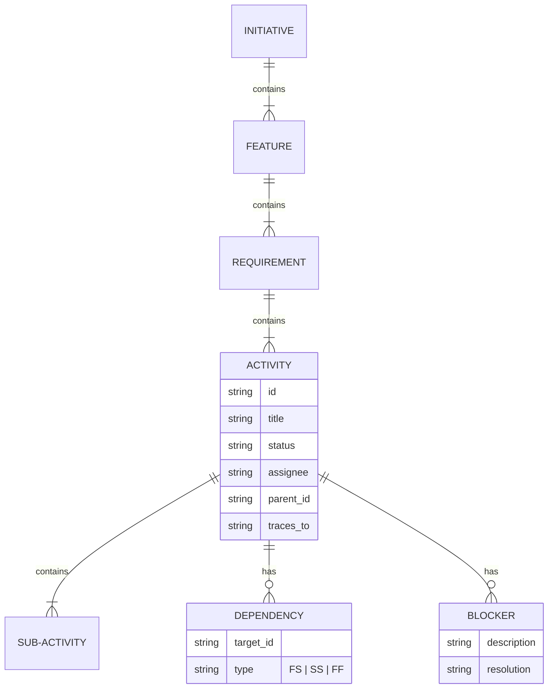
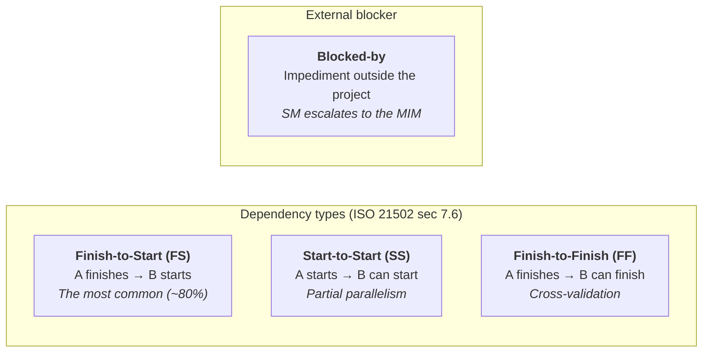
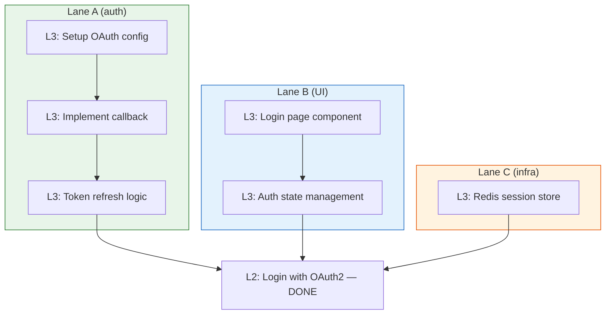
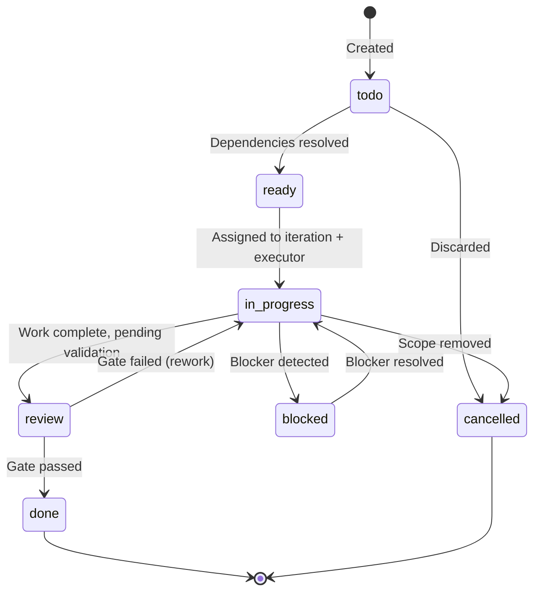

# workItem Hierarchy

← [Main Index](../../README.md) | [Planning](../README.md) | [Artifacts](README.md)

## workItem Hierarchy — Sprints, Epics, Stories, Tasks

The 6 artifacts produce **units of work** at different levels of
granularity. This section defines the universal workItem hierarchy,
its dependencies, and how it enables parallelism in execution mode.

### Why It's Necessary

Without an explicit hierarchy, teams (human or AI) face three
recurring problems:

1. **No parallelism** — without formal dependencies, everything runs
   serially because it is unknown what is safe to parallelize.
2. **No blocker visibility** — impediments are discovered late, once
   they have already blocked the critical path.
3. **No vertical traceability** — you cannot answer "which tasks
   implement this requirement?" or "which epic covers this business
   idea?"

### Universal Levels

The hierarchy has 5 levels. The methodology determines the **names**
and the **ceremonies**, but the levels are constant:

| Level | Universal name | Scrum | Kanban | Shape Up | SAFe |
|-------|-----------------|-------|--------|----------|------|
| L0 | **Initiative** | Theme / Initiative | — | Bet (appetite) | Epic |
| L1 | **Feature** | Epic | Category | Scope | Feature |
| L2 | **Requirement** | User Story | Card | Task (Shape Up) | Story |
| L3 | **Activity** | Task | Sub-card | Sub-task | Task |
| L4 | **Sub-activity** | Subtask | — | — | Subtask |

> **Backing**: the L0→L4 hierarchy reflects the progressive
> decomposition of ISO 21502 sec 7.6 (Schedule Management) and the
> WBS Dictionary of PMBOK/ISO 21511. L0-L1 are deliverable-oriented
> (WBS), L2 is the requirement→work bridge, L3-L4 are
> activity-oriented (Define Activities).

### Who Produces Which Level

| Level | Source artifact | Producing role | Example |
|-------|-----------------|---------------|---------|
| L0 Initiative | `idea.md` | PO | "Authentication system" |
| L1 Feature | `idea.md` / `spec.md` | PO | "Login with OAuth2" |
| L2 Requirement | `spec.md` | PO + QA (ACs) | "As a user I can log in with Google" |
| L3 Activity | `tasks.md` | Dev Lead | "Implement OAuth2 callback handler" |
| L4 Sub-activity | `tasks.md` | Dev Lead | "Parse JWT token from the provider" |

### Universal workItem Schema

Every workItem, regardless of its level, has this schema:

```yaml
work_item:
  id: string          # Unique. Format: {level}-{sequential}. E.g. L2-003
  type: L0|L1|L2|L3|L4
  title: string
  description: string
  parent_id: string?  # Reference to the parent item (hierarchy). null for L0
  artifact_source: string  # Artifact that produced it (idea.md, spec.md, etc.)
  lane: string          # Grouping by feature/skill (auth, UI, infra). Assigned by Dev Lead.

  # — Dependencies and blockers —
  depends_on:         # Other workItems that must complete BEFORE
    - item_id: string
      type: FS|SS|FF  # Finish-to-Start, Start-to-Start, Finish-to-Finish
  blocked_by:         # EXTERNAL impediments (not workItems)
    - id: string
      description: string
      owner: string   # Who can resolve it
      since: date

  # — State —
  state: todo|ready|in_progress|review|blocked|done|cancelled
  iteration: string?  # Sprint N, Cycle N, PI N (per methodology)

  # — Criteria —
  acceptance_criteria:
    - given: string
      when: string
      then: string
  complexity: XS|S|M|L|XL

  # — Traceability —
  traces_to: string[] # IDs of items at other levels (vertical traceability)
  files:                    # Optional. Files this task modifies.
    - src/auth/login.ts     # Used by the Orchestrator to detect overlap
    - src/auth/login.spec.ts # between lanes and decide parallelism vs. serialization.
  methodology_stamp:
    name: string
    iteration: string
```

> **`files` field**: Optional but recommended. The Dev Lead assigns
> it in Phase 4 so the executionOrchestrator can detect file overlap
> between lanes and decide whether to run in parallel (worktrees) or
> serially. If absent, the Orchestrator assumes overlap and
> serializes.

Visual complement: the ER diagram shows the same hierarchy as
entities and relationships, useful for visualizing cardinality at a
glance.



### Dependency Types



**Dependency rules**:

1. Dependencies can be **cross-level** — an L3 can depend on a complete L1.
2. **Circular dependencies are an error** — the SM must detect them
   while building the graph and escalate to the MIM.
3. A **blocker** is an external impediment (a third-party API down, a
   pending stakeholder decision, a license). It is not a workItem —
   it is metadata that freezes the item until resolved.
4. SS-type dependencies enable **partial parallelism** — B can start
   when A starts, not when A finishes.

### Parallelism Detection — The Rule

The Dev Lead produces the dependency graph as part of `tasks.md`
(Phase 4). The orchestrator in execution mode uses that graph to
determine **parallel lanes**:



Alternate view: the Gantt diagram shows the same lanes with a
temporal reading — useful for spotting the critical path (Lane A,
the longest) at a glance.

```mermaid
gantt
    title Lanes and Critical Path Visualization
    dateFormat X
    axisFormat %s
    section Lane A
        Setup OAuth     :a1, 0, 2
        Implement callback :a2, after a1, 3
        Token refresh   :a3, after a2, 2
    section Lane B
        Login UI        :b1, 0, 2
        Auth state mgmt :b2, after b1, 3
    section Lane C
        Redis sessions  :c1, 0, 2
```



**Parallelism algorithm**:

1. Build the DAG (Directed Acyclic Graph) of all workItems with state
   `ready` or `todo`.
2. Identify items with no pending dependencies → **executable now**.
3. Group by the workItem's `lane` field (assigned by the Dev Lead in
   Phase 4) → **lanes**.
4. Calculate the **critical path** (the longest chain of FS
   dependencies).
5. Items outside the critical path have **slack** — they can be
   delayed without affecting the delivery date.

> **Backing**: Critical Path Method (CPM) — ISO 21502 sec 7.6, PMBOK
> "Develop Schedule." The DAG + CPM has been standard in project
> management since 1957 (DuPont/PERT). What the framework contributes
> is making it EXECUTABLE by AI agents.

### workItem State — State Machine



**SM automatic transitions**:

| Event | Transition | Who decides |
|--------|-----------|-------------|
| All FS dependencies of an item are `done` | `todo` → `ready` | SM (automatic) |
| `ready` item assigned to the active iteration | `ready` → `in_progress` | SM |
| subAgent reports work complete | `in_progress` → `review` | SM (via Status Report) |
| Blocker reported by subAgent or MIM | `in_progress` → `blocked` | SM |
| QA/UX/DevSecOps gate approves | `review` → `done` | SM (via PDC) |
| Gate rejects | `review` → `in_progress` | SM (with feedback) |
| MIM cancels scope | any state → `cancelled` | MIM → SM |

### Vertical Traceability

Vertical traceability connects levels and allows answering questions
like:

- "Which tasks implement story L2-003?" → `traces_to` of L3 items
- "Is feature L1-001 complete?" → verify ALL its children are `done`
- "What is the progress of initiative L0-001?" → percentage of
  `done` descendants / total

```plaintext
L0-001: Authentication system
├── L1-001: Login with OAuth2
│   ├── L2-001: As a user I can log in with Google
│   │   ├── L3-001: Setup OAuth config ✓
│   │   ├── L3-002: Implement callback handler [in_progress]
│   │   └── L3-003: Token refresh logic [ready]
│   └── L2-002: As a user I can log in with GitHub
│       ├── L3-004: GitHub OAuth provider [todo]
│       └── L3-005: Unify token handling [todo] (depends_on: L3-003)
└── L1-002: Session management
    └── L2-003: As a user my session persists for 30 days
        ├── L3-006: Redis session store [ready]
        └── L3-007: Session refresh middleware [todo] (depends_on: L3-006)
```

### Iterations — The Temporal Container

Iterations are the **temporal container** where workItems are
assigned. The name and duration depend on the methodology:

| Methodology | Container | Duration | Capacity |
|------------|-----------|----------|----------|
| Scrum | Sprint | Fixed (1-4 weeks) | Velocity-based |
| Kanban | — (continuous flow) | — | WIP limits |
| Shape Up | Cycle | Fixed (6 weeks) | Appetite-based |
| SAFe | PI / Iteration | PI: 8-12 weeks, Iteration: 2 weeks | Capacity allocation |

**What the framework tracks per iteration**:

```yaml
iteration:
  id: string          # sprint-1, cycle-2, pi-1-iter-3
  methodology: string # Whichever is current (locked per iteration)
  state: planning|active|review|closed
  work_items: string[] # Assigned IDs
  capacity: string    # Methodology-specific (story points, appetite, slots)
  goal: string        # Iteration objective
  start_date: date?
  end_date: date?
```

> In Kanban there is no formal iteration — the framework uses a
> pseudo-container "continuous" that groups items by reporting period
> (weekly, biweekly). Metrics (cycle time, throughput) replace
> velocity.

### Impact on `tasks.md` — Artifact Evolution

With the hierarchy defined, `tasks.md` evolves from "flat task list"
to "materialized view of the activity DAG (L3-L4)":

```markdown
# Tasks: {project name}

## workItems (L3-L4)
Each item with the universal schema: id, type, parent_id, depends_on,
blocked_by, state, iteration, acceptance_criteria, complexity.

## Dependency Graph
Complete DAG with types (FS/SS/FF).
Identified parallelism lanes.
Marked critical path.

## Active blockers
Blocked items with impediment, owner, age.

## Iteration summary
Items per state. Parent feature progress.
Parallel lanes available for execution.

## Metadata
- Creation date
- Total items per level and state
- Iteration and current methodology
```

### Impact on `idea.md` and `spec.md`

- `idea.md` produces L0 items (initiatives) and optionally L1
  (features) when the MIM identifies them from the initial input.
- `spec.md` produces L2 items (requirements/stories) with formal
  acceptance criteria. Each L2 traces to its parent L1.

These items are created INSIDE the respective artifacts and are
referenced in `tasks.md` via `traces_to`.

### Impact on `handoff.md`

The handoff includes:

- The complete workItem DAG with its dependencies
- The pre-calculated parallel lanes
- The identified critical path
- The known blockers (so execution mode knows what to avoid)

This allows the executionOrchestrator to start parallel work from the
first moment, without having to analyze dependencies at runtime.
