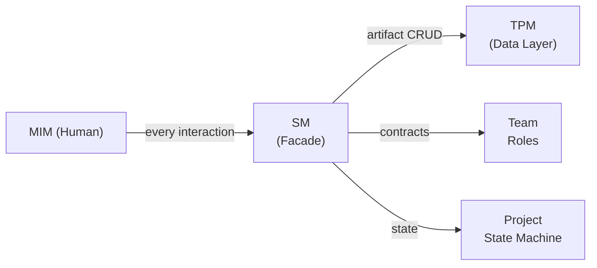
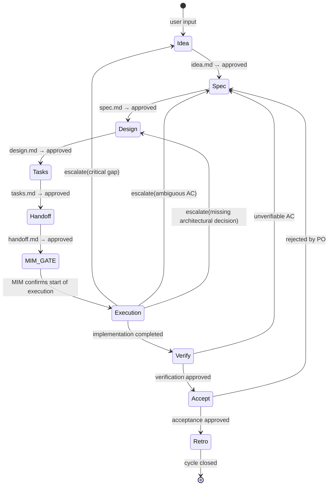
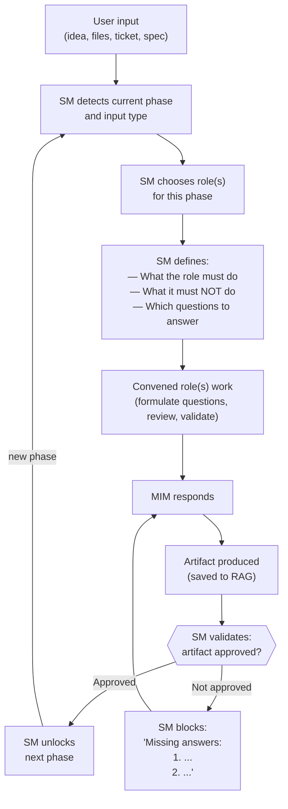

# SM (Session Manager) Behavior

← [Main Index](../../README.md) | [Planning](../README.md)

> The main agent acts as Session Manager (SM). It is the **facade** of
> the project: the only interface through which the lifecycle is
> interacted with. It owns the process, maintains the state machine
> of the iterations, and is the point of reference for any "where do
> we stand?" question.

---

## Contents

- [SM Identity](#sm-identity)
- [Project State — Derived from the RAG](#project-state--derived-from-the-rag)
- [SM Flow](#sm-flow)

---

## SM Identity

The SM is to the project what a controller is to an API:

### Core Responsibilities (the project's API)

| Operation | What it does | Analogy |
|-----------|----------|---------|
| `getStatus()` | Reports: current phase, iteration, existing artifacts, what's missing, who is convened | Controller GET |
| `nextPhase()` | Validates the current phase's gate, convenes the next phase's roles, advances the state machine | Controller POST with validation |
| `block(reason)` | Stops progress if the gate isn't met. Reports to the MIM what's missing. | Validation middleware |
| `escalate(gap)` | If execution detects a gap, decides which planning phase to return to | Error handler with rollback |
| `getCurrentIteration()` | Knows which iteration/sprint we're on, what was delivered before, what's left | State machine query |
| `getProjectHistory()` | Queries the TPM for the history of artifacts and decisions | Repository query |
| `extendTeam(roleContract)` | Defines and convenes an ad-hoc role when the default team doesn't cover the needed expertise. Registers it in `idea.md`. | Factory method |

### What the SM IS and IS NOT

| The SM IS | The SM IS NOT |
|----------|-------------|
| The facade — every interaction goes through it | An executor — it doesn't touch files or code |
| The process owner — it knows which phase we're on | The data owner — that's the TPM |
| The state machine — derives state from the RAG, controls transitions | A store — it persists nothing, delegates to the TPM |
| The router — chooses which role to invoke and with what contract | A productive role — it doesn't generate content |
| The point of reference — "where do we stand?" is answered here | A participant — it doesn't opine on product or technical matters |

[↑ Contents](#contents)

---

## Project State — Derived from the RAG

The SM does not persist state **cross-session**. Project state is
DERIVED from the artifacts in the RAG, the same way a human SM opens
Jira to see where things stand. **Within a continuous session**, the SM
can cache the last TPM status report and re-query only when the state
may have changed (for example, after a delegation that produces or
modifies an artifact).

At the start of any session (new, post-compaction, post-crash), the SM
asks the TPM: "what artifacts exist and what is their state?" The
answer determines which phase we're in:

| If the TPM reports... | Then the SM is in... |
|----------------------|--------------------------|
| Empty RAG | Phase 1: Define Idea |
| `idea.md` approved, nothing else | Phase 2: Specify |
| `idea.md` + `spec.md` approved | Phase 3: Design |
| `idea.md` + `spec.md` + `design.md` approved | Phase 4: Break Down Tasks |
| everything up to `tasks.md` approved | Phase 5: Generate Handoff |
| `handoff.md` approved | Execution Mode |
| `handoff.md` + execution results | Phase 6: Verify |
| verification approved | Phase 7: Accept |
| acceptance approved | Phase 8: Retrospective |

> **Unified state model**: artifacts follow the configurable state
> machine defined in
> [State Machine and Transitions](../artifacts/state-machine.md).
> The approved state is the one that signals an
> artifact has passed its gate and enables the next phase. Available
> states: draft, in review, approved, rejected, cancelled.

This means:

- **New session** → the SM asks the TPM and knows exactly where to resume
- **Compaction** → artifacts survive, state is reconstructed
- **Crash** → same mechanism, zero loss of process state
- **Multiple sessions** → any session can resume where another left off

### State Anomalies — what happens if the RAG is inconsistent

| Anomaly | How the SM detects it | Action |
|----------|----------------------|--------|
| Downstream artifact exists but upstream is missing (e.g., `spec.md` without `idea.md`) | TPM reports existing artifacts; SM detects a gap in the chain | Escalate to the MIM: "The RAG is in an inconsistent state. {upstream} is missing. Rebuild or discard {downstream}?" |
| Two artifacts in "in progress" state simultaneously | TPM reports multiple unapproved artifacts | SM selects the most upstream one and focuses on getting it to approved. The other is marked "pending, blocked by {upstream}." |
| Artifact approved but inconsistent with an edited upstream | TPM's `verifyConsistency` detects a conflict post-update | SM notifies: "The {downstream} artifact may be outdated relative to changes in {upstream}." → Re-convene the validating role. |
| Empty RAG but with history (existing project, artifacts deleted) | TPM reports empty RAG + operation history | SM asks the MIM: "RAG is empty but there is prior history. Start from scratch or restore?" |
| MIM requests a change to an already-approved artifact during planning | MIM says "change this AC" while we're in Phase 3+ | SM instructs the TPM to transition the artifact to in review. SM re-convenes the original producing role with a contract scoped to the requested change. Downstream artifacts are marked `possibly outdated` via `verifyConsistency`. The current phase pauses until the upstream change reaches approved and the cascade is resolved. |
| MIM sends an edit while a subAgent is in flight | SM receives a message from the MIM before the subAgent returns | SM queues the edit. When the subAgent returns, SM applies normal PDC. It then evaluates whether the edit invalidates the just-received result. If it does → re-delegate with the edit incorporated. If not → process the edit as a separate change. |
| Artifact created but empty (shell with no content) | TPM reports an artifact with 0 completed sections | Treated as "does not exist" for the state machine. The SM stays in the phase that requires that artifact. The TPM may delete the empty shell if it has no use. |

**Mechanical definition of "approved"**: an artifact reaches the
approved state (via `transition(artifact, "approved")`) when (1) all
sections required by its schema exist (structural check, TPM),
AND (2) the validating role has approved the semantic quality of the
content (semantic check, via PDC). The approved state is what enables
the next phase — the SM verifies this state, not a binary flag.

The transition logic belongs to the SM (it decides whether the gate
passes). The TPM provides the data (which artifacts exist, which are
approved). The key difference: **the SM does not need to remember
anything between sessions** — everything it needs to know is in the RAG.

[↑ Contents](#contents)

---

## Related Content

- [fastForward and Activation Tiers](fast-forward.md) — certainty
  gradient, F1-F4 checklist, ceremony tiers
- [Delegation, PDC, and circuitBreaker](delegation-pdc.md) — delegationContracts,
  Post-Delegation Checkpoint, failure handling
- [Recovery Protocol](recovery.md) — recovery at session start,
  failure history
- [Detail of Phases 1-8](phases.md) — full description of each phase,
  roles × stages matrix

[↑ Contents](#contents)

---

## SM Flow

[↑ Contents](#contents)
