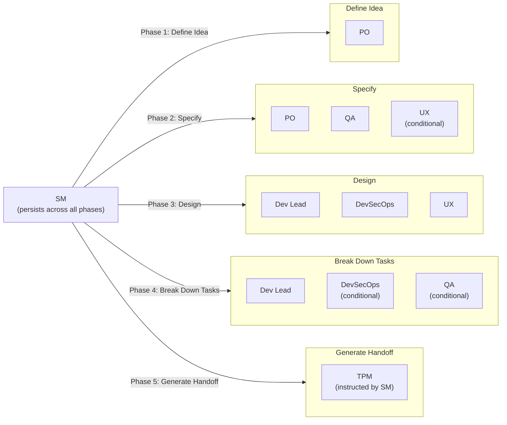
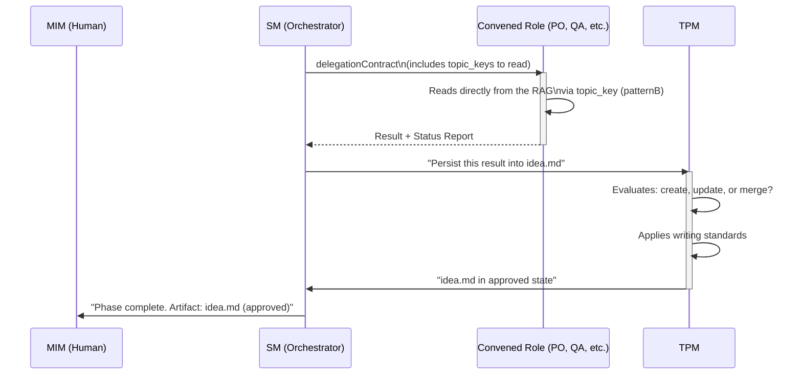
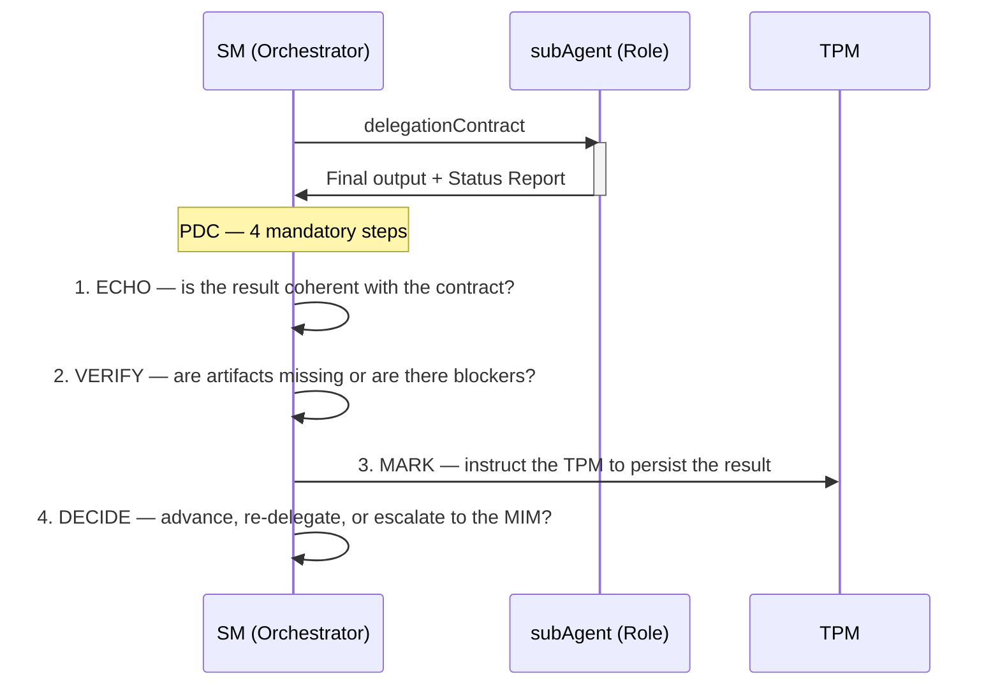
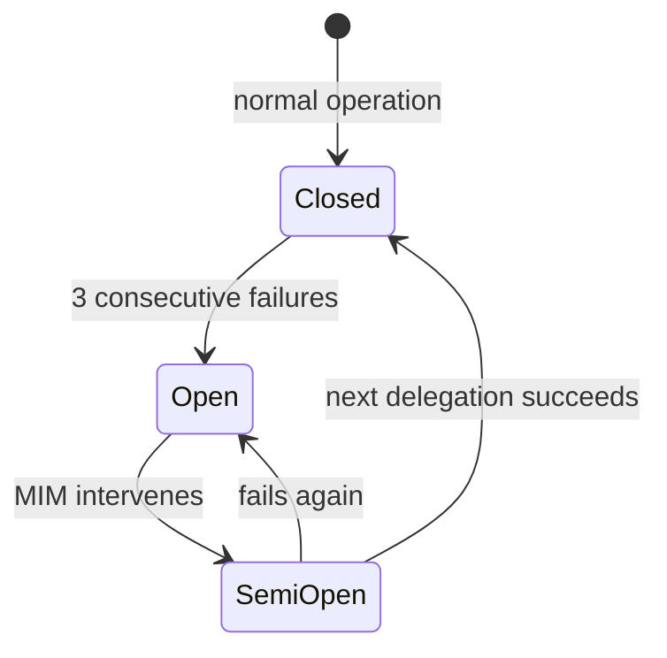
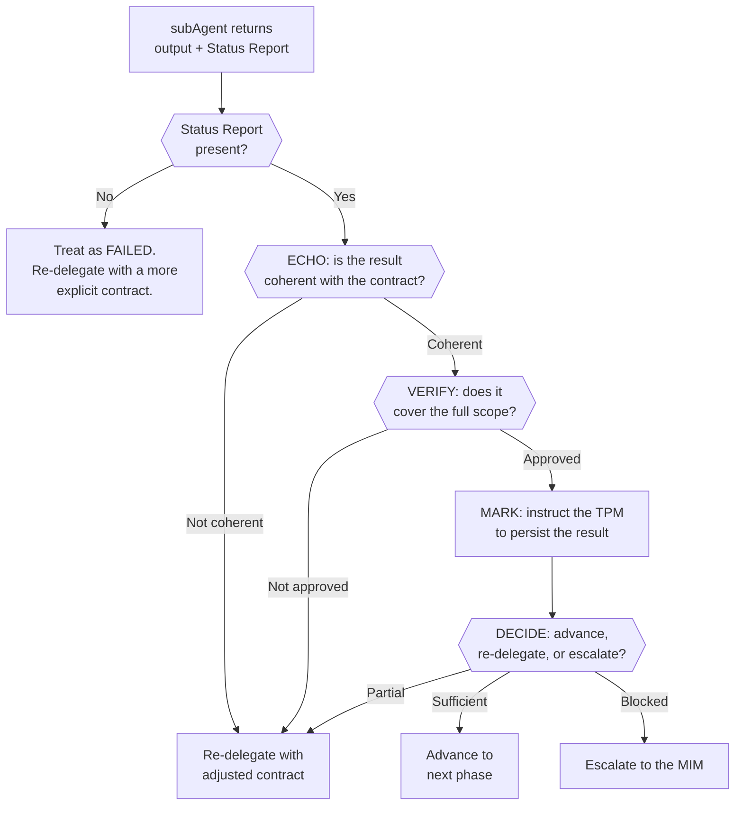

# Delegation, PDC, and circuitBreaker

← [Main Index](../../README.md) | [Planning](../README.md) | [SM Behavior](README.md)

---

## Contents

- [Principle](#principle)
- [Convocation Map by Phase](#convocation-map-by-phase)
- [Conditional Activation Rules](#conditional-activation-rules)
- [Cardinal rule: the SM NEVER touches files, ALWAYS delegates](#cardinal-rule-the-sm-never-touches-files-always-delegates)
- [The TPM: operational manager of the RAG](#the-tpm-operational-manager-of-the-rag)
- [Protocol when the MIM cannot respond](#protocol-when-the-mim-cannot-respond)
- [delegationContract to subAgents](#delegationcontract-to-subagents)

---

## Principle

The SM does NOT produce content artifacts. The SM:

1. **Detects** what phase the project is in
2. **Convenes** the team roles (default or ad-hoc) that correspond to that phase
3. **Extends** the team with ad-hoc roles when the project requires expertise outside the default team
4. **Scopes** the function of each convened role (what we expect, what NOT)
5. **Validates** that the output artifact ends up approved (via TPM)
6. **Blocks** progress if the gate is not met
7. **Unblocks** the next phase when the artifact is sufficient
8. **Tracks** the current iteration, history, and escalations

The SM is the ONLY role that persists across all phases. The other
roles (default and ad-hoc) come and go as each phase requires them.

---

[↑ Contents](#contents)

## Convocation Map by Phase

The SM convenes different roles depending on the phase. Each role has
a scoped function and an expected deliverable. The roles listed below
are the **default** team. The SM can add ad-hoc roles to any phase
when the project requires it (see [Ad-Hoc Roles](../roles/ad-hoc.md)).



---

[↑ Contents](#contents)

## Conditional Activation Rules

Not all roles are activated always. The SM decides based on context:

| Condition | Roles activated |
|-----------|---------------------|
| Project without a user interface (pure API, CLI, library) | UX is NOT convened at any stage |
| Project without special security requirements | DevSecOps is convened only in Design (minimum) |
| Single-developer project (low tier) | SM + PO in Idea, SM + Dev Lead in Design, rest condensed |
| Tech challenge with a timebox | SM extracts process rules in Phase 1. All phases are compressed. |

The SM evaluates the project context in Phase 1 and decides which
default roles to activate and whether ad-hoc roles are needed. This
decision is re-evaluated mid-cycle if the scope changes (see
[Conditional Activation Rules](../roles/profiles-by-phase.md#conditional-activation-rules)).
Everything is documented in `idea.md` as "roles
active for this project" — both the activated default roles and
any ad-hoc role with its justification.

---

[↑ Contents](#contents)

## Cardinal rule: the SM NEVER touches files, ALWAYS delegates

The SM (the main agent) does not read files, does not write files,
does not edit files, does not execute commands, does not produce
artifacts. **ZERO exceptions.** Not even the handoff — that is also
done by a subAgent.

The SM only does three things:

1. Orchestrate (convene roles, define contracts, validate gates)
2. Communicate with the MIM (ask, report, block)
3. Decide which subAgent to launch and with what contract

Any temptation to "just do it quickly myself" is exactly the
rationalization that causes drift. If it needs to be done, it needs
to be delegated.

> **Clarification**: "Never reads files" means the SM never processes
> raw artifacts from the artifactStore. The SM DOES process: (1) TPM
> state summaries, (2) structured subAgent reports (PDC status
> reports), (3) transition metadata. The distinction is:
> raw artifacts → never; processed/summarized information → yes.

---

[↑ Contents](#contents)

## The TPM: operational manager of the RAG

There is a permanent subAgent that is NOT part of the team: the
**TPM (Technical Program Manager)**. It is the operational owner of the
RAG and the bridge between the team's decisions and their materialization as artifacts.

The TPM is NOT a dumb data funnel. It has its own judgment for:

- **Writing standards** — ensures artifacts meet format,
  structure, and quality. If a role returns a disorganized result, the TPM
  structures it before persisting it.
- **CRUD operations on the RAG** — decides whether an artifact requires
  creation, update (upsert), or in exceptional cases, deletion.
  Transitions artifacts to approved when appropriate.
- **Scoped context for agents** — when the SM or a role needs
  information from the RAG, the TPM serves the correct slice. It does not return "everything",
  it returns what is relevant to the active contract.
- **Completeness tracking** — knows which artifacts exist, which are
  approved, which have gaps. Reports state to the SM.
- **Release readiness** — in final phases, verifies that all
  necessary artifacts are approved and consistent with each other before
  the SM declares the handoff ready.

By default, read access follows **patternB**: the SM does not
intermediate RAG content toward the convened role. The delegationContract
includes the `topic_keys` the role needs, and the
subAgent itself reads them directly against the RAG. The TPM only
intervenes to persist (write), not to serve reads. patternA — the TPM
serving a curated slice — is reserved for exceptional cases (see
the operations table below).



| Aspect | Detail |
|---------|---------|
| **Name** | TPM (Technical Program Manager) |
| **Part of the team** | NO — it is permanent operational infrastructure |
| **Personality** | Rigorous, methodical, with editorial judgment. Maintains standards without imposing product or technical opinion. |
| **Responsibilities** | RAG CRUD, writing standards, scoped context serving, completeness tracking, release readiness |
| **When it is invoked** | Every time something must be persisted, read, or verified in the RAG |
| **Heartbeat** | Notifies operation performed + artifact state (draft/in review/approved/gaps) |

### TPM operations on the RAG

| Operation | When | Example |
|-----------|--------|---------|
| **Create** | First time a phase produces an artifact | `idea.md` doesn't exist → the TPM creates it with structure and standards |
| **Update** | A phase completes missing information or corrects something | QA identifies an ambiguous AC → the TPM updates `spec.md` |
| **Transition** | The SM validates that the gate passed and transitions the artifact | Gate approved → `transition("idea", "approved", "gate passed")` |
| **Read** | When an agent needs information | subAgent reads directly via `topic_key` (patternB). The TPM does not intervene in reads. |
| **Serve context** | Only for patternA (8+ consumers or fuzzy search) | Default: agents read directly. The TPM only serves curated slices in exceptional high-fan-out scenarios. |
| **Verify consistency** | Before generating the handoff AND after any Update to an upstream artifact | The TPM reviews that downstream artifacts don't contradict the edited upstream. Reports stale artifacts to the SM. |
| **Delete** | Exceptional. Obsolete or duplicate artifact. | Rare — the TPM documents the reason |

---

[↑ Contents](#contents)

## Protocol when the MIM cannot respond

If the MIM responds "I don't know" or "you decide" to a gate question:

1. The PO (or active role) formulates an **explicit assumption** based on
   available context and best practices.
2. The assumption is recorded in the corresponding artifact → in the
   "Decisions made" section with flag `[ASSUMPTION — pending validation]`.
3. The gate is satisfied with the documented assumption — the flow does NOT
   block indefinitely.
4. In Phase 6 (Verify), QA reviews the flagged assumptions and
   validates whether they were correct post-implementation.
5. If the assumption turns out to be incorrect → the SM escalates to
   the MIM with concrete evidence: "We assumed X, but the implementation
   showed Y. Decision required."

### Decision classification by risk

To escalate efficiently in an operating model with multiple
agents, the SM classifies pending decisions by risk level:

| Level | Criterion | SM action |
|-------|----------|---------------|
| Low | Reversible, well-defined, existing precedent | Resolves autonomously, documents the assumption, notifies the MIM asynchronously |
| Medium | Partially reversible, no clear precedent | Presents options with a recommendation to the MIM |
| High | Irreversible, architectural, no precedent | Blocks until the MIM responds |

This classification complements the existing delegation protocol and
allows the MIM to manage multiple projects without becoming a
bottleneck.

---

[↑ Contents](#contents)

## delegationContract to subAgents

Every time the SM convenes a subAgent, it MUST define an
explicit contract with these fields:

### Required contract fields

| Field | Description | Example |
|-------|-------------|---------|
| **Role** | Which team role it represents | `PO`, `QA`, `Dev Lead` |
| **Personality** | How the subAgent behaves (tone, focus, priorities) | "Rigorous about testability, skeptical of vague ACs" |
| **Context** | What information it receives from the RAG (and ONLY that) | `idea.md` for the spec phase |
| **Input** | What it is asked to do, with a scoped boundary | "Validate that every AC in spec.md is verifiable" |
| **Expected output** | What form the result it must return takes | "List of ACs with verdict: verifiable / not verifiable + reason" |
| **Status Report** | Mandatory format in the subAgent's output | Status/Progress/Blocker block at the end |

### Post-Hoc Supervision (proven pattern)

subAgents are fire-and-forget: the SM launches them and receives the
final result. There is NO bidirectional real-time channel. Supervision is
**reactive**: it is evaluated AFTER each return, not during execution.

This pattern is empirically validated in projects that preceded this
framework.

> **Trust but verify**: The PDC and the circuitBreaker are the
> equivalent of "trust but verify" adapted to AI agents. It is not
> distrust — it's that subAgents lack persistent memory and shared
> context, so post-hoc verification substitutes for the interpersonal
> trust that exists in human teams.

#### 1. Mandatory Status Report

Every subAgent MUST include this block in its final output:

```plaintext
Status: [SUCCESS | PARTIAL | FAILED | BLOCKED]
Progress: X/Y items completed
Blocker: (if applicable — what stopped it)
Artifacts: (what it produced — list of changes or decisions)
```

Without this block, the SM treats the result as FAILED.

#### 2. Post-Delegation Checkpoint (PDC)

After EVERY subAgent return, the SM executes 4 mandatory steps:



The PDC is NOT optional. No other subAgent can be launched without having
completed the 4 steps of the previous PDC.

> **VERIFY now includes strength, not just existence**: the VERIFY
> step of the PDC no longer settles for confirming that a test
> exists for a task — the binding layer (TPM) tracks that
> existence as traceability, but the test's strength (does it
> catch real regressions?) requires `virgil verify`. The `virgil
> verify` scan runs mutation testing, computes the CRAP score, and
> measures cyclomatic complexity over the code and tests affected by
> the delegation. A workItem NEVER reaches the `verified` confidence
> level just because the TPM recorded a task↔test link — that
> level is granted only after `virgil verify` confirms the scan. Before
> that confirmation, the maximum possible state is `traced` (link
> recorded, strength not yet evaluated).

```plaintext
confidence levels:
  untested   → no test associated with the task
  traced     → a test is associated (TPM binding), strength not evaluated
  verified   → virgil verify confirmed the scan (mutation/CRAP/complexity within the tier's threshold)
```

**Exception: Phase 7 (Accept) — parallel launch.** In Phase 7,
acceptance roles vote in parallel (see
[Contracts by Phase](../roles/profiles-by-phase.md)). This includes the
active default roles (3-5) plus any ad-hoc role the SM has declared
as a voting member in its contract. Ad-hoc roles without a declared
vote participate as **advisory** — they provide an opinion the SM considers,
but have no BLOCK power. The SM launches all delegations
simultaneously and applies PDC to each result as it arrives. If a vote
is missing (timeout, crash, no Status Report), it is treated as implicit BLOCK and
only that role is re-delegated. Merging votes requires a simple majority; a
BLOCK from any voting member halts progress until resolution.

**Tiebreaker**: if the voting panel is even and there is a tie between
APPROVE and REQUEST CHANGES (with no BLOCK), the SM escalates to the MIM with
both sides' positions. The MIM decides. In the absence of a MIM response,
REQUEST CHANGES is applied as the conservative default.

#### 3. circuitBreaker

If 3 consecutive delegations to the same role fail (Status: FAILED):

1. The SM halts the chain
2. Escalates to the MIM: "Role X failed 3 consecutive times. Context: [...]
   Redefine the contract, change approach, or continue manually?"
3. There is NO automatic retry after the third failure

**Cap for PARTIAL without progress**: if 3 consecutive re-delegations to
the same role return PARTIAL with the same progress (X/Y unchanged), the
SM treats the third as FAILED and applies the circuitBreaker. Stalled
progress is equivalent to failure.

**Counter scope**: the consecutive-failure counter is per
**session**. If there is compaction, a crash, or a new session, the counter
resets to 0. This is intentional: cross-session, the TPM maintains a
history of failed delegations as metadata on the affected artifact,
and the SM can query it at the start of a session to adjust
strategy (see [recovery.md](recovery.md) section "Failure
History"). The circuitBreaker is NOT context-resilient in the sense of
surviving compaction — it is an intra-session protection mechanism.

> **Mandatory history rule**: If an artifact accumulates 3+ historical
> failures of the same type (queried via `history(artifact)`), the SM
> MUST escalate to the MIM before re-delegating. This query is not
> advisory — it is mandatory in the recovery protocol.



#### 4. Context Resilience

Supervision survives loss of context (end of session, compaction,
crash) because:

- **Artifacts are the memory** — project state is derived from the
  RAG, not from the SM's context
- **Rules travel as text** — compactRules are injected into the
  subAgent's delegationContract, they don't depend on the SM retaining context
- **Skill resolution feedback** — subAgents report whether they received
  the rules correctly (`injected` / `self-loaded` / `none`). If
  they report `none`, the SM knows it lost context and must re-resolve

### Example of a complete contract

```plaintext
delegationContract:
─────────────────────────────────────────────
Role:           QA
Personality:    Skeptical. Assumes ACs are poorly written until
                proven otherwise. Prioritizes verifiability over
                completeness.
Context:        Read spec.md from the RAG (docs/)
Input:          Validate that each AC in spec.md is verifiable with a
                concrete test. Identify ambiguous ACs.
Output:         For each AC:
                - verdict: verifiable | not verifiable
                - if not verifiable: what's missing to make it so
                - rewording suggestion (if applicable)
Status Report:  Mandatory. Format:
                Status: SUCCESS|PARTIAL|FAILED|BLOCKED
                Progress: X/Y ACs reviewed
                Blocker: (if applicable)
                Artifacts: list of verdicts produced
─────────────────────────────────────────────
```

### Output validation (integrated into the PDC)

Output validation is the ECHO + VERIFY step of the PDC. The SM evaluates
the output + status report together:



> **semanticDrift in VERIFY**: the VERIFY step not only validates
> structural completeness — it also verifies that the content of
> the produced artifact is semantically consistent with the upstream
> artifacts. The TPM runs `verifyConsistency` in semantic mode to
> detect contradictions (critical drift) or additions without
> traceability (minor drift). If critical drift is detected, the SM
> blocks approval and re-delegates. If minor drift is detected, the SM
> consults the MIM before proceeding. See
> [semanticDrift Detection](../artifacts/state-machine.md#semanticdrift-detection)
> for the full definition of indicators and severity levels.

### What happens when a subAgent fails

| Status Report | SM action |
|---------------|--------------|
| FAILED | Evaluate: was the contract clear? If not → improve the contract, re-delegate. If yes → re-delegate with a more scoped boundary. Increment the circuitBreaker counter. |
| PARTIAL | Re-delegate ONLY the missing part, passing what was completed as context. Does NOT increment the circuitBreaker (the agent did work). |
| BLOCKED + Blocker described | Evaluate whether the blocker is resolvable by the SM (re-route) or requires the MIM (escalate). |
| BLOCKED without Blocker | Treat as FAILED. |
| No Status Report | Treat as FAILED. Re-delegate with explicit instructions on the required format. |
| SUCCESS but incoherent output | ECHO fails. Re-delegate with a more scoped contract. Increment the circuitBreaker. |

[↑ Contents](#contents)
