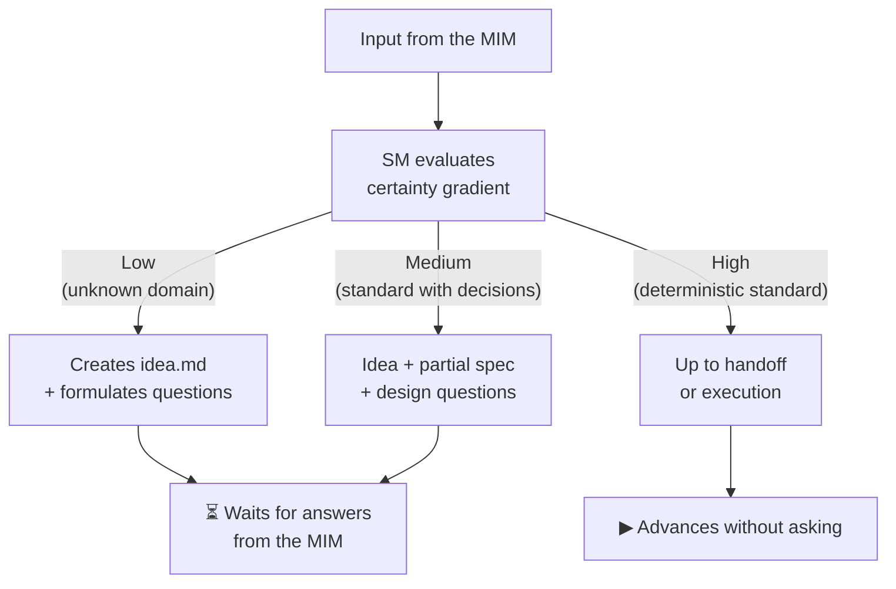
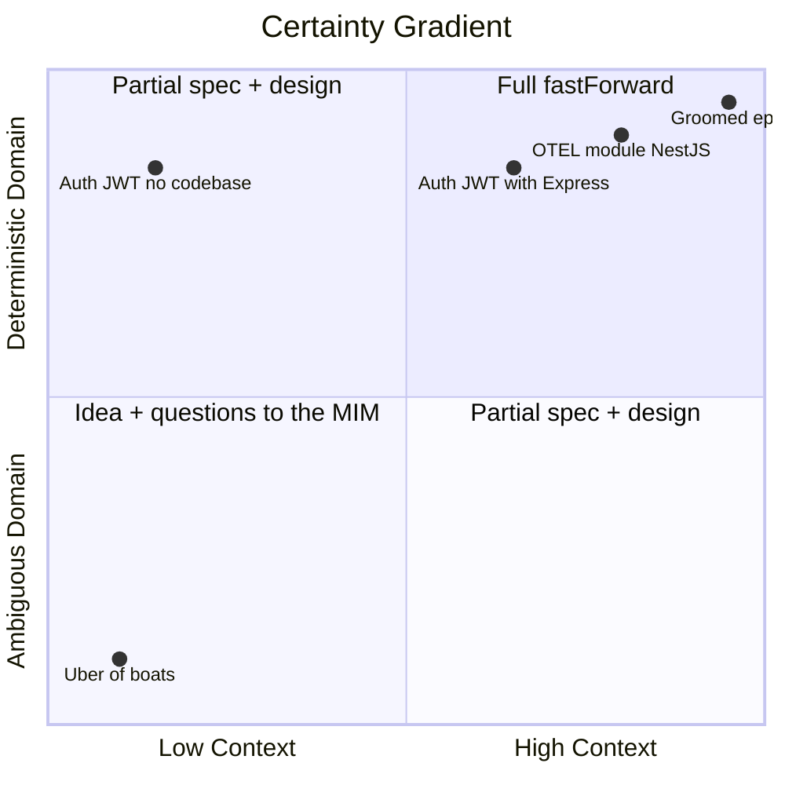
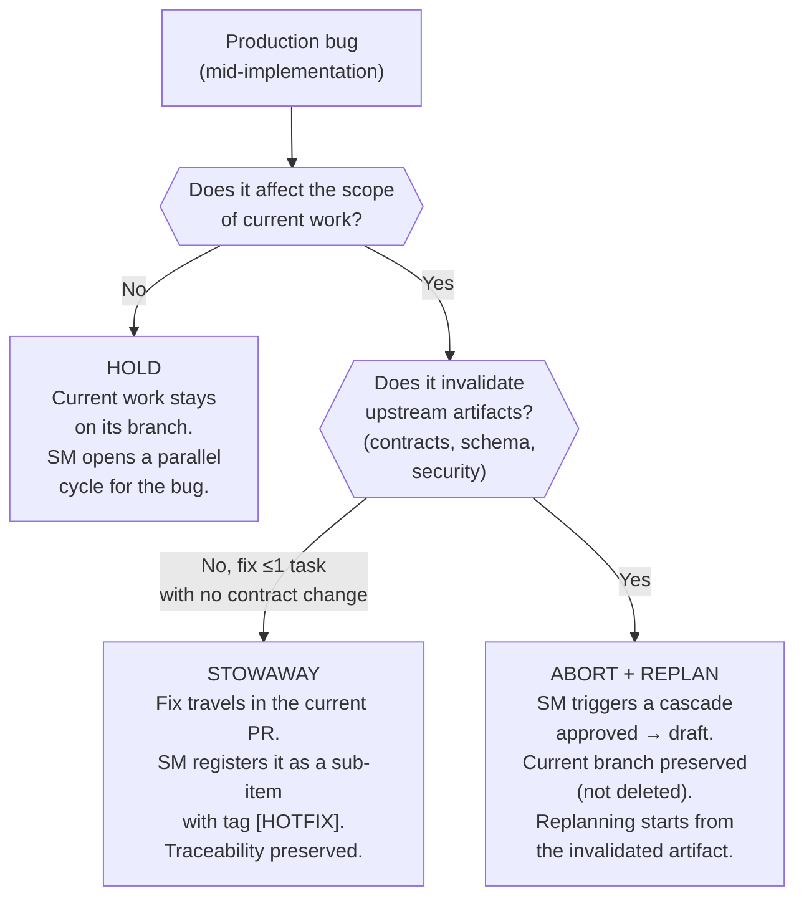
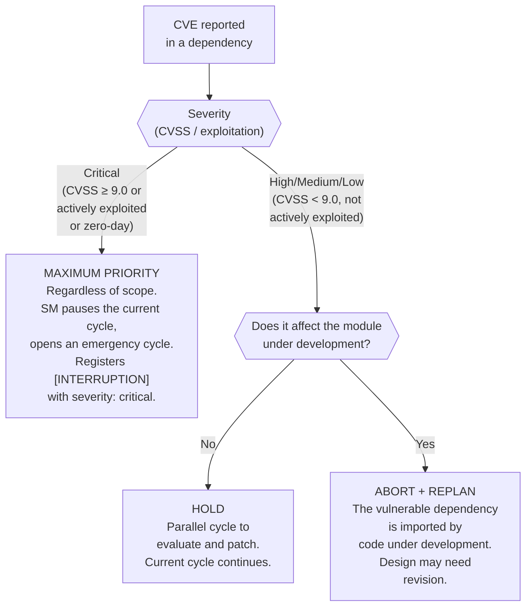
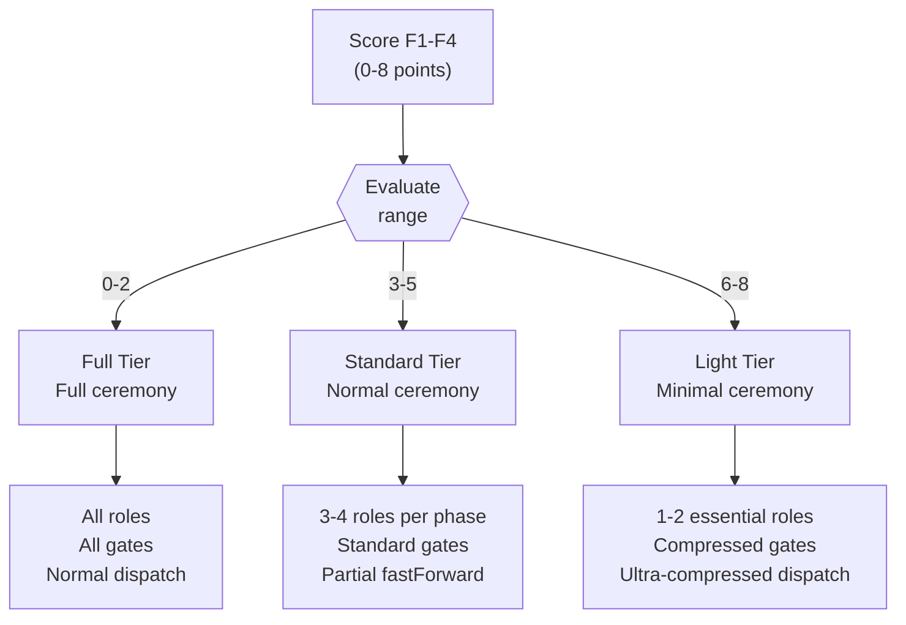

# fastForward and Activation Tiers

← [Main Index](../../README.md) | [Planning](../README.md) | [SM Behavior](README.md)

## Contextual fastForward — Certainty Gradient

The SM does not always advance one phase at a time. Upon receiving an
input, it evaluates **how deterministic the solution is given the
existing context** and advances proportionally:



### Gradient rules

| Certainty | SM criterion | How far it advances | Example |
|---------|-----------------|--------------------|---------|
| **Low** | Unknown domain, ambiguous requirements, no existing app | Idea + questions | "Build me the uber of boats" |
| **Medium** | Known standard but with pending decisions | Idea + partial spec + specific questions | "Add auth with JWT" |
| **High** | Open standard, existing app in the RAG, well-defined patterns | Up to handoff or direct execution | "Create an OTEL module" |

### Who decides

**The SM decides autonomously** using a 4-factor checklist.
It is not the MIM who says "go in fastForward" — the SM evaluates and decides.

### Certainty checklist (mandatory, auditable)

The SM evaluates 4 factors and assigns 0, 1, or 2 points to each:

| Factor | 0 points | 1 point | 2 points |
|--------|----------|---------|----------|
| **F1. Existing artifacts** | Empty RAG | 1-2 upstream artifacts | spec + design + tasks approved |
| **F2. Standardization** | Custom domain without a standard | Standard with variants (auth, API) | Pure open standard (OTEL, i18n, linting) |
| **F3. Domain ambiguity** | Infinite interpretations ("uber of X") | Bounded domain with pending decisions | Deterministic domain (adding module X to an existing app) |
| **F4. Existing reference** | No codebase or precedent | Codebase exists but doesn't cover this domain | Codebase with patterns/stack that apply directly |

> **Note on F1**: an artifact that exists but is not approved
> counts as 0.5 points. "Not approved" = the TPM reports that
> required sections are missing or that the artifact is in draft/in review.
> **Cap**: the sum of points for unapproved artifacts has a ceiling
> of **1 point** for F1, regardless of how many exist. This
> prevents N incomplete drafts from reaching the same score (F1=2)
> as validated, approved artifacts. To reach F1=2, the
> upstream artifacts must be approved.

**Thresholds**:

| Total score | Certainty | How far it advances |
|-------------|---------|-------------------|
| 0–2 | **Low** | Idea + questions to the MIM |
| 3–5 | **Medium** | Idea + partial spec + specific questions |
| 6–8 | **High** | Up to handoff or direct execution |

**The SM MUST record the score in its reasoning** (not just the
conclusion) so the decision is auditable:

> *"F1=0 (empty RAG), F2=1 (JWT is a standard with variants), F3=1
> (auth is bounded but there are decisions), F4=2 (existing codebase
> with Express). Total: 4 → Medium. Advancing to idea + partial spec."*

The SM instructs the TPM to persist the F1-F4 score and the reasoning in
`idea.md` "Decisions made" section as an entry with format:
`[FASTFORWARD] F1={n}, F2={n}, F3={n}, F4={n}. Total={n} → {certainty}.
Reason: {summary}.` This guarantees cross-session auditability.

### Resolved boundary examples

| Input | F1 | F2 | F3 | F4 | Total | Certainty | Action |
|-------|----|----|----|----|-------|---------|--------|
| "Build me the uber of boats" | 0 | 0 | 0 | 0 | 0 | Low | Idea + questions |
| "Add auth with JWT" (no codebase) | 0 | 1 | 1 | 0 | 2 | Low | Idea + questions |
| "Add auth with JWT" (existing Express codebase) | 0 | 1 | 1 | 2 | 4 | Medium | Idea + partial spec |
| "Create an OTEL module" (codebase with NestJS) | 0 | 2 | 2 | 2 | 6 | High | Up to handoff |
| "Epic X already groomed" (spec+design+tasks in RAG) | 2 | 2 | 2 | 2 | 8 | High | fastForward to execution |
| "Implement payments with Stripe" (no codebase) | 0 | 1 | 1 | 0 | 2 | Low | F2=1: Stripe is a standard BUT it has variants (checkout, elements, custom). F3=1: payments is bounded but requires decisions (currency, subscriptions, webhooks). |
| "Add logging with Winston" (existing Node codebase) | 0 | 2 | 2 | 2 | 6 | High | F2=2: Winston is an open standard without significant variants. F3=2: logging is deterministic — configuration, transports, format. |
| "Migrate from REST to GraphQL" (existing API) | 1 | 1 | 0 | 2 | 4 | Medium | F2=1: GraphQL is a standard BUT every migration is different. F3=0: infinite interpretations — which endpoints to migrate, schema design, N+1. |
| "Add OAuth authentication" (existing Python/FastAPI codebase) | 0 | 1 | 1 | 2 | 4 | Medium | Idea + partial spec |
| "Refactor the reports module" (Go codebase with defined patterns) | 1 | 2 | 2 | 2 | 7 | High | Up to handoff |

> **Note on stack agnosticism**: the examples in this table use
> specific stacks (Express, NestJS, Winston, FastAPI, Go) only to
> illustrate the reasoning with concrete context. The F1-F4 scoring and the
> certainty gradient rules are stack-agnostic — they apply
> equally to any language, framework, or ecosystem.

Alternative view: the quadrant chart places each example according to how much
context exists (X axis) and how deterministic the domain is (Y axis) — the
cases in the upper-right quadrant are the natural candidates for
full fastForward.



### fastForward also applies MID-CYCLE

Not only at the start. Examples:

- **Bug in production** → MIM says "this broke" → SM orchestrates:
  reproduce → diagnose → fix → promote to the appropriate environment.
  It does not go through Idea → Spec → Design.
- **Already-groomed epic** → everything in the RAG → SM detects approved
  artifacts → fastForward directly to execution.

> **Entry contract for bug fastForward**: execution
> requires `handoff.md` as the standard entry contract. For bug fixes
> escalated from operation or detected mid-cycle, the diagnostic context
> (bug description, reproduction steps, affected area) acts as
> the entry contract to execution instead of a formal `handoff.md`.

---

## Interruption Protocol (mid-implementation)

`fastForward` MID-CYCLE resolves how the SM prioritizes an external event
(production bug, CVE, contract change) that arrives while a cycle
is already in execution. But prioritizing is not the same as deciding what happens
to the in-progress work. This section defines the SM's decision tree
for that interruption.



### Interruption strategies

| Strategy | Conditions | Risk | SM action |
|------------|-------------|--------|----------------|
| **Hold** | Bug independent of the current scope | Current branch ages if the bug takes a while | Open a parallel cycle. Register `[INTERRUPTION]` in `idea.md`/`plan.md` of the current cycle |
| **Stowaway** | Bug in the same domain AND fix ≤1 task AND doesn't change contracts | Contaminates the PR's scope; `verifyConsistency` must detect drift | Register a sub-item with `[HOTFIX]` in the handoff. The fix goes through the current cycle's echo |
| **Abort + Replan** | Bug invalidates assumptions (schema, contracts, security) | Potentially lost work | Cascade `approved → draft` on affected artifacts. Branch preserved for cherry-pick post-replan |

### Mandatory gate: [INTERRUPTION] registration

The SM MUST register the interruption decision and its reasoning as an
`[INTERRUPTION]` entry in the current cycle's `idea.md` or `plan.md`,
with the same cross-session auditability criteria that applies to the
`[FASTFORWARD]` score. Format:

`[INTERRUPTION] Strategy: {hold|stowaway|abort}. Reason: {summary}.`

Without this record, the interruption is not traced and `verifyConsistency`
cannot reconstruct why the cycle changed shape.

### Special interruption cases

#### CVE in a dependency (compromised supply chain)

A CVE (Common Vulnerabilities and Exposures) reported in a
project dependency while a cycle is in execution is a case
of compromised supply chain. The SM's response depends on two axes:
**severity** and **scope**.



| Severity | Scope | Strategy |
|-----------|-------|------------|
| **Critical** (CVSS ≥ 9.0 or actively exploited or zero-day) | Any | Maximum priority. The SM pauses the current cycle and opens an emergency cycle. Scope evaluation does not apply — an actively exploited RCE in any dependency is an emergency regardless of whether the affected module is the one being implemented. |
| High/Medium/Low (CVSS < 9.0) | Does not affect the current module | **Hold**. Parallel cycle to evaluate and patch. |
| High/Medium/Low (CVSS < 9.0) | Affects the current module | **Abort + Replan**. The work in progress may be built on an insecure surface. |

Updating the dependency may also require contract changes if the
package's API changed between the vulnerable version and the
patched version. In that case, the SM treats the contract change as
`semanticDrift` (see [semanticDrift detection](../artifacts/state-machine.md#semanticdrift-detection))
over `design.md`, regardless of the chosen strategy.

---

## Activation Tiers

The SM determines the **ceremony tier** at the start of each cycle using the
fastForward score (F1-F4). The tier defines how much ceremony is applied,
not which artifacts are produced — the artifacts are universal.



### Tier table

| Tier | Score | Ceremony | Roles | Dispatch | Ideal for |
|------|-------|-----------|-------|----------|------------|
| **Light** | 6-8 | Minimal. The SM can compress multiple phases into a single delegation. | 1-2 roles (strictly necessary for the phase) | Compressed or ultra-compressed | Bugs, already-groomed epics, pure open standard |
| **Standard** | 3-5 | Normal. Sequential phases with partial fastForward possible. | 3-4 roles depending on the phase | Normal | New features, bounded domain with pending decisions |
| **Full** | 0-2 | Total. Every phase executed, every role convened, every gate enforced. | All default roles + possible ad-hoc | Normal (no compression) | New products, high ambiguity, regulated, mission-critical |

### What changes by tier

| Aspect | Light (6-8) | Standard (3-5) | Full (0-2) |
|---------|--------------|----------------|----------------|
| **Roles per phase** | 1-2 essential | 3-4 depending on phase | All + ad-hoc |
| **Gates** | Compressed (SM validates inline) | Standard (full PDC) | Strict (PDC + cross-validation) |
| **Dispatch** | Ultra-compressed: multiple phases in one delegation | Normal: one phase per delegation | Normal: one phase per delegation, no omissions |
| **Handoff smoke test** | Omissible if the context is deterministic | Required | Required + adversarial review |

### Escalation rules

- The SM determines the tier at the START of the cycle, based on the F1-F4 score.
- The tier can **escalate** mid-cycle (Light → Standard, Standard →
  Full) if discovered complexity justifies it.
- The tier **NEVER** de-escalates mid-cycle. Discovered complexity cannot be
  un-discovered.
- **Escalation triggers**:
  1. PDC failure rate > 50% in the current tier (more than half of the
     delegations return FAILED or PARTIAL without progress).
  2. The MIM explicitly requests more ceremony.

#### Concrete escalation example

> The SM starts a cycle in **Light Tier** (score 7: OTEL module in an
> existing NestJS app). During the design phase, the Dev Lead discovers that
> the integration requires a custom exporter with non-trivial retry logic.
> Two consecutive delegations return PARTIAL. The SM evaluates:
> 2/3 delegations with problems → rate > 50%. Escalates to **Standard Tier**:
> convenes QA to validate testability and DevSecOps to review the
> exporter's surface. The cycle continues with normal ceremony from this
> point forward.

### Note on artifacts

Tiers mainly affect **ceremony** (convened roles, applied gates,
dispatch pattern). In Standard and Full Tiers, the cycle
produces the same artifacts (`idea.md`, `spec.md`, `design.md`,
`tasks.md`, `handoff.md`). In **Light Tier**, artifacts can be
compressed into a single document (`plan.md`) that contains the
essential sections in abbreviated form — ISO alignment
is maintained, but the physical count is reduced. What always changes is
how many eyes review them and how many checkpoints are applied.

### plan.md Format (Light Tier)

When the SM operates in Light Tier, the 5 universal artifacts
(idea.md, spec.md, design.md, tasks.md, handoff.md) are compressed into a
single `plan.md` document. Each section maps 1:1 to its
full artifact and expands into separate artifacts if the tier escalates.

```markdown
# plan.md — {change name}

## Idea
What problem we solve and for whom. 1-2 paragraphs.
fastForward Score: F1={n}, F2={n}, F3={n}, F4={n}. Total={n}.

## Spec
ACs in given/when/then format. Only the critical ones for the scope.

- AC-1: Given ... When ... Then ...
- AC-2: Given ... When ... Then ...

## Design
Technical decisions: stack, patterns, constraints.
Inline ADRs (decision + rejected alternative + why).
No diagrams unless the domain requires them.

## Tasks
Ordered list of tasks. No DAG, no lanes.
Execution order implicit by position.

- [ ] Task 1
- [ ] Task 2
- [ ] Task 3

## Handoff
Scope: {scope description}.
Echo compliance: {which echo steps apply}.
Constraints: {operational constraints}.
```

**plan.md rules**:

| Rule | Detail |
|-------|--------|
| **Minimum viable** | Idea + Spec + Tasks are mandatory. Design and Handoff can be omitted if the score is 7-8 (high certainty, deterministic context) |
| **ACs** | At least 1 AC in given/when/then format. Without ACs there is no definition of "done" |
| **Expansion** | If the tier escalates mid-cycle, the SM expands plan.md into separate artifacts. Already-written information is redistributed, not rewritten |
| **Echo** | plan.md does NOT exempt from the echo. The echo runs with whatever scope applies to the tier |
| **Persistence** | plan.md lives in the artifactStore like any other artifact. It transitions through the same state machine (draft → review → approved) |
