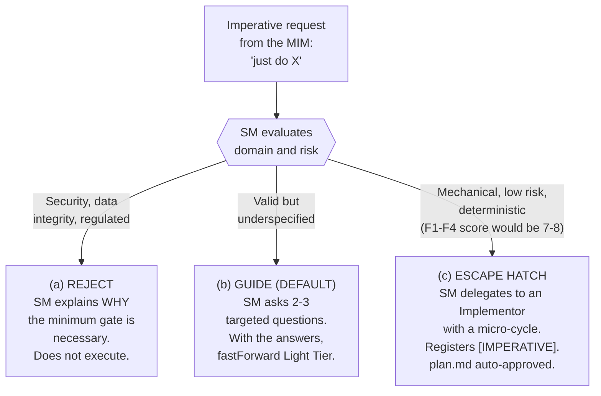
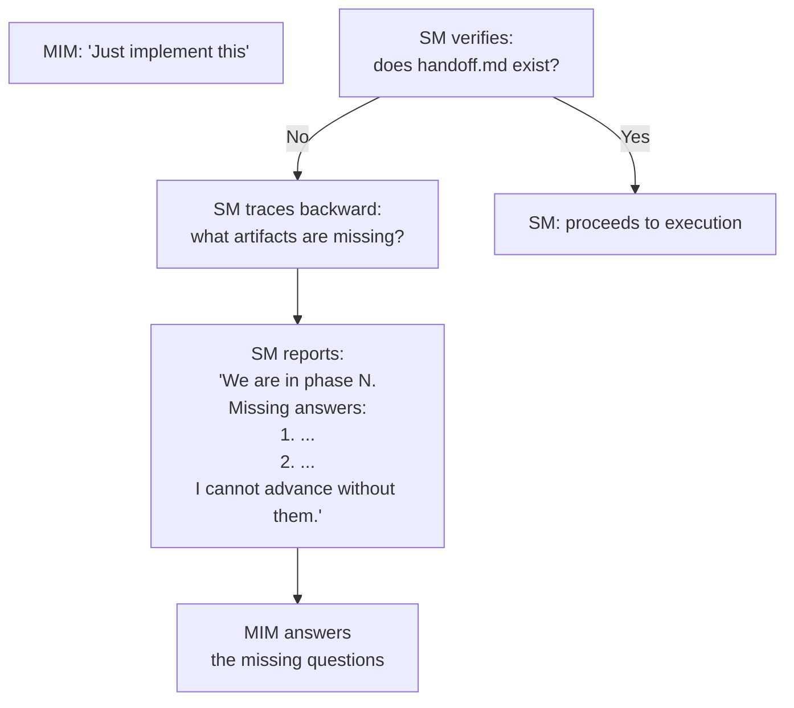
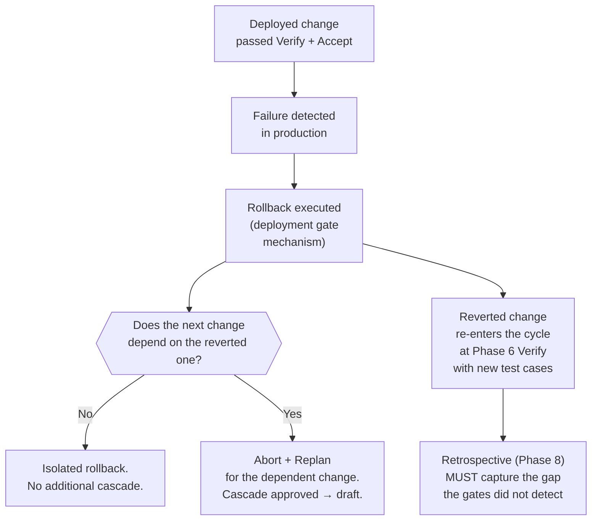
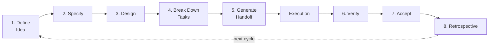
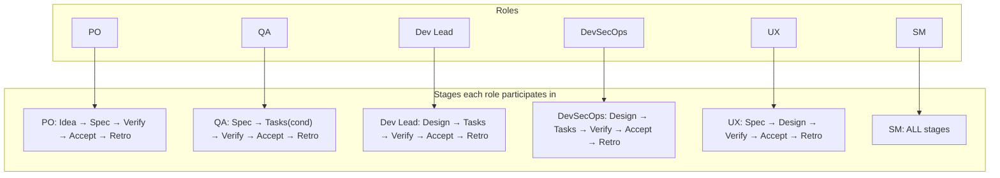
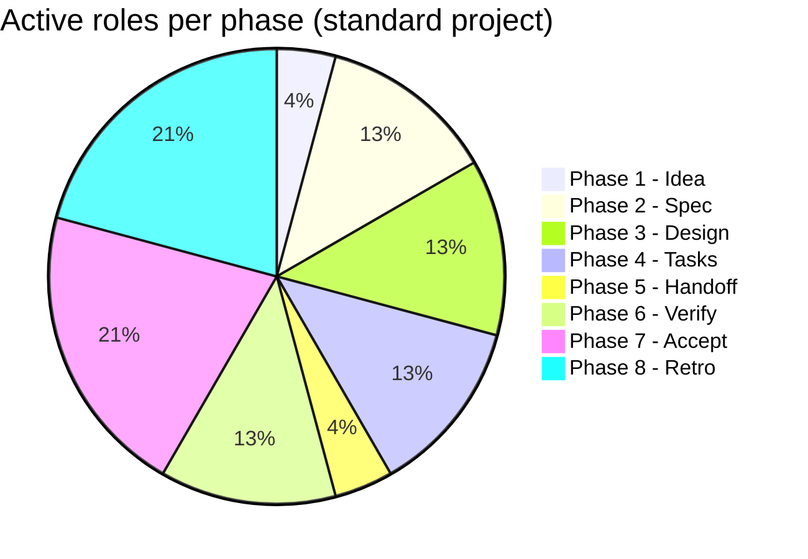

# Detail of Phases 1-8

← [Main Index](../../README.md) | [Planning](../README.md) | [SM Behavior](README.md)

---

## Contents

- [Imperative Mode — SM Response to Direct Requests](#imperative-mode--sm-response-to-direct-requests)
- [Detail by Phase](#detail-by-phase)
- [Blocking: how the SM stops premature progress](#blocking-how-the-sm-stops-premature-progress)
- [SM Rules](#sm-rules)
- [Deployment — transition between Execution and Operation](#deployment--transition-between-execution-and-operation)
- [Operation Phase — optional (facade)](#operation-phase--optional-facade)
- [Full Matrix: Roles × Stages](#full-matrix-roles--stages)

---

## Imperative Mode — SM Response to Direct Requests

When the MIM issues an imperative request — "just do X", "implement
this directly", without going through the phase chain — the SM has no
license to blindly execute nor to block by default. The
imperative request triggers a domain and risk evaluation that
resolves into one of three routes: reject, guide, or use the escape hatch.



| Response | When it applies | Examples | What the SM does |
|-----------|---------------|----------|-----------------|
| **(a) Reject** | The request touches security (auth, crypto, secrets), data integrity (migrations, schema), or regulated domains | "Change encryption to MD5", "Drop the users table" | Explains the concrete risk. Does NOT execute. Offers route (b) guide as an alternative. |
| **(b) Guide** | The request is valid but lacks scope, ACs, or impact assessment. **DEFAULT for imperative requests.** | "Add a health endpoint", "Add rate limiting" | Formulates 2-3 targeted questions. With the answers, applies [fastForward](fast-forward.md) in Light Tier (`plan.md`). |
| **(c) Escape hatch** | The request is mechanical, low risk, deterministic. The F1-F4 score would be 7-8. | "Rename X to Y", "Update ESLint to v9", "Fix this typo" | Delegates to an Implementor with a micro-cycle (auto-approved plan.md). Registers `[IMPERATIVE]` in the current cycle or as a standalone micro-cycle. The SM does not execute — it delegates. |

**Escape hatch restriction**: route (c) NEVER applies to changes
that modify contracts, public APIs, database schemas, or
security boundaries. Those domains force (a) reject or, if the
request is valid but underspecified, (b) guide. Whenever there is any doubt
about whether a request fits (c), the SM chooses (b).

**Mandatory audit trail**: every imperative interaction — whether (a),
(b), or (c) — is recorded with the SM's reasoning about which route
it chose and why. The record lives in the `idea.md` or `plan.md` of the
active cycle, the same mechanism as the `[INTERRUPTION]` record (see
[fastForward and Activation Tiers](fast-forward.md)).

[↑ Contents](#contents)

---

## Detail by Phase

### Phase 1 — Define Idea

| | Detail |
|---|---------|
| **Convened role** | PO (± SM if it's a challenge with process rules) |
| **Function** | Formulate business questions to the MIM to bound scope and value |
| **Does NOT do** | Does NOT decide stack. Does NOT define architecture. Does NOT estimate effort. |
| **Output artifact** | `idea.md` |
| **Gate** | All business questions answered |

Predefined questions the PO must resolve:

1. Who is the end user?
2. What problem does it solve for the user?
3. What is the core flow of the product?
4. Is it an MVP or a complete product?
5. Are there time or budget constraints?
6. Who approves the final result?

**Multi-stakeholder**: if the answer to question 6 indicates that
requester ≠ approver (e.g., a dev requests the feature but the PM approves),
the SM registers both in `idea.md` metadata and routes interactions:
context/scope questions → requester, acceptance gates →
approver. Default: MIM = requester = approver (single persona).

**Ingesting MIM input**: when the MIM provides files,
screenshots, URLs, or any context material (tech challenge,
product brief, wireframes), the SM instructs the TPM to **ingest**
the material into the artifactStore. The TPM:

1. Reads the source material (files, screenshots, text)
2. Synthesizes the relevant content (does not copy verbatim)
3. Stores it with **citations to the source** (path, line, URL, section)
4. Makes it queryable for any role via `search()`

The SM does NOT read files — the cardinal rule has no exceptions. The TPM
is the only one that touches source material. Any role that needs
context obtains it from the artifactStore via patternB (direct query).

If the input is a **tech challenge**, the TPM ingests the challenge
files and extracts: timebox, evaluation criteria, tool
constraints. The PO uses that information (via RAG query) to
formulate the business questions.

**Compound requests from the MIM**: if the MIM sends multiple
features/ideas in a single message ("add auth AND add i18n"), the SM
decomposes them into independent L1 features. Each L1 follows its
own planning cycle (idea → handoff). The SM can execute them
sequentially or, if they have no dependencies between them, plan them in
parallel. The SM informs the MIM of the decomposition before proceeding.

### Phase 2 — Specify

| | Detail |
|---|---------|
| **Convened roles** | PO + QA |
| **PO function** | Define acceptance criteria and functional contracts |
| **QA function** | Validate that each AC is verifiable and testable |
| **Do NOT do** | Do NOT choose testing tools. Do NOT write tests. Do NOT decide architecture. |
| **Output artifact** | `spec.md` |
| **Gate** | Every AC is verifiable. No ambiguities. QA approves testability. |

Predefined questions:

1. What are the acceptance criteria per feature?
2. What contracts must the system fulfill? (APIs, schemas, interfaces)
3. What non-functional constraints exist? (performance, security, accessibility)
4. Can each AC be verified with a concrete test?
5. What is OUT of scope?

### Phase 3 — Design

| | Detail |
|---|---------|
| **Convened roles** | Dev Lead + DevSecOps (+ UX if there's a user interface) |
| **Dev Lead function** | Define architecture, patterns, technical decisions |
| **DevSecOps function** | Assess security surface, risks, infra requirements |
| **UX function** | Validate decisions that impact user experience |
| **Do NOT do** | Do NOT implement. Do NOT write code. Do NOT configure infra. |
| **Output artifact** | `design.md` |
| **Gate** | Architectural decisions made. Risks assessed. Stack defined. |

Predefined questions:

1. What technical stack will be used and why?
2. What is the high-level architecture?
3. What design patterns apply?
4. What are the technical risks and how are they mitigated?
5. What decisions were made and which were discarded (with reason)?

### Phase 4 — Break Down Tasks

| | Detail |
|---|---------|
| **Convened role** | Dev Lead + DevSecOps (conditional) + QA (conditional) |
| **Dev Lead function** | Decompose the design into dependency-ordered tasks |
| **DevSecOps function** | (If active) Inject missing security/hardening tasks |
| **QA function** | (If active) Validate that every task has a verification criterion |
| **Do NOT do** | Do NOT implement. Do NOT assign to specific people. |
| **Output artifact** | `tasks.md` |
| **Gate** | Tasks follow the workItem schema (L3-L4, parent_id, depends_on with FS/SS/FF types, traces_to). No cyclic dependencies. Every task mapped to at least one AC. Complete dependency graph with assigned lanes. Structural completeness (TPM) + semantic (QA validates per-task verifiability). |

Predefined questions:

1. What are the tasks and in what order do they execute?
2. What dependencies exist between tasks?
3. Can each task be mapped to one or more ACs from `spec.md`?
4. Are there tasks that can execute in parallel?

### Phase 5 — Generate Handoff

| | Detail |
|---|---------|
| **Convened role** | TPM (under the SM's instruction) |
| **Function** | Compile a self-contained contract from the previous artifacts |
| **Does NOT do** | Does NOT add new information. Does NOT interpret. Does NOT make decisions. |
| **Output artifact** | `handoff.md` |
| **Gate** | SM validates: handoff is self-contained. An executor who didn't see the conversation can act on it. |

The SM instructs the TPM on what the handoff must include:

1. Project context (from `idea.md`)
2. Acceptance criteria (from `spec.md`)
3. Architecture decisions (from `design.md`)
4. Ordered tasks with dependency graph (from `tasks.md`)
5. Test strategy (from `spec.md` non-functional requirements + QA)
6. What NOT to do (explicit constraints)
7. What success looks like (definition of done)

The TPM compiles it and applies writing standards.

**Self-containment validation** (adversarial smoke test):

After the TPM produces `handoff.md`, the SM does NOT validate it
by reading it directly (cardinal rule). Instead, it launches a
fresh subAgent that receives **ONLY** `handoff.md` (with no access to any
other artifact or conversation context) under this contract:

- **Input**: only `handoff.md`
- **Task**: "Generate an execution plan from this document."
- **Criterion**: if the subAgent can generate the plan without asking
  questions → the handoff is self-contained. If it needs to ask → it fails.

If the smoke test fails, the SM instructs the TPM about the detected
gaps. It iterates until the fresh subAgent can plan
without questions.

**Smoke test subAgent contract**:

| Field | Value |
|-------|-------|
| Role | Fresh executor (no prior context) |
| Input | Only `handoff.md` — no other artifact or conversation context |
| Task | Generate an execution plan. If information is missing to make a decision, do NOT assume — list the explicit question instead of guessing. |
| Output | Execution plan + list of assumptions made (can be empty) |
| PASS criterion | 0 blocking questions AND 0 critical assumptions |
| FAIL criterion | 1+ blocking questions OR 1+ assumptions about architecture/stack/scope decisions |
| Status Report | Mandatory (Status/Progress/Blocker/Assumptions) |

> **Note on confidence bias**: LLMs tend to generate plausible plans
> without asking, even with incomplete information. The
> operating criterion must be: the fresh agent explicitly LISTS
> every assumption it made. 0 critical assumptions about
> architecture/stack/scope = PASS. 1+ critical assumptions = FAIL.

**Mechanical gate — `virgil handoff lint`**: before the MIM's
confirmation gate, the SM instructs the execution of `virgil handoff lint` on
`handoff.md`. This gate is deterministic — it does not depend on the
subjective judgment of a subAgent: it validates the schema's structure
(ACs with ID, tasks with `depends_on`, references to `spec.md`/`design.md`,
`execution_state` status), reference consistency, and
absence of cyclic dependencies. If `virgil handoff lint` fails, the SM does NOT
present the handoff to the MIM — it returns to the TPM with the errors reported by the
tool. The adversarial smoke test (fresh subAgent) and `virgil
handoff lint` are complementary gates: the lint verifies mechanical form and
consistency, the smoke test verifies semantic self-containment.

**MIM confirmation gate**: before transitioning to Execution Mode,
the SM presents the MIM with a summary of the handoff and asks for
explicit confirmation: "Shall we proceed to execution?" The MIM can
approve, request adjustments, or stop. This transition is NOT automatic — the
MIM always has the final word before code gets written.

**fastForward rollback**: if the MIM rejects the result of a
fastForward ("you assumed too much"), the SM: (1) asks the MIM to
identify the artifacts with incorrect assumptions, (2) instructs the
TPM to mark those artifacts as `in review`, (3) re-evaluates the
F1-F4 score with the new information, (4) resumes the cycle from the
phase of the first affected artifact, now with the questions the
fastForward skipped. The MIM has the final word.

### Phase 6 — Verify (QA + DevSecOps)

| | Detail |
|---|---------|
| **Convened roles** | QA + DevSecOps |
| **QA function** | Verify each AC against the implementation and produce a verification report |
| **DevSecOps function** | Verify security, performance, and infrastructure |
| **Do NOT do** | Do NOT implement corrections. Do NOT redefine ACs. |
| **Output artifact** | Update to `tasks.md` with verification results |
| **Gate** | All ACs have an explicit verdict (PASS/FAIL with justification) |

The SM does NOT run tests — it delegates full verification to QA and
DevSecOps. Each AC must end up with an explicit verdict: PASS or FAIL,
along with the corresponding justification. An AC without a verdict does not
satisfy the gate.

### Phase 7 — Accept (Full Panel)

| | Detail |
|---|---------|
| **Convened role** | All team roles (default + ad-hoc with declared vote) |
| **Function** | Formal vote on the deliverable, each role evaluates from its perspective |
| **Does NOT do** | Does NOT re-run technical verification (that's Phase 6). Does NOT redefine scope. |
| **Output artifact** | Vote record and justifications in metadata |
| **Gate** | Simple majority approves. A BLOCK from any role halts acceptance |

Each role evaluates from its own perspective: PO evaluates value, Dev Lead evaluates
architecture, QA evaluates quality, DevSecOps evaluates security, UX evaluates
experience. If the panel does not approve, what's missing is specified
and the cycle returns to the corresponding phase to resolve it.

> **Relationship to execution's Accept**: Planning Phase 7 and the
> execution Accept Phase are DISTINCT gates. Accept (execution) certifies that
> the code meets the handoff — it operates within each execution iteration.
> Phase 7 (planning) accepts the complete deliverable from the
> team's perspective — it operates at the close of the planning cycle. See
> [Accept Phase](../../execution/accept.md).

### Phase 8 — Retrospective

| | Detail |
|---|---------|
| **Convened role** | All roles that participated in the cycle (default + ad-hoc) |
| **Facilitator** | SM |
| **Function** | Evaluate the process, not the product. Close the cycle with concrete agreements. |
| **Does NOT do** | Does NOT reopen product defects (that's Phase 6). Does NOT redefine scope (that's Phase 1). |
| **Output artifact** | Project metadata → "Retrospective" section (persisted via TPM in the artifactStore as operational metadata, NOT inside any of the 6 product artifacts) |
| **Gate** | At least 1 concrete agreement recorded. MIM confirms cycle closure. |

**Session structure** (facilitated by the SM):

1. **Stop doing** — what we did this cycle that we shouldn't repeat.
   The SM convenes each active role and asks: "What part of the process
   held you back, confused you, or produced waste?"

2. **Start doing** — what we didn't do and should incorporate.
   The SM asks: "What is missing from the process that would have
   avoided a problem or accelerated the result?"

3. **Continue doing** — what worked well and we should keep.
   The SM asks: "What part of the process was useful, clear, or
   efficient?"

4. **Agreements** — concrete commitments for the next cycle.
   Each agreement must be: actionable (verb + object), assignable (who
   executes it), and verifiable (how do we know it was fulfilled).

**Delegation by role** (the SM convenes each role with a
prompt specific to its perspective):

| Role | SM prompt | Example of expected output |
|-----|---------------|---------------------------|
| PO | "Assess whether the value delivered matches the expected value. Did the prioritization process work?" | "Start: validate ACs with users before Phase 2" |
| Dev Lead | "Were the architectural decisions sound? Was the task breakdown realistic?" | "Stop: estimating without measuring integration complexity" |
| QA | "Was the testing strategy effective? Were defects caught in time?" | "Continue: semantic gate in Phase 4" |
| DevSecOps | "Were the security measures adequate? Was anything discovered late?" | "Start: threat model in Phase 3 instead of Phase 4" |
| UX | "Was usability feedback incorporated in time? Is the result usable?" | "Stop: deferring UX feedback until Phase 6" |
| Ad-hoc | "Did your contribution impact the result? Was the contract clear?" | "Start: include Data Architect from Phase 3" |

**Persistence**: the SM instructs the TPM to register the results
in the project metadata (NOT in `idea.md` — the retro is operational
metadata, not an ISO product artifact). Format:

```markdown
## Retrospective

### Stop doing
- [item] — reported by [role]

### Start doing
- [item] — reported by [role]

### Continue doing
- [item] — reported by [role]

### Agreements
- [ ] [actionable agreement] — responsible: [role/MIM] — verifiable: [criterion]
```

> **Structured agreement format**: To ensure the SM can
> interpret and apply the agreements in the next cycle in a
> deterministic way, each agreement must follow this schema:
>
> ```yaml
> - action: start | stop | continue | change
>   target_phase: 1-8
>   target_role: PO | Dev Lead | QA | DevSecOps | UX | SM | all
>   description: "Concrete description of the agreement"
>   responsible: role | MIM
> ```

**MIM feedback on the process**: as a closing step, the SM asks the
MIM directly: "Was the planning process useful for this
project? Was it excessive? What would you change?" The MIM's
response is registered as an additional item in the corresponding
section (stop/start/continue). This closes the review-001 M4 concern —
the MIM has a formal point to give feedback on the process, not just
on the product.

**Agreements as meta-configuration**: agreements are NOT
product deliverables — they are process adjustments that tune how
the framework operates in the next cycle. Examples:

- "Start: threat model in Phase 3" → the SM adds DevSecOps as
  a mandatory participant in Phase 3 for the next cycle.
- "Stop: estimating without measuring" → the SM adds a complexity check
  to the Phase 4 gate.
- "Start: include Data Architect from Phase 3" → the SM creates an
  ad-hoc role with a contract and pre-activates it in Phase 3's
  convocation.

The SM reads the previous cycle's agreements (via TPM, from the project
metadata's "Retrospective/Agreements" section) when starting a new
cycle and
incorporates them as operational rules. This is the **process feedback
loop**: the retro is not ceremonial — it produces concrete changes in
the SM's and the team's behavior.

If an agreement contradicts a documented rule in
[this document](README.md) or [Role Profiles](../roles/README.md),
the SM escalates it to the MIM: "This agreement requires modifying a
framework rule. Do you confirm?" The MIM decides whether it's a local
override (this project only) or a permanent amendment.

**Cycle closure**: the SM presents the agreements to the MIM and asks:
"Shall we close this cycle?" The MIM confirms. The SM instructs the TPM to
mark the cycle as closed.

[↑ Contents](#contents)

---

## Blocking: how the SM stops premature progress

When the MIM tries to skip a phase (for example, requesting implementation
from a vague idea), the SM responds with:

1. **Current phase** — where we stand
2. **What's missing** — list of unanswered questions
3. **The chain** — why it can't be skipped



Concrete example:

> **MIM**: "Just implement this"
>
> **SM**: We are in the idea-definition phase. I cannot move to
> implementation because the chain is incomplete:
>
> - `idea.md` — **INCOMPLETE** (3 of 6 questions missing)
> - `spec.md` — does not exist
> - `design.md` — does not exist
> - `tasks.md` — does not exist
> - `handoff.md` — does not exist
>
> Pending questions to complete `idea.md`:
>
> 1. Who is the end user?
> 2. What is the core flow of the product?
> 3. Are there time or budget constraints?
>
> Let's answer these and we'll proceed.

[↑ Contents](#contents)

---

## SM Rules

General operating rules:

1. **The SM does NOT produce content** — it convenes whoever produces it
2. **The SM does NOT touch files** — the TPM manages the RAG
3. **The SM does NOT make product decisions** — it facilitates them
4. **The SM does NOT make technical decisions** — it delegates them to the Dev Lead
5. **The SM DOES validate completeness** — with data the TPM reports to it
6. **The SM DOES block** — if the gate doesn't pass, there's no progress
7. **The SM DOES trace** — the TPM provides it with the artifacts' status
8. **The SM persists across all phases** — it is the connecting thread
9. **The SM DOES extend the team** — if the project needs expertise outside the 5 default roles, the SM defines ad-hoc roles with a complete contract
   (see [Ad-Hoc Roles](../roles/ad-hoc.md)). Justification mandatory. Registered in `idea.md`.
10. **Phase transitions have a deterministic gate** — moving from
    one phase to the next does NOT depend solely on the MIM's approval.
    Every transition runs a mechanical gate (schema, dependencies,
    traceability) executed by tooling, and only afterward is it presented
    to the MIM for confirmation. The MIM's approval certifies business
    intent; the deterministic gate certifies structural integrity.
    Both are necessary — neither substitutes for the other.

[↑ Contents](#contents)

---

## Deployment — transition between Execution and Operation

The pipeline covers idea → certified code (execution's Accept Phase)
and, if the project activates the facade, the Operation phase. Between
both ends there is a transition the framework recognizes at the dogma level:
moving from "artifact certified in the registry" to "service running
and reachable" is **deployment**, and it has its own gate. The framework
does not prescribe HOW to deploy (CI/CD, blue-green, canary, manual — that's
a project decision), but it does prescribe WHAT is verified before and
after.

| Moment | Gate | What it verifies |
|---------|------|---------------|
| Pre-deploy | Deployment gate | All ACs of the iteration certified in Accept Phase. `virgil health` metrics within the active tier's threshold. No open blocking findings (security, DevSecOps). Deployment strategy documented in `design.md` or `handoff.md`. |
| Post-deploy | Smoke test | The service responds in the target environment (health check, minimal smoke E2E). A failure triggers **rollback**. |

**Rollback** is not just a section heading — it is a concept
prescribed with three mandatory components: what triggers it (post-deploy
smoke failure, or degradation of critical metrics during the
initial observation window), who authorizes it (DevSecOps proposes;
the MIM confirms if the rollback implies data loss or visible
downtime), and how it's verified (the smoke test is repeated on the
previous version; the service must return to a known-good state). The
rollback mechanism (image revert, feature flag, reversible database
migration) is not prescribed — it is a DevSecOps/Dev Lead
decision documented in `design.md`.

### Post-Deploy Rollback Protocol

The rollback described above covers the technical mechanism. What's missing is the case
where the reverted change is not an isolated event: a change already
deployed passed all gates (Verify, Accept) but causes problems
in production not detected during verification, and the **next**
change — already in planning or execution — depends on it.

**SM behavior**: the rollback is treated as an Abort + Replan
interruption (see [fastForward and Activation
Tiers](fast-forward.md) → interruption strategies) applied
to the dependent change. The `approved → draft` cascade reaches the
artifacts of the dependent change that assumed the state of the
reverted change.



- **Dependent change**: the SM triggers Abort + Replan exactly as
  documented in [fastForward](fast-forward.md) for interruptions that
  invalidate upstream artifacts. The dependent change's branch is
  preserved; replanning starts from the artifact invalidated
  by the new post-rollback baseline.
- **Reverted change**: it doesn't go back to zero. It re-enters the cycle at
  Phase 6 (Verify), with new test cases that specifically cover
  the problem detected in production — the coverage gap the
  original gate let through.
- **Mandatory retrospective**: Phase 8 of the reverted change's cycle
  MUST capture, as a concrete agreement, what failed in the
  Verify or Accept gate that let the problem reach
  production. A rollback without that agreement does not close the cycle.

### Note — Environment Parity (Staging ≠ Production)

Virgil does not manage infrastructure, so it cannot prescribe
HOW parity between staging and production is maintained. What it
does recommend is a gate: the deployment transition (Execution →
Operation) should include an environment parity check
(configuration, representative data, infra dependency versions)
before the post-deploy smoke test.

This gate is **RECOMMENDED, not mandatory** — unlike the
deployment gate in the table above, which is dogma. The
environment-homogeneity principle is already covered conceptually by the
[echo system](../../echo-system.md); this note adds the
concrete recommendation of where to verify it in the pipeline: as a step
prior to the smoke test in the table above, orchestrated by the echo
system of the project if the project activates it.

[↑ Contents](#contents)

---

## Operation Phase — optional (facade)

The Operation Phase (post-Retrospective) is NOT mandatory for all
projects. It is a **facade**: each project decides whether to activate it based
on whether it has a surface to operate (a live service, distributed CLI,
published library) or whether the cycle ends at code delivery.

- **It activates** when the handoff declared expected operational
  documentation (see `handoff.md` → "Expected operational documentation") and the
  project has a post-delivery surface that a user or operator
  needs to use or maintain.
- **It is omitted** when the deliverable is a single artifact (internal
  library without publication, one-off script, proof of
  concept) — the cycle closes at Phase 8.
- The SM does NOT impose the phase; the decision is recorded in `idea.md`
  along with the rest of "roles active for this project".

See [Operational Model](../operational-model.md) → "Operation" section
for the complete detail of the facade pattern and the adapters by project
type (service, CLI, library).

[↑ Contents](#contents)

---

## Full Matrix: Roles × Stages

This matrix defines the tasks each **default** role CAN take on at each
stage. If a cell is empty, that role does NOT participate in that stage. If the
SM doesn't convene it, the role is not activated. Ad-hoc roles do not appear in
this matrix — the SM defines their phases and tasks in the contract when creating them
(see [Ad-Hoc Roles](../roles/ad-hoc.md)).

### Stages of the Full Cycle



### PO (Product Owner)

| Stage | Permitted tasks |
|-------|-------------------|
| 1. Define Idea | Formulate business questions. Bound scope. Define value for the user. Prioritize features. Identify stakeholders. |
| 2. Specify | Define acceptance criteria. Write functional contracts. Delimit what's out of scope. Prioritize ACs by value. |
| 3. Design | — |
| 4. Break Down Tasks | — |
| 5. Generate Handoff | — |
| 6. Verify | Validate that the ACs are met from the business perspective. |
| 7. Accept | Give formal acceptance of the deliverable against the original ACs. Approve, request changes, or block. |
| 8. Retrospective | Assess whether the delivered value matches the expected value. Propose prioritization adjustments. |

### QA (Quality Assurance)

> **Lifecycle**: QA participates from "three amigos" (Phase 2, co-defines
> ACs with PO) to "certification" (Phase 7, approves or blocks the
> deliverable). The SM decides when to convene it in intermediate phases
> based on the project's needs — there is no rigid inclusion/exclusion
> rule by phase.

| Stage | Permitted tasks |
|-------|-------------------|
| 1. Define Idea | — |
| 2. Specify | **Three amigos**: validate that each AC is verifiable with a concrete test. Identify ambiguous or non-testable ACs. Propose coverage criteria. |
| 3. Design | (SM decides) Review design for testability. Identify decisions that complicate testing. |
| 4. Break Down Tasks | Validate that each task has a verification criterion. Identify tasks that need specific tests. Mandatory semantic gate. |
| 5. Generate Handoff | — |
| 6. Verify | Validate test coverage. Verify that tests cover the ACs. Identify uncovered edge cases. |
| 7. Accept | **Certification**: give a verdict on the technical quality of the testing. Approve, request changes, or block. |
| 8. Retrospective | Assess the effectiveness of the testing strategy. Propose improvements to the QA process. |

### Dev Lead

| Stage | Permitted tasks |
|-------|-------------------|
| 1. Define Idea | — |
| 2. Specify | — |
| 3. Design | Define technical stack (with justification). Define high-level architecture. Choose design patterns. Assess technical tradeoffs. Document decisions made and discarded. |
| 4. Break Down Tasks | Decompose the design into atomic tasks. Order by dependencies. Identify parallelizable tasks. Estimate relative complexity. Map each task to `spec.md` ACs. |
| 5. Generate Handoff | — |
| 6. Verify | Validate that the implementation respects architecture decisions. Review code quality. **Co-produce `ops-runbook.md`** (troubleshooting and operational architecture sections). |
| 7. Accept | Give a verdict on the technical quality of the implementation. Approve, request changes, or block. |
| 8. Retrospective | Assess whether the architectural decisions were sound. Propose technical improvements for the next cycle. |

### DevSecOps

| Stage | Permitted tasks |
|-------|-------------------|
| 1. Define Idea | — |
| 2. Specify | — |
| 3. Design | Assess security surface. Identify risks of the proposed architecture. Define infra requirements. Validate that decisions don't introduce known vulnerabilities. |
| 4. Break Down Tasks | Identify tasks that require security considerations. Add hardening tasks if missing. |
| 5. Generate Handoff | — |
| 6. Verify | Validate that no vulnerabilities were introduced. Review security configurations. Verify secrets handling. **Produce `ops-runbook.md`** (infra, monitoring, security, deploy/rollback sections). |
| 7. Accept | Give a verdict on the security posture. Approve, request changes, or block. |
| 8. Retrospective | Assess whether the security measures were adequate. Propose improvements. |

### UX (User Experience)

| Stage | Permitted tasks |
|-------|-------------------|
| 1. Define Idea | — |
| 2. Specify | Validate that the ACs consider the user experience. Identify confusing or inconsistent flows. |
| 3. Design | Validate that design decisions don't degrade UX. Propose alternatives if usability problems are found. |
| 4. Break Down Tasks | — |
| 5. Generate Handoff | — |
| 6. Verify | Validate that the implementation respects the defined user flows. |
| 7. Accept | Give a verdict on the user experience. Approve, request changes, or block. |
| 8. Retrospective | Assess usability feedback. Propose UX improvements. |

### SM (Session Manager)

| Stage | Permitted tasks |
|-------|-------------------|
| 1. Define Idea | Convene PO. If it's a challenge: delegate extraction of process rules to smProcess subAgent (timebox, evaluation, constraints). Validate gate. |
| 2. Specify | Convene PO + QA. Facilitate resolution of ambiguities. Validate gate. |
| 3. Design | Convene Dev Lead + DevSecOps (+ UX if applicable). Facilitate decisions. Validate gate. |
| 4. Break Down Tasks | Convene Dev Lead. Validate there are no cyclic dependencies. Validate estimates. Validate gate. |
| 5. Generate Handoff | Instruct the TPM to compile the handoff. Validate completeness of the result. |
| 6. Verify | Convene verification roles based on the type of change. Validate that the process was followed. Instruct production of `ops-runbook.md` (DevSecOps: infra/security, Dev Lead: troubleshooting). |
| 7. Accept | Convene the acceptance panel. Facilitate the review. Consolidate verdicts. |
| 8. Retrospective | Facilitate the retrospective. Document lessons learned. Propose process improvements. |

### Summary visual matrix



Visual complement: the pie chart shows how many active roles the
SM convenes in each phase of a standard project (Full tier), showing that
the closing phases (Accept, Retro) concentrate the most participation.



[↑ Contents](#contents)
