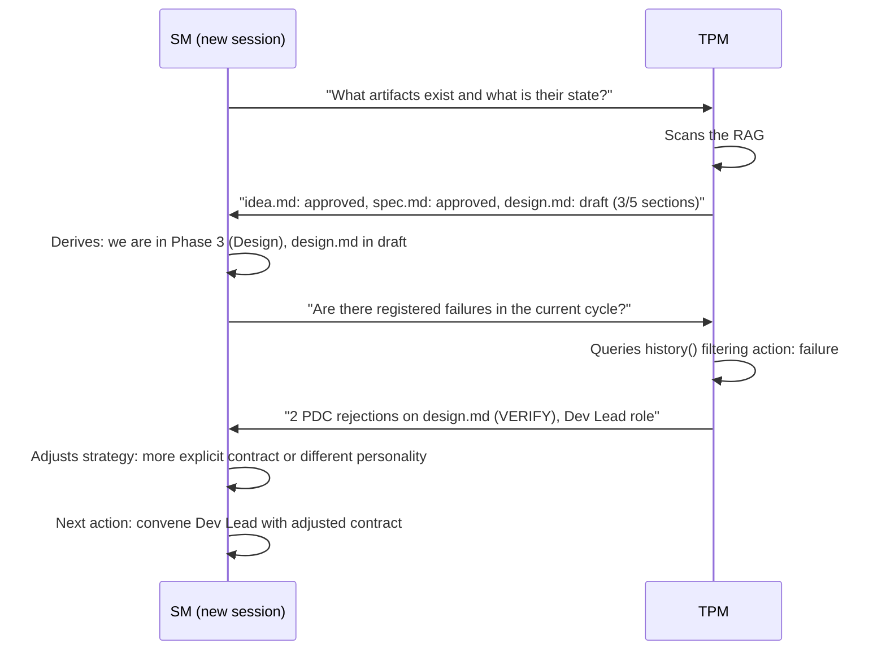
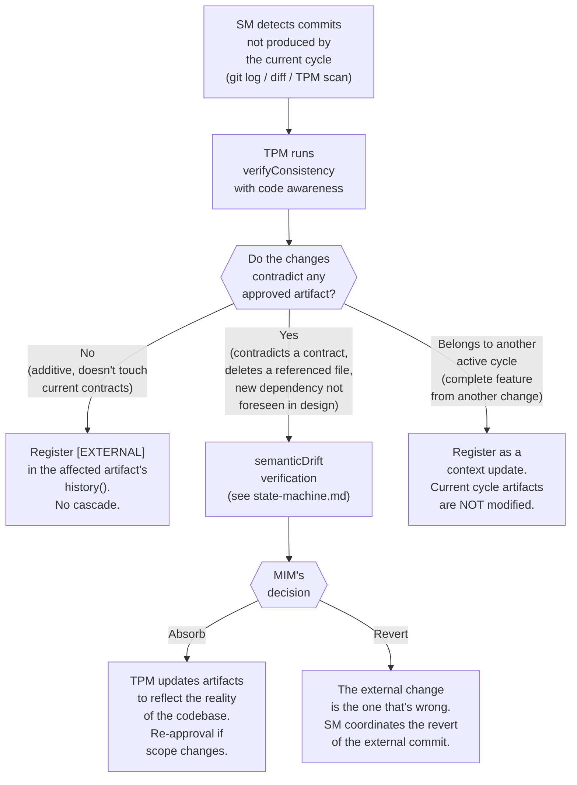

# Recovery Protocol

← [Main Index](../../README.md) | [Planning](../README.md) | [SM Behavior](README.md)

## Recovery protocol (session start)



---

## Failure History

The circuitBreaker protects intra-session, but failures are also
registered cross-session in the affected artifact's `history()` (see
[TPM and universalInterface](../artifacts/tpm-adapter.md#historyartifact)).
This allows the SM to learn
from previous failures when recovering state.

**What is registered**: each failure is stored as an entry in `history()`
with `action: "failure"` and type-specific metadata:

| Type | Additional fields | Example |
|------|-------------------|---------|
| `pdc_rejection` | `step` (ECHO/VERIFY/MARK/DECIDE), `role`, `reason` | VERIFY rejection: output doesn't cover ACs |
| `circuit_breaker` | `role`, `consecutive` | 3 consecutive failures of the QA role |
| `escalation` | `role`, `description`, `resolution` | Gap in auth design, MIM provided ADR |
| `redelegation` | `role`, `reason`, `contract_delta` | Scope too broad, narrowed to ACs 1-3 |

Registration format (all share base fields `action: "failure"`,
`phase`, `timestamp`):

```yaml
# Example: PDC rejection
{ action: "failure", type: "pdc_rejection", step: "VERIFY",
  role: "Dev Lead", reason: "output does not cover 2 of 5 ACs", phase: 3 }

# Example: circuitBreaker
{ action: "failure", type: "circuit_breaker",
  role: "QA", consecutive: 3, phase: 6 }
```

**How the SM uses the history during recovery**:

1. After deriving the current phase, the SM asks the TPM:
   "Are there registered failures in the current cycle?"
2. The TPM queries `history()` of the in-progress artifacts filtering
   `action: "failure"`.
3. If failures exist, the SM adjusts strategy before re-delegating:
   - **Recurring PDC rejection** — more explicit contract, adjusted
     role personality, narrower scope.
   - **Previous circuitBreaker** — change the role's approach or escalate
     tier from the start.
   - **Resolved escalation** — inject the MIM's resolution as
     explicit context in the new contract.
   - **Previous re-delegation** — apply the `contract_delta` that
     worked as the baseline for the new contract.

---

## Reconciliation after External Changes

When another agent, a human collaborator, or a CI pipeline
modifies the codebase outside the Virgil flow, the SM needs to
detect the divergence between artifacts (source of truth for the WHAT) and
code (source of truth for the HOW) before continuing the current cycle.

**Trigger**: the SM detects, at session start or during recovery,
one or more commits that were not produced by the current cycle (they don't
carry the `[IMPERATIVE]`/`[HOTFIX]` tag nor correspond to any `claimed`
task in the current handoff's `executionState`). Detection relies on
`git log`/`git diff` over the artifact's file scope, or on a
TPM scan.

### Detection and classification



Classifying into three paths avoids treating every external change as
an incident: only the "contradictory" path triggers drift
verification and an MIM decision. The other two paths are low-cost
(registration only) and do not block the cycle.

### Protocol, step by step

| Step | Responsible | Action |
|------|-------------|--------|
| **1. Detection** | SM | Identifies commits with no origin in the current cycle, comparing `git log` against the `executionState` of the in-progress handoff |
| **2. verifyConsistency with code awareness** | TPM | Extends the [state-machine.md](../artifacts/state-machine.md) verification to the artifact↔code pair: it not only compares artifacts against each other, it also compares an artifact against the actual state of the files it declares as its scope |
| **3. `[EXTERNAL]` registration** | TPM | Persists the finding in the affected artifact's `history()` (see format below) |
| **4. Semantic drift verification** | TPM | Only if the classification is "contradictory". Applies the same flow as [semanticDrift Detection](../artifacts/state-machine.md#semanticdrift-detection), comparing the current code against the artifact instead of downstream against upstream |
| **5. MIM decision** | SM | Presents the drift to the MIM with two alternatives: absorb (the code wins, artifacts are updated) or revert (the artifact wins, the external commit is reverted) |

**Mandatory gate**: if the classification is "contradictory", the SM
does NOT continue the cycle on the affected artifact until the MIM
decides. The artifact remains on hold — the same spirit as the Hold
state of a mid-implementation interruption (see
[Interruption Protocol](fast-forward.md#interruption-protocol-mid-implementation)),
but triggered by code instead of a prioritized external event.

### Registering external changes

Each detected external change is stored in the affected artifact's
`history()` with `action: "external_change"` and specific metadata:

| Field | Description | Example |
|-------|-------------|---------|
| `classification` | `additive` \| `contradicting` \| `other_cycle` | `contradicting` |
| `commit` | Hash of the external commit | `a3f21c9` |
| `files` | Files that intersect the artifact's scope | `["src/auth/middleware.ts"]` |
| `resolution` | Only if `classification: contradicting`. `absorbed` \| `reverted` \| `pending` | `absorbed` |

```yaml
# Example: contradictory external change, absorbed by MIM decision
{ action: "external_change", classification: "contradicting",
  commit: "a3f21c9", files: ["src/auth/middleware.ts"],
  resolution: "absorbed", phase: 4 }
```

**Human-readable registration format** (complements the structured
entry in `history()`, same auditability criteria as `[INTERRUPTION]` and
`[HOTFIX]`):

```text
[EXTERNAL] Commit: {hash}. Classification: {additive|contradicting|other_cycle}. Resolution: {pending|absorbed|reverted}.
```

### lastVerifiedAt — avoiding unnecessary re-verification

Running code-aware `verifyConsistency` on every session turn
would be costly. That's why the TPM maintains a
`lastVerifiedAt` field (timestamp) per artifact, updated every time
`verifyConsistency` runs successfully on that artifact.

**Invalidation rule**: at session start (see Recovery protocol
above), the SM asks the TPM whether the `lastVerifiedAt` of each
in-progress artifact predates the last commit that touches its file
scope. If so, the TPM marks the artifact as `stale` for
re-verification before the SM continues the cycle on it.

| Field | Lives in | Updated when | Invalidated when |
|-------|---------|----------------------|-------------------|
| `lastVerifiedAt` | artifact metadata (TPM) | `verifyConsistency` runs successfully on the artifact | There is a commit after the timestamp that touches files in the artifact's scope |

> **Note**: `lastVerifiedAt` does not replace the Recovery protocol of the
> previous section — it complements it. The Recovery protocol derives the
> current phase of the cycle; `lastVerifiedAt` determines whether that phase remains
> valid against the actual state of the code.
