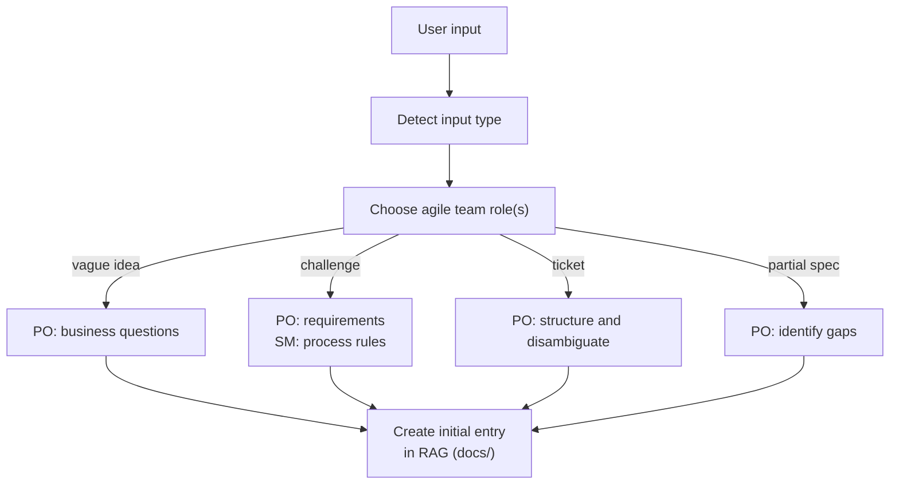
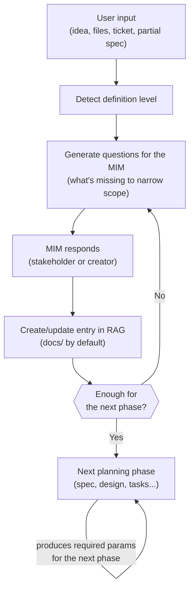
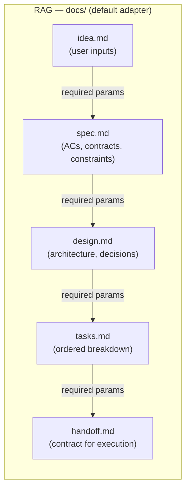
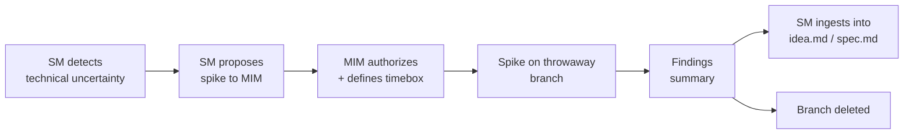
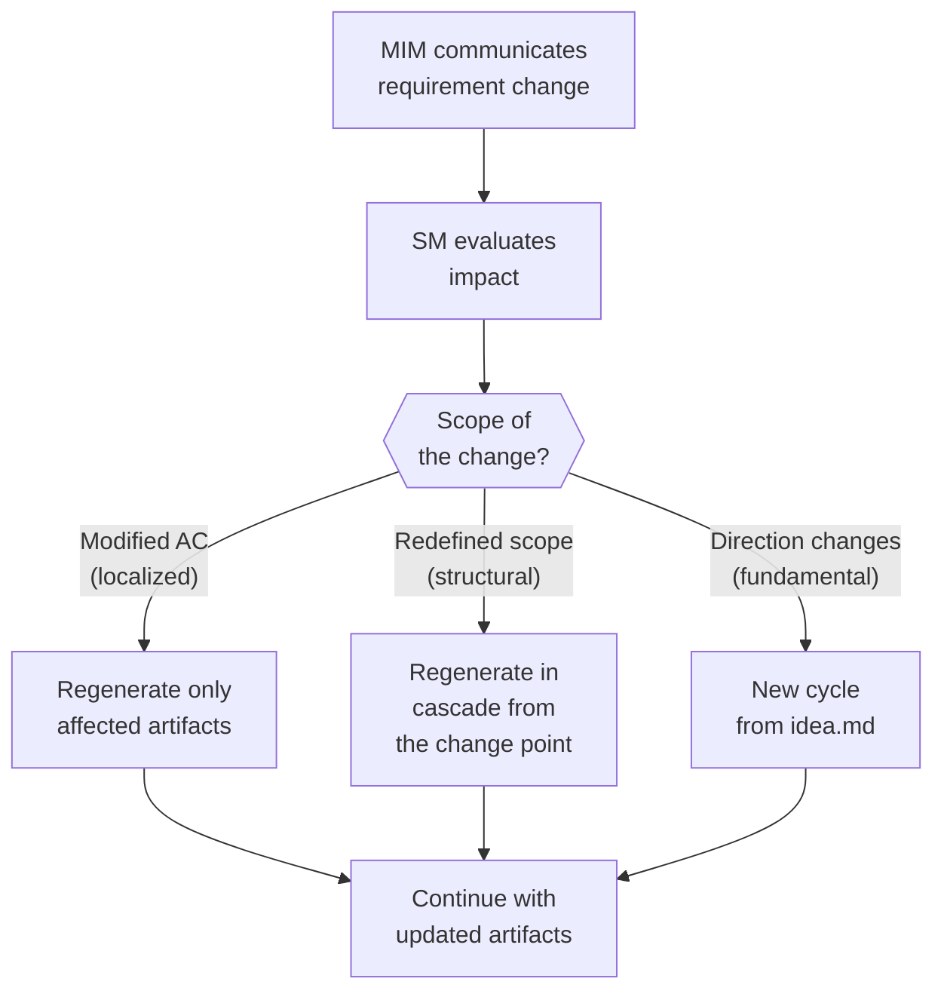
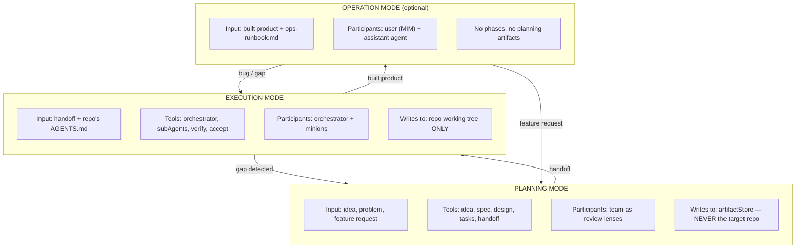

# Operational Model Design — idea-to-mvp

← [Main Index](../README.md) | [Planning](README.md)

> Goal: define HOW the framework operates before deciding HOW to
> implement it (skills, agents, packages, etc.).
>
> **Framework scope**: Optimized for the "1 human (MIM) + N AI
> agents" case. For human teams, the phases and artifacts are
> reusable but the delegation model (rigid contracts, SM as the
> single point of interaction) needs to be adapted.

---

## Contents

- [The Problem](#the-problem)
- [Global Behavior](#global-behavior)
- [Ownership and Context Model](#ownership-and-context-model)
- [Framework Modes](#framework-modes)
- [Spike — Time-Boxed Exploration](#spike--time-boxed-exploration)
- [Pivot — Requirement Changes as a Normal Operation](#pivot--requirement-changes-as-a-normal-operation)
- [Limits](#limits)
- [The Handoff as a Contract](#the-handoff-as-a-contract)
- [What Lives WHERE](#what-lives-where)
- [artifactStore Adapters](#artifactstore-adapters)
- [Team — When and How](#team--when-and-how)
- [What Stays in AGENTS.md (per-repo governance)](#what-stays-in-agentsmd-per-repo-governance)
- [What Does NOT Go in AGENTS.md](#what-does-not-go-in-agentsmd)
- [Multi-Model Delegation Strategy](#multi-model-delegation-strategy)
- [Open Questions](#open-questions)

---

## The Problem

The framework currently mixes three concerns in a single repository:

1. **Governance rules** — AGENTS.md axioms, compactRules, pipeline
   phases. These DO BELONG to every repo that adopts the framework.
2. **Planning tooling** — cycle phases (idea, spec, design,
   tasks, handoff), team roles, artifact persistence
   (engram, local, hybrid). These are OPERATIONAL and must not
   contaminate adopting repos.
3. **Execution tooling** — orchestrator-minion pattern, delegation to
   subAgents, personality/context injection, skill resolution.
   These are RUNTIME concerns and must not be coupled to governance
   rules.

Result: adopting repos accumulate `.tmp-*` files,
`openspec/` directories, feedback documents and planning-cycle state
that have nothing to do with their codebase.

Every repo has a right to its own AGENTS.md. The tooling that helps
CREATE and ENFORCE that AGENTS.md must live elsewhere.

[↑ Contents](#contents)

---

## Global Behavior

See [SM behavior](behavior/README.md) —
the SM acts as a phase router, convenes roles, validates gates, and
blocks premature advancement.

[↑ Contents](#contents)

---

## Ownership and Context Model

The framework operates with two levels of ownership over project context:

### SM — Total ownership, load on demand

The SM is the only actor with the complete map of the project: it knows
all topic keys, artifact slugs, state machine states, phase contracts,
and available roles. But it does NOT load everything into its context —
it consults via RAG when needed. The SM knows everything exists and
WHERE it is; it only brings into its context window what the current
decision requires.

### subAgents — Ownership bounded by delegationContract

subAgents (team roles, TPM, ad-hoc agents) receive
ONLY what their role and phase require, as defined in the
delegationContract. They do not know the rest of the context exists,
nor do they need to know. Their scope is the contract — nothing more.

### Operating principle

No actor loads what it does not need. The SM has total but lazy
access; subAgents have partial but sufficient access. A subAgent that
attempts to load the entire project context is violating this
principle — the delegationContract IS the scope boundary.

This applies to both humans and agents: `{repo}/docs/` is accessible
to everyone, but each actor consults only the artifacts relevant to
its current task.

[↑ Contents](#contents)

---

## Framework Modes

This document details planning in depth. execution is summarized here
and detailed in [Execution Model](../execution/README.md). operation
is summarized here and detailed in [Operation Model](../operation/README.md).

### Planning (idea → handoffs)

**Purpose**: produce sources of truth and plans. No code execution.

**Who participates**: the team (PO, Dev Lead, SM, UX, QA, DevSecOps)
as review lenses — not as agents that write code.

#### Accepted inputs

Planning mode starts from any level of definition.
**At this stage, stack, architecture and technologies are NOT
detected.** The only thing that happens is: creating the project's
initial entry in the RAG.

The system detects the type of input and chooses which agile team
role processes it:

| Input level | Example | Assigned role | Action |
|-----------------|---------|-------------|--------|
| Vague idea | "Build the Uber for boats" | PO | Asks business questions to the MIM to narrow scope and value |
| Challenge files | README.md + seeds + schema from a tech challenge | PO + SM | PO extracts requirements and constraints. SM delegates to the smProcess subAgent the extraction of process rules (timebox, evaluation, restrictions) |
| External ticket | Link to Jira, Linear, Confluence, GitHub Issue | PO | Reads, structures, identifies ambiguities (via TBD adapter) |
| Partial specification | "REST API with JWT auth and product CRUD" | PO | Identifies gaps in the requirements and asks only about what is missing |



The point is: **it doesn't matter how vague or precise the input is**.
The system detects the level of definition, chooses the right role, and
produces ONE thing: the project's initial entry in the RAG (`idea.md`).
Nothing more.

Technical decisions (stack, architecture, patterns) do NOT belong to
this stage. They come later, when the Dev Lead and DevSecOps enter the
design phases.

#### Flow: from idea to handoff



#### The RAG as a progressive source of truth

The artifactStore is NOT just persistence — it is a **RAG** that
agents consult to obtain BOUNDED context without crawling the codebase.

Fundamental principle: **each phase consumes the output of the
previous one and produces the required params of the next**. No agent
needs to read "everything" — only the slice that corresponds to it.



Context evolution at each phase:

| Phase | Consumes from RAG | Produces to RAG | Who consults afterward |
|------|----------------|---------------|----------------------|
| Define idea | Nothing (fresh user input) | `idea.md` — the problem, scope, constraints | Spec phase |
| Specify | `idea.md` | `spec.md` — ACs, contracts, constraints | Design phase |
| Design | `idea.md` + `spec.md` | `design.md` — architecture, patterns, tradeoffs | Tasks phase |
| Break down tasks | `spec.md` + `design.md` | `tasks.md` — ordered tasks with dependencies | Handoff phase |
| Generate handoff | `spec.md` + `design.md` + `tasks.md` | `handoff.md` — self-contained contract | Execution mode |

**Key point**: when an execution agent needs context, it does not read
15 files from the repo — it fetches from the RAG and gets exactly the
slice it needs. At the start (define idea) the RAG only contains user
inputs. At the end (handoff) it contains the entire chain of decisions.

#### Guidance to the MIM (question generation)

The system does not expect the MIM to know what to ask. Based on the
detected input level, it generates targeted questions:

For a **vague idea** ("Uber for boats"):

- Who is the end user? (passengers, boat owners, both)
- What is the core flow? (book, pay, track)
- What platform? (web, mobile, both)
- Are there technical constraints? (stack, hosting, budget)
- MVP or full product? Deadline?

For a **tech challenge** (repo files):

- What is the timebox?
- Are there undocumented stack constraints?
- What is being evaluated? (code, process, architecture, all of it)
- Can AI tooling be used? With what restrictions?

For an **external ticket**:

- Are the ACs complete or is there ambiguity?
- Are there blocking dependencies?
- Who approves the result?

Questions adapt: if the MIM IS the stakeholder/creator, they answer
directly. If not, they use them as a guide to obtain the answers.

#### Default adapter: local files as RAG

- Default path (configurable route): `~/.idea-to-mvp/projects/{name}/docs/`
  — **outside** the target repo (guarantees planning mode never
  contaminates the working tree)
- Format: markdown files, one per artifact
- Human-readable, optionally versionable with git
- Agents fetch specific files, not a full crawl
- Additional adapters (engram, Jira, Confluence, etc.): TBD

**Key restriction**: planning mode NEVER touches the target repo's
working tree. It reads the codebase to inform decisions, but all
output goes to the artifactStore — not to scattered `.tmp-*` files
in the repo.

#### Team in this mode

Each role is a LENS that reviews planning artifacts from its own
perspective. PO validates scope against user value. QA validates
testability. DevSecOps validates security surface. They produce
review verdicts, not code.

Lenses activate AFTER a phase produces its artifact —
they review what was produced, they don't participate in generating it.
If a lens finds a gap, the system returns to the question cycle for
that phase.

---

### Execution (handoffs → working code)

**Purpose**: implement what planning produced. Code gets written.

**Input**: handoff documents from planning, the target repo's
AGENTS.md, resolved compactRules.

**Output**: implemented, tested, refactored code certified by QA
in the target repo's working tree.

**Key restriction**: execution mode ONLY writes to the target repo's
working tree. It does NOT create planning artifacts, feedback
documents or process state files in the repo.

For the complete definition of execution (phases, roles, iterative
cycle, orchestrator delegation model, and connection with planning), see
[Execution Model](../execution/README.md).

---

### Operation (product → usage)

**Purpose**: the MIM uses the built product; the agent assists as
operator. Optional and reactive mode — no phases, no team.

**Facade/plugin pattern**: Operation is NOT a mandatory phase of
the cycle. It is a **facade** — each project decides whether to
activate it based on whether it has a post-delivery surface to
operate. A one-off script or a proof of concept does not need
Operation; a deployed service or a distributed CLI does. The decision
to activate it is made in `idea.md` (section "active roles") and does
not block closing the planning cycle if the project doesn't require it.

**Adapter by project type**: the artifact this phase produces
varies depending on what type of surface the project exposes:

| Project type | Operation adapter | What it documents |
|-------------------|----------------------|----------------|
| Service (API, deployed backend) | `ops-runbook.md` | Deploy/rollback, monitoring, alerts, troubleshooting (see `artifacts/schemas.md` → `ops-runbook.md`) |
| CLI | Usage guide (`usage-guide.md`) | Flags, commands, exit codes, invocation examples |
| Library / package | API reference (`api-reference.md`) | Public surface, migration guide, changelog |

Each adapter reuses the same infrastructure (TPM, artifactStore,
Accept gate) — what changes is the content and the backing
standard (ITIL 4 / Google SRE PRR for runbooks, IEEE 1063 for
user documentation in CLIs and libraries).

**Input**: built product (output of execution), the corresponding
adapter's artifact (if any), project documentation.

**Key restriction**: no planning artifacts or ceremony exist here.
If operation reveals a gap, it escalates back to planning or execution.

For the complete definition (when it activates, types of operation, flow),
see [Operation Model](../operation/README.md).

---

### Spike — Time-Boxed Exploration

A spike is a time-boxed exploration that produces throwaway code to
inform planning decisions. It is the mechanism the framework uses
when uncertainty is too high to plan directly.

**When it applies**: the SM detects it cannot proceed with planning
because there are questions that can only be answered by writing code
(technical feasibility, API performance, library compatibility).

**Spike rules**:

| Aspect | Rule |
|---------|-------|
| **Authorization** | Only the MIM authorizes a spike. The SM proposes it, does not start it |
| **Timebox** | Maximum defined at authorization time (e.g., "2 hours", "1 session"). The SM reports to the MIM when it expires |
| **Branch** | Throwaway branch (`spike/{name}`). Deleted after extracting conclusions |
| **Output** | NOT production code. The output is knowledge that feeds `idea.md` or `spec.md` |
| **Artifacts** | Does not generate the 5 universal artifacts. Produces a findings summary that the SM ingests into the artifactStore |
| **Echo** | Reduced: Setup + Build only. No tests, linting, or coverage required |



**Spike vs. prototype**: a spike is not a prototype. A prototype seeks
to validate UX or flow; a spike seeks to answer a concrete technical
question. Spike code is NEVER promoted to production — it gets
rewritten with the acquired knowledge.

[↑ Contents](#contents)

---

### Pivot — Requirement Changes as a Normal Operation

A pivot is a requirement change that alters the scope, direction, or
acceptance criteria of work in progress. The framework treats pivots
as legitimate operations, not as errors or exceptions.

**Principle**: requirements change because context changes (market
feedback, technical discovery, stakeholder decision). The framework
must absorb that change without requiring the entire cycle to restart
from scratch.

**Pivot flow**:



**Pivot categories**:

| Category | Example | Impact on artifacts |
|-----------|---------|----------------------|
| **Localized** | "AC-3 now requires pagination" | Only `spec.md` and `tasks.md` are updated. `idea.md` and `design.md` intact |
| **Structural** | "It's no longer REST, it will be GraphQL" | `design.md` is regenerated. `tasks.md` and `handoff.md` regenerate in cascade. `idea.md` and `spec.md` may remain |
| **Fundamental** | "The product isn't for consumers, it's B2B" | New cycle from `idea.md`. Previous artifacts are archived as reference |

**Pivot rules**:

1. The SM does NOT discard artifacts — it marks them as superseded with
   a reference to the pivot reason.
2. Regeneration is selective: the SM evaluates which downstream
   artifacts are invalidated by the change and regenerates only those.
3. The fastForward score is recalculated post-pivot. A pivot can escalate
   or de-escalate the tier.
4. If the pivot occurs during execution, the SM halts execution and
   returns to planning to regenerate the affected artifacts before
   continuing.

[↑ Contents](#contents)

---

### Entry point: Codebase Takeover

For legacy or existing codebases being onboarded into the framework, the
SM runs a **discovery (archaeology)** phase before evaluating the
fastForward scoring.

#### Discovery phase

The SM audits the actual state of the codebase before assigning points:

| Dimension | What it looks for | Where it finds it |
|-----------|-----------|-------------------|
| **Documentation** | README, ADRs, specs, wikis | Root, `/docs`, `/adr`, repo wiki |
| **Tests** | Existing suite, coverage, test types | `/tests`, `/spec`, `/__tests__`, CI config |
| **CI/CD** | Pipeline, gates, automated checks | `.github/workflows`, `.gitlab-ci.yml`, `Jenkinsfile` |
| **Architecture** | Patterns, structure, stack | Directory structure, `package.json`, imports |
| **Technical debt** | TODOs, hacks, documented workarounds | Code comments, open issues, backlog |

#### Scoring override for brownfield

Standard F1-F4 scoring measures certainty about FUTURE work. In a
takeover, the situation is different: there is high certainty about
what EXISTS but low certainty about what should be CHANGED. The SM
applies an override:

| Factor | Standard scoring (greenfield) | Takeover override |
|--------|-------------------------------|-------------------|
| **F1. Artifacts** | Do artifacts exist in the RAG? | Do functional equivalents exist? (README ≈ idea.md, tests ≈ partial spec.md) |
| **F2. Standardization** | Is the domain standard? | Does the codebase follow recognizable standards? |
| **F3. Ambiguity** | How many possible interpretations? | Is it clear what the system does? (not what needs to change) |
| **F4. Reference** | Is there a codebase with patterns? | Always 2 — the codebase IS the reference |

**Consequence**: F4=2 always in takeover. This raises the base score and
prevents a well-documented codebase with tests from falling into Full
Tier (the fastForward paradox).

#### Incremental echo bootstrap

In a takeover, echo does not activate all at once. It bootstraps in
layers:

| Week | Echo step | What activates | Threshold |
|--------|-----------|---------------|--------|
| 1 | Setup | Dependencies resolve, project compiles | Build passes |
| 2 | Static analysis | Linter configured, 0 new errors | Baseline established |
| 3 | Build + Static | The two previous plus formatting | Green CI |
| 4+ | Dynamic | Existing tests pass, baseline coverage measured | No regression |
| Month 2+ | Full echo | All 5 steps, E2E if applicable | Project thresholds |

Each layer activates only when the previous one is stable. The SM does
NOT demand full echo from day 1 in a takeover.

#### Entry point table (expanded)

| Situation | Discovery | Entry point | Likely tier |
|-----------|---------------|-----------------|---------------|
| Legacy codebase, no planned changes | Light archaeology | operation — operate and learn | N/A (no planning) |
| Legacy codebase, planned changes, well documented | Full archaeology | fastForward — existing docs count as partial artifacts | Light or Standard |
| Legacy codebase, planned changes, no documentation | Full archaeology | planning — generate missing artifacts | Standard or Full |
| Legacy codebase with critical technical debt | Archaeology + spike(s) | planning with spike(s) to evaluate feasibility, then fastForward | Depends on the spike |
| Abandoned codebase (no active maintainers) | Deep archaeology | planning from idea.md — treat as a new product with legacy context | Full |

The SM does not demand recreating artifacts that already exist in
equivalent form (a detailed README can fulfill the function of
`idea.md`, an existing test suite informs `spec.md`).

[↑ Contents](#contents)

---

## Limits



[↑ Contents](#contents)

---

## The Handoff as a Contract

The handoff document is the interface between modes. It must be:

- **Self-contained**: an executor who never saw the planning
  conversation can act without asking questions.
- **Portable**: works independently of the adapter that produced it.
- **Bounded**: states exactly what to do, what NOT to do, and what
  success looks like.

The handoff is NOT a file in the target repo. It lives in the
artifactStore and is READ by execution mode.

[↑ Contents](#contents)

---

## What Lives WHERE

| Artifact | Where it lives | Why |
|-----------|-----------|---------|
| AGENTS.md | Target repo (root) | Governance is per-repo. Each project owns its rules. |
| Planning artifacts (proposals, specs, designs, tasks) | artifactStore (depends on adapter) | Inform the work, they are not the work. |
| Handoff documents | artifactStore | Contract between planning and execution. |
| Cycle state (phase tracking, DAG) | artifactStore | Operational state, not project state. |
| Adopter feedback | artifactStore (tagged to source framework) | Input for framework evolution, not repo content. |
| Code, tests, configs | Target repo | The actual deliverable. |
| `.tmp-*` files | NOWHERE in the target repo | Eliminated. Planning artifacts go to the store. |

[↑ Contents](#contents)

---

## artifactStore Adapters

The framework needs a pluggable persistence layer. Each adapter
implements the same universalInterface (see `artifacts/README.md` →
"Persistence Adapters" for the complete definition of the 9
operations: `ingest`, `save`, `read`, `search`, `list`,
`verifyConsistency`, `delete`, `history`, `transition`). All write
operations are mediated by the TPM (see `artifacts/README.md`
→ "TPM as DBMS"); reads can be direct via patternB.
Artifact state management uses `transition` exclusively
(the former `markComplete` was absorbed by `transition`).

### Local adapter (default)

- Stores artifacts as markdown files in
  `~/.idea-to-mvp/projects/{name}/docs/` (configurable path, defaults
  to the one indicated)
- **Outside** the target repository — planning mode never touches the repo's working tree
- Advantages: zero dependencies, human-readable, optionally versionable
- Disadvantage: no cross-machine access, no semantic search

### Engram adapter

- Stores artifacts as engram observations with structured topic keys.
- Advantages: cross-session, searchable, survives compaction.
- Disadvantage: requires the engram MCP server, content may be truncated in
  search results (`mem_get_observation` needed for full content).

### Hybrid adapter

- Writes to both: local and engram.
- Advantages: best of both worlds — local readability +
  cross-session persistence.
- Disadvantage: higher token cost per operation.

[↑ Contents](#contents)

---

## Team — When and How

The planning team is a PLANNING tool, not an execution tool.

| Role | When it activates | What it does | What it does NOT do |
|-----|-----------------|----------|-------------|
| PO | Idea, Spec, Verify, Accept, Retro | Validates scope, prioritizes, defines ACs, accepts deliverables | Write code, review PRs |
| Dev Lead | Design, Tasks, Verify, Accept, Retro | Validates architecture, estimates, sequences, reviews technical quality | Execute tasks (that's execution mode) |
| SM | All phases | Facilitates, removes blockers, validates process, orchestrates gates | Produce content, read files |
| UX | Spec, Design, Verify, Accept, Retro | Validates decisions that affect the user | Implement UI |
| QA | Spec, Tasks (cond), Verify, Accept, Retro | Validates testability, defines test strategy, verifies coverage | Write production code |
| DevSecOps | Design, Tasks (cond), Verify, Accept, Retro | Validates security surface, infra decisions, security posture | Deploy |
| *Ad-hoc* | Any phase, per contract | Specialized expertise outside the default team (DBA, Performance Engineer, Domain Expert, etc.). The SM defines and convenes them with a full contract. | Depends on the contract |

> **Note**: the 5 productive roles above (plus the SM as
> infrastructure) form the **default** team. The SM can extend the
> team with ad-hoc roles when the project requires expertise no
> default role covers. See `roles/README.md` section "Ad-Hoc Roles".

**During execution**, the team is silent. The orchestrator and
subAgents do the work. If execution reveals a planning gap,
the orchestrator can escalate BACK to planning mode.

**Post-execution** (Verify, Accept, Retrospective), the team
RE-ACTIVATES as a review panel. These phases are part of planning
mode — they operate over the results of execution, not directly over
code. See `behavior/README.md` Phases 6-8 and
`roles/README.md` for the delegationContracts of each role in these
phases.

[↑ Contents](#contents)

---

## What Stays in AGENTS.md (per-repo governance)

These are the things every adopting repo receives:

- Axioms (non-negotiable principles)
- Pipeline phases (the sequence of work)
- Phase gates (DOR, DOD, MIM checkpoints)
- compactRules (project-specific code standards)
- Role definitions (what each role validates at the gates)
- Activation tiers (how much ceremony based on project maturity)

These are RULES, not TOOLS. They say what must be true, not how
to make it true.

[↑ Contents](#contents)

---

## What Does NOT Go in AGENTS.md

- Planning cycle phase definitions (idea, spec, design, etc.)
- artifactStore configuration
- Orchestrator delegation patterns
- subAgent personality templates
- Engram topic key formats
- Skill resolution protocols
- Model assignment tables

These are OPERATIONAL. They belong to the tooling layer, not the
governance layer.

[↑ Contents](#contents)

---

## Multi-Model Delegation Strategy

The SM selects the model tier per task using a simple criterion:
**Is the correct output derivable from rules/templates, or does it require judgment?**

> In operation scenarios with multiple simultaneous agents, the
> PDC delegation protocol (see `delegation-pdc.md`) defines
> risk-based autonomy levels to keep the MIM from becoming a
> bottleneck.

| Tier | Runtime | Selection criterion | Cost |
|------|---------|----------------------|-------|
| **Local** (on-premise model) | Local model (e.g., Docker, Ollama), zero cost per token | Output is deterministic or template-driven. Does not require complex reasoning. | Zero (local compute only) |
| **Cloud** (model via API) | Remote API (e.g., Claude, Codex), cost per token | Requires synthesis, judgment, creativity, or reasoning over ambiguous context. | Proportional to usage |

### Assignment by component

| Component | Tier | Justification |
|-----------|------|---------------|
| **TPM** (validate format, verify schema, generate markdown, batch writes, slug) | Local | Mechanical operations with well-defined rules |
| **Echo Protocol** — structural checks (completeness, format, required fields) | Local | Verifiable with rules |
| **Echo Protocol** — semantic checks (coherence, contradictions, quality) | Cloud | Requires content comprehension |
| **SM** (coordination, routing decisions, gate evaluation) | Cloud | Requires judgment over context |
| **PO** (spec from ambiguous input, prioritization, ACs) | Cloud | Synthesis and judgment |
| **Dev Lead** (architectural design, estimation, sequencing) | Cloud | Deep technical reasoning |
| **QA** (adversarial review, test strategy, verification) | Cloud | Adversarial judgment and creativity |
| **DevSecOps** (threat model, surface analysis) | Cloud | Security reasoning |
| **UX** (validation of user decisions) | Cloud | Empathy and product judgment |
| **Retro** (stop/start/continue synthesis, agreements) | Cloud | Synthesis of multiple perspectives |

### Decision rule

```plaintext
if (output == template_with_slots && no_ambiguity)
  → Local
else
  → Cloud
```

The SM doesn't need complex scoring. If the template and the slots
can be written in advance, the task is mechanical. If the agent needs
to **think**, it's cloud.

### Implementation note

Model selection is a **tooling** decision, not a governance one.
Each project can configure which local model to use (llama3, mistral,
phi, etc.) and which cloud provider to prefer. The framework defines the
selection CRITERION, not the specific model.

[↑ Contents](#contents)

---

## Open Questions

1. **Where does the tooling live?**
   Options: Claude Code skills (installable), a distributable
   package (npm, pip, cargo, etc.), a dotfiles convention (`~/.idea-to-mvp/`),
   or a combination.

2. **How does a repo "opt in" to the framework?**
   Currently: copy AGENTS.md. Should there be a bootstrap command
   (`/sdd-init` or equivalent) that sets up the tooling layer without
   contaminating the repo?

3. **How does feedback flow back to the framework?**
   fullstack-base produced feedback for idea-to-mvp. Where does that
   feedback live? How is it tracked? Currently it's a `.tmp-*` file in the
   framework repo — which is the same contamination we want to eliminate.

4. **Should the handoff format be standardized?**
   If the handoff is the contract between modes, its structure matters.
   A schema? A template? Minimum required fields?

5. ~~**How do activation tiers affect mode separation?**~~
   **RESOLVED**: activation tiers (Light, Standard, Full)
   are defined in `behavior/README.md` → section
   "Activation Tiers". The SM determines the tier at the start of the cycle
   using the fastForward F1-F4 score. Tiers scale ceremony
   (roles, gates, dispatch), not artifacts.

6. ~~**Verification in execution mode — who does it?**~~
   **RESOLVED**: Verify (Phase 6) and Accept (Phase 7) are
   POST-execution phases of planning mode. The team reactivates
   as a review panel. Retro (Phase 8) closes the cycle and feeds
   the next one. See `behavior/README.md` Phases 6-8.

7. ~~**Should planning artifacts be compressed for small
   changes (Light Tier), or is the full set always produced
   (idea/spec/design/tasks/handoff)?**~~
   **RESOLVED**: In Light Tier, planning artifacts CAN be
   compressed into a single document (`plan.md`) containing the
   essential sections of idea + spec + design + tasks in abbreviated
   form. ISO alignment is maintained (the content sections
   exist), but the physical artifact count is reduced. For
   hot-fixes via mid-cycle fastForward, the minimum required is: (1)
   problem description, (2) reproduction test, (3) fix, (4)
   verification.

[↑ Contents](#contents)
