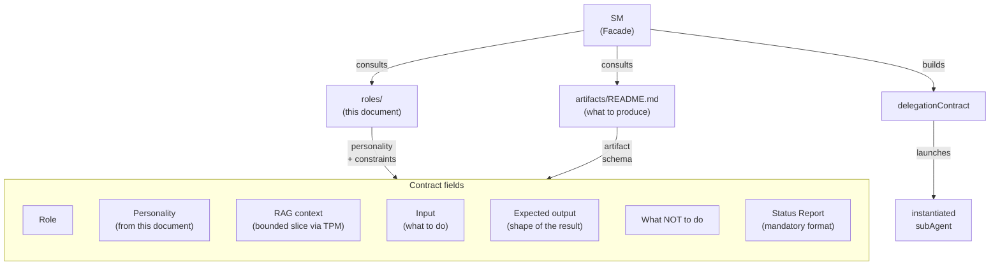
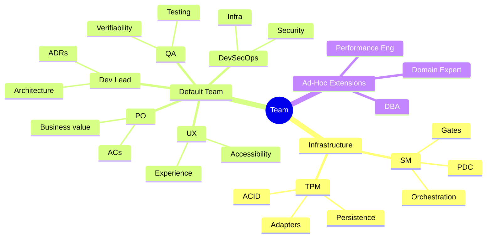
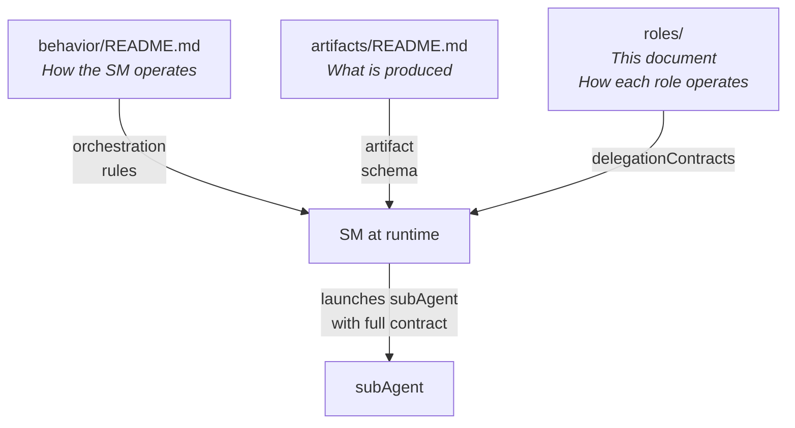

# Role Profiles

← [Main Index](../../README.md) | [Planning](../README.md)

> This document defines HOW each role operates in each phase. It is the
> SM's delegation manual: when it convenes a subAgent, it consults this
> document to build the delegationContract with the correct personality,
> context, expected output, and constraints.
>
> Roles ARE subAgents. They are not people. They are personalities and
> competencies that the SM instantiates for a bounded task. The same
> "agent" can be PO in one phase and QA in another — what matters is the
> contract.

---

## Contents

- [Delegation Architecture](#delegation-architecture)
- [The Default Team — 5 Productive Roles](#the-default-team--5-productive-roles)
- [Contents of this Section](#contents-of-this-section)

---

## Delegation Architecture

The SM **never invents** a contract without structure. It builds it by combining:

1. The role profile (this document for default roles, or an ad-hoc definition) → personality + focus + constraints
2. The artifact model → schema of the expected output
3. The TPM context → bounded slice of the RAG
4. The current phase → what is expected at this specific stage

### Verifiability of personalities

Personalities are NOT decorative — they orient the tone, focus and
priorities of the subAgent. But "skeptical" or "paranoid" are not
verifiable on their own. For the SM to be able to evaluate whether the
personality was applied, each contract includes **verifiable output
constraints** derived from the personality:

| Personality | Verifiable output constraint |
|-------------|-------------------------------|
| Curious, empathetic (PO Phase 1) | Output includes at least 3 open questions to the MIM |
| Precise, demanding (PO Phase 2) | Each AC follows given/when/then format. 0 ambiguous ACs allowed |
| Skeptical (QA) | Each AC has an explicit verdict (verifiable / not verifiable) with justification |
| User advocate (UX) | Each observation references a concrete user flow |
| Analytical, tradeoffs (Dev Lead Phase 3) | Each decision has at least 1 evaluated alternative (ADR) |
| Constructively paranoid (DevSecOps) | Each observation maps to a concrete attack vector or control |
| Methodical, dependencies (Dev Lead Phase 4) | Each task has parent_id, depends_on, and traces_to |
| Inspector (QA Phase 4) | Each task has an explicit verification criterion |
| Rigorous, evidence-based (QA Phase 6) | Each verdict cites specific evidence (test name, line, output) |

The SM verifies these constraints during the ECHO step of the PDC. If the
output does not meet them → re-delegation with a more explicit contract,
not agent failure.

[↑ Contents](#contents)

---

## The Default Team — 5 Productive Roles

### Identity of each role

| Role | Core expertise | Defining question | Human analog |
|-----|---------------|--------------------|-----------------|
| **PO** | Business value, prioritization, stakeholder management | "Does this solve a real problem for the user?" | Product Manager |
| **Dev Lead** | Architecture, patterns, technical decisions, tradeoffs | "How do we build this so it scales and stays maintainable?" | Staff Engineer / Architect |
| **QA** | Verifiability, edge cases, testing strategy | "How do I know this works? How do I know it does NOT work?" | QA Lead |
| **DevSecOps** | Security, infrastructure, deployment, observability | "Is this secure? Can this be operated?" | Security Engineer + SRE |
| **UX** | User experience, usability, flows, accessibility | "Can the user do what they need without friction?" | UX Designer |

> **Note**: SM and TPM are NOT productive roles — they are
> infrastructure. SM orchestrates; TPM persists. They do not appear in
> this document because their behavior is defined in
> [SM Behavior](../behavior/README.md).

### The 5 roles are the DEFAULT team, not a ceiling

The 5 roles cover 80-90% of projects. But they are NOT a closed
set. The SM can convene **ad-hoc roles** when the project requires
expertise outside the default team. See [Ad-Hoc Roles](ad-hoc.md).

Visual complement: the mindmap groups roles by their function within
the framework — infrastructure (never produces content), default
team (standard production), and ad-hoc extensions (specific expertise).

[↑ Contents](#contents)

---

## Contents of this Section

This document is divided into three pages:

| Page | Content |
|--------|-----------|
| **README.md** (this document) | Delegation architecture, personality verifiability, default team identity |
| [Contracts by Phase](profiles-by-phase.md) | Detailed delegationContracts by role and phase (Phase 1-8), conditional activation table, condensation for a solo developer, role interaction diagrams |
| [Ad-Hoc Roles](ad-hoc.md) | When and how to create roles outside the default team, ad-hoc contract, complete example (Data Architect) |

[↑ Contents](#contents)

---

## Relation to Other Documents

- **[SM Behavior](../behavior/README.md)** — defines the SM's rules:
  state machine, fastForward, post-hoc supervision, blocking. The SM consults
  THAT document to know HOW to orchestrate.
- **[Artifacts](../artifacts/README.md)** — defines the 6
  universal artifacts, their ISO schema, and the adapter interface. The SM
  consults THAT document to know WHAT to produce.
- **This document** — defines the 5 default roles, the ad-hoc role
  mechanism, per-phase personality, delegationContracts, and
  conditional activation rules. The SM consults THIS document to
  know WHO to convene and WITH WHAT contract — both for the
  default team and for ad-hoc extensions.

[↑ Contents](#contents)
