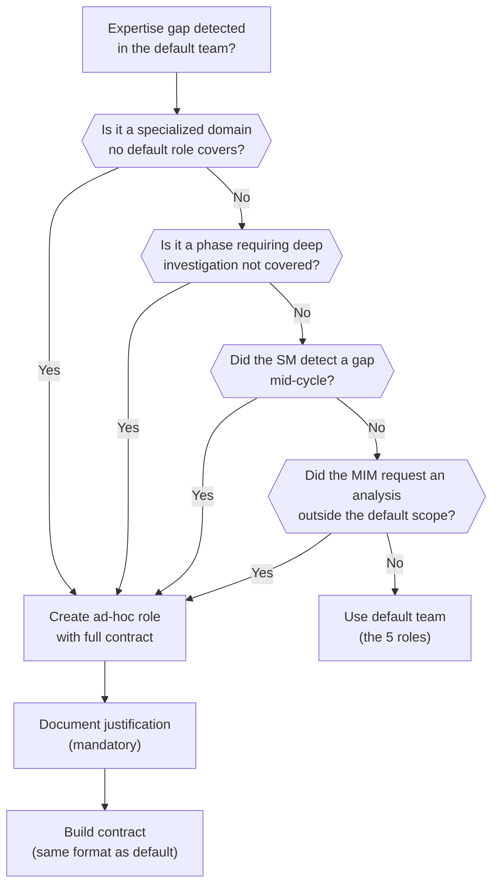

# Ad-Hoc Roles

← [Main Index](../../README.md) | [Planning](../README.md) | [Roles](README.md)

The SM has the authority to define and convene roles that do not exist in
the default table. The principle: if the project needs an expert that
none of the 5 roles adequately covers, the SM creates one rather than
forcing an existing role outside its competence.

---

## Contents

- [When to Create an Ad-Hoc Role](#when-to-create-an-ad-hoc-role)
- [Contract of an Ad-Hoc Role](#contract-of-an-ad-hoc-role)
- [Example: Ad-Hoc Role `Data Architect`](#example-ad-hoc-role-data-architect)
- [Ad-Hoc Role Restrictions](#ad-hoc-role-restrictions)
- [Examples of Common Ad-Hoc Roles](#examples-of-common-ad-hoc-roles)

---

## When to Create an Ad-Hoc Role

| Signal | Example |
|-------|---------|
| The project domain requires specialized expertise no default role covers | Medical project → `Regulatory Specialist` for HIPAA/GDPR compliance |
| A phase needs deep investigation in an area not covered | Migration to a new platform → `Platform Researcher` to evaluate options |
| The SM detects an expertise gap mid-cycle | WCAG AAA accessibility requirement → `Accessibility Specialist` |
| The MIM requests a type of analysis outside the default roles' scope | Performance analysis → `Performance Engineer` |

### Decision flow



[↑ Contents](#contents)

---

## Contract of an Ad-Hoc Role

The ad-hoc role uses the **same contract format** as default roles.
The SM builds it on the spot, defining each field:

| Field | Mandatory | Description |
|-------|-------------|-------------|
| **Role** | Yes | Descriptive expertise name (`DBA`, `Performance Engineer`, `Legal Analyst`, etc.) |
| **Justification** | Yes | Why the default roles do not cover this need. One sentence, auditable. |
| **Core expertise** | Yes | Domain of knowledge and competence |
| **Defining question** | Yes | The question this role asks itself before every decision |
| **Personality** | Yes | Tone, focus, priorities for the current phase |
| **RAG context** | Yes | What information it receives (topic_keys) |
| **Input** | Yes | What it is asked to do |
| **Expected output** | Yes | Shape of the result |
| **Does NOT do** | Yes | Scope restrictions — what is outside its jurisdiction |
| **Upstream escalation** | Yes | If it discovers a gap in an artifact from earlier phases, it MUST report it to the SM for re-evaluation. It cannot resolve upstream gaps on its own. |
| **Status Report** | Yes | Mandatory format (same as default roles) |
| **Gate** | Yes | Completion criterion for its deliverable |
| **Active phases** | Yes | Which phases this role participates in |
| **Vote in Phase 7** | No | Whether it has voting power in acceptance (default: NO — advisory only) |

[↑ Contents](#contents)

---

## Example: Ad-Hoc Role `Data Architect`

```plaintext
delegationContract (ad-hoc):
─────────────────────────────────────────────
Role:            Data Architect (ad-hoc)
Justification:   The project handles 12 entities with complex relationships
                 and transactional consistency requirements. The Dev Lead
                 covers application architecture, not data modeling.
Expertise:       Relational modeling, normalization, indexes, query
                 optimization, migrations
Question:        "Does the data model support the queries the
                 business needs without degrading?"
Personality:     Methodical, oriented toward referential integrity. Reads the
                 ACs thinking about what queries they generate and whether the model
                 resolves them without N+1 or full scans.
Context:         topic_keys: sdd/{project}/spec + sdd/{project}/design
Input:           Design the data model that supports the ACs.
Output:          ERD (Mermaid), justification of normalization/denormalization
                 decisions, recommended indexes,
                 migration strategy.
Does NOT do:     Does NOT choose ORM or framework. Does NOT implement migrations.
                 Does NOT modify the application architecture.
Status Report:   Mandatory (Status/Progress/Blocker/Artifacts).
Gate:            Model covers all ACs. No inconsistencies.
Active phases:   Design, Tasks (validation), Verify
Vote Phase 7:    YES — can BLOCK for data inconsistency
─────────────────────────────────────────────
```

[↑ Contents](#contents)

---

## Ad-Hoc Role Restrictions

1. **Same contract, same supervision**: the ad-hoc role is subject to the PDC
   (Post-Delegation Checkpoint) and the circuitBreaker just like any
   default role. No exceptions.
2. **Mandatory justification**: the SM MUST document why the default
   team does not cover the need. No justification → the role is not created.
3. **Registration in `idea.md`**: ad-hoc roles are listed in the
   "active roles for this project" section along with default roles, with
   their justification.
4. **Bounded scope**: the SM defines "does NOT do" with the same discipline as
   default roles. An ad-hoc role without restrictions is a scope-creep risk.
5. **Vote in Phase 7**: by default, ad-hoc roles are **advisory** in
   Phase 7 (they give an opinion, not a vote). The SM can promote them to
   voting member if their expertise is critical for acceptance — but must
   declare it in the contract.
6. **No duplicating default roles**: if the ad-hoc role's expertise
   overlaps with a default role, the SM must justify why the default
   is not sufficient. No redundant roles are created.
7. **Lifecycle**: an ad-hoc role lives until the current cycle closes.
   If needed in the next cycle, the SM re-evaluates it — it can be
   promoted to "recurring" in `idea.md` or dropped.

[↑ Contents](#contents)

---

## Examples of Common Ad-Hoc Roles

| Ad-hoc role | When to convene it | Typical phases |
|------------|-------------------|----------------|
| `Performance Engineer` | Latency requirements < 100ms, throughput > 10k rps, critical optimization | Design, Verify |
| `DBA / Data Architect` | Complex data model, migrations, consistency requirements | Design, Tasks, Verify |
| `Accessibility Specialist` | Mandatory WCAG AA/AAA, accessibility audit | Spec, Design, Verify, Accept |
| `Domain Expert` (medical, legal, financial) | Regulated domain with normative constraints | Idea, Spec, Verify |
| `Technical Writer` | Public documentation, API docs, onboarding docs as a deliverable | Tasks, Verify |
| `Researcher / Investigator` | Unknown technology requiring exploration before deciding | pre-Design (bounded investigation) |
| `i18n Specialist` | Complex internationalization requirements (RTL, pluralization, formats) | Spec, Design, Verify |

> **Note**: this table is indicative. The SM can create ANY role
> the project requires, as long as it meets the restrictions above.
> The creativity lies in defining the right contract, not in limiting itself to
> a fixed list.

[↑ Contents](#contents)
