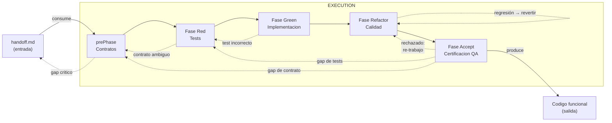
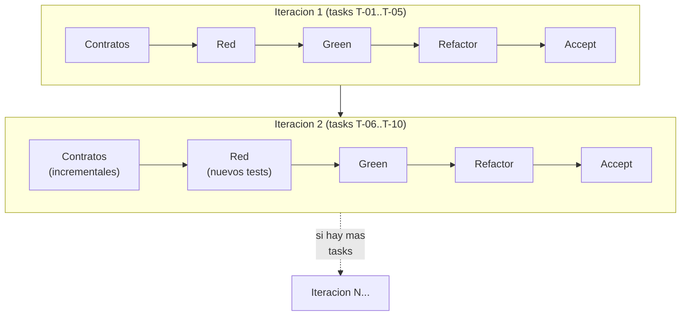
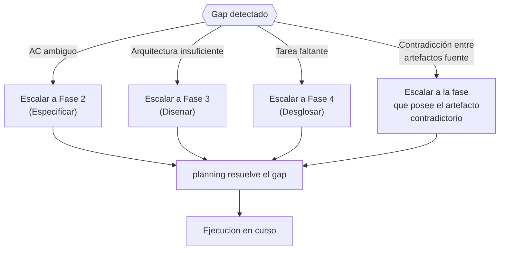
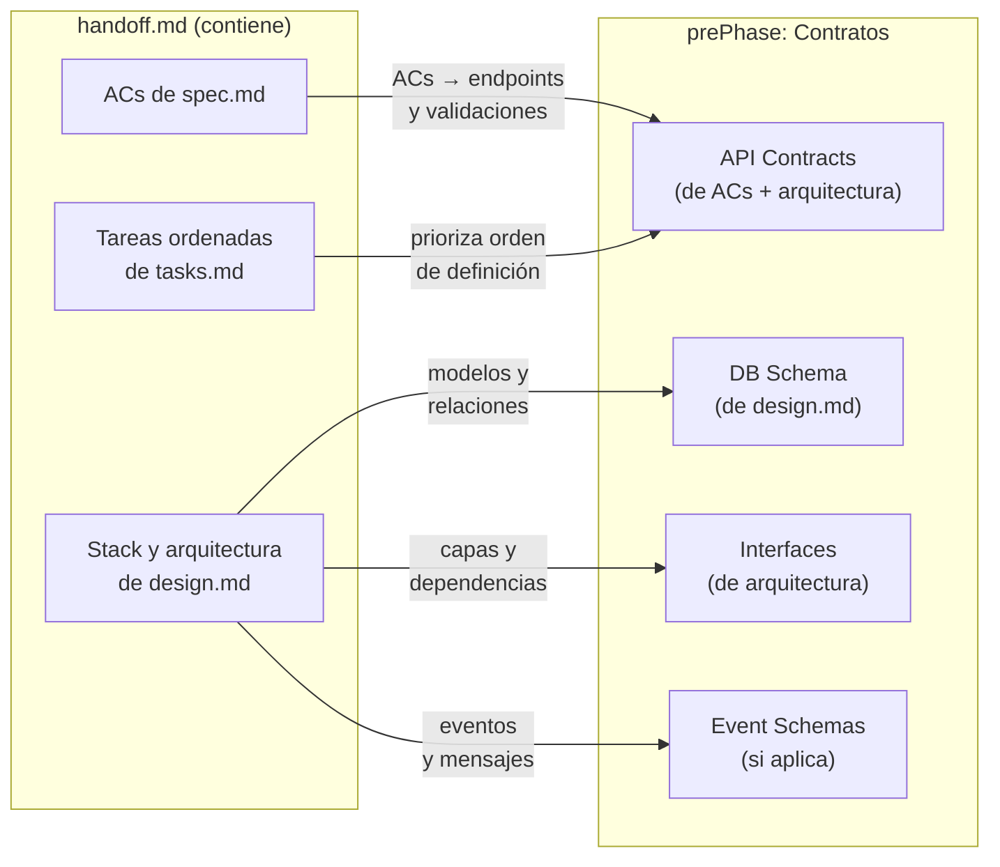
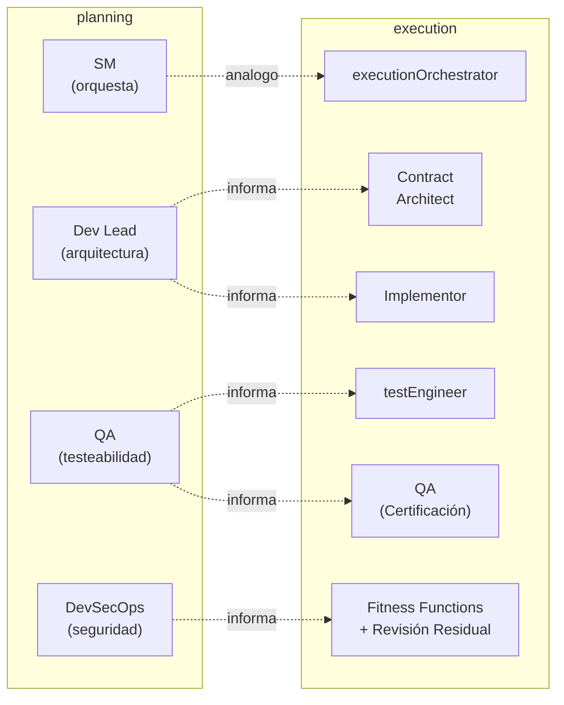
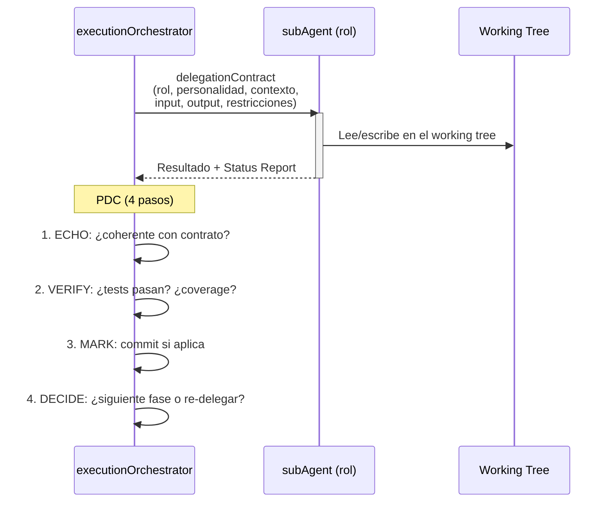

# Modelo de Execution

← [Índice principal](../README.md)

> Del handoff al codigo funcional. Este modo consume el contrato producido
> por planning y produce codigo implementado, probado y
> refactorizado en el working tree del repositorio destino.

---

## Contenido

- [Vision General](#vision-general)
- [Ciclo Iterativo](#ciclo-iterativo)
- [Conexion con planning](#conexion-con-planning)
- [Roles de execution](#roles-de-execution)
- [Modelo de Delegacion del Orquestador](#modelo-de-delegacion-del-orquestador)
- [Ejecución Paralela y Resumption Determinista](#ejecución-paralela-y-resumption-determinista)
- [Que Sigue](#que-sigue)
- [Contenido de esta sección](#contenido-de-esta-sección)

---

## Vision General

Execution transforma un `handoff.md` aprobado en codigo funcional
mediante cinco fases estructurales. La secuencia **Contrato - Red -
Green - Refactor - Accept** no es un ciclo micro por funcion --- es la
columna vertebral macro de toda la ejecucion.

> **TDD a nivel batch, no micro**: Este framework reinterpreta
> Red-Green-Refactor como fases macro — primero toda la suite de tests,
> luego toda la implementación, luego todo el refactoring. Esto es TDD
> por lotes (batch), no TDD función-por-función (micro). El trade-off:
> se pierde feedback rápido entre test individual y su implementación,
> pero se gana una especificación ejecutable completa y la capacidad de
> paralelizar el trabajo del testEngineer y el Contract Architect. Para
> tareas de alta complejidad algorítmica, el Implementor puede usar TDD
> micro dentro de la Fase Green como herramienta complementaria.
>
> **Entrada validada mecánicamente**: execution no arranca sobre un
> `handoff.md` a libre interpretación. Arranca sobre un handoff que pasó
> `virgil handoff lint` — la validación mecánica que verifica que el
> contrato está bien formado (ACs completos, contratos referenciables,
> DAG de tareas consistente) antes de delegar cualquier trabajo a la
> prePhase. Un handoff que no pasa el lint no habilita la ejecución.

### Tabla de fases

| Fase | Entrada | Salida | Actores |
|------|---------|--------|---------|
| prePhase: Contratos | `handoff.md` (spec, design, tasks) | Contratos formales (API, DB, interfaces) | Orquestador + Contract Architect |
| Red | Contratos + ACs de `spec.md` | testPlan + testContract + testImplementation (todos fallan) + cobertura configurada | testEngineer |
| Green | Tests rojos + contratos | Codigo que pasa todos los tests | Implementor |
| Refactor | Codigo verde + tests | Codigo limpio, verificado mecánicamente, alineado a `design.md` | Fitness functions + revisión residual |
| Accept: Certificación QA | Código refactorizado + test reports + reportes de métricas + handoff.md + documentación operativa (si requerida por handoff) | Certificación formal de cumplimiento del handoff | QA (execution) |

[↑ Contenido](#contenido)

---

## Ciclo Iterativo

### Red-Green-Refactor dentro de una iteracion

El ciclo macro (Contrato → Red → Green → Refactor) puede ejecutarse
multiples veces dentro de un proyecto:

### Cuando re-entrar a Red

| Situacion | Accion |
|-----------|--------|
| Nuevos ACs descubiertos durante Green | Volver a Red: escribir tests para los nuevos ACs |
| Nuevo contrato necesario (integracion no prevista) | Volver a prePhase: definir contrato, luego Red |
| Bug descubierto durante Refactor | Escribir test que reproduzca el bug (Red), corregir (Green) |
| Requisito cambiado por el MIM | Escalar a planificacion si es structural. Si es menor: actualizar contrato, Red, Green |

### Escalacion a planning

> **Nota**: Si la contradicción es entre ACs de spec → Fase 2. Si es
> entre decisiones de design → Fase 3. Si es entre tareas → Fase 4. Fase
> 5 se re-ejecuta DESPUÉS de resolver la contradicción upstream para
> regenerar el handoff con los artefactos corregidos.

El executionOrchestrator NO resuelve gaps de planificacion --- los
escala. planning tiene los roles y la ceremonia para resolverlos.
execution opera con lo que recibe; si lo que recibe es insuficiente, lo
devuelve.

[↑ Contenido](#contenido)

---

## Conexion con planning

### Como el handoff alimenta la prePhase

> **Nota**: `Estrategia de pruebas` alimenta la Fase Red (no la
> prePhase). `DAG + lanes` alimenta al Orquestador para decisiones de
> paralelismo (ver [git-strategy.md](git-strategy.md)). No se incluyen
> en el diagrama de la prePhase porque no alimentan directamente la
> definición de contratos.

### Artefactos de planning que informan a execution

| Artefacto planning | Como lo usa execution |
|-------------------|----------------------|
| `spec.md` (ACs) | Cada AC se convierte en uno o mas tests. Trazabilidad directa. |
| `design.md` (arquitectura) | Define la estructura del codigo. El Refactor verifica alineacion. |
| `design.md` (ADRs) | Decisiones tecnicas que restringen la implementacion. |
| `tasks.md` (DAG) | Orden de ejecucion. Lanes paralelos. Ruta critica. |
| `tasks.md` (workItems) | Cada L3/L4 es una unidad de trabajo en Green. |
| `handoff.md` | Contrato autocontenido. Punto de entrada de execution. |

### Feedback loop: ejecucion → planificacion

| Evento en ejecucion | Feedback a planificacion |
|---------------------|---------------------------|
| AC no implementable como esta escrito | `spec.md` necesita reformulacion (Fase 2) |
| Arquitectura insuficiente para un AC | `design.md` necesita ADR adicional (Fase 3) |
| Tarea faltante descubierta | `tasks.md` necesita actualizacion (Fase 4) |
| Contradiccion entre ACs | `spec.md` tiene conflicto interno (Fase 2) |
| Dependencia externa no documentada | `design.md` necesita componente (Fase 3) |

[↑ Contenido](#contenido)

---

## Roles de execution

### Tabla de roles

| Rol | Personalidad | Fase activa | Responsabilidad | Input | Output |
|-----|-------------|-------------|-----------------|-------|--------|
| **executionOrchestrator** | Metodico, orientado a flujo. Delega, no ejecuta. Analogo al SM en planificacion. | Todas | Lee handoff, coordina las 5 fases, delega a subAgents, valida resultados, gestiona commits. | `handoff.md` + AGENTS.md del repo | Codigo implementado en el working tree |
| **Contract Architect** | Preciso, orientado a interfaces. Piensa en consumidores del contrato. | prePhase | Define contratos formales basados en la arquitectura y ACs. | `design.md` + `spec.md` (via handoff) | Contratos tipados (OpenAPI, schemas, interfaces) |
| **testEngineer** | Esceptico, orientado a cobertura real. Prioriza appTests (stack real) sobre cualquier forma de mocking; unit prohibido, integración derivada por filtrado. | Red | Escribe la suite completa de tests mapeada a ACs y contratos. | Contratos + ACs | testPlan + testContract + testImplementation (todos fallan) + coverage config |
| **Implementor** | Pragmatico, orientado a "que funcione". Sin perfeccionismo prematuro. | Green | Escribe codigo que pase los tests. Commits frecuentes. | Tests rojos + contratos | Codigo que pasa los tests |
| **Fitness Functions** | Mecánicas, determinísticas. Miden, no opinan. | Refactor | Ejecutan verificación mecánica: mutation score, CRAP, complexity, dependency structure, module size, security scanners. | Codigo verde + design.md + tier de métricas | Reporte de métricas (pass/fail por threshold del tier) |
| **Revisión Residual** | Bajo demanda, solo para lo no mecanizable. | Refactor | Verifica aspectos que ninguna herramienta puede medir: lógica de autorización, modelado DDD. Se documenta y escala — no es un gate. | Codigo verde + spec.md | Observaciones documentadas (no bloquea) |
| **QA (execution)** | Verificador exhaustivo. Contrasta producto contra handoff. No asume que "tests pasan" es suficiente. | Accept | Verifica que CADA AC del handoff se cumple en el producto, que la cobertura no bajó, que el comportamiento de producto es el esperado, y que la documentación operativa declarada en el handoff existe. Certifica formalmente. | Código refactorizado + test reports + handoff.md + documentación operativa (si requerida por handoff) | Certificación formal (mecanismo definido por el consumidor del framework) |
| **MIM** | Humano. Decide, aprueba, desbloquea. | Todas (on-demand) | Aprueba contratos, resuelve ambiguedades, acepta resultado final. | Reportes del Orquestador | Decisiones y aprobaciones |

### Mapeo a roles de planificacion

Los roles de execution NO son los mismos que los de planning. En
planificacion, los roles son **lentes de revision** que evaluan
artefactos. En ejecucion, los roles son **ejecutores** que producen
codigo. La relacion es de **influencia** (las decisiones de planificacion
guian la ejecucion), no de identidad.

[↑ Contenido](#contenido)

---

## Modelo de Delegacion del Orquestador

El executionOrchestrator sigue el mismo patron de delegacion
documentado en
[SM Behavior](../planning/behavior/README.md):
delegationContracts con campos obligatorios, Status Report, y PDC
(Post-Delegation Checkpoint).

### Diferencias con el SM de planificacion

| Aspecto | SM (planning) | Orquestador (execution) |
|---------|-------------|------------------------|
| Donde escribe | artifactStore (fuera del repo) | Working tree del repo |
| Que produce | Artefactos de planificacion | Codigo, tests, commits |
| Roles que convoca | Equipo (lentes) | Ejecutores (code writers) |
| Validacion | Gates de artefactos | Tests pasan + coverage |
| Escalacion | Al MIM | Al MIM o de vuelta a planning |

[↑ Contenido](#contenido)

---

## Ejecución Paralela y Resumption Determinista

Un handoff con múltiples lanes independientes no se ejecuta lane por
lane de forma secuencial — se ejecuta en paralelo, con semántica de
claiming para evitar que dos lanes tomen la misma tarea:

| Estado | Significado |
|--------|-------------|
| `pending` | La tarea existe en el DAG pero ningún lane la reclamó |
| `claimed` | Un lane reclamó la tarea y la está trabajando |
| `done` | La tarea terminó, con su commit SHA registrado |

Este estado de ejecución (claiming + timestamps + commit SHAs, ver
[contracts.md](contracts.md#contrato-de-estado-de-ejecución)) se
persiste fuera del contexto de cualquier agente individual. Esto
habilita **resumption determinista**: si un lane falla, el proceso se
interrumpe o el contexto se compacta, el Orquestador reconstruye qué
tareas están en curso, cuáles terminaron y cuáles siguen pendientes
leyendo el estado persistido — sin re-preguntar al MIM ni re-derivar
trabajo ya hecho.

[↑ Contenido](#contenido)

---

## Que Sigue

Areas dentro de execution que requieren definicion adicional:

| Area | Estado | Descripcion |
|------|--------|-------------|
| delegationContracts detallados | TBD | Plantillas completas para cada rol de execution (como `roles/` en planning) |
| ~~Paralelismo en ejecucion~~ | DEFINIDO | Ver [git-strategy.md](git-strategy.md) — worktrees por lane, detección de conflictos, merge controlado |
| ~~Commit strategy~~ | DEFINIDO | Ver [git-strategy.md](git-strategy.md) — convención por fase, trazabilidad AC→test→commit, squash policy |
| ~~CI/CD integration~~ | DEFINIDO | Ver [echo system](../echo-system.md) — pipeline determinista de 5 pasos, enforcement vía hooks y CI, homogeneidad de ambientes |
| Metricas de ejecucion | TBD | Coverage thresholds, tiempos de ciclo, tasa de re-delegacion |
| operation | DEFINIDO | Opcional y reactivo. El MIM opera el producto con asistencia del agente. Ver [modelo de operación](../operation/README.md) |

[↑ Contenido](#contenido)

---

## Contenido de esta sección

Este documento se divide en siete páginas:

| Página | Contenido |
|--------|-----------|
| **README.md** (este documento) | Vision general, ciclo iterativo, conexion con planning, roles, modelo de delegacion |
| [Contratos](contracts.md) | prePhase: contract-first, tipos de contrato, desarrollo paralelo, validacion |
| [Fase Red](red.md) | boundaryModel, arquitectura de 3 capas, tests derivados y droppableCode |
| [Fase Green](green.md) | Reglas de implementacion, estrategia de commits, test vs codigo |
| [Fase Refactor](refactor.md) | Gate de calidad, dimensiones de revision, checklist |
| [Fase Accept](accept.md) | Certificación QA: qué verifica, contra qué, cómo certifica |
| [Estrategia Git](git-strategy.md) | Gitflow, worktrees para paralelismo, commits, merge strategy |

[↑ Contenido](#contenido)

---

## Indice de Documentos Relacionados

| Documento | Relacion con este |
|-----------|-------------------|
| [Vista general](../overview.md) | Mapa del framework completo |
| [Modelo operativo](../planning/operational-model.md) | Define los dos modos y sus limites |
| [Artifacts](../planning/artifacts/README.md) | Define `handoff.md` (input de este modo) y los 6 artefactos |
| [SM Behavior](../planning/behavior/README.md) | Patron de delegacion y PDC que el Orquestador adapta |
| [Roles](../planning/roles/README.md) | Roles de planificacion que informan los roles de ejecucion |
| [echo system](../echo-system.md) | Pipeline determinista de 5 pasos que CI ejecuta; enforcement vía hooks |
| [artifact system](../artifact-system.md) | Dónde aterrizan los outputs del echo (builds, reportes, cobertura) |

[↑ Contenido](#contenido)
