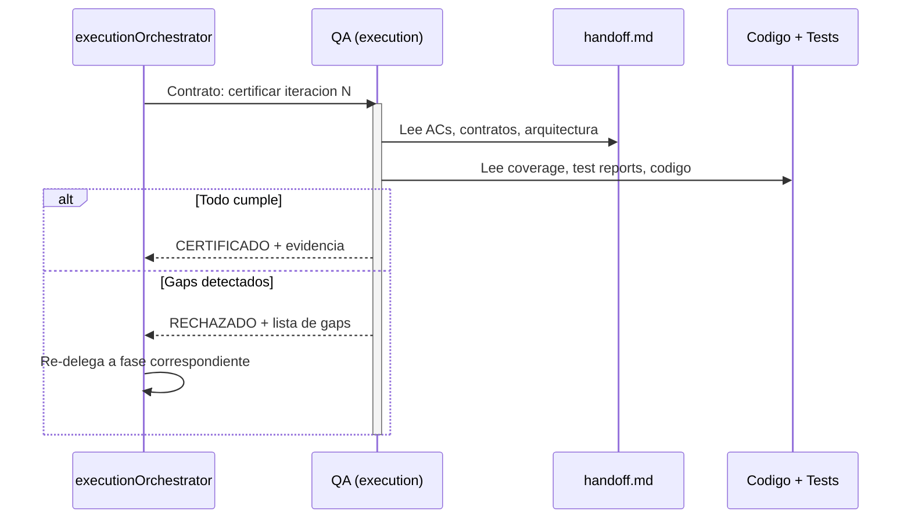

# Fase Accept — Certificación QA

← [Índice principal](../README.md) | [Execution](README.md)

> La Fase Accept es el gate final antes de cerrar una iteración.
> QA verifica que el producto implementado cumple TODO lo que el
> handoff estipula — no solo que los tests pasen.

---

## Contenido

- [Principio](#principio)
- [Qué verifica QA](#qué-verifica-qa)
- [Verificación Mecánica (Dogma)](#verificación-mecánica-dogma)
- [Qué NO hace QA en esta fase](#qué-no-hace-qa-en-esta-fase)
- [Mecanismo de certificación](#mecanismo-de-certificación)
- [Flujo de la fase](#flujo-de-la-fase)
- [Resultado](#resultado)
- [Validación Externa (recomendada)](#validación-externa-recomendada)
- [Testing de Interacción Multi-Ciclo (Feature Flags)](#testing-de-interacción-multi-ciclo-feature-flags)

---

## Principio

QA no valida código — valida PRODUCTO contra CONTRATO (handoff). "Tests
pasan" es condición necesaria pero NO suficiente. QA certifica que:

- Cada AC del `spec.md` se cumple funcionalmente.
- Los contratos de la prePhase se respetan.
- La cobertura no bajó respecto al baseline.
- El comportamiento de producto es el esperado (no solo el comportamiento
  de código).

[↑ Contenido](#contenido)

---

## Qué verifica QA

| Dimensión | Fuente de verdad | Qué se verifica |
|-----------|-------------------|------------------|
| ACs funcionales | `spec.md` (via handoff) | Cada AC tiene test(s) que pasan Y el comportamiento observable es correcto |
| Contratos | Contratos de la prePhase | APIs, schemas, interfaces respetan lo definido |
| Cobertura | Threshold del proyecto | No bajó. Código nuevo está cubierto. |
| droppableCode | Coverage report | Código con 0% cobertura identificado y reportado |
| Arquitectura | `design.md` (via handoff) | Refactor alineó la implementación con las decisiones arquitectónicas |
| Seguridad | Security scanners (govulncheck, npm audit, trivy) | Vulnerabilidades críticas resueltas antes de certificar |
| echo completo | [echo system](../echo-system.md) | Los 5 pasos del echo pasan (setup, build, static, dynamic, E2E). Precondición para certificar |
| Documentación operativa | `handoff.md` sección "Documentación operativa esperada" | Si el handoff la requiere: documentación existe, es usable, cubre lo declarado. Si el handoff dice "no requerida": omitir verificación. |
| Métricas (Dogma) | `virgil health` | Mutation score, CRAP, complejidad y binding coverage cumplen el threshold del tier activo |

[↑ Contenido](#contenido)

---

## Verificación Mecánica (Dogma)

Además de las dimensiones de la tabla anterior, la certificación de
Accept incluye el reporte de `virgil health`, que agrega cuatro
categorías:

1. **Binding coverage** — porcentaje de ACs con binding en estado
   `verified` (requirement → test → código, ver
   [contracts.md](contracts.md#contrato-de-binding-layer)).
2. **Mutation score** — fuerza real de la suite de tests.
3. **CRAP score** — riesgo de cambio por módulo.
4. **Complejidad ciclomática** — tamaño y complejidad de los módulos.

`virgil coverage --min` actúa como gate de CI: un build que no alcanza
el mínimo de cobertura configurado falla antes de llegar a Accept — QA
nunca certifica sobre un build que ya venía roto en ese gate.

> **Gate determinista**: a diferencia de una revisión manual, el gate
> de Accept en Dogma es determinista — se aprueba cuando la
> cobertura de bindings y las métricas de `virgil health` alcanzan el
> threshold del tier activo (ver
> [refactor.md](refactor.md#verificación-basada-en-métricas)), no
> cuando un humano "lo ve bien". "Tests pasan" sigue siendo condición
> necesaria pero no suficiente: las métricas son la condición
> suficiente.

[↑ Contenido](#contenido)

---

## Qué NO hace QA en esta fase

- No escribe tests (eso es Red).
- No corrige código (eso es Green/Refactor).
- No define contratos (eso es prePhase).
- No resuelve gaps de planificación (escala a planning).

[↑ Contenido](#contenido)

---

## Mecanismo de certificación

> **Agnóstico por diseño**: El framework define QUÉ certifica QA, no CÓMO lo
> formaliza. El consumidor del framework elige el mecanismo apropiado para
> su contexto:
>
> - Tag firmado en git (`qa/approved/iter-1`)
> - Trailer en commit de merge (`Certified-By: QA`)
> - Gate en pipeline de CI/CD
> - Artefacto en el artifactStore (reporte de aceptación)
> - Aprobación en herramienta de gestión (Jira, Linear, etc.)
>
> Lo que el framework EXIGE es que la certificación sea **formal, trazable
> y auditable** — no un "sí, se ve bien" informal.

[↑ Contenido](#contenido)

---

## Flujo de la fase

[↑ Contenido](#contenido)

---

## Resultado

| Resultado | Siguiente acción |
|-----------|-------------------|
| CERTIFICADO | Orquestador cierra iteración (merge → develop) |
| RECHAZADO — gap de implementación | Re-delegar a Green |
| RECHAZADO — gap de calidad | Re-delegar a Refactor |
| RECHAZADO — gap de tests | Re-delegar a Red |
| RECHAZADO — gap de contrato | Re-delegar a prePhase |
| RECHAZADO — gap de planificación | Escalar a planning |

[↑ Contenido](#contenido)

---

## Validación Externa (recomendada)

La certificación de Accept es interna: QA valida el producto contra el
handoff, no contra la experiencia de un usuario real. El framework
RECOMIENDA, sin exigirlo, que tras un CERTIFICADO alguien fuera del
equipo de agentes — el MIM, un stakeholder, un usuario piloto — vea el
software funcionando antes de cerrar la iteración. Esa señal externa es
el "Measure" de Build-Measure-Learn: alimenta la siguiente Fase 1
(Definir Idea) o la Fase 8 (Retrospectiva) con evidencia real, no solo
con la percepción del propio equipo. No bloquea el cierre de la
iteración — es una ceremonia recomendada, no un gate.

[↑ Contenido](#contenido)

---

## Testing de Interacción Multi-Ciclo (Feature Flags)

Cuando dos o más ciclos activos entregan features detrás de feature
flags, cada feature puede pasar su propio Accept de forma aislada y
seguir interactuando de forma inesperada cuando ambos flags están
habilitados simultáneamente. Ningún test de un ciclo individual cubre
el estado combinado.

**Comportamiento esperado**: si los scopes de archivos de dos ciclos
activos se superponen (mismo módulo, mismo dominio), QA recomienda
integration testing con ambos flags habilitados. Esto es **advisory,
no bloqueante** — no impide la certificación individual de cada
feature, pero queda registrado como observación en el reporte de
Accept.

| Condición | Acción de QA |
|-----------|---------------|
| Ciclos con scopes de archivos disjuntos | Sin acción adicional |
| Ciclos con scopes superpuestos, flags independientes | Recomendar test de integración con ambos flags ON. No bloquea. |
| Ciclos con scopes superpuestos, dependencia funcional conocida | Recomendar test de integración obligatorio antes del siguiente deploy conjunto. Sigue sin bloquear el Accept individual. |

Esta verificación depende de que `verifyConsistency` exponga qué
ciclos están activos y qué archivos toca cada uno — ver
[detección de semanticDrift](../planning/artifacts/state-machine.md#detección-de-semanticdrift)
para el mecanismo de detección de superposición entre artefactos.

[↑ Contenido](#contenido)

---

## Índice de Documentos Relacionados

| Documento | Relación con este |
|-----------|-------------------|
| [echo system](../echo-system.md) | QA verifica que el echo completo pasa como precondición de certificación |
| [artifact system](../artifact-system.md) | Define dónde viven los reportes de cobertura y tests que QA consume |
| [Fase Red](red.md) | Define la suite de tests y el umbral de cobertura que QA verifica |
| [Fase Refactor](refactor.md) | QA verifica que las fitness functions pasaron y no hay observaciones residuales críticas pendientes |

[↑ Contenido](#contenido)
