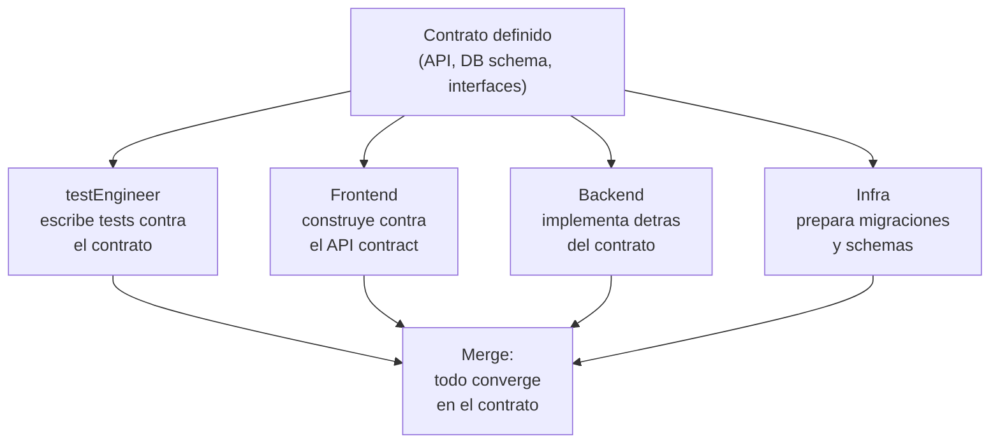
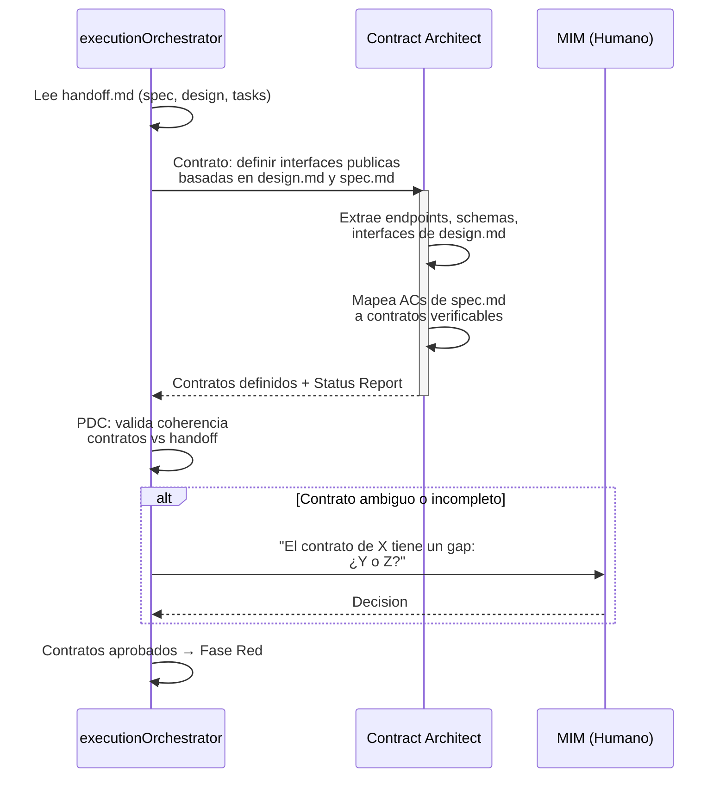
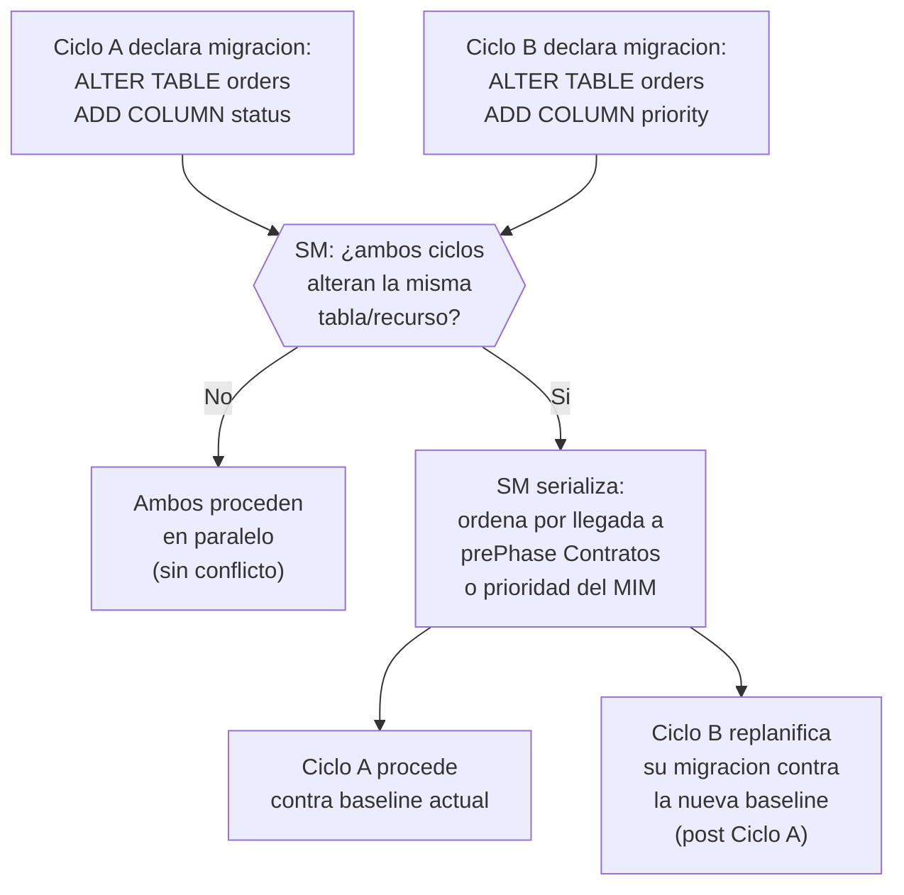

# prePhase: Definición de Contratos

← [Índice principal](../README.md) | [Execution](README.md)

---

## Contenido

- [Por que Contract-First](#por-que-contract-first)
- [Tipos de contrato](#tipos-de-contrato)
- [Contrato de binding layer](#contrato-de-binding-layer)
- [Contrato de métricas](#contrato-de-métricas)
- [Contrato de estado de ejecución](#contrato-de-estado-de-ejecución)
- [Flujo de definicion de contratos](#flujo-de-definicion-de-contratos)
- [Criterios de validacion del contrato](#criterios-de-validacion-del-contrato)
- [Colisión de Contratos entre Ciclos Concurrentes](#colisión-de-contratos-entre-ciclos-concurrentes)

---

## Por que Contract-First

El contrato es la fuente de verdad compartida entre todos los actores de
ejecucion. Antes de escribir una linea de test o de implementacion, el
equipo define la interfaz publica del sistema. Esto habilita **desarrollo
paralelo agil**:

> **Nota**: Los roles "Frontend", "Backend" e "Infra" del diagrama son
> ilustrativos --- representan dominios de implementación, no roles
> formales de execution. En el modelo de ejecución, estos dominios los
> cubren instancias del Implementor asignadas a lanes distintos.

**Principio: Contract over Methodology.** El contrato importa mas que el
proceso. Como implementes detras del contrato es tu problema --- pero
DEBES cumplirlo. El contrato es el acuerdo verificable; la metodologia
es la ceremonia alrededor.

[↑ Contenido](#contenido)

---

## Tipos de contrato

| Tipo | Formato (ejemplo) | Cuando aplica | Ejemplo |
|------|---------|----------------|---------|
| API Contract | OpenAPI 3.x / AsyncAPI | Proyecto con endpoints HTTP o eventos | `POST /auth/login` con request/response schema |
| SDK / Library Interface | TypeScript interfaces, Rust traits | Librerias, modulos reutilizables | `interface AuthService { login(credentials): Token }` |
| Database Schema | SQL DDL + migraciones | Proyecto con persistencia | `CREATE TABLE users (...)` con constraints |
| Event Schema | JSON Schema / AsyncAPI | Sistemas event-driven | `UserCreatedEvent { id, email, timestamp }` |
| Component Interface | Props/inputs tipados | Frontend con componentes | `LoginFormProps { onSubmit, initialValues }` |
| Connector / Adapter Interface | Ports & adapters | Integraciones con terceros | `interface PaymentGateway { charge(amount): Receipt }` |
| Binding Layer | Manifiesto requirement ↔ test ↔ código | Todo proyecto que use Virgil | `AC-01 ↔ AuthTestCase.loginSuccess ↔ src/auth/login.service.ts` |

> Los formatos son ilustrativos. Cualquier especificación formal que
> cumpla los requisitos del contrato (tipada, verificable por máquina,
> schema-completo) es válida.

[↑ Contenido](#contenido)

---

## Contrato de binding layer

El binding layer es el contrato que conecta un AC de `spec.md` con su
test y con el código que lo satisface. A diferencia de los contratos de
la tabla anterior (definidos una vez en la prePhase), el binding layer
evoluciona durante la ejecución — no es estático:

| Estado | Fase donde se alcanza | Qué garantiza |
|--------|-------------------------|----------------|
| `declared` | Red | El test existe y referencia un AC (ver [red.md](red.md#trazabilidad-ac-testplan-testcontract-implementación-coverage)) |
| `inferred` | Green | Un hook post-commit detectó que el código ejercita el test declarado (ver [green.md](green.md#inferencia-de-bindings)) |
| `verified` | Refactor | Mutation testing confirmó la fuerza real del test (ver [refactor.md](refactor.md#verificación-basada-en-métricas)) |

[↑ Contenido](#contenido)

---

## Contrato de métricas

Cada tier define un contrato de thresholds que el código debe cumplir
antes de que Accept lo certifique (ver
[refactor.md](refactor.md#verificación-basada-en-métricas)):

| Tier | Mutation score mínimo | CRAP máximo | Complejidad ciclomática máxima | Tamaño de módulo máximo |
|------|------------------------|-------------|--------------------------------|--------------------------|
| strict | ≥ 80% | ≤ 30 | ≤ 10 por función | ≤ 300 LOC por módulo |
| standard | ≥ 60% | ≤ 45 | ≤ 15 por función | ≤ 500 LOC por módulo |
| relaxed | ≥ 40% | ≤ 60 | ≤ 20 por función | ≤ 800 LOC por módulo |

**Estructura de dependencias**: reglas de dirección (sin dependencias
circulares, inversión de dependencias respetada), con umbral de
**cero violaciones** en todos los tiers — a diferencia de las métricas
anteriores, no admite gradación: una dependencia circular no es "más o
menos aceptable" según el rigor del proyecto, es un defecto
estructural binario.

El tier activo es parte del contrato del handoff — no se negocia a
mitad de ejecución sin re-aprobación del MIM.

[↑ Contenido](#contenido)

---

## Contrato de estado de ejecución

La ejecución paralela por lanes (ver
[modelo de execution](README.md#ejecución-paralela-y-resumption-determinista))
requiere un contrato de estado explícito, no solo contratos de
producto:

| Campo | Qué registra |
|-------|----------------|
| **claiming** | Estado de cada tarea: `pending`, `claimed` o `done`. Evita que dos lanes tomen la misma tarea. |
| **timestamps** | Cuándo se reclamó y cuándo se completó cada tarea. |
| **commit SHAs** | El commit que cerró cada tarea, para trazabilidad y resumption. |

Este estado es lo que habilita la resumption determinista después de un
crash o una compactación de contexto: el Orquestador reconstruye qué
tareas están en curso, cuáles terminaron y cuáles siguen pendientes
leyendo el estado persistido, sin re-preguntar al MIM ni re-derivar
trabajo ya hecho.

[↑ Contenido](#contenido)

---

## Flujo de definicion de contratos

[↑ Contenido](#contenido)

---

## Criterios de validacion del contrato

Un contrato esta listo cuando:

1. Cada AC de `spec.md` puede mapearse a al menos un contrato
2. Cada contrato tiene tipos definidos (request, response, error)
3. Los contratos son consistentes entre si (sin contradicciones)
4. Las dependencias entre contratos estan explicitas
5. El MIM aprobo los contratos que requieren decisiones de negocio

[↑ Contenido](#contenido)

---

## Colisión de Contratos entre Ciclos Concurrentes

Cuando dos ciclos concurrentes (o un ciclo y un hotfix) definen
contratos que modifican el mismo recurso — tipicamente el mismo schema
de base de datos — la prePhase Contratos es donde el SM detecta la
colision, antes de que ambos ciclos lleguen a Fase Red con migraciones
incompatibles.

**Criterio de serializacion**: el SM ordena por el ciclo que llegó
primero a la prePhase Contratos con el contrato declarado, o por
prioridad explícita del MIM si hay empate. El ciclo que va segundo NO
pierde su trabajo — su migracion se replanifica contra la nueva
baseline que el primer ciclo estableció.

**Dónde se detecta**: durante la validacion de contratos (ver
[criterios de validacion del contrato](#criterios-de-validacion-del-contrato)),
el SM extiende el criterio 3 ("los contratos son consistentes entre
si") para incluir consistencia ENTRE ciclos activos, no solo dentro de
un mismo ciclo.

**Registro**: el SM anota la serializacion como `[COLLISION]`
en el `plan.md`/`idea.md` del ciclo que replanifica, con referencia al
ciclo que tomó precedencia.

[↑ Contenido](#contenido)
