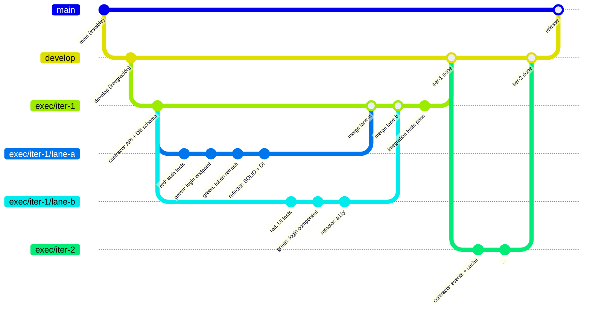
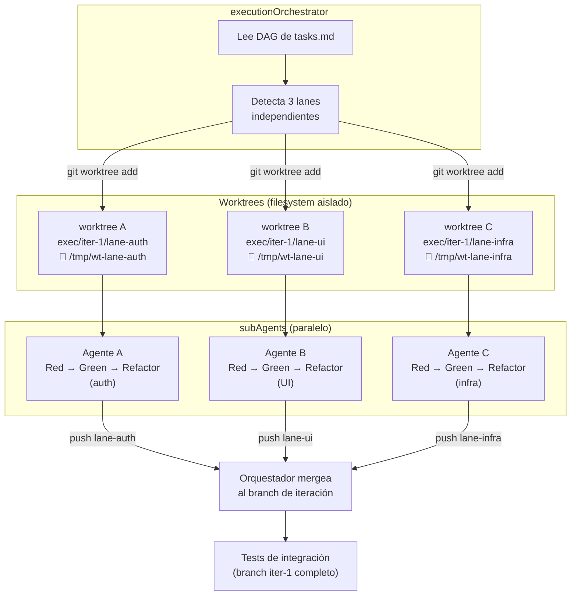
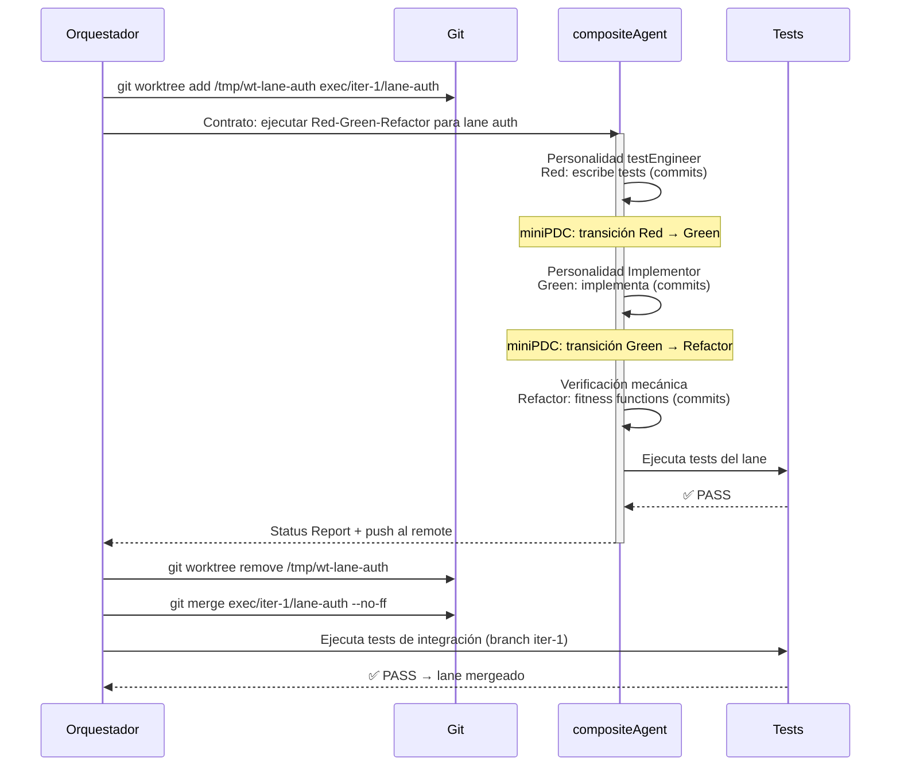
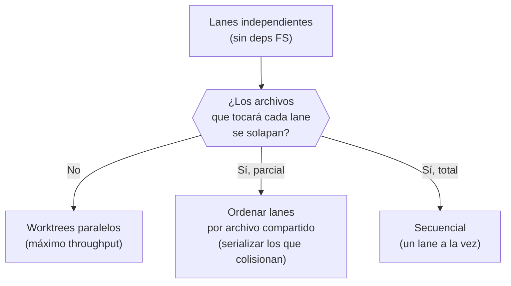
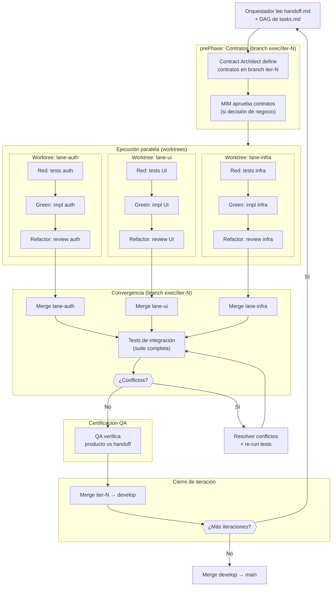
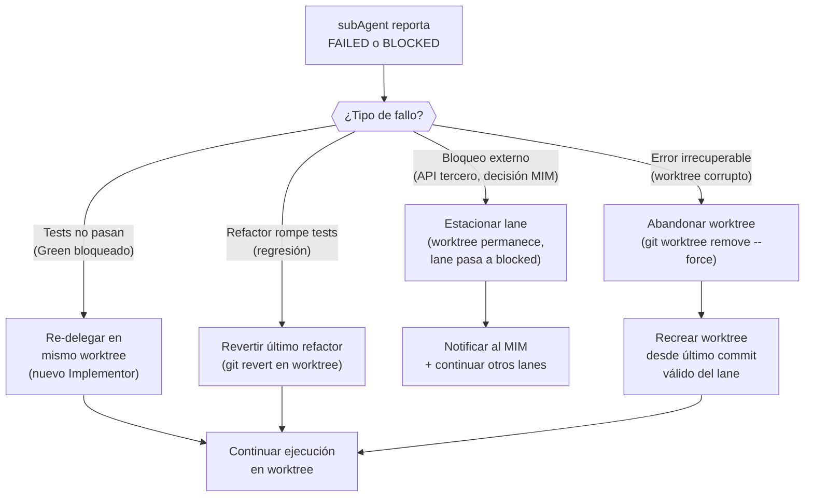
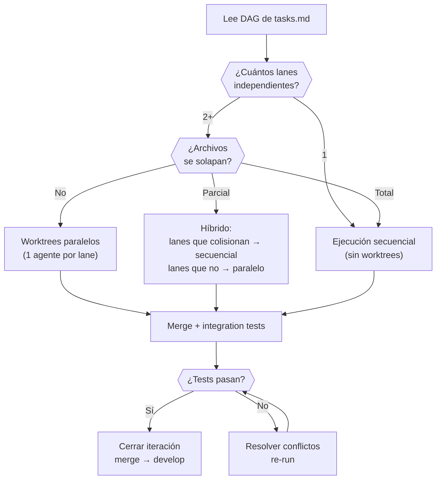

# Estrategia Git y Paralelismo

← [Índice principal](../README.md) | [Execution](README.md)

> Define cómo el executionOrchestrator usa ramas, worktrees y commits
> para ejecutar el ciclo Red-Green-Refactor con paralelismo real. Resuelve
> los TBDs de "Paralelismo en ejecución" y "Commit strategy".

> **Nota sobre WHAT vs HOW.** Este documento define los REQUISITOS que
> toda estrategia de branching debe cumplir para execution (aislamiento
> entre lanes, trazabilidad a iteraciones, merge no destructivo, soporte
> para ejecución paralela). La implementación de referencia usa Gitflow
> adaptado con worktrees, pero cualquier estrategia que satisfaga estos
> requisitos es aceptable (trunk-based con feature flags, stacked PRs,
> etc.).

---

## Contenido

- [Modelo de Ramas](#modelo-de-ramas)
- [Worktrees para Paralelismo](#worktrees-para-paralelismo)
- [Estrategia de Commits](#estrategia-de-commits)
- [Flujo Completo de una Iteración](#flujo-completo-de-una-iteración)
- [Manejo de Conflictos Post-Merge](#manejo-de-conflictos-post-merge)
- [Manejo de Fallos Mid-Lane](#manejo-de-fallos-mid-lane)
- [Diagrama de Decisión del Orquestador](#diagrama-de-decisión-del-orquestador)

---

## Modelo de Ramas

execution adapta Gitflow al contexto de ejecución por fases. Cada
iteración del ciclo (un batch de tasks del DAG) opera sobre un branch
dedicado. Los lanes paralelos se ejecutan en worktrees aislados.



### Anatomía de las ramas

| Rama | Propósito | Quién la crea | Cuándo se mergea |
|------|-----------|---------------|------------------|
| `main` | Código estable, listo para operación | — | Cuando develop pasa aceptación |
| `develop` | Integración continua entre iteraciones | Orquestador (una vez) | Hacia main en release |
| `exec/iter-N` | Una iteración del ciclo Red-Green-Refactor | Orquestador (por iteración) | Hacia develop cuando todos los lanes convergen |
| `exec/iter-N/lane-X` | Un lane paralelo del DAG | Orquestador (por lane) | Hacia exec/iter-N cuando completa Refactor |

### Regla de naming

```text
exec/iter-{N}/lane-{nombre-descriptivo}

Ejemplos:
  exec/iter-1/lane-auth
  exec/iter-1/lane-ui-login
  exec/iter-1/lane-infra-redis
  exec/iter-2/lane-payments
```

[↑ Contenido](#contenido)

---

## Worktrees para Paralelismo

Cuando el DAG de `tasks.md` tiene lanes independientes (sin dependencias
FS entre sí), el Orquestador lanza subAgents en **worktrees aislados**.
Cada agente opera su propio directorio de trabajo sin conflictos de
archivos.



### Modelo de roles dentro de un worktree

> **Reconciliación roles ↔ worktrees**: En ejecución secuencial (1 lane),
> el Orquestador lanza roles separados por fase — testEngineer (Red),
> Implementor (Green), fitness functions + revisión residual (Refactor)
> — como subAgents distintos con personalidades diferenciadas.
>
> En ejecución paralela con worktrees, cada lane se asigna a un
> **compositeAgent** que asume las personalidades secuencialmente dentro
> del mismo worktree. La razón: lanzar múltiples subAgents por lane
> dentro del mismo worktree crearía conflictos de acceso al filesystem.
> El compositeAgent cambia de personalidad entre fases:
>
> 1. **Personalidad testEngineer** → escribe la suite de tests (Red)
> 2. **Personalidad Implementor** → escribe código que pase los tests (Green)
> 3. **Verificación mecánica** → ejecuta fitness functions (mutation,
>    CRAP, complexity, dependencies, module size, security scanners).
>    La revisión residual (autorización, DDD) se documenta y escala
>    sin bloquear el gate.
>
> El Orquestador valida cada transición de personalidad con un miniPDC
> entre fases.

### Ciclo de vida de un worktree



> **Nota**: Este diagrama cubre el ciclo de vida de un worktree individual
> (Red-Green-Refactor). La fase Accept (Certificación QA) NO ocurre por
> worktree — se ejecuta una única vez por iteración, después de que TODOS
> los lanes convergen en `exec/iter-N` y los tests de integración pasan,
> y ANTES del merge de `exec/iter-N` hacia `develop`. Ver el diagrama
> "Flujo Completo de una Iteración" más abajo.

### Cuándo usar worktrees vs secuencial

| Condición | Estrategia | Razón |
|-----------|-----------|-------|
| 2+ lanes sin dependencias FS entre sí | Worktrees paralelos | Sin conflictos de archivos — máximo throughput |
| Lanes con dependencia SS (start-start) | Worktrees con merge parcial | Lane B empieza cuando A empieza, pero necesita el setup de A |
| Lanes con dependencia FS (finish-start) | Secuencial | B necesita el output completo de A |
| Lane único o tasks < 5 | Secuencial en branch | Overhead de worktree no se justifica |
| Conflicto de archivos detectado entre lanes | Secuencial forzado | Worktrees paralelos producirían merge conflicts |

### Detección de conflictos pre-worktree

Antes de lanzar worktrees paralelos, el Orquestador verifica que los
lanes no toquen los mismos archivos:



El análisis se basa en los archivos listados en cada workItem de
`tasks.md` (campo `files` del schema de workItem). Si el campo no
existe, el Orquestador asume solapamiento y serializa.

[↑ Contenido](#contenido)

---

## Estrategia de Commits

### Convención por fase

| Fase | Prefijo | Ejemplo | Frecuencia |
|------|---------|---------|------------|
| Contratos | `contract:` | `contract: define auth API (OpenAPI 3.1)` | 1 por tipo de contrato |
| Red | `test:` | `test: auth-login-success (AC-01)` | 1 por test o grupo pequeño |
| Green | `feat:` | `feat: implement login endpoint (passes auth-login-success)` | 1 por test que pasa |
| Refactor | `refactor:` | `refactor: extract AuthService (SOLID-SRP)` | 1 por refactor atómico |

### Trazabilidad AC → test → commit

Cada commit en Green referencia qué test(s) pasa. Cada commit en Red
referencia qué AC cubre. La cadena completa es:

```text
AC-01 (spec.md)
  → test: auth-login-success (AC-01)        [Red]
    → feat: implement login (passes auth-login-success)  [Green]
      → refactor: extract AuthService (SOLID-SRP)        [Refactor]
```

### Squash policy

| Momento | Estrategia | Razón |
|---------|-----------|-------|
| Dentro de un lane | Commits granulares | Trazabilidad Red→Green→Refactor |
| Merge lane → iter-N | `--no-ff` (merge commit) | Preserva historia del lane |
| Merge iter-N → develop | `--no-ff` (merge commit) | Preserva historia de iteración |
| Merge develop → main | Squash opcional | El MIM decide: historia limpia vs completa |

[↑ Contenido](#contenido)

---

## Flujo Completo de una Iteración



[↑ Contenido](#contenido)

---

## Manejo de Conflictos Post-Merge

Cuando dos lanes modificaron archivos relacionados (no el mismo archivo,
pero con dependencias lógicas), los tests de integración los detectan:

| Escenario | Síntoma | Resolución |
|-----------|---------|------------|
| Dos lanes definieron el mismo endpoint | Test de integración falla (ruta duplicada) | Orquestador mergea manualmente, elimina duplicado |
| Lane A cambió una interfaz que lane B consume | Test de B falla post-merge | Orquestador ajusta B para la interfaz actualizada de A |
| Lane A y B modificaron el mismo archivo | Merge conflict de git | Orquestador resuelve, re-run tests |
| Tests pasan aislados pero fallan integrados | Interferencia de estado (DB, cache) | Orquestador aísla el problema, crea fix en branch iter-N |

[↑ Contenido](#contenido)

---

## Manejo de Fallos Mid-Lane

Cuando un subAgent falla durante la ejecución dentro de un worktree:



### Impacto en otros lanes

| Escenario | Impacto | Acción |
|-----------|---------|--------|
| Lane fallido no tiene dependientes | Ninguno | Otros lanes continúan normalmente |
| Lane fallido es pre-requisito parcial (SS) | Lane dependiente puede continuar con lo que ya tiene | Orquestador evalúa si lo parcial es suficiente |
| Lane fallido es pre-requisito completo (FS) | Lane dependiente se bloquea | Orquestador marca lane dependiente como `blocked`, estaciona su worktree |
| Múltiples lanes fallan | Posible problema sistémico | Orquestador escala al MIM antes de re-delegar |

### Limpieza de worktrees

El Orquestador es responsable de limpiar worktrees al cierre de la iteración:

1. Lanes completados exitosamente → `git worktree remove` después del merge
2. Lanes estacionados → worktree permanece hasta que el bloqueo se resuelva
3. Lanes abandonados → `git worktree remove --force` + branch eliminado

[↑ Contenido](#contenido)

---

## Diagrama de Decisión del Orquestador



[↑ Contenido](#contenido)
