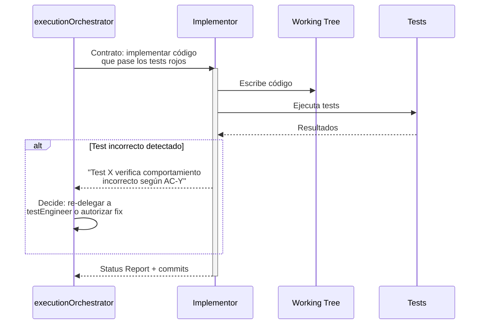
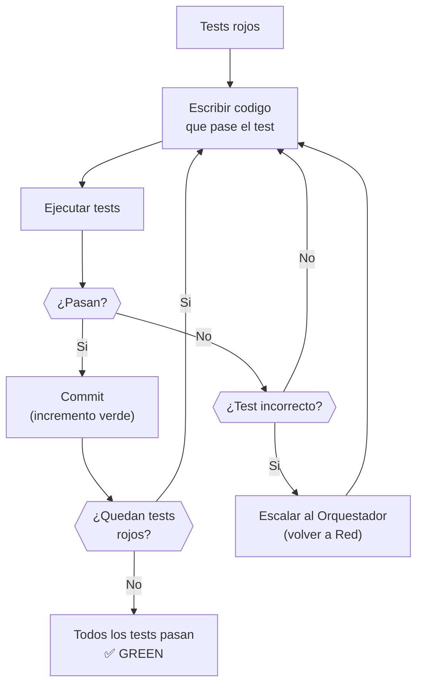
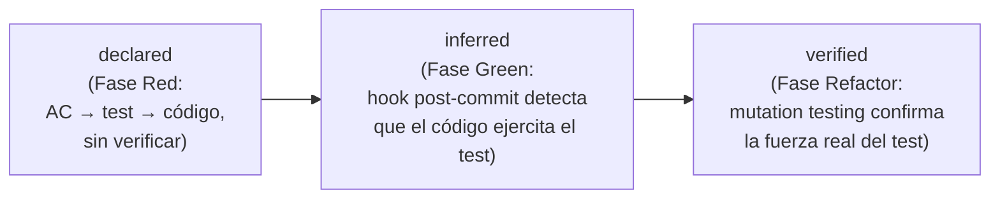
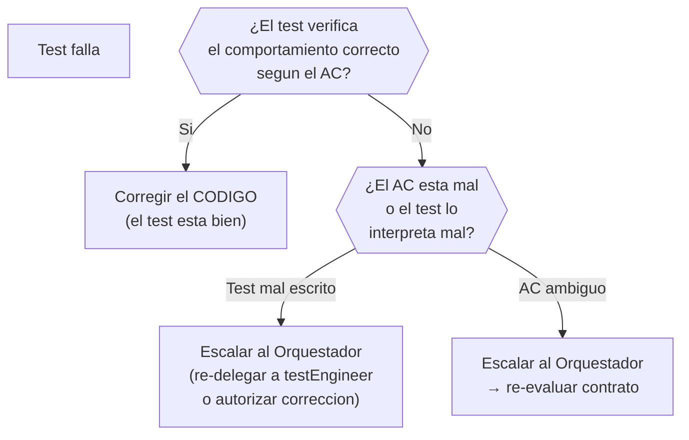

# Fase Green — Implementación

← [Índice principal](../README.md) | [Execution](README.md)



> **Input de Red**: El Implementor recibe la Capa 3 (testImplementation)
> como entrada directa — los tests ejecutables que debe hacer pasar. Las
> Capas 1 (testPlan) y 2 (testContract) proporcionan trazabilidad pero no
> son input operativo de Green.

---

## Contenido

- [Reglas de Green](#reglas-de-green)
- [Estrategia de commits](#estrategia-de-commits)
- [Inferencia de bindings](#inferencia-de-bindings)
- [Cuando corregir tests vs corregir codigo](#cuando-corregir-tests-vs-corregir-codigo)

---

## Reglas de Green

La unica meta es hacer que los tests pasen. Nada mas.



| Regla | Descripcion |
|-------|-------------|
| **Lo primero que funcione** | Codigo feo, duplicado, con magic numbers --- todo vale si los tests pasan |
| **Sin optimizacion prematura** | No abstraer, no generalizar, no "mejorar". Eso es la siguiente fase |
| **Cumplir contratos** | El codigo DEBE respetar los contratos definidos en la prePhase |
| **Commits frecuentes** | Cada test que pasa = un posible commit. Incrementos verdes pequenos |
| **Test incorrecto → corregir test** | Si un test verifica algo equivocado, arreglarlo ANTES de implementar |

> **Excepción: TDD micro para complejidad algorítmica**: Para tareas de
> alta complejidad algorítmica (algoritmos, parsers, cálculos financieros),
> el Implementor puede usar TDD micro (test-implement-test por función)
> como herramienta complementaria dentro de Green. Esta excepción no
> aplica a código de aplicación estándar (CRUD, endpoints, flujos de UI).

[↑ Contenido](#contenido)

---

## Estrategia de commits

```plaintext
feat: implement login endpoint (passes auth-login-success test)
feat: implement login validation (passes auth-login-invalid-credentials test)
feat: implement token refresh (passes auth-token-refresh test)
```

Cada commit referencia que test(s) pasa. Esto crea trazabilidad entre
implementacion y especificacion ejecutable.

[↑ Contenido](#contenido)

---

## Inferencia de bindings

El binding layer declarado en Red (ver
[red.md](red.md#trazabilidad-ac-testplan-testcontract-implementación-coverage))
no se actualiza a mano durante Green. Un hook post-commit analiza cada
commit verde y actualiza el binding correspondiente cuando detecta que
el código del commit efectivamente ejercita el test referenciado.

El binding transita por tres niveles de confianza:



| Estado | Cuándo se alcanza | Qué garantiza |
|--------|--------------------|----------------|
| `declared` | Fase Red | El test existe y referencia un AC. No implica que el código lo cumpla. |
| `inferred` | Fase Green (hook post-commit) | El código del commit ejercita el test declarado. No implica que el test sea fuerte. |
| `verified` | Fase Refactor (`virgil metrics`) | Mutation testing confirmó que el test detecta mutantes reales — la señal es confiable. |

[↑ Contenido](#contenido)

---

## Cuando corregir tests vs corregir codigo



> **Separación de responsabilidades**: El Implementor NO corrige tests directamente. Si sospecha
> que un test es incorrecto, escala al Orquestador con evidencia (qué test, qué AC contradice,
> por qué). El Orquestador decide si re-delega al testEngineer o autoriza la corrección in situ.

[↑ Contenido](#contenido)
