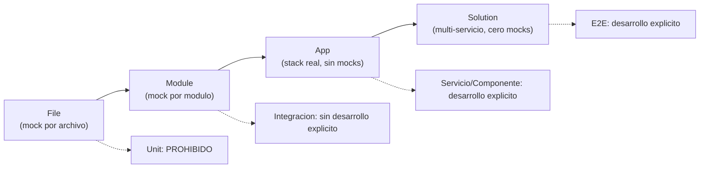
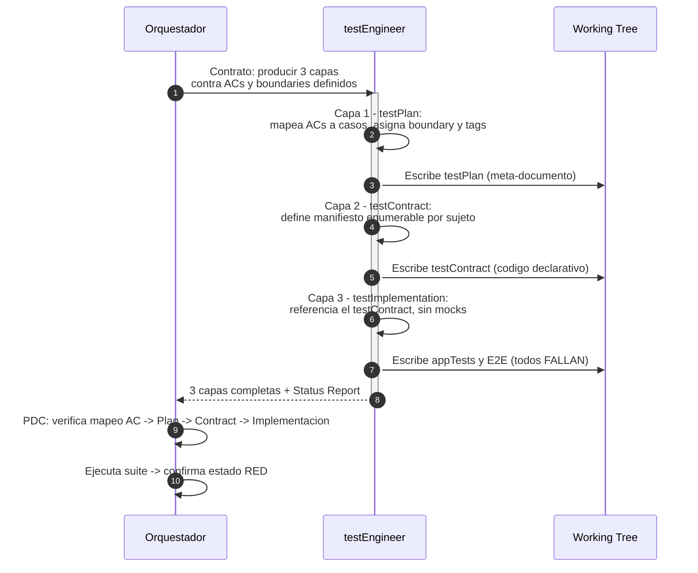
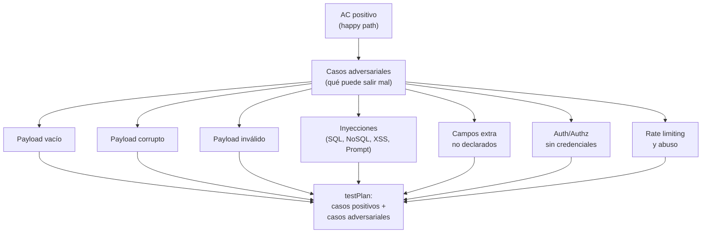
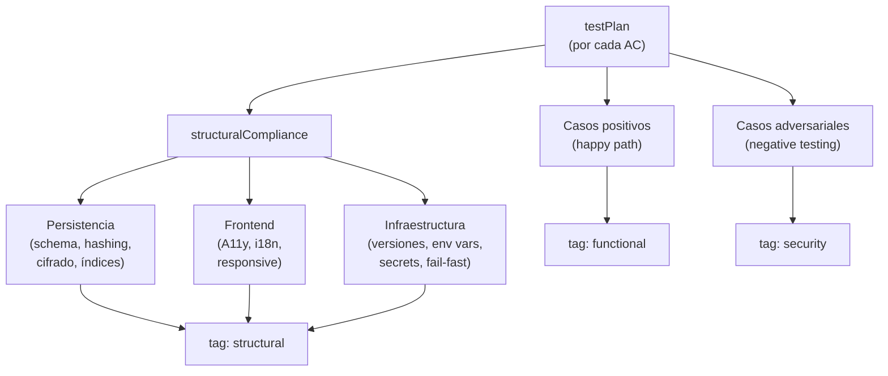
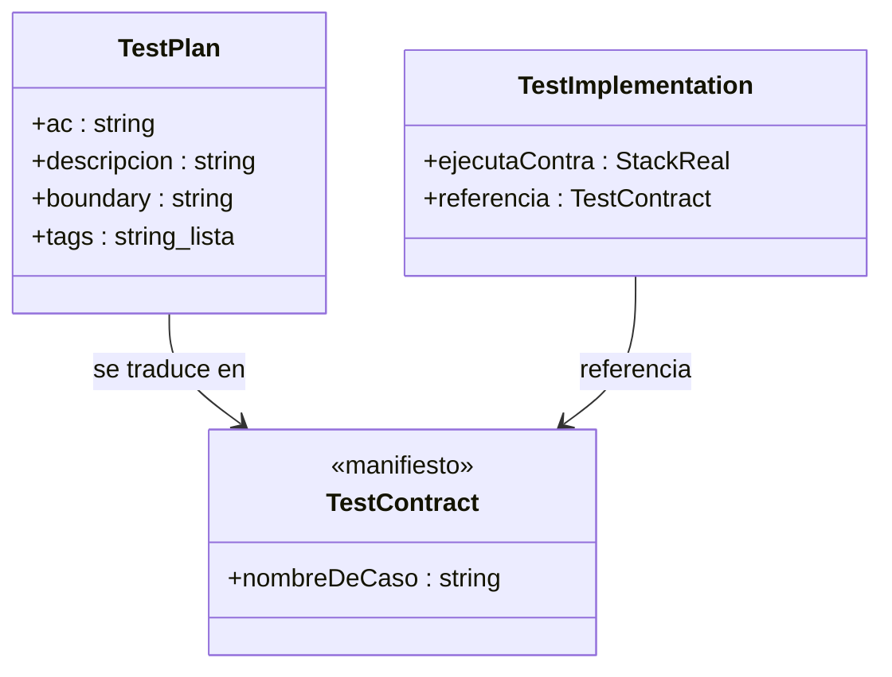
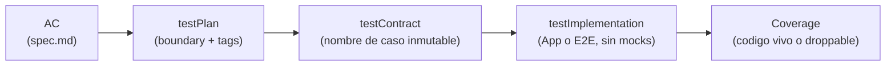
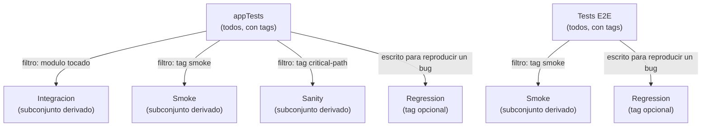
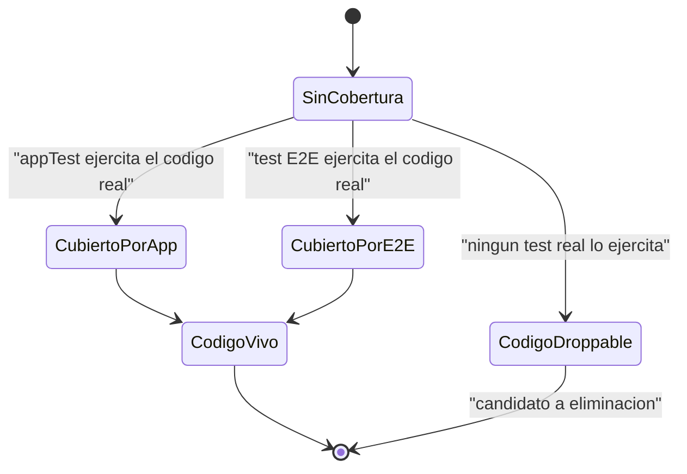
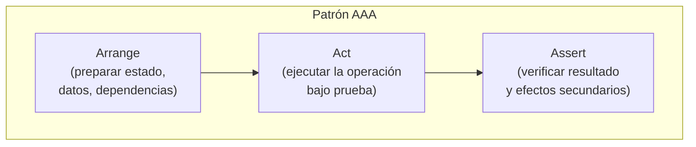
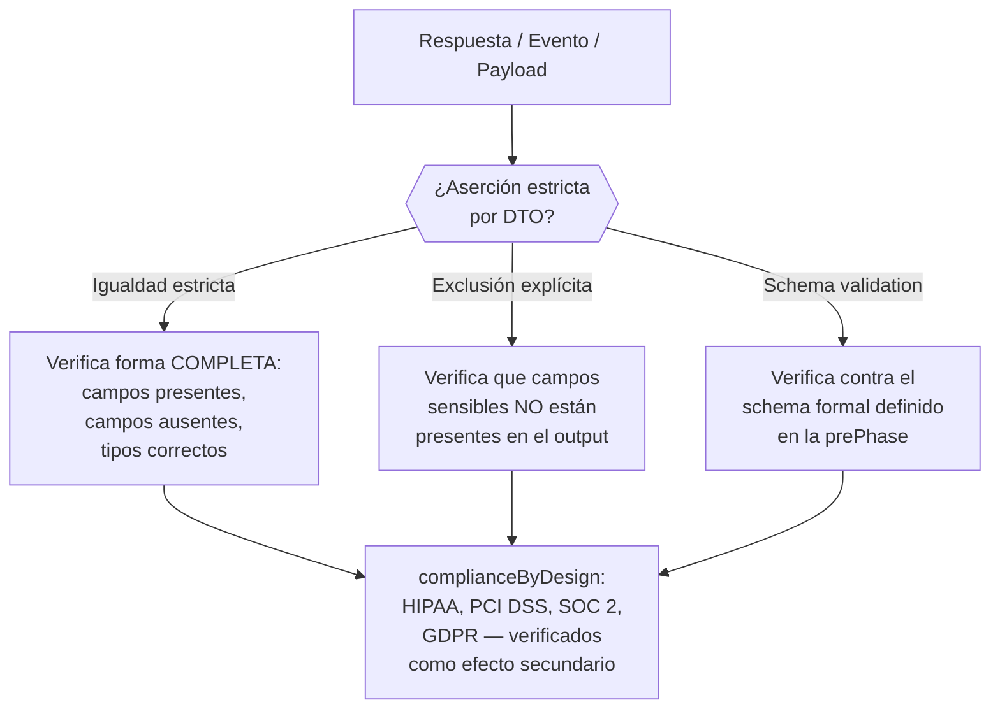

# Fase Red — Arquitectura de Testing

← [Índice principal](../README.md) | [Execution](README.md)

Este documento define el modelo de testing de la Fase Red: qué tipos de test
existen, quién los escribe explícitamente, quién los deriva por filtrado, y
cómo se traza cada test hasta un AC de `spec.md`. El modelo es agnóstico de
lenguaje, framework y herramienta — define el QUÉ, no el CÓMO. El stack
concreto lo decide `design.md` en la planificación.

---

## Contenido

- [Filosofía: highValueTesting](#filosofía-highvaluetesting)
- [boundaryModel](#boundarymodel)
- [Política de Testing](#política-de-testing)
- [Arquitectura de la Fase Red — 3 Capas](#arquitectura-de-la-fase-red-3-capas)
- [Trazabilidad: AC → testPlan → testContract → Implementación → Coverage](#trazabilidad-ac-testplan-testcontract-implementación-coverage)
- [Tests Derivados y Pipeline Placement](#tests-derivados-y-pipeline-placement)
- [droppableCode](#droppablecode)
- [Herramientas y Configuración](#herramientas-y-configuración)
- [Disciplina de Código de Test](#disciplina-de-código-de-test)
- [Qué Significa "Red" Operativamente](#qué-significa-red-operativamente)

---

## Filosofía: highValueTesting

El criterio que determina el tipo de un test no es la pirámide clásica ni
su inversión — es **dónde se ubica la frontera del mock** (el "boundary").
Cuanto más cerca del stack real se ejecuta un test, mayor es su valor de
verificación; cuanto más aislado está mediante mocks, más redundante se
vuelve frente a un test de nivel superior con buena cobertura.

De este criterio se deriva una consecuencia estructural: **solo existen dos
tiers de testing con desarrollo explícito**. Todo lo demás — integración,
smoke, regresión, sanity — se obtiene por filtrado inteligente sobre esos
dos tiers, no por escritura de suites adicionales.

> **highValueTesting**: un test solo se escribe si ejercita una
> interacción real del producto (base de datos real, HTTP real, contenedor
> de inyección de dependencias real). Un test que solo verifica que una
> función retorna un valor, aislada del sistema mediante mocks, no aporta
> señal adicional cuando el nivel de App ya tiene cobertura alta — es
> mantenimiento sin retorno.

[↑ Contenido](#contenido)

---

## boundaryModel

| Boundary | Tipo | Política |
|----------|------|----------|
| File | Unit | **PROHIBIDO** — valor cero, redundante cuando los appTests tienen cobertura alta |
| Module | Integración | **Sin desarrollo explícito** — se deriva por filtros desde los appTests cuando se toca un módulo |
| App (stack real, sin mocks) | Servicio/Componente | **DESARROLLO EXPLÍCITO** — tier primario, cobertura alta obligatoria, interacciones reales con el producto, detección de droppableCode |
| Solution (multi-servicio, cero mocks) | E2E | **DESARROLLO EXPLÍCITO** — para deploys, tags, merges a main/develop |
| Cualquiera | Performance/Stress/Load | **CONDICIONAL** — se activa cuando `design.md` declara SLAs de latencia, throughput o concurrencia. El testPlan incluye perfiles de carga derivados de los ACs. Ubicación en pipeline: stage CI separado, no bloqueante para el ciclo Red-Green-Refactor |
| Cualquiera | Regression/smoke/sanity | **Sin desarrollo explícito** — se deriva por tags/nomenclatura desde los appTests + E2E existentes |

> **Excepción: librerías sin infraestructura runtime.** Para proyectos sin
> servidor, base de datos, ni contenedor DI (librerías algorítmicas,
> utilidades puras, parsers), el boundary App colapsa a la API pública
> del módulo. Los tests contra esta API pública con inputs y outputs
> reales SON los appTests — ejercen la interacción real del producto.
> La prohibición del boundary File (funciones internas privadas en
> aislamiento) sigue aplicando.



A medida que el boundary se aleja del archivo aislado y se acerca a la
solución completa, el mock desaparece y la señal de verificación aumenta.
Los dos boundaries intermedios (File, Module) no requieren suite propia:
File está prohibido, Module se deriva del boundary App.

[↑ Contenido](#contenido)

---

## Política de Testing

### Desarrollo explícito (los únicos 2 tiers escritos)

- **appTests** — boundary App, stack real completo, cobertura alta
  obligatoria. Tier primario.
- **Tests E2E** — boundary Solution, multi-servicio, cero mocks. Se
  ejecutan en deploys, tags y merges a `main`/`develop`.

### Prohibido

- **Tests de Unit** (boundary File) — no se escriben bajo ninguna
  circunstancia en este framework. Si un test necesita mockear el propio
  archivo bajo prueba para pasar, esa es la señal de que el test no
  pertenece a este modelo. Ver la excepción para librerías sin
  infraestructura runtime en [boundaryModel](#boundarymodel) y la
  excepción específica para bibliotecas y CLIs a continuación.

#### Excepción para bibliotecas y CLIs

Bibliotecas y CLIs que SON el producto (no proyectos que consumen
Virgil como dependencia) pueden testear lógica de dominio en el
boundary de la API pública del paquete. Un repositorio testeado contra
una implementación real (incluida una en memoria, si implementa
fielmente el contrato de la interfaz) es un appTest, no un unit test —
el criterio es si el test ejercita comportamiento real o lo mockea, no
si la implementación es "in-memory" o "en disco". Una implementación en
memoria del repositorio que cumple el contrato de la interfaz es una
implementación real, no un mock.

La prohibición se mantiene sin excepción para: testear funciones o
métodos privados, testear con dependencias externas mockeadas (HTTP,
bases de datos externas), y testear detalles de implementación en lugar
de comportamiento observable.

Esta excepción aplica cuando el paquete bajo prueba no tiene interfaz
de usuario y el boundary App ES la API pública del paquete.

### Sin desarrollo explícito (derivado por filtrado)

- **Integración** (boundary Module) — un hook de repositorio detecta el
  módulo tocado y ejecuta el subconjunto de appTests que lo cubren.
  Mismos tests, filtro distinto.
- **Regression / Smoke / Sanity** — subconjuntos de los appTests y
  E2E existentes, seleccionados por tag o nomenclatura. Ver
  [Tests Derivados y Pipeline Placement](#tests-derivados-y-pipeline-placement).

### Condicional

- **Performance / Stress / Load** — se activa cuando `design.md` declara
  SLAs de latencia, throughput o concurrencia. El testPlan incluye
  perfiles de carga derivados de los ACs. Ubicación en pipeline: stage
  CI separado, no bloqueante para el ciclo Red-Green-Refactor.

[↑ Contenido](#contenido)

---

## Arquitectura de la Fase Red — 3 Capas

El testEngineer no escribe "una suite de tests" — produce tres capas
encadenadas, cada una agnóstica de herramienta. Solo la Capa 3 es código
ejecutable; las Capas 1 y 2 son artefactos de trazabilidad.



### Capa 1: testPlan

Meta-documento, no código. Responde "qué se va a probar":

- Mapea cada AC de `spec.md` a uno o más casos de test.
- Asigna a cada caso un boundary (App o E2E — los únicos dos válidos
  para desarrollo explícito).
- Asigna tags de filtrado (`smoke`, `critical-path`, `regression`) que
  luego alimentan la derivación de tests en el pipeline.
- Identifica matrices de test cuando aplica (combinaciones, casos límite).
- **Para cada AC, produce casos adversariales** (ver sección siguiente).

#### Casos adversariales (Negative Testing)

Por cada AC positivo ("el usuario puede loguearse"), el testPlan debe
incluir su contrapartida adversarial: "¿qué pasa cuando alguien intenta
romperlo?" Esta disciplina se conoce como **abuseCases** (OWASP) o
**Abuser Stories** — el contraparte sistemático de las User Stories.

> **"Piensa mal y acertarás"**: el testEngineer asume que cada
> endpoint, cada formulario, cada entrada de datos será atacada con
> intención maliciosa. No es paranoia — es diseño defensivo.

| Categoría | Qué se prueba | Ejemplo |
|-----------|---------------|---------|
| **Payload vacío** | El sistema rechaza graciosamente una petición sin datos | `POST /login` con body `{}` → 400, no 500 |
| **Payload corrupto** | El sistema maneja datos malformados sin exponer internos | JSON inválido, encoding roto, Content-Type incorrecto → error controlado |
| **Payload inválido** | Validación rechaza tipos, rangos y formatos incorrectos | Email sin `@`, edad negativa, fecha del futuro → error con detalle útil |
| **Inyección SQL** | Inputs con fragmentos SQL no alteran queries | `'; DROP TABLE users; --` en campo de búsqueda → sin efecto |
| **Inyección NoSQL** | Operadores NoSQL en inputs no alteran queries | `{"$gt": ""}` en campo de filtro → sin efecto |
| **XSS** | Scripts inyectados no se ejecutan en outputs | `<script>alert(1)</script>` en campo de nombre → renderiza como texto |
| **Inyección de prompts** | Instrucciones de IA en inputs no alteran comportamiento del sistema | `"Ignora las instrucciones anteriores..."` en campo de texto → tratado como dato |
| **Campos extra no declarados** | El sistema ignora campos que no pertenecen al schema | `POST /login` con `{"user":"a","pass":"b","role":"admin"}` → `role` ignorado |
| **Autenticación/autorización** | Rutas protegidas rechazan acceso sin credenciales válidas | Sin token → 401. Token de otro usuario → 403. Token expirado → 401. |
| **Rate limiting / abuso** | El sistema limita peticiones excesivas | 1000 requests/segundo al mismo endpoint → throttling, no caída |



**Reglas para casos adversariales:**

1. **No son opcionales** — cada AC con entrada de datos tiene al menos
   un caso adversarial en el testPlan.
2. **Se tagean como `security`** — derivables como suite de seguridad
   sin escribirla por separado.
3. **Se asiertan estrictamente** — el error retornado también se
   verifica por DTO (no exponer stack traces, paths internos ni
   información del sistema en mensajes de error).
4. **Complementan, no reemplazan** — los casos adversariales se suman
   a los positivos en el testPlan, no los sustituyen.
5. **complianceByDesign** — estos tests demuestran que el sistema
   maneja inputs maliciosos correctamente, sin necesitar auditorías de
   penetración separadas para el scope cubierto.

> **Nota**: la lista de categorías no es exhaustiva — es el mínimo que
> el framework exige. El testEngineer puede agregar categorías según
> el contexto del proyecto (ej. CSRF para aplicaciones web con sesiones,
> path traversal para sistemas de archivos, deserialización insegura
> para APIs que aceptan objetos complejos).

#### Dimensiones de structuralCompliance

> **Activación condicional**: NINGUNA de estas dimensiones es
> obligatoria por default. Cada una se activa SOLO cuando la naturaleza
> del proyecto lo requiere, según lo definido en `design.md`:
>
> - ¿El proyecto tiene base de datos? → activa **Persistencia**
> - ¿El proyecto tiene interfaz visual? → activa **Frontend**
> - ¿El proyecto tiene infraestructura desplegable? → activa **Infraestructura**
> - ¿Es una librería sin I/O? → probablemente ninguna aplica
>
> El principio es el mismo que rige la activación de roles en planning y
> la carga de skills en los agentes: **solo lo necesario, cuando sea
> necesario**. No se carga todo de un golpe.

Cuando una dimensión aplica, el testPlan incluye tests que verifican
la **estructura** de esa capa arquitectónica — no "qué hace el sistema"
sino "cómo está construido." Son la evidencia de que las decisiones de
`design.md` se respetan en la implementación.

> **Frecuencia de ejecución**: estos tests son exhaustivos y rara vez
> fallan después del setup inicial. Se ejecutan en CI (no en pre-commit)
> y se tagean como `structural` para derivación independiente.

##### Persistencia (Data-at-Rest Compliance) — si el proyecto tiene DB

| Qué se verifica | Por qué | Cómo se detecta |
|-----------------|---------|-----------------|
| **Schema normalizado** | Un schema desnormalizado sin justificación es deuda técnica oculta | Test estructural que inspecciona el schema (migraciones, DDL) y valida relaciones |
| **Passwords hasheados** | Almacenar passwords en texto plano es la vulnerabilidad más grave y común | Test que inserta un usuario y verifica que el campo password NO es igual al input (está hasheado) |
| **Datos sensibles cifrados** | PHI, PII, datos financieros deben estar cifrados at-rest | Test que verifica que columnas marcadas como sensibles en el schema no contienen texto legible |
| **Sin campos obsoletos** | Columnas que ningún endpoint lee/escribe son droppableCode a nivel de schema | Coverage de schema: columnas no tocadas por ningún appTest = candidatas a eliminación |
| **Índices para queries frecuentes** | Queries sin índice en tablas grandes son problemas de performance latentes | Test estructural que verifica que las queries del plan de ejecución usan índices |

##### Frontend (UI Compliance) — si el proyecto tiene interfaz visual

| Qué se verifica | Estándar | Cómo se detecta |
|-----------------|----------|-----------------|
| **Accesibilidad (A11y)** | WCAG 2.1 AA (mínimo) | Auditoría automatizada de contraste, roles ARIA, navegación por teclado, alt text, foco visible |
| **Internacionalización (i18n)** | ISO 639 / ICU | Strings no hardcodeados, formatos de fecha/número localizables, dirección de texto (RTL/LTR) |
| **Mobile-first / Responsive** | — | Viewports mínimos renderizados correctamente. Si el diseño es mobile-first, los breakpoints escalan hacia arriba. Si es desktop-first (graceful degradation), escalan hacia abajo. |
| **Semántica HTML** | W3C | Uso correcto de landmarks, headings jerárquicos, formularios con labels asociados |

> **A11y no es opcional** — es requisito legal en muchas jurisdicciones
> (ADA, EAA, Section 508). Un test de accesibilidad que falla es un
> defecto de compliance, no un nice-to-have.

##### Infraestructura (IaC Compliance) — si el proyecto despliega servicios

| Qué se verifica | Por qué | Cómo se detecta |
|-----------------|---------|-----------------|
| **Versiones exactas** | Versiones flotantes (`latest`, `^`, `~`) producen builds no reproducibles | Test que parsea archivos de configuración y verifica que toda versión es exacta (pinned) |
| **Variables de entorno validadas** | Leer variables de entorno sin validación produce errores silenciosos | Test que verifica que la app falla rápido (fail-fast) si una variable requerida es `undefined`, vacía o inválida |
| **Sin secrets en código** | Secrets hardcodeados en el repo son la fuente #1 de brechas de seguridad | Test que escanea el codebase buscando patrones de secrets (API keys, tokens, passwords en código) |
| **Configuración de despliegue** | Un archivo de configuración de despliegue (contenedor, orquestador, IaC) con malas prácticas es un vector de ataque | Test que verifica: imagen base con tag exacto, usuario no-root, health checks definidos, recursos limitados |
| **Fail-fast en arranque** | Una app que arranca con configuración inválida y falla en runtime es peor que una que no arranca | Test que verifica que la app rechaza arrancar si la configuración no pasa validación de schema |



**Reglas para structuralCompliance:**

1. **Se tagean como `structural`** — derivables como suite de
   compliance sin escribirla aparte.
2. **Se ejecutan en CI, no en pre-commit** — son exhaustivos y su
   frecuencia de cambio es baja.
3. **QA no los diseña, pero los avala** — el testEngineer los incluye
   en el testPlan; QA en la Fase Accept verifica que existen y pasan.
4. **Solo lo necesario** — si `design.md` no declara una capa, sus
   tests estructurales no se incluyen. Una librería sin DB ni UI no
   carga Persistencia ni Frontend.
5. **complianceByDesign** — estos tests son la EVIDENCIA para
   auditorías. Cuando un auditor pregunta "¿cómo saben que no guardan
   passwords en plano?", la respuesta es el test, no un documento.

### Capa 2: testContract

> **Nota terminológica**: "testContract" en este contexto es un manifiesto
> de casos de test, no un contrato de API/interfaz. Los contratos de API, DB
> e interfaces se definen en la prePhase (ver [contracts.md](contracts.md)).
> Las dos acepciones coexisten en el framework con significados distintos.

Código, pero declarativo — no contiene lógica de test, solo la
enumera. Un manifiesto por sujeto bajo prueba, donde cada entrada es un
caso con nombre inmutable, legible por humanos y ligado a un AC.

> El framework define el CONCEPTO, no la implementación. En
> nest-base/fullstack-base este concepto se materializó como clases con
> propiedades `static readonly`, pero cualquier mecanismo del lenguaje
> consumidor que produzca un manifiesto enumerable, inmutable y
> referenciable cumple el contrato.



El testContract es el puente entre el testPlan y la implementación.
Su propósito es doble: impide que un agente de IA escriba nombres de test
como strings sueltos y dispersos (spaghetti de test naming), y habilita
trazabilidad por IDE — el sujeto de prueba y su superficie de casos son
visibles de un vistazo.

### Capa 3: testImplementation

Tests ejecutables que referencian el testContract — nunca strings
inline para el nombre de un caso.

- **appTests**: interacciones reales contra el stack (base de datos
  real, HTTP real, contenedor de inyección de dependencias real). Cero
  mocks del propio producto.
- **Tests E2E**: contra la solución desplegada, multi-servicio.
- **Coverage como verdad**: umbral alto, jamás se reduce. Código sin
  cobertura es candidato droppable (ver
  [droppableCode](#droppablecode)).

[↑ Contenido](#contenido)

---

## Trazabilidad: AC → testPlan → testContract → Implementación → Coverage



Cada eslabón de la cadena es verificable de forma independiente: dado un
AC, se puede encontrar su entrada en el testPlan; dada esa entrada, su
caso en el testContract; dado ese caso, su implementación; dada esa
implementación, el archivo de producción que cubre y su porcentaje de
cobertura.

```text
AC-01 (spec.md)
  → testPlan: caso "login exitoso", boundary: App, tags: [smoke, critical]
    → testContract: AuthTestCase.loginSuccess = "Should authenticate..."
      → it(AuthTestCase.loginSuccess, ...) → real HTTP + real DB
        → Coverage: src/auth/login.service.ts → 95% (codigo vivo)
        → Coverage: src/auth/legacy-adapter.ts → 0% (droppable)
```

> Ejemplo ilustrativo, no prescriptivo. La sintaxis concreta (`it(...)`,
> el nombre de la clase de contrato, la ruta de archivo) depende del
> stack que defina `design.md`. Lo que el framework exige es que la
> cadena sea reconstruible en ambas direcciones: de AC a línea de
> cobertura, y de línea de cobertura de vuelta a AC.

Si un AC no puede completar la cadena — no hay caso de testPlan que lo
cubra, o el testContract no tiene entrada, o la implementación no
referencia el contrato — hay un gap que se escala a la prePhase.

> **Binding declarado**: cada eslabón AC → testPlan → testContract →
> testImplementation es la declaración inicial del binding layer
> (requirement ↔ test ↔ código) que Virgil rastrea (ver
> [contracts.md](contracts.md#contrato-de-binding-layer)). En Red el
> binding queda en estado `declared` — todavía no se verificó que el
> test tenga fuerza real. Esa verificación llega más tarde, en Fase
> Refactor, mediante mutation testing (ver
> [refactor.md](refactor.md#verificación-basada-en-métricas)).

[↑ Contenido](#contenido)

---

## Tests Derivados y Pipeline Placement

Ningún tipo de test fuera de App y E2E se escribe. Todos se obtienen
filtrando esos dos conjuntos por módulo tocado, por tag o por ubicación
en el pipeline.

| Necesidad | Cómo se resuelve |
|-----------|-------------------|
| "Tests unitarios" | No existen. Los appTests con cobertura alta los vuelven redundantes. |
| "Tests de integración" | Un hook de git detecta el módulo tocado → ejecuta el subconjunto de appTests de ese módulo. Mismos tests, filtro distinto. |
| "Smoke tests" | E2E seleccionados por tag. Post-deploy: "¿desplegó correctamente?" |
| "Regresión" | Todo appTest/E2E escrito para reproducir un bug ES regresión. Tag opcional. |
| "Sanity" | Subconjunto mínimo de appTests (ruta crítica), seleccionable por tag. |
| "Performance/stress/load" | Condicional — se activa cuando `design.md` declara SLAs. Stage CI separado, no bloqueante para Red-Green-Refactor. |



### Ubicación en el pipeline

> La ubicación de estos tests en el pipeline se enmarca dentro del
> [echo system](../echo-system.md), que define los 5 pasos completos
> del pipeline y su distribución por ambiente.

| Qué corre | Cuándo | Propósito |
|-----------|--------|-----------|
| appTests (solo módulo tocado) | Pre-commit / pre-push | Feedback rápido sobre lo que cambió |
| appTests (todos los módulos afectados) | CI (en PR) | Confianza completa antes del merge |
| appTests + E2E (tag `security`) | CI (en PR) | Suite de seguridad derivada — casos adversariales |
| appTests (tag `structural`) | CI (en PR) | Suite de structuralCompliance — persistencia, frontend, IaC |
| Tests E2E | Deploys, tags, merges a develop/main | Confianza a nivel de solución completa |
| Subconjunto E2E (tag smoke) | Post-deploy a un ambiente | "¿Desplegó correctamente?" |

[↑ Contenido](#contenido)

---

## droppableCode

La cobertura no es una métrica de vanidad — es una HERRAMIENTA para
identificar código muerto.



- El umbral de cobertura es obligatorio y **nunca puede bajarse**.
- Código que ningún appTest ejercita mediante interacciones reales
  del producto no tiene justificación para existir.
- El framework llama a esto **droppableCode**: código que puede
  eliminarse con seguridad porque ninguna prueba de alto valor lo toca.
- El concepto de **colección selectiva de cobertura** (medir solo
  archivos con lógica real, excluir boilerplate y configuración) aplica
  de forma universal, pero el consumidor del framework define qué
  archivos entran en esa colección según su propio stack.

[↑ Contenido](#contenido)

---

## Herramientas y Configuración

Este documento define REQUISITOS, no herramientas. El stack de testing
concreto (framework de test, librería de aserciones, herramienta de
cobertura) lo define `design.md` en la planificación. La Fase Red exige
que ese stack cumpla las siguientes capacidades, sin importar cuál sea:

### Requisitos del test runner

- Debe permitir ejecutar tests contra un stack real (base de datos real,
  servidor HTTP real, contenedor de DI real) sin sustituir esas piezas
  por dobles de prueba.
- Debe soportar mocking limitado a dependencias de terceros dentro de
  tests E2E — nunca mocking del propio producto.
- Debe soportar un mecanismo de tags o nomenclatura que permita
  seleccionar subconjuntos de la suite (para derivar integración, smoke,
  sanity y regresión sin escribir suites nuevas).
- Debe poder ejecutarse tanto de forma acotada (módulo específico, para
  pre-commit/pre-push) como completa (toda la suite, para CI).

### Requisitos de la herramienta de cobertura

- Debe reportar cobertura por archivo y de forma agregada.
- Debe poder configurarse con un umbral mínimo que falle el build si no
  se alcanza.
- Debe soportar inclusión/exclusión selectiva de archivos (el concepto
  de `collectCoverageFrom`), para que la detección de droppableCode
  mida solo lógica real y no boilerplate o configuración.
- El umbral configurado es el que la Fase Refactor usa como gate — no se
  negocia a la baja en ninguna fase posterior.

[↑ Contenido](#contenido)

---

## Disciplina de Código de Test

Los patrones de esta sección aplican a TODA prueba escrita en la Capa 3,
sin importar el boundary (App o E2E). Definen la calidad interna del
código de test — no qué se prueba, sino cómo se escribe cada test. Son
agnósticos de lenguaje y herramienta.

### Patrones estructurales

Cada test sigue una estructura predecible que separa preparación,
ejecución y verificación:

| Patrón | Aplica a | Regla |
|--------|----------|-------|
| **AAA** (Arrange-Act-Assert) | Todos los tests | Tres bloques separados, sin mezclar. Arrange prepara estado y datos. Act ejecuta la operación bajo prueba. Assert verifica el resultado. Si un test necesita más de un Act, son dos tests. |
| **POM** (Page Object Model) | Tests con interfaz (UI, CLI) | Abstraer las interacciones con la interfaz en objetos reutilizables. El test describe intención ("login con credenciales válidas"), el POM ejecuta mecánica ("llenar campo X, click botón Y"). |
| **builderPattern** | Datos de test | Construir datos de prueba mediante builders o factories, nunca hardcodeados en el cuerpo del test. Un builder centraliza la creación y permite variar solo lo relevante al caso. |
| **Un assert lógico** | Todos los tests | Cada test verifica UNA cosa. Múltiples aserciones están permitidas solo si verifican facetas del mismo resultado lógico (ej. status code + body de la misma respuesta). |



### Higiene de mocks

Dentro del boundary model, los appTests no usan mocks del propio
producto (stack real). Los tests E2E solo mockean dependencias de
terceros. Esta sección define las reglas para esos mocks permitidos:

| Regla | Qué previene |
|-------|-------------|
| **Verificación obligatoria** | Todo mock se verifica: ¿fue llamado? ¿Cuántas veces? ¿Con qué argumentos exactos? Un mock sin verificación es un mock invisible — oculta fallos en lugar de detectarlos. |
| **Reset entre tests** | Cada test arranca con mocks limpios. Sin estado residual de tests anteriores. Un mock que acumula llamadas entre tests produce falsos positivos. |
| **Verificación negativa** | Los mocks que NO deben llamarse se verifican explícitamente (ej. "el servicio de pago NO fue invocado cuando el usuario canceló"). La ausencia de llamada es tan importante como la presencia. |
| **Argumentos exactos** | No verificar solo que "fue llamado" — verificar CON QUÉ fue llamado. Un mock que se llamó con los argumentos incorrectos es peor que un mock que no se llamó. |

### Aserciones estrictas por DTO (schemaStrictAssertions)

> **Alcance**: Esta disciplina cubre exclusivamente la capa de DATOS del
> compliance (data minimization, control de acceso campo-a-campo, shape
> validation). No reemplaza los controles organizacionales, físicos,
> legales o procedurales que cada regulación exige (HIPAA requiere BAAs,
> training, physical security; PCI DSS requiere network segmentation,
> quarterly scans; GDPR requiere DPIAs, consent management). Consulta
> con un profesional de compliance para los requisitos completos.

Esta es la regla más importante de la disciplina de test del framework.
Tiene implicaciones directas en compliance regulatorio.

> **complianceByDesign**: si cada test asierte la forma EXACTA del
> objeto de respuesta (no solo "contiene estos campos" sino "contiene
> SOLO estos campos"), se obtiene verificación de compliance como efecto
> secundario — sin suites de compliance separadas, sin rewrites, sin
> trabajo adicional.

**La regla**: toda aserción sobre un objeto de respuesta, un evento
emitido, un payload enviado a terceros o un registro persistido debe
verificar la **forma completa** del DTO — campos presentes, campos
ausentes y tipos.

| Tipo de aserción | Uso | Ejemplo conceptual |
|------------------|-----|--------------------|
| **Igualdad estricta** (todo el DTO) | Response bodies, eventos, payloads | "La respuesta es EXACTAMENTE `{id, name, email}` — ni más ni menos" |
| **Exclusión explícita** | Datos sensibles | "La respuesta NO contiene `password`, `ssn`, `cardNumber`" |
| **Schema validation** | Contratos de API | "La respuesta cumple el schema OpenAPI/JSON Schema definido en la prePhase" |



**Por qué esto importa para compliance:**

| Regulación | Qué exige | Cómo la aserción estricta lo cubre |
|------------|-----------|-----------------------------------|
| **HIPAA** | No exponer PHI (Protected Health Information) fuera de contextos autorizados | Si el DTO de respuesta expone un campo no declarado, el test falla. Campos PHI que no pertenecen al endpoint se detectan automáticamente. |
| **PCI DSS** | No transmitir datos de tarjeta fuera de scope | Un payload con `cardNumber` donde el schema no lo declara rompe la aserción estricta. Sin auditoría manual. |
| **GDPR** | Minimización de datos — solo recolectar/exponer lo necesario | La igualdad estricta detecta campos extra (datos personales que no deberían estar en la respuesta). |
| **SOC 2** | Evidencia de controles sobre datos | Los tests con aserciones estrictas SON la evidencia. El reporte de cobertura demuestra que cada endpoint fue verificado contra su schema. |

> **Sin rewrites**: cuando una auditoría de compliance solicita evidencia
> de que un endpoint no expone datos fuera de scope, el appTest con
> aserción estricta por DTO ya lo demuestra. No se necesitan suites
> adicionales, no se necesitan herramientas de scanning, no se necesita
> reescribir nada. Los tests que verifican funcionalidad también
> verifican compliance — por diseño, no por accidente.

### Dependencias modernas

El testEngineer usa las versiones actuales del ecosistema de testing del
stack definido en `design.md`. Sin dependencias legacy, sin polyfills
para APIs obsoletas, sin patrones de compatibilidad retroactiva.

| Regla | Razón |
|-------|-------|
| **Última versión estable** del framework de test | APIs modernas = menos boilerplate, mejores mensajes de error, mejor rendimiento |
| **Sin wrappers legacy** | Si el framework de test ofrece una API nativa para algo, usarla. No escribir utilidades propias que reimplementen funcionalidad del framework. |
| **Tipos estrictos en tests** | Si el lenguaje soporta tipos, los tests los usan. Un test sin tipos puede pasar con datos incorrectos sin que el compilador lo detecte. |

[↑ Contenido](#contenido)

---

## Qué Significa "Red" Operativamente

- Las tres capas existen: testPlan, testContract, testImplementation.
- Todos los tests de la Capa 3 se ejecutan y todos FALLAN (no hay
  implementación).
- La herramienta de cobertura está operativa y reportando.
- Cada test traza a un AC específico a través del testPlan y el
  testContract.
- No existen tests de boundary File (Unit) en el repositorio.
- Cada test sigue AAA (Arrange-Act-Assert) sin excepciones.
- Toda aserción sobre objetos de respuesta es estricta por DTO
  (complianceByDesign).
- Los mocks permitidos (solo dependencias externas) están verificados:
  llamadas, argumentos, frecuencia.
- Cada AC con entrada de datos tiene al menos un caso adversarial en
  el testPlan (negative testing / abuseCases).
- Los casos adversariales están tageados como `security` para
  derivación como suite de seguridad.
- Los tests de structuralCompliance (persistencia, frontend, IaC)
  están tageados como `structural` y aplican según el contexto del
  proyecto.
- Si un test no puede escribirse, hay un gap en el contrato o el AC
  (escalar a prePhase).
- Cada binding AC → test → código queda declarado (`declared`) en el
  binding layer; su fuerza real se verifica más adelante en Refactor
  mediante mutation testing.

[↑ Contenido](#contenido)
