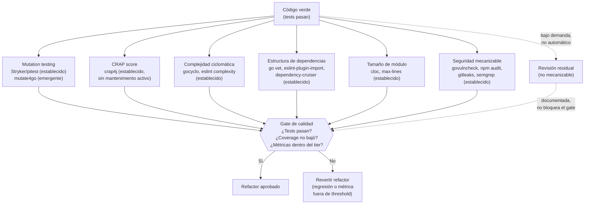

# Fase Refactor — Gate de Calidad

← [Índice principal](../README.md) | [Execution](README.md)

---

## Contenido

- [Principio](#principio)
- [Dimensiones de verificación mecánica](#dimensiones-de-verificación-mecánica)
- [Checklist de verificación mecánica](#checklist-de-verificación-mecánica)
- [Verificación Basada en Métricas](#verificación-basada-en-métricas)
- [Reglas del refactor](#reglas-del-refactor)

---

## Principio

El codigo verde funciona pero puede ser feo. La Fase Refactor aplica
todas las disciplinas de calidad SIN romper tests. Si despues de un
refactor los tests fallan, el refactor introdujo una regresion y se
revierte.

[↑ Contenido](#contenido)

---

## Dimensiones de verificación mecánica

> **Dogma principio 3**: "No revisas código del agente — mides
> métricas." Uncle Bob lo formula así: "No reviso código escrito por
> agentes. Mido cobertura de tests, estructura de dependencias,
> complejidad ciclomática, tamaño de módulos, mutation testing."
> (julio 2026). Virgil no traslada la revisión de código de un
> humano a un sub-agente — la ELIMINA y la reemplaza por herramientas
> mecánicas. Un sub-agente leyendo código y emitiendo un "reporte de
> revisión" sigue siendo revisión de código, solo que relocalizada.
> Eso es exactamente lo que el dogma prohíbe.

Cada dimensión de calidad se verifica con una herramienta que produce
un número comparable contra un threshold, no con una lectura subjetiva
del código:



[↑ Contenido](#contenido)

---

## Checklist de verificación mecánica

| Dimensión | Qué mide | Herramienta | Estado | Criterio |
|-----------|----------|--------------|--------|----------|
| **Complejidad ciclomática** | Ramas de decisión por función/método (proxy mecánico de SRP y KISS). | gocyclo, eslint `complexity`, radon | Establecido | Threshold independiente por tier (ver [thresholds](#thresholds-por-tier)) |
| **Tamaño de módulo** | Líneas de código por archivo/módulo (proxy mecánico de SRP a nivel módulo). | cloc, `wc -l`, eslint `max-lines` | Establecido | Threshold independiente por tier |
| **Estructura de dependencias** | Dirección de dependencias, ciclos, inversión de dependencias (Arquitectura hexagonal, DI). | go vet, eslint-plugin-import, dependency-cruiser, ArchUnit | Establecido | Cero violaciones, en todos los tiers |
| **Duplicación (DRY)** | Bloques de código repetidos. | jscpd, dupl (Go), PMD CPD | Establecido | Referencial — no bloquea el gate por sí sola |
| **Fortaleza de tests** | Mutation score + CRAP (penaliza complejidad sin cobertura; recompensa indirectamente diseño testeable). | Stryker, pitest (establecidos); mutate4go, crap4go (emergentes, ver [tabla por lenguaje](#virgil-metrics)) | Mixto | Ver [thresholds](#thresholds-por-tier) |
| **Seguridad mecanizable** | CVEs en dependencias, secrets hardcodeados, patrones inseguros detectables por SAST. | govulncheck, npm audit, gitleaks, semgrep | Establecido | Vulnerabilidades críticas = 0 |

### Revisión residual

Uncle Bob no reemplaza cada dimensión de calidad por una métrica —
reemplaza las que SON mecanizables. Lo que no lo es queda como
excepción explícita, no como regla:

- **Seguridad no mecanizable** — lógica de autorización correcta,
  modelado de amenazas, decisiones de diseño de seguridad. Ningún
  linter certifica que la regla de negocio "solo el dueño del recurso
  puede editarlo" está bien implementada.
- **Modelado DDD** — si un bounded context o un agregado está bien
  diseñado es una decisión semántica, no una que un tool de análisis
  estático pueda puntuar.

Estos casos no bloquean el gate automático de refactor. Se documentan
como hallazgo y, si el riesgo lo justifica, se escalan a una revisión
puntual bajo demanda (humana o de agente) — la EXCEPCIÓN, no el
mecanismo por defecto de la fase.

[↑ Contenido](#contenido)

---

## Verificación Basada en Métricas

Virgil reemplaza la revisión manual de código por verificación
basada en métricas (ver dogma citado arriba en
[Dimensiones de verificación mecánica](#dimensiones-de-verificación-mecánica)).
El binding layer (declarado en
[Fase Red](red.md#trazabilidad-ac-testplan-testcontract-implementación-coverage),
inferido en [Fase Green](green.md#inferencia-de-bindings)) rastrea
requirement → código → test; las herramientas de esta sección verifican
la FUERZA real de esos tests y del código que producen, no solo su
existencia.

### virgil metrics

Durante o después del refactor, `virgil metrics` ejecuta el chequeo de:

- **Mutation score** — porcentaje de mutantes detectados por la suite
  de tests. Un mutation score bajo significa tests que pasan pero no
  detectan cambios reales en el comportamiento del código.
- **CRAP score** — Change Risk Anti-Patterns (ver fórmula abajo).
- **Complejidad ciclomática** — por función/método. Alimenta el CRAP
  score Y se verifica además como threshold independiente: una función
  puede tener CRAP bajo por estar bien cubierta y seguir siendo
  demasiado compleja para mantener.
- **Estructura de dependencias** — dirección de las dependencias entre
  módulos/capas. Detecta ciclos y violaciones de la regla de
  dependencia (las capas internas no dependen de las externas). Es la
  verificación mecánica de lo que en Dogma v1 cubría el rol reviewer
  de Arquitectura (ver [Revisión residual](#revisión-residual)).
- **Tamaño de módulo** — líneas de código por archivo/módulo. Un
  módulo que crece sin límite es la señal mecánica de una
  responsabilidad que dejó de ser única.

Virgil **orquesta** herramientas externas especializadas por lenguaje —
no las construye ni las reimplementa. No todas están al mismo nivel de
madurez: se marcan explícitamente cuáles son **establecidas** (mantenidas,
con adopción verificable) y cuáles son **emergentes/no verificadas**
(existencia o mantenimiento activo sin confirmar):

| Lenguaje | Mutation testing | Complejidad ciclomática | CRAP | Dependencias |
|----------|-------------------|--------------------------|------|--------------|
| Go | mutate4go — emergente, custom adapter requerido | gocyclo — establecido | crap4go — emergente, custom adapter requerido | go vet, depguard — establecido |
| JavaScript / TypeScript | Stryker — establecido | eslint (`complexity`) — establecido | pendiente de evaluación — sin herramienta madura equivalente | eslint-plugin-import, dependency-cruiser — establecido |
| Java | pitest — establecido | — | crap4j — establecido pero sin mantenimiento activo reciente, evaluar antes de adoptar | ArchUnit — establecido |

El tamaño de módulo es agnóstico de lenguaje (cloc, `wc -l`, o la regla
`max-lines` del linter del stack) y no requiere una columna por
lenguaje en esta tabla.

> **Degradación elegante**: Virgil orquesta herramientas externas. Donde
> no existe una herramienta madura para una celda de la tabla anterior,
> Virgil reporta "no disponible" para esa dimensión y el tier degrada a
> las métricas disponibles (cobertura + complejidad ciclomática) en
> lugar de bloquear el gate por una herramienta inexistente. La
> degradación elegante es una feature del diseño, no una limitación —
> ver el criterio de aceptación de degradación elegante en el contrato
> de métricas (AC-10.6).

### CRAP score

```text
CRAP = comp^2 * (1 - cov/100)^3 + comp
```

Donde `comp` es la complejidad ciclomática de la función y `cov` es su
porcentaje de cobertura de tests. Un método complejo y sin cobertura
produce un CRAP score alto; el mismo método, bien cubierto, lo mantiene
bajo. El CRAP score castiga la combinación de complejidad y ausencia de
tests, no la complejidad por sí sola.

### Thresholds por tier

| Tier | Mutation score mínimo | CRAP máximo | Complejidad ciclomática máxima | Tamaño de módulo máximo (LOC) | Violaciones de dependencia |
|------|------------------------|-------------|----------------------------------|----------------------------------|-------------------------------|
| strict | ≥ 80% | ≤ 30 | ≤ 10 | ≤ 300 | 0 |
| standard | ≥ 60% | ≤ 45 | ≤ 15 | ≤ 500 | 0 |
| relaxed | ≥ 40% | ≤ 60 | ≤ 20 | ≤ 800 | 0 |

Las violaciones de dependencia son tolerancia cero en los tres tiers:
un ciclo o una inversión de la regla de dependencia no es un problema
de grado, es una violación arquitectónica binaria — existe o no existe.

> El tier activo es parte del contrato del handoff (ver
> [contracts.md](contracts.md#contrato-de-métricas)). `virgil health`
> reporta contra ese tier en Accept — el binding pasa de `inferred` a
> `verified` solo cuando las métricas alcanzan su threshold.

[↑ Contenido](#contenido)

---

## Reglas del refactor

1. **Tests DEBEN seguir pasando** despues de cada refactor --- si fallan,
   el refactor introdujo una regresion
2. **Coverage no debe bajar** --- el refactor no elimina tests ni reduce
   cobertura
3. **Alineacion con `design.md`** --- el refactor acerca el codigo a la
   arquitectura definida, no lo aleja
4. **Commit por refactor** --- cada refactor es un commit separado para
   facilitar reversion
5. **Métricas dentro del threshold del tier** --- mutation score, CRAP,
   complejidad ciclomática, tamaño de módulo y violaciones de
   dependencia cumplen el umbral definido para el tier activo antes de
   considerar el refactor aprobado (ver
   [Verificación Basada en Métricas](#verificación-basada-en-métricas))

> Los quality gates del refactor están alineados con el paso 3 (Static
> Test) del [echo system](../echo-system.md) — el análisis estático
> es la primera línea de defensa que el echo formaliza como obligatorio.

[↑ Contenido](#contenido)
