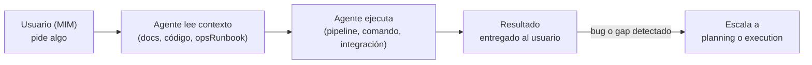
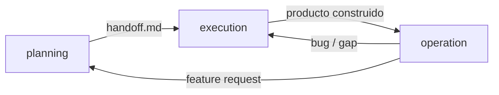

# Modelo de Operation

← [Índice principal](../README.md)

> El producto construido entrega valor: el MIM pasa de dirigir a usar, el
> agente pasa de construir a asistir.

---

## Contenido

- [Principio](#principio)
- [Cuándo se activa](#cuándo-se-activa)
- [Patrón Adaptador](#patrón-adaptador)
- [Actores](#actores)
- [Input](#input)
- [Tipos de operación](#tipos-de-operación)
- [Flujo](#flujo)
- [Lo que NO es operation](#lo-que-no-es-operation)
- [Conexión con planning y execution](#conexión-con-planning-y-execution)
- [Documentación operativa](#documentación-operativa)

---

## Principio

operation arranca donde termina execution: el producto ya existe en el
working tree, certificado por QA. A partir de ahí, el MIM deja de ser
director del proyecto y se convierte en **usuario** del producto. El agente
deja de ser orquestador de construcción y se convierte en
**operationalAssistant**: ejecuta lo que el usuario pide dentro del
contexto del producto ya construido.

A diferencia de planning y execution, operation no tiene fases, no tiene
scrum team convocado, y no produce artefactos de planificación. Es
**reactivo**: el agente responde a pedidos concretos del usuario,
consultando la documentación y el código del proyecto para entender qué
puede hacer y cómo hacerlo.

operation es **opcional**. No todo proyecto tiene superficie operativa —
una librería se publica, no se opera; un entregable one-shot se entrega,
no se opera.

> **operation como facade, no como fase obligatoria**: la metodología
> cubre el ciclo completo idea → operación, pero operation funciona
> como una fachada (facade) o plugin que se activa sobre el producto ya
> construido — no como un eslabón obligatorio del pipeline. Cada
> proyecto decide, según su naturaleza, **si** activa esa fachada y
> **con qué adaptador** (ver [Patrón Adaptador](#patrón-adaptador)).

[↑ Contenido](#contenido)

---

## Cuándo se activa

| Tipo de proyecto | ¿Aplica operation? | Ejemplo |
|-------------------|-----------------|---------|
| CLI o herramienta con comandos | Sí | Ejecutar comandos, generar outputs |
| Servicio o API | Sí | Operar, invocar, interactuar con endpoints |
| Proyecto con integraciones externas | Sí | Jira, Confluence, sistemas de terceros |
| Librería o paquete | No | Se publica, no se opera |
| Entregable one-shot | No | Se entrega, no se opera |

[↑ Contenido](#contenido)

---

## Patrón Adaptador

operation no impone un único formato de documentación operativa. Se
comporta como una fachada con adaptadores intercambiables: el tipo de
proyecto determina qué adaptador aplica y qué documento produce
planning en su fase de documentación operativa:

| Tipo de proyecto | Adaptador | Documento operativo |
|-------------------|-----------|-----------------------|
| Servicio o API | ops-runbook | `ops-runbook.md` |
| CLI o herramienta con comandos | usage-guide | `usage-guide.md` |
| Librería o paquete | api-reference | `api-reference.md` |

> El adaptador no es obligatorio ni único. Un proyecto puede no activar
> ninguno (ver [Cuándo se activa](#cuándo-se-activa)), y un proyecto con
> superficies mixtas (CLI que también expone una librería, por ejemplo)
> puede combinar más de un adaptador. La elección la informa `design.md`
> y la produce planning — operation solo consume el resultado.

[↑ Contenido](#contenido)

---

## Actores

| Actor | En planning | En execution | En operation |
|-------|-----------|-----------|-----------|
| MIM | Dirige | Aprueba/desbloquea | **Usuario** — consume el producto |
| Agente | SM (orquesta planificación) | Orquestador (coordina ejecución) | **operationalAssistant** — ejecuta lo que el usuario pide |

[↑ Contenido](#contenido)

---

## Input

- Producto construido (salida de execution, en el working tree)
- `ops-runbook.md` (si el proyecto lo tiene — referencia operativa)
- Documentación del proyecto (README, guías, docs de API)
- `AGENTS.md` — las reglas del proyecto siguen aplicando

[↑ Contenido](#contenido)

---

## Tipos de operación

No es una taxonomía a seguir rígidamente — son ejemplos de qué significa
"operar" un producto:

| Tipo | Ejemplo | Qué hace el agente |
|------|---------|---------------------|
| Generación de artefactos | "Genera un PDF con mi perfil" | Ejecuta el pipeline del proyecto, produce el output |
| Ejecución de tareas | "Lanza el challenge X" | Configura y ejecuta el flujo definido por el proyecto |
| Integración con sistemas externos | "Entra a Jira y comenta en US-123" | Usa las integraciones del proyecto para interactuar |
| Consulta operativa | "¿Cuántos challenges tengo pendientes?" | Lee el estado del proyecto y reporta |

[↑ Contenido](#contenido)

---

## Flujo

[↑ Contenido](#contenido)

---

## Lo que NO es operation

- No es SRE ni monitoreo de infraestructura — eso lo cubre `ops-runbook.md`
  como referencia, no el operation en sí.
- No es planificación — no hay fases ni artefactos de planificación.
- No es construcción — no hay ciclo Red-Green-Refactor.
- No hay equipo — el usuario opera directamente con asistencia del
  agente, sin lentes de revisión convocados.

[↑ Contenido](#contenido)

---

## Conexión con planning y execution

| Evento en operación | Acción |
|----------------------|--------|
| Bug descubierto | Escalar a execution (Red → Green) |
| Feature request | Escalar a planning (nueva planificación) |
| Gap de documentación | Escalar a planning (Fase 6 — producir/actualizar `ops-runbook.md`) |
| Proyecto deprecado | Cerrar operation — archivar |

> Para escalaciones de bug desde operation, el contexto diagnóstico (descripción
> del bug, pasos de reproducción, área afectada) actúa como contrato de
> entrada a execution en lugar de un `handoff.md` formal. Ver
> `fast-forward.md` para el mecanismo de fastForward mid-cycle.

[↑ Contenido](#contenido)

---

## Documentación operativa

operation consume la documentación operativa que haya producido el ciclo
anterior. El `handoff.md` declara qué documentación se espera (sección
condicional). Si esa documentación no existe o es insuficiente, operation
puede escalar de vuelta a planning para producirla o completarla.

[↑ Contenido](#contenido)
