# idea-to-mvp --- Vista General del Framework

← [Índice](README.md)

> **Identidad**: idea-to-mvp es un harness para desarrollo de software
> asistido por IA. Caso primario: 1 humano (MIM) + N agentes IA, desde
> una idea hasta un producto funcional. El framework previene drift y
> alucinaciones de los agentes mediante artefactos validados, gates de
> aprobación, y un pipeline determinista (echo). Equipos con
> desarrolladores humanos pueden adoptar las fases y artefactos — el
> modelo de delegación (SM, delegationContracts, PDC) se adapta.
>
> Este documento es el mapa de navegación. Los diagramas son la
> comunicación principal; el texto es tejido conectivo.

---

## Contenido

- [Dogma Rector](#dogma-rector)
- [Adopción Progresiva](#adopción-progresiva)
- [Actores y Roles](#actores-y-roles)
- [Modos de Funcionamiento](#modos-de-funcionamiento)
- [Pipeline Completo](#pipeline-completo)
- [Artifacts](#artifacts)
- [Máquina de Estados de Artefactos](#máquina-de-estados-de-artefactos)
- [Modelo de Delegación](#modelo-de-delegación)
- [fastForward](#fastforward)
- [artifactStore y Adapters](#artifactstore-y-adapters)
- [Qué Sigue (áreas TBD)](#qué-sigue-áreas-tbd)

---

## Dogma Rector

El framework se rige por seis principios no negociables (Dogma). Toda
decisión de diseño, herramienta o proceso nueva debe alinearse con ellos.

1. **Metodología e2e** — el framework cubre el ciclo completo idea →
   código certificado, con una transición de despliegue verificada
   mecánicamente (gate pre/post-deploy y concepto de rollback, ver
   [Detalle de Fases](planning/behavior/phases.md#despliegue--transición-entre-ejecución-y-operación))
   hacia una operación opcional. La operación es una fachada (facade)
   deliberadamente delgada — reactiva, sin fases propias — sobre el
   flujo end-to-end; no es una macro-fase obligatoria para cerrar el
   ciclo, y el framework no prescribe monitoreo continuo, alerting ni
   SRE. "Idea → operación" describe la transición mecánica cubierta,
   no que el framework opere el servicio por el usuario.
2. **Trazabilidad Y fortaleza verificadas** — no basta con verificar el
   binding (la trazabilidad entre artefactos, que confirma que un enlace
   existe). También se verifica la fortaleza real del código mediante
   herramientas externas orquestadas (mutation testing, CRAP score,
   complejidad ciclomática).
3. **Gestión desde nivel superior** — el MIM gestiona el proyecto
   mediante un dashboard de salud (`virgil health`), no mediante
   revisión manual de código línea por línea.
4. **El agente opera bajo constraint, no bajo confianza** — el
   cumplimiento se impone mediante hooks y gates determinísticos, no
   mediante la expectativa de que el agente "se porte bien".
5. **Un handoff, ejecución paralela con semántica de coordinación** —
   múltiples subAgents ejecutan sobre un mismo `handoff.md` mediante
   claiming (`pending` → `claimed` → `done`) y execution state, evitando
   colisiones sin necesitar handoffs separados por subAgent.
6. **Gates determinísticos en transiciones de fase** — cada transición
   entre fases se valida mecánicamente (`virgil handoff lint`), no por
   aprobación subjetiva.

> "I don't review code written by agents. I measure test coverage,
> dependency structure, cyclomatic complexity, module sizes, mutation
> testing. Humans need to disengage from code and manage from a higher
> level." — Robert C. Martin ("Uncle Bob"), julio 2026.

> Detalle: [Gobernanza Metodológica](planning/artifacts/methodology.md)
> (sección "Verificación de métricas: trazabilidad y fortaleza").

[↑ Contenido](#contenido)

---

## Adopción Progresiva

Las capacidades de Virgil (binding layer, `virgil scan`, `virgil health`)
son usables de forma **independiente** de la metodología completa. La
metodología de 8 fases es el default opinado del framework, no el peaje
de entrada para beneficiarse del binding layer.

| Nivel | Comando | Qué incluye |
|-------|---------|-------------|
| **Mínima** | `virgil init --minimal` | Binding graph + `virgil scan` + `virgil health`. Sin fases, sin roles, sin ceremonia. |
| **Estándar** | `virgil init` | Binding + echo hooks + handoff lint + orquestación del motor de métricas (mutation, CRAP, complejidad). |
| **Completa** | `virgil init --full` | Metodología de 8 fases completa, con los roles del equipo default y gates de aprobación. |

Cada nivel agrega valor por sí mismo; ningún nivel exige adoptar el
siguiente. Un equipo puede quedarse en adopción mínima de forma indefinida
y seguir beneficiándose de trazabilidad y verificación de fortaleza — así
como un equipo puede adoptar la metodología completa sin tocar nunca el
binding layer, aunque en ese caso pierde la mitad "fortaleza" del Dogma
(principio 2).

[↑ Contenido](#contenido)

---

## Actores y Roles

El framework opera con tres capas de actores: el humano (MIM), la
infraestructura de orquestación (SM + TPM), y los roles productivos
(equipo default + ad-hoc).

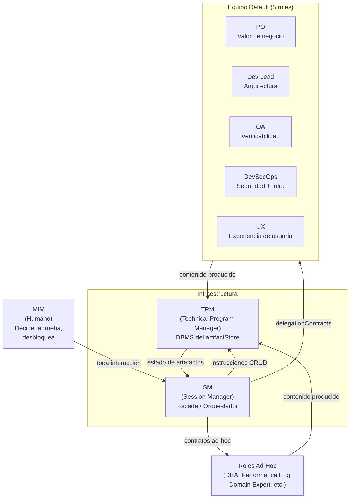

Reglas clave:

- El SM **nunca produce contenido** --- solo orquesta, convoca y valida gates.
- El TPM **es el único que escribe** en el artifactStore --- con criterio editorial.
- Los roles son subAgents con personalidad que **cambia por fase**.
- El SM puede **extender el equipo** con roles ad-hoc justificados.

> Detalle: [roles](planning/roles/README.md) (contratos por fase) y
> [comportamiento SM](planning/behavior/README.md)
> (reglas del SM).

[↑ Contenido](#contenido)

---

## Modos de Funcionamiento

El framework separa planificación de ejecución con un contrato formal
entre ambos modos: el handoff.

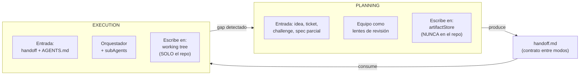

| Aspecto | Planning | Execution |
|---------|---------------|-----------|
| Propósito | Producir fuentes de verdad | Implementar código |
| Participantes | Equipo (lentes) | Orquestador + minions |
| Dónde escribe | artifactStore (fuera del repo) | Working tree del repo |
| Estado actual | **DEFINIDO** | **DEFINIDO** |

> **Nota (Dogma)**: el `AGENTS.md` monolítico como único vehículo de
> gobernanza por repo se reemplaza por **progressive disclosure**:
> reglas divididas en skills que se activan por contexto, hooks que
> imponen constraints determinísticos (principio 4), y MCP que expone
> herramientas bajo demanda — en vez de un único archivo que el agente
> debe leer completo en cada sesión.

> Detalle: [modelo operativo](planning/operational-model.md).

[↑ Contenido](#contenido)

---

## Pipeline Completo

El ciclo tiene 4 macro-fases, todas definidas. Las fases post-ejecución
están definidas como parte de planning; la macro-fase de operación es
operation: una fachada (facade) opcional y reactiva sobre el ciclo e2e
completo (idea → operación) — no es un requisito para cerrar el ciclo
(Dogma, principio 1).

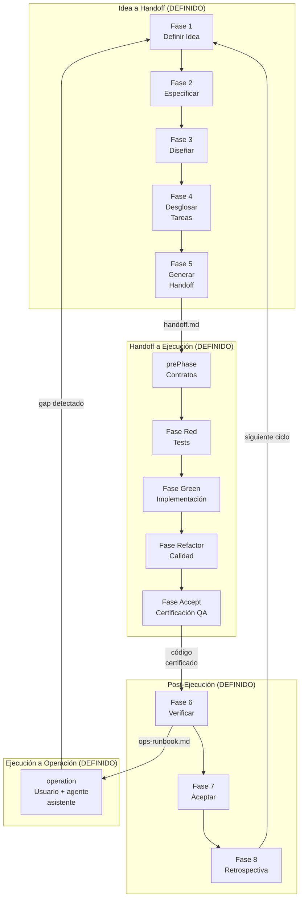

Vista alternativa: la línea de tiempo pone el foco en el **orden temporal**
de las fases dentro de cada macro-etapa, en vez de las dependencias entre
sub-fases.

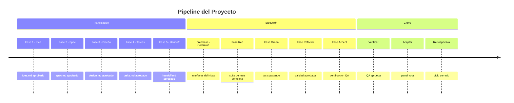

### Roles convocados por fase

| Fase | Roles activos |
|------|---------------|
| 1. Idea | PO |
| 2. Spec | PO + QA + UX (condicional) |
| 3. Diseño | Dev Lead + DevSecOps + UX (condicional) |
| 4. Tareas | Dev Lead + DevSecOps (cond) + QA (cond) |
| 5. Handoff | TPM (compila bajo instrucción del SM) |
| 6. Verificar | QA + Dev Lead + DevSecOps (condicional) |
| 7. Aceptar | Todos los roles activos (votación paralela) |
| 8. Retro | Todos los roles activos |

> Detalle: [comportamiento SM](planning/behavior/README.md)
> (fases 1-8) y [roles](planning/roles/README.md) (contratos de cada
> rol por fase).
>
> **Validación externa (recomendada, no un gate)**: tanto Fase Accept
> (execution) como Fase 7 (planning) certifican el entregable de forma
> **interna** — el propio equipo de agentes vota o certifica. El
> framework recomienda, sin exigirlo, un checkpoint de **validación
> externa**: alguien fuera del equipo de agentes (el MIM, un
> stakeholder, un usuario real) ve el software funcionando antes de
> cerrar el ciclo. Es el equivalente al "Measure" de
> Build-Measure-Learn — sin esa señal externa, la Retrospectiva
> (Fase 8) solo aprende de la percepción del propio equipo. Ver
> [Fase Accept](execution/accept.md#validación-externa-recomendada).

[↑ Contenido](#contenido)

---

## Artifacts

El framework produce 6 artefactos universales respaldados por estándares
ISO/IEC/IEEE. Cada fase consume el output de la anterior y produce los
parámetros requeridos para la siguiente.

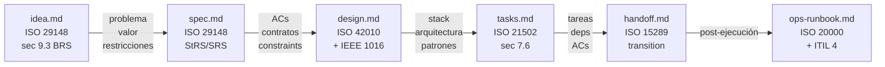

> **binding layer**: esta cadena de artefactos es, en términos del Dogma
> (principio 2), el grafo de trazabilidad que el TPM mantiene —
> vincula cada artefacto downstream con su upstream (idea → spec →
> design → tasks → handoff → ops-runbook). `verifyConsistency` opera
> sobre este grafo para detectar semanticDrift. El binding layer
> confirma que el enlace existe; la fortaleza del enlace (si el test
> realmente detecta regresiones) se verifica aparte, vía herramientas
> externas orquestadas por Virgil (mutation testing, CRAP score,
> complejidad ciclomática).

### Quién produce y quién valida

| Artefacto | Produce | Valida (gate) |
|-----------|---------|---------------|
| `idea.md` | PO | SM (estructural via TPM) |
| `spec.md` | PO | QA (testeabilidad) + UX (experiencia) |
| `design.md` | Dev Lead + DevSecOps | SM (via TPM) + DevSecOps + UX |
| `tasks.md` | Dev Lead | QA (verificabilidad) + SM (via TPM) |
| `handoff.md` | TPM (compila) | SM (autocontención) |
| `ops-runbook.md` | DevSecOps + Dev Lead | SM (gate) |

> Regla cardinal: **quién produce nunca valida su propio artefacto**.
>
> DevSecOps contribuye al assessment de seguridad en Fase 3 (input a
> `design.md`) y evalúa la postura de seguridad en Fase 7 (validación). Son
> scopes distintos: el input de Fase 3 no equivale a producción del
> artefacto completo.
>
> Detalle: [artefactos](planning/artifacts/README.md) (schemas, contenido
> mínimo, jerarquía de workItems, adapters de persistencia).

[↑ Contenido](#contenido)

---

## Máquina de Estados de Artefactos

Cada artefacto transiciona a través de una state machine configurable.
El estado `approved` es el que habilita la siguiente fase.

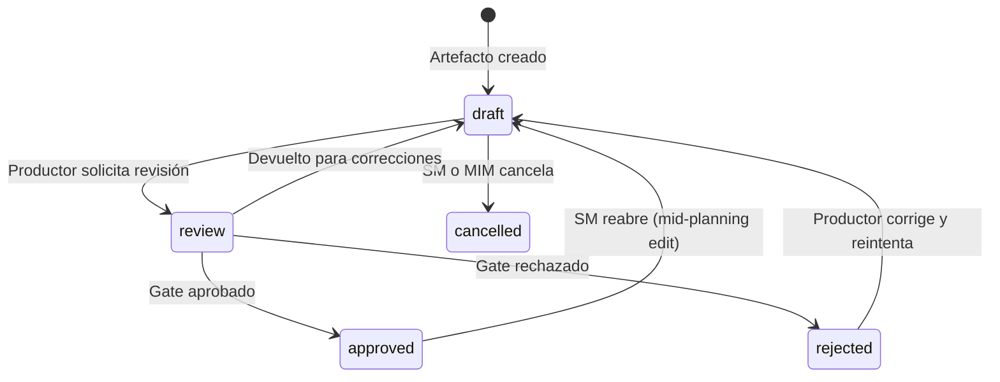

La state machine del **proyecto** se deriva del estado de los artefactos
en el RAG. El SM no persiste estado --- lo reconstruye consultando al TPM:

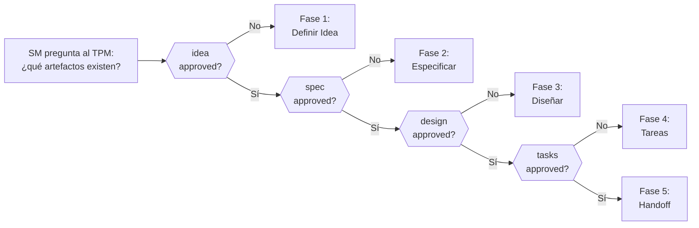

> Detalle: [artefactos](planning/artifacts/README.md) (sección `transition`)
> y [comportamiento SM](planning/behavior/README.md)
> (state machine del proyecto).

[↑ Contenido](#contenido)

---

## Modelo de Delegación

El SM delega trabajo vía **contratos de delegación** con campos
obligatorios. Después de cada retorno, ejecuta el **PDC** (Post-Delegation
Checkpoint).

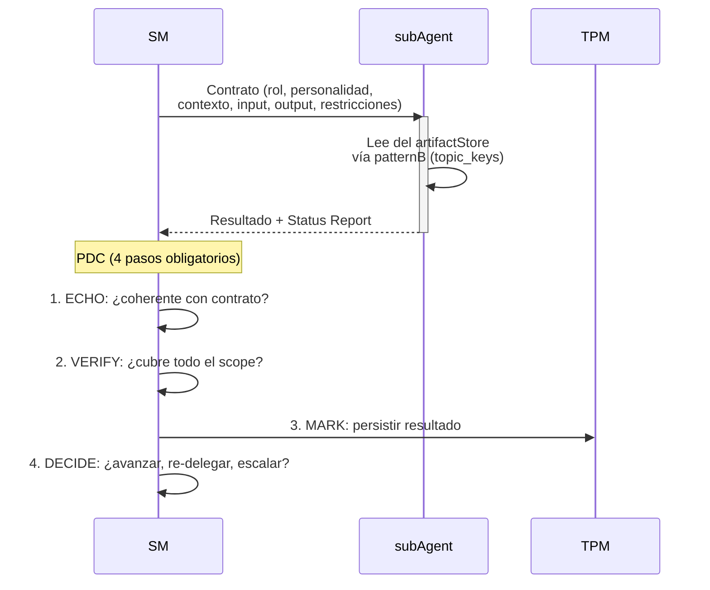

### patternA vs patternB (retrieval)

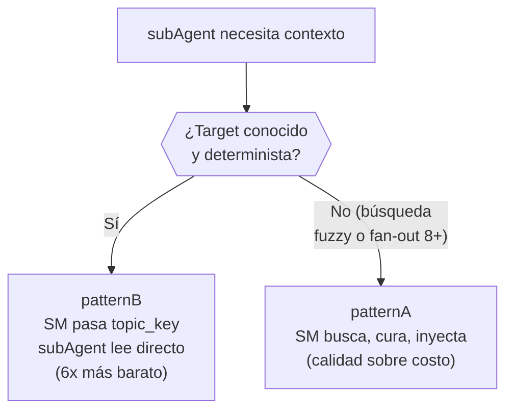

**circuitBreaker**: si 3 delegaciones consecutivas al mismo rol fallan, el SM detiene la cadena y escala al MIM.

> Detalle: [comportamiento SM](planning/behavior/README.md)
> (PDC, circuitBreaker, context resilience) y
> [roles](planning/roles/README.md) (contratos por fase).

[↑ Contenido](#contenido)

---

## fastForward

El SM no avanza siempre una fase a la vez. Evalúa un **gradiente de
certeza** con 4 factores (F1-F4) y avanza proporcionalmente.

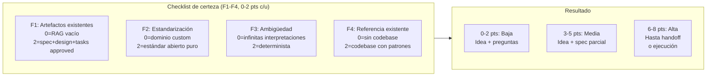

Ejemplos:

| Input | Score | Certeza | Acción |
|-------|-------|---------|--------|
| "Hazme el uber de lanchas" | 0 | Baja | Idea + preguntas |
| "Agrega auth JWT" (codebase Express) | 4 | Media | Idea + spec parcial |
| "Crea módulo OTEL" (codebase NestJS) | 6 | Alta | Hasta handoff |
| Epic ya groomeado (todo en RAG) | 8 | Alta | fastForward a ejecución |

El SM registra el score F1-F4 en `idea.md` para auditabilidad. El
fastForward también aplica **mid-cycle** (bugs en producción, epics
ya groomeados).

> Detalle: [comportamiento SM](planning/behavior/README.md)
> (sección fastForward contextual).

[↑ Contenido](#contenido)

---

## artifactStore y Adapters

Los artefactos se persisten vía una **universalInterface de 9
operaciones**. El adapter es pluggable --- el framework define la
interfaz, no la implementación.

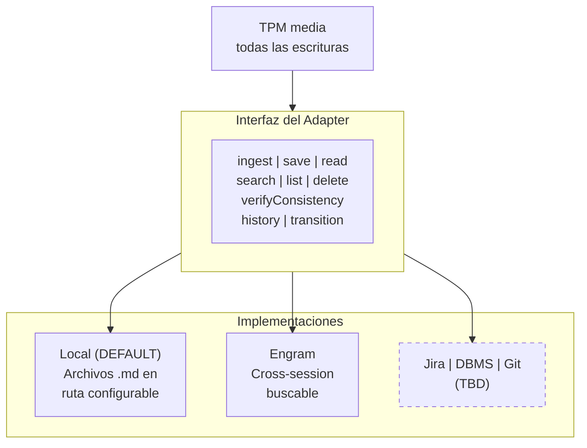

El TPM actúa como DBMS: no decide qué datos crear, pero decide cómo se
almacenan, valida integridad, y sirve consultas con criterio editorial.

> Detalle: [artefactos](planning/artifacts/README.md) (universalInterface,
> contrato de comportamiento, garantías ACID, adapters).

[↑ Contenido](#contenido)

---

## Qué Sigue (áreas TBD)

El framework cubre la macro-fase de planificación y la macro-fase de
ejecución en detalle. Las siguientes áreas están identificadas pero no
definidas:

| Área | Estado | Descripción |
|------|--------|-------------|
| Execution | **DEFINIDO** | 5 fases (Contratos → Red → Green → Refactor → Accept). Contract-first, boundaryModel (App + E2E), revisión multi-dimensional. Ver [modelo de ejecución](execution/README.md). |
| Despliegue | **DEFINIDO (nivel dogma)** | Transición entre Fase Accept (execution) y Operation. Define gate pre/post-deploy y el concepto de rollback a nivel dogma; NO prescribe mecanismo de despliegue (CI/CD, blue-green, canary) — eso queda a decisión del proyecto. Ver [Detalle de Fases](planning/behavior/phases.md#despliegue--transición-entre-ejecución-y-operación). |
| Operation | **DEFINIDO** | Opcional. Para proyectos con superficie operativa: el usuario consume el producto con asistencia del agente. Reactivo, sin fases. Ver [modelo de operación](operation/README.md). |
| Adapters avanzados | TBD | Jira, DBMS, Git repo, MS Project como adapters del artifactStore. |
| Routing no-Scrum | TBD | Routing tables para Kanban (WIP limits), Shape Up (bets), SAFe (PIs). Los artefactos son universales; la orquestación no. |
| Tiers de activación | TBD | Cómo escala hacia abajo el modo planificación para proyectos simples o challenges con timebox. |
| Transacciones del adapter | TBD | Primitivas `begin`/`commit`/`rollback` para adapters sin soporte nativo. |

[↑ Contenido](#contenido)

---

## Índice de Documentos Detallados

| Documento | Qué define |
|-----------|-----------|
| [Modelo operativo](planning/operational-model.md) | Dos modos, ownership, límites, adapter por defecto |
| [Artifacts](planning/artifacts/README.md) | 6 artefactos, TPM, interfaz de adapters, state machine, jerarquía de workItems |
| [SM Behavior](planning/behavior/README.md) | SM como facade, state machine del proyecto, fastForward, PDC, circuitBreaker |
| [Roles](planning/roles/README.md) | delegationContracts por fase, personalidades, activación condicional, roles ad-hoc |
| [Execution](execution/README.md) | Execution: Contract-first, Red-Green-Refactor macro, roles de ejecución, conexión con planning |
| [Operation](operation/README.md) | Operation: opcional y reactivo, sin fases, usuario + agente asistente, conexión con planning y execution |
| [echo system](echo-system.md) | Pipeline determinista de 5 pasos, homogeneidad de ambientes, enforcement, bumpDependencies |
| [artifact system](artifact-system.md) | Convención de ubicación predecible para outputs de build (compilados, reportes, documentación API) |
