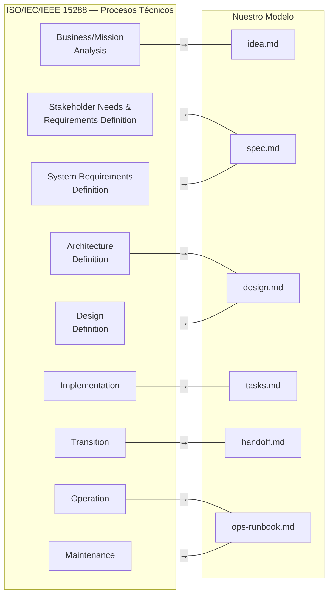
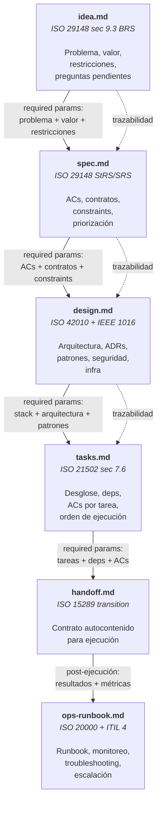
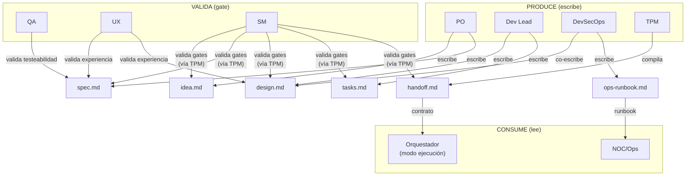
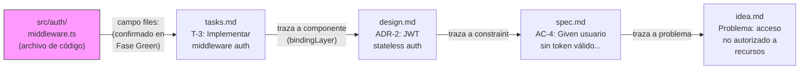

# Modelo de Artefactos

← [Índice principal](../../README.md) | [Planning](../README.md)

> El modelo de artefactos define QUÉ documentos produce un proyecto y qué
> contiene cada uno. Es **independiente de la metodología** (Scrum, Kanban,
> Shape Up, PI Planning, SAFe, etc.) y está respaldado por estándares
> internacionales ISO/IEC/IEEE.
>
> La metodología define CÓMO se organiza el trabajo (ceremonia, cadencia,
> roles). Los artefactos son los mismos sin importar la metodología elegida.
>
> **Nota terminológica**: El *artifactStore* es el sistema de
> almacenamiento (backend del TPM). El patrón *RAG* (Retrieval-Augmented
> Generation) es CÓMO los agentes consultan el artifactStore. No son
> sinónimos: el artifactStore es la infraestructura; RAG es el patrón
> de acceso.

---

## Contenido

- [Por Qué Estándares Internacionales](#por-qué-estándares-internacionales)
- [La Columna Vertebral: ISO/IEC/IEEE 15288](#la-columna-vertebral-isoiecieee-15288)
- [Documentos del Modelo](#documentos-del-modelo)
- [Cadena de Artefactos — Flujo Completo](#cadena-de-artefactos-flujo-completo)
- [Ownership — Quién Produce, Quién Consume, Quién Valida](#ownership-quién-produce-quién-consume-quién-valida)
- [Trazabilidad Inversa — Código a Artefacto](#trazabilidad-inversa-código-a-artefacto)
- [Preguntas Abiertas](#preguntas-abiertas)

---

## Por Qué Estándares Internacionales

El modelo de artefactos NO es una invención del framework. Está alineado
con estándares ISO/IEC/IEEE porque:

1. **Portabilidad de adapters** — si los artefactos siguen un estándar,
   cualquier sistema que implemente ese estándar puede ser adapter:
   archivos locales, Jira, Asana, Basecamp, MS Project, un DBMS, un RAG
   remoto, engram, Confluence, Linear, o cualquier herramienta futura.

2. **Interoperabilidad** — un `spec.md` que sigue ISO/IEC/IEEE 29148 es
   entendible por cualquier equipo, herramienta o proceso que conozca el
   estándar. No es un formato propietario.

3. **Completitud verificable** — los estándares definen qué secciones debe
   tener cada artefacto. Eso nos da un schema verificable mecánicamente
   (el TPM puede validar completitud contra el estándar).

4. **Independencia de la metodología** — los estándares describen
   *information items*, no ceremonias. Un `spec.md` es un `spec.md` sin
   importar si se produjo en un sprint planning o en un bet de Shape Up.

```mermaid
flowchart TD
    subgraph STANDARDS["Estándares ISO/IEC/IEEE"]
        ISO15288["15288\nCiclo de vida\n(la columna vertebral)"]
        ISO15289["15289\nCatálogo de artefactos\n(qué documentos por proceso)"]
        ISO29148["29148\nRequisitos\n(StRS, SyRS, SRS, BRS sec 9.3)"]
        ISO42010["42010\nDescripción de arquitectura"]
        IEEE1016["IEEE 1016\nDiseño de software"]
        ISO29119["29119-3\nDocumentación de pruebas"]
        ISO20000["20000\nGestión de servicios IT"]
        ITIL["ITIL 4\nTransición de servicios"]
        ISO21502["21502 sec 7.6\nSchedule Management"]
        PMBOK_DA["PMBOK\nDefine Activities"]
    end

    subgraph MODEL["Modelo Universal de Artefactos"]
        IDEA["idea.md"]
        SPEC["spec.md"]
        DESIGN["design.md"]
        TASKS["tasks.md"]
        HANDOFF["handoff.md"]
        OPS["ops-runbook.md"]
    end

    ISO15288 -->|"define la secuencia\nde etapas"| MODEL
    ISO15289 -->|"define contenido\nmínimo por artefacto"| MODEL
    ISO29148 -->|"respalda sec 9.3 BRS"| IDEA
    ISO29148 -->|"respalda StRS/SRS"| SPEC
    ISO42010 -->|"respalda"| DESIGN
    IEEE1016 -->|"respalda"| DESIGN
    ISO21502 -->|"respalda mecanismo\nde descomposición"| TASKS
    PMBOK_DA -->|"respalda Activity List\n+ Activity Attributes"| TASKS
    ISO29119 -->|"respalda"| HANDOFF
    ISO20000 -->|"respalda"| OPS
    ITIL -->|"respalda"| OPS
```



> **Los 6 artefactos tienen respaldo de estándares internacionales.**
> `idea.md` se respalda con ISO/IEC/IEEE 29148 sec 9.3 (BRS). `tasks.md` no
> tiene un estándar que defina el artefacto como tal, pero el mecanismo de
> descomposición que implementa está respaldado por ISO 21502 sec 7.6 y PMBOK
> "Define Activities." Los demás siguen directamente sus estándares ISO.

[↑ Contenido](#contenido)

---

## La Columna Vertebral: ISO/IEC/IEEE 15288

El estándar 15288 (System Life Cycle Processes) define las etapas del ciclo
de vida de un sistema. Es **agnóstico a la metodología** — no menciona
sprints, backlogs ni cadencias. Define procesos y sus outputs.

Nuestro modelo mapea directamente a sus procesos técnicos:



**Nota**: el estándar define más procesos (Integration, Verification,
Validation, Disposal). Esos se mapean a las etapas post-ejecución (Verify,
Accept, Retro) que se definen por separado.

[↑ Contenido](#contenido)

---

## Documentos del Modelo

Este modelo se documenta en las siguientes páginas:

- [Schemas de los 6 Artefactos](schemas.md) — propósito, respaldo ISO,
  y contenido mínimo de cada artefacto.
- [Metodología como Capa Intercambiable](methodology.md) — gobierno de
  metodología, lock por iteración, y protocolo de cambio.
- [TPM y universalInterface](tpm-adapter.md) — el TPM como DBMS del
  modelo, las operaciones sobre artefactos, y los adapters de
  persistencia.
- [Máquina de Estados y Transiciones](state-machine.md) — estados de un
  artefacto, la operación `transition()`, y la detección de drift
  semántico.
- [Jerarquía de workItems](work-items.md) — niveles L0-L4, dependencias,
  y el DAG de ejecución.
- [Estrategia de Retrieval](retrieval.md) — patternA vs. patternB para
  que los subAgents consulten el RAG.

[↑ Contenido](#contenido)

---

## Cadena de Artefactos — Flujo Completo



[↑ Contenido](#contenido)

---

## Ownership — Quién Produce, Quién Consume, Quién Valida



### Matriz de Ownership Detallada

| Artefacto | Produce | Co-produce | Valida (gate) | Consume |
|-----------|---------|------------|---------------|---------|
| `idea.md` | PO | SM (preguntas) | SM (estructural vía TPM) + QA (verificabilidad de restricciones) | Fase spec |
| `spec.md` | PO | — | QA (testeabilidad), UX (experiencia), SM (gate) | Fase design |
| `design.md` | Dev Lead | DevSecOps (seguridad, infra) | SM (estructural vía TPM) + DevSecOps (seguridad) + UX (experiencia, condicional) | Fase tasks |
| `tasks.md` | Dev Lead | QA (verificabilidad por tarea) | SM (estructural vía TPM) + QA (verificabilidad por tarea) | Fase handoff |
| `handoff.md` | TPM | — | SM (autocontención) | Modo ejecución |
| `ops-runbook.md` | DevSecOps | Dev Lead (troubleshooting) | SM (gate) | NOC/Ops |

### Reglas de Ownership

1. **Quien produce NUNCA valida su propio artefacto** — el PO escribe
   spec, QA valida. Dev Lead escribe design, UX y DevSecOps validan.
   Separación de concerns entre producción y validación. Casos con
   validador semántico independiente añadido: `idea.md` (SM estructural
   vía TPM + QA verifica verificabilidad de restricciones), `design.md`
   (SM estructural vía TPM + DevSecOps valida seguridad + UX valida
   experiencia de forma condicional), `tasks.md` (SM estructural vía
   TPM + QA valida verificabilidad por tarea, en vez de que Dev Lead
   se autovalide).

2. **El SM nunca produce contenido** — orquesta, valida gates (vía TPM),
   pero no escribe dentro de ningún artefacto. Regla cardinal sin
   excepciones.

3. **El TPM es el ÚNICO que ESCRIBE en el RAG** — todas las operaciones
   de escritura (create, update, delete, transition) pasan por el TPM
   con criterio editorial (formato, completitud, consistencia). Las
   **lecturas son libres** — cualquier rol puede consultar el RAG
   directamente vía patternB (topic_keys) sin intermediario. Ver
   [Estrategia de Retrieval](retrieval.md).

4. **El handoff lo compila el TPM, no un rol productivo** — es una
   síntesis de artefactos previos, no contenido nuevo. El TPM aplica
   su criterio editorial para compilar un documento autocontenido.

5. **opsRunbook se construye incrementalmente** — no es un artefacto de
   una sola fase. Se va construyendo como parte de los artifacts que
   apliquen al proyecto que se implementa: si es CLI → documentacion de
   flags y help, si es API → API docs, si es gRPC → protos, si es
   infraestructura → runbook de operaciones. DevSecOps contribuye la
   parte de seguridad y monitoreo; Dev Lead la de troubleshooting y
   arquitectura operativa. El formato final depende de lo que el
   proyecto SEA, no de una plantilla rigida.

[↑ Contenido](#contenido)

---

## Trazabilidad Inversa — Código a Artefacto

> El `bindingLayer` (ver [glosario](../../glossary.md)) traza hacia
> adelante: qué AC de `spec.md` está cubierto por qué tarea de
> `tasks.md`. Pero dado un archivo de código ya escrito
> (`src/auth/middleware.ts`), no existe forma mecánica de determinar qué
> tarea lo originó, qué decisión de diseño lo motivó, o qué problema de
> negocio resuelve. Esta sección define el binding inverso: código →
> artefacto.

### Grafo de Binding Inverso



Dado un `path`, el grafo se camina en un solo sentido: código hacia el
problema de negocio que lo justifica. Es el complemento inverso de la
[Cadena de Artefactos](#cadena-de-artefactos-flujo-completo), que traza
hacia adelante (`idea.md` → ... → `handoff.md`).

### Tres Mecanismos Complementarios

Ningún mecanismo por sí solo resuelve el binding inverso. Los tres
operan juntos:

| Mecanismo | Dónde vive | Cómo funciona |
|-----------|-----------|---------------|
| **Anotación de binding** | Campo `files` del workItem, en `tasks.md` y `handoff.md` | En planificación, `files` es una estimación ("si se conocen", ver [Schemas](schemas.md)) usada para detectar solapamiento entre lanes. Durante **Fase Green** (ver [Estrategia de Commits](../../execution/git-strategy.md#estrategia-de-commits)), el implementor CONFIRMA el campo con los archivos realmente creados o modificados. La estimación de planificación se convierte en el registro de binding real. |
| **Integración con git** | Historial de commits | Los commits de Green ya referencian AC y test bajo la convención `tipo: descripción (referencias)` (ver [Estrategia de Commits](../../execution/git-strategy.md#estrategia-de-commits)). El ID de tarea se agrega al mismo paréntesis: `feat: implement auth middleware (T-3, passes auth-login-success)`. Trazabilidad secundaria vía `git log --grep "T-3"`. |
| **Query inversa** | `verifyConsistency` en modo `--reverse` (ver [universalInterface](tpm-adapter.md)) | Dado un path de archivo, camina el `bindingLayer` hacia atrás: file → task (`files`) → design (componente/ADR) → spec (AC) → idea (problema). Extiende la operación `verifyConsistency(artifact[])` existente — no agrega una operación nueva al `universalInterface`. |

### Regla — Trazabilidad Vive en Artefactos y Git, Nunca en Código

La trazabilidad se registra en los artefactos (campo `files`) y en git
(mensajes de commit). **NUNCA** en comentarios de código:

```typescript
// ❌ NUNCA — el comentario se desincroniza del artefacto y nadie lo audita
// Task: T-3
// See spec AC-4
export function authMiddleware() { /* ... */ }
```

```typescript
// ✅ El código no anota su propio origen. La trazabilidad vive en
// handoff.md (campo files) y en el commit que lo introdujo.
export function authMiddleware() { /* ... */ }
```

**Razón**: un comentario de código no está bajo control del TPM — nadie
lo valida, nadie lo actualiza cuando la tarea se re-planifica, y
`verifyConsistency` no puede leerlo como fuente de verdad. El
`bindingLayer` exige que la trazabilidad viva donde el TPM puede
escribirla, validarla y consultarla mecánicamente: el artifactStore y
el historial de git, nunca el código fuente.

[↑ Contenido](#contenido)

---

## Relación con Otros Documentos

- [operational-model.md](../operational-model.md) — define los dos
  modos (planificación y ejecución). Este documento define los
  artefactos que el modo planificación produce.
- [SM Behavior](../behavior/README.md) — define
  cómo el SM orquesta la producción de artefactos. El SM usa este
  modelo como referencia para saber qué artefactos deben existir en
  cada fase.

[↑ Contenido](#contenido)

---

## Preguntas Abiertas

1. ~~**¿Debe `ops-runbook.md` producirse en modo planificación o
   post-ejecución?**~~ **RESUELTO**: post-ejecución. El opsRunbook
   se produce en Fase 6 (Verificar) o Fase 7 (Aceptar), cuando ya
   existe código desplegable. DevSecOps lo escribe con input del
   design.md (infra) y los resultados de ejecución (métricas, configs).
   La estructura puede anticiparse en Fase 3 (Design), pero el
   contenido requiere código existente.

2. **¿Cómo escala el modelo hacia abajo?** — para un challenge de 45 min,
   ¿se omiten artefactos o se comprimen en uno solo? Los tiers de
   activación deben definir esto.

3. **¿Debe el TPM validar contra los estándares ISO mecánicamente?** —
   es decir, ¿tener un schema formal por artefacto que se valida
   automáticamente? O ¿basta con el criterio editorial del TPM?

[↑ Contenido](#contenido)
