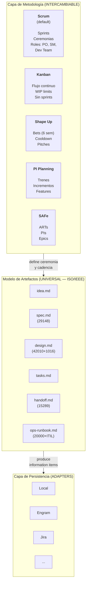
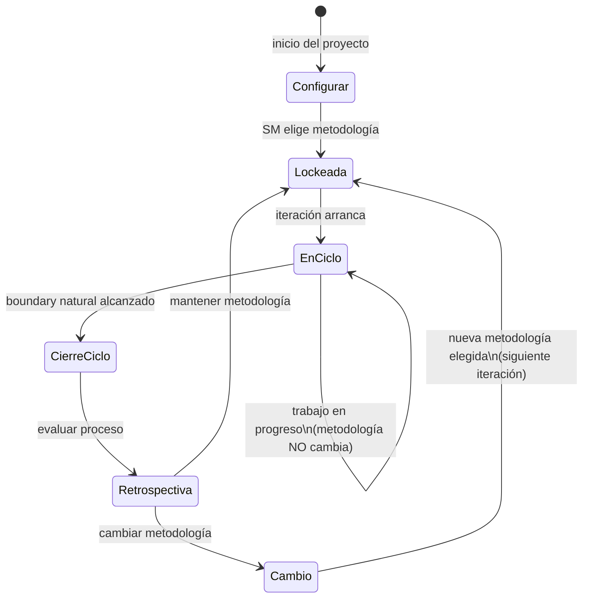
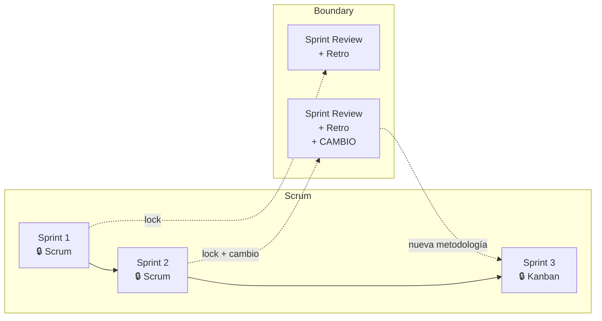
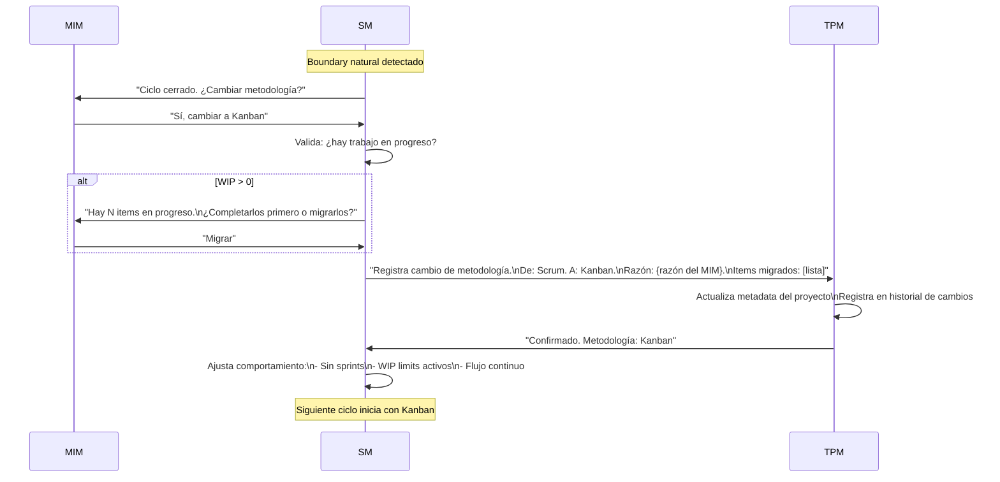
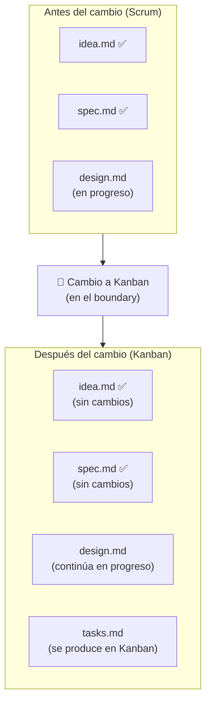
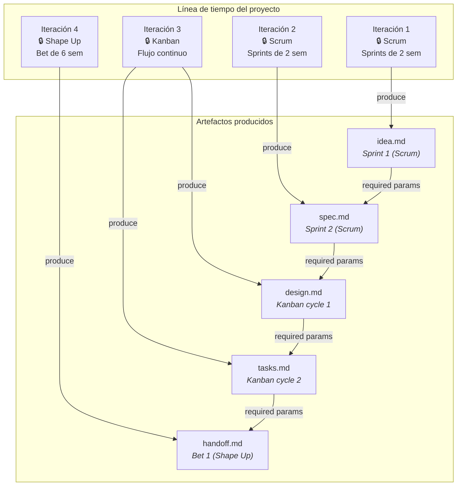

# Metodología como Capa Intercambiable

← [Índice principal](../../README.md) | [Planning](../README.md) | [Artifacts](README.md)

La metodología define COMO se organiza el trabajo. Los artefactos definen
QUE se produce. Son capas independientes.

> **Alcance del claim**: la intercambiabilidad esta **implementada a
> nivel de artefactos** — los 6 artifacts son identicos sin importar la
> metodología. A nivel de **orquestacion (routing, gates, convocatoria)**,
> el framework implementa **Scrum como default**. El routing para
> Kanban, Shape Up, y SAFe es extensible pero **no esta implementado
> aun** — requiere routing tables alternativas (ej: WIP-limit checks
> en vez de sprint gates). Los roles (PO, SM, Dev Lead, QA, DevSecOps,
> UX) son funciones constantes con nombres methodology-specific.

**Metodología como meta-artifact**: la eleccion de metodología se
almacena en el artifactStore como configuracion del proyecto. No es
un artefacto de producto — es un **meta-artifact** que configura el
comportamiento del SM.

- **Cuando se define**: el SM pregunta al MIM durante setup (Fase 1,
  configuración inicial): "Que metodología prefieres? Default: Scrum."
- **Donde se almacena**: en el artifactStore, seccion de metadata del
  proyecto (no en un artefacto de producto).
- **Cuando se revisa**: durante la retrospectiva (Fase 8), como
  candidato natural para "start doing" o "stop doing" — ej: "Start:
  usar Kanban en vez de Scrum para el proximo ciclo."
- **Que afecta**: routing tables, gates, convocatoria, state machine
  de workItems, ceremonia. Los artefactos no cambian.



---

## Contenido

- [Qué cambia con la metodología, qué NO cambia](#qué-cambia-con-la-metodología-qué-no-cambia)
- [Mapeo rápido: mismos artefactos, diferente ceremonia](#mapeo-rápido-mismos-artefactos-diferente-ceremonia)
- [Verificación de métricas: trazabilidad y fortaleza](#verificación-de-métricas-trazabilidad-y-fortaleza)
- [Gobierno de Metodología — Lock, Cambio y Trazabilidad](#gobierno-de-metodología-lock-cambio-y-trazabilidad)

---

## Verificación de métricas: trazabilidad y fortaleza

La metodología define CÓMO se organiza el trabajo; la verificación de
métricas es una capa transversal que corre por encima de cualquier
metodología elegida. Tiene dos responsabilidades separadas:

- **La capa de binding (TPM)** rastrea **trazabilidad**: qué AC de
  `spec.md` está cubierto por qué tarea de `tasks.md`, qué tarea tiene
  al menos una prueba asociada. Es contabilidad — confirma que existe
  un enlace, no que el enlace sea de calidad.
- **Las herramientas externas** verifican **fortaleza**: si el test que
  cubre un AC realmente detecta regresiones. Esto se mide con mutation
  testing, CRAP score, y complejidad ciclomática — métricas que la
  capa de binding no puede calcular por sí sola porque requieren
  ejecutar y analizar el código, no solo mapear referencias.

`virgil health` consolida ambas dimensiones en un reporte de 4
categorías: trazabilidad, fortaleza de pruebas, estructura de código, y
salud de documentación. Los umbrales de cada categoría son configurables
por tier (`strict`, `standard`, `relaxed`, `custom`) — un proyecto en
tier Ligero no exige el mismo score de mutation testing que uno en tier
Completo.

**Virgil orquesta, no construye**: Virgil NO implementa motores de
mutation testing, cálculo de CRAP score, ni analizadores de complejidad
ciclomática propios. Delega esas mediciones a herramientas externas
especializadas por lenguaje (por ejemplo, Stryker para JS/TS, mutmut o
cosmic-ray para Python, PIT para JVM) y consolida sus resultados en el
reporte de `virgil health`. Esto mantiene el framework agnóstico de
lenguaje: agregar soporte a un lenguaje nuevo es cuestión de definir el
adapter hacia su herramienta de métricas, no de reimplementar el motor
de análisis.

[↑ Contenido](#contenido)

---

## Qué cambia con la metodología, qué NO cambia

| Aspecto | ¿Cambia con la metodología? | Ejemplo |
|---------|---------------------------|---------|
| **Qué artefactos se producen** | NO — siempre los mismos 6 | spec.md existe en Scrum, Kanban, y Shape Up |
| **Qué contiene cada artefacto** | NO — contenido definido por estándares ISO | Los ACs de spec.md son iguales sin importar si se definen en un sprint planning o en un pitch |
| **En qué orden se producen** | NO — la cadena idea→spec→design→tasks→handoff→ops es lógica, no metodológica | No puedes diseñar sin requisitos, sin importar la metodología |
| **Cómo se agrupa el trabajo** | SÍ | Scrum: sprints. Kanban: flujo. Shape Up: bets |
| **Qué ceremonia acompaña la producción** | SÍ | Scrum: sprint planning. Kanban: replenishment. Shape Up: betting table |
| **Qué roles participan y cómo** | NO — las funciones son constantes; los **nombres** son methodology-specific | Scrum: PO + SM + Dev Team. Kanban: mismas funciones sin títulos formales. Shape Up: shapers (≈PO+SM) + builders (≈Dev Lead+QA). Las 6 funciones (PO, SM, Dev Lead, QA, DevSecOps, UX) existen en todas las metodologías; lo que cambia es cómo se nombran y cuánta ceremonia acompaña su invocación. |
| **Cadencia de revisión** | SÍ | Scrum: cada sprint. Kanban: continua. PI Planning: cada PI |
| **Cómo se gestionan las tareas** | SÍ | Scrum: sprint backlog. Kanban: board con WIP. Shape Up: hill chart |

[↑ Contenido](#contenido)

## Mapeo rápido: mismos artefactos, diferente ceremonia

| Artefacto | En Scrum | En Kanban | En Shape Up | En PI Planning |
|-----------|----------|-----------|-------------|---------------|
| `idea.md` | Product Backlog Item refinado | Card en "Ideas" | Raw idea antes del pitch | Feature en el backlog |
| `spec.md` | Sprint Planning output (ACs) | Definition of Ready | Pitch document | PI Objectives |
| `design.md` | Spike / Architecture Decision | Diseño al momento del pull | Solution sketch | Enabler |
| `tasks.md` | Sprint Backlog | Cards en el board | Scopes en el hill chart | Stories en el PI |
| `handoff.md` | Sprint Review package | — (flujo continuo) | Hand-off post bet | System Demo package |
| `ops-runbook.md` | Post-release runbook | Post-release runbook | Post-release runbook | Post-PI runbook |

[↑ Contenido](#contenido)

---

## Gobierno de Metodología — Lock, Cambio y Trazabilidad

### Selección inicial de metodología

En el primer ciclo del proyecto, el SM debe determinar la metodología:

1. **Si el MIM la especifica** → usar la especificada.
2. **Si el MIM no la especifica** → el SM aplica **Scrum como default**
   e informa al MIM: *"Se usará Scrum como metodología. Puedes cambiar
   a Kanban/Shape Up/PI Planning al cierre del primer sprint."*
3. **Si el MIM tiene dudas** → el SM presenta la tabla comparativa
   (sección "Mapeo rápido") y pregunta explícitamente.

La decisión se registra en `idea.md` → sección "Decisiones tomadas" →
campo `methodology_stamp`.

### Principio: la metodología se LOCKEA por iteración

La metodología vigente **no se puede cambiar a medio ciclo**. Se lockea
al inicio de cada iteración y solo se puede cambiar cuando el ciclo
cierra. Esto previene:

- Compromisos rotos a mitad de sprint/bet/PI
- Métricas invalidadas (velocity, cycle time, throughput)
- Confusión sobre qué reglas aplican
- Artefactos en estados ambiguos



### Boundary natural por metodología

Cada metodología tiene su propio concepto de "ciclo cerrado". El SM
detecta el boundary y solo ahí habilita el cambio:

| Metodología | Boundary natural | Cuándo se puede cambiar | Duración típica |
|-------------|-----------------|------------------------|-----------------|
| **Scrum** | Fin del sprint (Sprint Review + Retro) | Antes del siguiente Sprint Planning | 1-4 semanas |
| **Kanban** | Replenishment meeting o WIP = 0 | En el siguiente replenishment | Continuo (boundary artificial) |
| **Shape Up** | Fin del bet cycle + cooldown | En la siguiente betting table | 6 + 2 semanas |
| **PI Planning** | Fin del Program Increment | En el siguiente PI Planning | 8-12 semanas |
| **SAFe** | Fin del PI (System Demo + I&A) | En el siguiente PI Planning | 8-12 semanas |

> **Caso especial — Kanban**: no tiene sprints, así que el boundary es
> más difuso. Opciones: (1) el SM declara un "review point" cada N días,
> (2) cuando el WIP llega a cero, (3) en el replenishment meeting
> periódico. Cualquiera es válido — lo que importa es que exista un
> boundary explícito.



### Cambio de metodología — protocolo



### Lo que pasa con los artefactos cuando cambia la metodología

**Respuesta corta: NADA.** Los artefactos son los mismos. Solo cambia
la ceremonia alrededor de su producción.

Esto está validado por múltiples frameworks de la industria:

| Framework | Qué dice sobre artefactos y cambio de metodología |
|-----------|--------------------------------------------------|
| **Disciplined Agile (PMI)** | El goal es constante; la práctica/artefacto que lo implementa es la opción variable. Cambiar de WoW no requiere re-crear artefactos. |
| **Scrumban** | "Start with what you have" — el backlog y sus items sobreviven la transición. Solo cambian sprints → flujo y velocity → cycle time. |
| **SAFe** | Epic → Feature → Story mantiene el mismo formato cruzando niveles con diferentes metodologías. La identidad del artefacto es constante. |
| **PMBOK 7** | Artifacts son "tools you select per context" — independientes del delivery approach. |
| **Práctica real (Jira)** | Migrar de Scrum board a Kanban board no reescribe issues. Se desactivan sprints, se agregan WIP limits. Los items quedan intactos. |
| **ISO 15288/12207** | Proceso outcomes son fijos; life-cycle model es variable y tailorable. Los information items que produce un proceso no dependen del modelo de ciclo de vida. |



### Metadata — estampa de metodología por artefacto

Cada artefacto registra BAJO QUÉ metodología fue producido. Esto no
cambia el contenido — es metadata de trazabilidad.

```markdown
## Metadata
- Fecha de creación: 2026-07-15
- Estado: aprobado
- Iteración: Sprint 3
- Metodología vigente: scrum
- Revisores: [PO, QA]
```

Si la metodología cambia y un artefacto nuevo se produce después:

```markdown
## Metadata
- Fecha de creación: 2026-08-02
- Estado: borrador
- Iteración: Kanban cycle 1
- Metodología vigente: kanban
- Revisores: [Dev Lead]
```

**El TPM estampa esto automáticamente.** Los roles no necesitan saberlo
ni preocuparse — el TPM es el DBMS y la estampa es metadata, no
contenido.

### Metadata del proyecto — historial de metodología

El proyecto mantiene un historial de cambios de metodología en el RAG.
Esto es metadata del PROYECTO, no de un artefacto individual.

```markdown
# Metadata del Proyecto: {nombre}

## Metodología vigente
- Actual: kanban
- Desde: 2026-08-01
- Boundary: replenishment cada 5 días

## Historial de cambios
| Fecha | De | A | Razón | Boundary |
|-------|------|--------|-------|----------|
| 2026-07-01 | — | scrum | Inicio de proyecto | Sprint 2 semanas |
| 2026-08-01 | scrum | kanban | Equipo prefiere flujo continuo post-MVP | Replenishment 5 días |

## Roles activos
- [PO, SM, Dev Lead, QA] (UX desactivado: proyecto CLI)
```

### Artefactos mixtos — el caso real

En la práctica, un proyecto puede tener artefactos producidos bajo
diferentes metodologías. Esto NO es un problema porque el contenido
es universal (ISO-backed). Lo que varía es solo el contexto ceremonial
en que fue producido:



**La cadena de dependencias (required params) no se rompe.** Un
`design.md` producido bajo Kanban consume el `spec.md` producido bajo
Scrum sin ningún problema, porque ambos siguen el mismo schema ISO.

### Reglas del SM para gobierno de metodología

1. **LOCK al inicio** — el SM establece la metodología al inicio de cada
   iteración. Durante la iteración, la metodología NO cambia.

2. **Solo cambia en boundary** — el SM solo propone cambio de metodología
   cuando detecta el boundary natural del ciclo vigente.

3. **El MIM decide** — el SM puede RECOMENDAR un cambio basándose en
   métricas o fricción observada, pero la decisión es del MIM.

4. **WIP se resuelve primero** — si hay trabajo en progreso, el SM
   pregunta: ¿completar o migrar? No se abandona trabajo.

5. **El TPM registra TODO** — cada cambio queda en el historial con:
   fecha, metodología anterior, nueva, razón, items afectados.

6. **Sin efecto retroactivo** — los artefactos ya producidos conservan
   su metadata original. No se re-estampan.

7. **Emergencia como excepción** — si el MIM declara una emergencia
   (producción caída, deadline movido), el SM puede hacer un "emergency
   break" del lock. Se registra como excepción en el historial con
   justificación.

### Contribución novel del framework

> **Nota importante**: la granularidad de "metodología como metadata por
> artefacto" es una **extensión genuina** más allá de la literatura PM
> existente. Los frameworks establecidos (DA, SAFe, PMBOK) operan a
> nivel de equipo, nivel de programa, o por deliverable — no por
> artefacto individual.
>
> Nuestro modelo lleva esto un paso más allá: cada artefacto sabe
> bajo qué metodología fue producido, permitiendo trazabilidad completa
> incluso cuando la metodología cambia múltiples veces durante un
> proyecto. Esto es posible porque el modelo de artefactos es universal
> (ISO-backed) y la metodología es solo metadata, no estructura.
>
> **Precedente de validación**: SAFe demuestra que artefactos cruzan
> boundaries de metodología sin conversión (Epic → Feature → Story
> sobrevive Scrum ↔ Kanban en diferentes equipos). Disciplined Agile
> demuestra que el goal es constante y la práctica es variable.
> Scrumban demuestra que los items sobreviven la transición. Nuestro
> modelo generaliza estos patrones a una metadata explícita por
> artefacto.

[↑ Contenido](#contenido)
