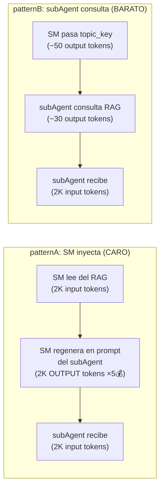
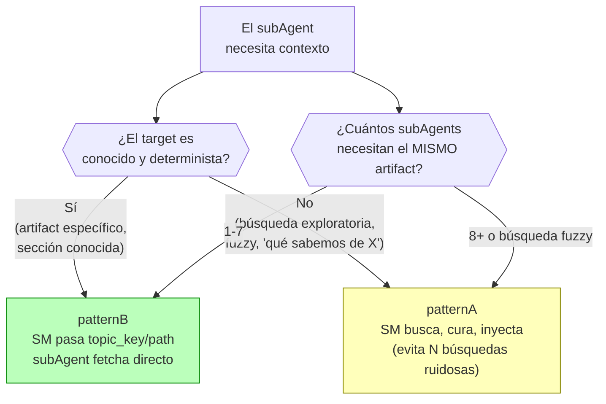
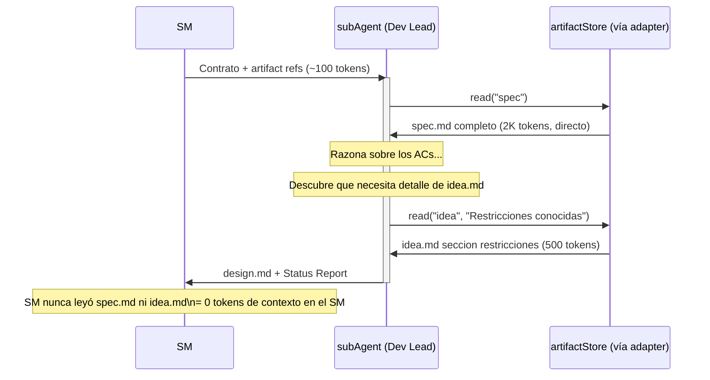

# Estrategia de Retrieval

← [Índice principal](../../README.md) | [Planning](../README.md) | [Artifacts](README.md)

## Estrategia de Retrieval — Quién Consulta el RAG

### El problema: el SM como middleman de contexto quema tokens

Cuando el SM lee contenido del RAG y lo re-inyecta en el prompt del
subAgent, paga un **impuesto de regeneración**: el contenido se
serializa como output tokens del SM (~5x más caros que input tokens)
antes de llegar al subAgent como input.



### Números concretos

Para **2,000 tokens de contexto** por delegación:

| Paso | patternA (SM inyecta) | patternB (agente consulta) |
|------|----------------------|---------------------------|
| SM lee del RAG | 2,000 tokens input | — |
| SM regenera en prompt del agente | 2,000 tokens **output** (5x costo) | ~50 tokens output (topic_key) |
| subAgent recibe contexto | 2,000 tokens input | 2,000 tokens input |
| subAgent emite query al RAG | — | ~30 tokens output |
| **Costo total (proporcional)** | **~6x el baseline** | **baseline (1x)** |

Para **20,000 tokens** (un `spec.md` o `design.md` completo), la misma
proporción se mantiene — **la diferencia escala linealmente con el
tamaño del artefacto**.

> **El driver principal NO es "leer dos veces"** — es que el SM tiene
> que GENERAR el contenido como output tokens para ponerlo en el prompt
> del subAgent. Output tokens cuestan varias veces más que input
> tokens (típicamente ~5x) en la mayoría de los modelos LLM a la fecha
> de escritura. Ese impuesto de regeneración es el grueso del costo
> extra de patternA.

### La regla: híbrido (no todo es patternB)



| Situación | Pattern | Por qué |
|-----------|---------|---------|
| **Fase normal**: Dev Lead necesita `spec.md` para diseñar | **B** (topic_key) | Target determinista. El agente fetcha solo lo que necesita. 6x más barato. |
| **Verificación**: QA necesita `spec.md` + resultados de ejecución | **B** (topic_keys) | Targets conocidos. El agente puede hacer queries incrementales (primero seccion 3, luego seccion 3.2 si necesita detalle). |
| **Búsqueda exploratoria**: SM busca "qué decisiones se tomaron sobre auth" | **A** (SM inyecta) | Búsqueda fuzzy. Los resultados pueden ser ruidosos. Mejor que el SM cure una vez a que 5 agentes hagan la misma búsqueda vaga. |
| **Fan-out alto**: 8+ agentes o búsqueda fuzzy compartida | **A** (SM inyecta) | Justificación principal: **calidad, no costo**. Cuando N agentes hacen la misma búsqueda fuzzy independientemente, obtienen resultados ruidosos y divergentes. El SM cura una vez y distribuye. Nota: Fase 7 tiene 5 roles → patternB aplica (bajo el umbral). patternA se reserva para escenarios reales de alto fan-out (multi-team reviews, custom roles). |
| **Mid-task discovery**: subAgent descubre que necesita más contexto | **B** (agente fetcha) | El SM no puede anticipar qué necesitará el agente a mitad de tarea. El agente hace queries precisas conforme razona. |

### Cómo funciona patternB en la práctica

El SM NO pasa contenido — pasa **referencias al adapter**:

```plaintext
delegationContract:
─────────────────────────────────────────────
Rol:           Dev Lead
Personalidad:  Arquitecto (ver role-profiles.md Fase 3)
Contexto:      Lee del artifactStore usando la universalInterface:
               - read("idea", "Restricciones conocidas")
               - read("spec")
               El adapter activo resuelve la operación:
               - Local: lee {store}/idea.md, {store}/spec.md
               - Engram: mem_search → mem_get_observation
               - DBMS: SELECT content FROM artifacts WHERE slug = ...
Input:         Diseñar la arquitectura que satisfaga los ACs
Output:        design.md (schema del artifact model)
Status Report: Obligatorio
─────────────────────────────────────────────
```

El subAgent recibe ~100 tokens de instrucción en vez de ~5,000 tokens
de contexto inyectado. Consulta el artifactStore directamente vía la
universalInterface y obtiene exactamente lo que necesita, cuando lo
necesita.



> **Nota de implementación**: la universalInterface (`read`, `search`,
> etc.) es adapter-agnostic. Para el adapter engram, `read("spec")`
> se traduce internamente a `mem_search(query: "sdd/{project}/spec")`
>
> - `mem_get_observation(id)`. Para el adapter local, se traduce a
> leer `{store}/spec.md`. El delegationContract usa la universalInterface
> — el adapter activo resuelve la llamada.

### Retrieval adaptativo: el agente sabe mejor qué necesita

Una ventaja clave de patternB: **el subAgent descubre su necesidad de
información MIENTRAS razona**, no antes.

El SM no puede anticipar que el Dev Lead va a necesitar la sección de
"error codes" de `spec.md` — eso lo descubre el Dev Lead al diseñar el
manejo de errores. Con patternB, el agente hace queries incrementales
conforme avanza:

1. Lee `spec.md` completo → identifica ACs principales
2. Descubre que necesita detalle de restricciones → lee `idea.md` seccion restricciones
3. Nota que hay un AC sobre rate limiting → re-lee `spec.md` seccion no-funcionales

Cada query es precisa y acotada. Con patternA, el SM tendría que
adivinar TODO lo que el agente va a necesitar de antemano — y por
seguridad, inyectaría de más.

### Requisito de auditabilidad

Para no perder visibilidad sobre qué leyó el agente, el Status Report
debe incluir un campo de **fuentes consultadas**:

```plaintext
Status Report:
  Status: SUCCESS
  Progress: design.md completo (5/5 secciones)
  Blocker: ninguno
  Artifacts: design.md
  Sources:                          ← NUEVO
    - sdd/project/spec (obs:1234)
    - sdd/project/idea (obs:1230, seccion restricciones)
```

Esto da al SM un audit trail sin pagar el costo de leer el contenido.

### Impacto proyectado en un ciclo completo

Ejemplo: proyecto con 5 fases, ~3 delegaciones por fase con ~3K tokens
de contexto promedio por delegación:

| Métrica | patternA (todo inyectado) | Híbrido (B default, A para fan-out) |
|---------|--------------------------|-------------------------------------|
| Delegaciones | 15 | 15 |
| Tokens de contexto movidos | 45K (15 × 3K) | 45K |
| Costo del contexto (proporcional) | ~6x el baseline (dominado por output-tax) | baseline (1x) |
| **Ahorro** | — | **~83%** en costo de retrieval |

> El ahorro es en la CAPA DE RETRIEVAL, no en el total del proyecto.
> Los subAgents siguen consumiendo tokens para razonar y producir. Pero
> eliminar el middleman de contexto quita el gasto más absurdo: pagar
> 5x por regenerar contenido que ya existe en el RAG.
