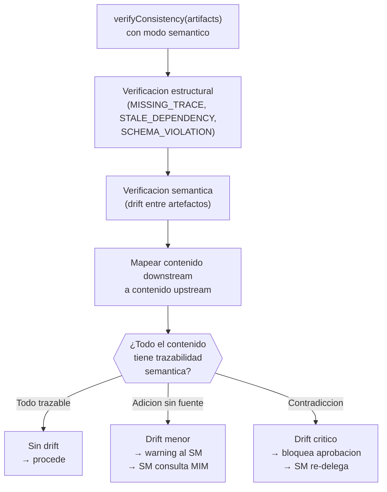

# Máquina de Estados y Transiciones

← [Índice principal](../../README.md) | [Planning](../README.md) | [Artifacts](README.md)

Esta página detalla la máquina de estados que gobierna el ciclo de vida
de un artefacto (`idea.md`, `spec.md`, `design.md`, `tasks.md`,
`handoff.md`, `ops-runbook.md`), la operación `transition()` del
[adapter](tpm-adapter.md), la operación retirada `markComplete`, y la
detección de semanticDrift entre artefactos encadenados.

---

## Contenido

- [Configuración de la State Machine](#configuración-de-la-state-machine)
- [Operación transition(artifact, newState, reason?)](#operación-transitionartifact-newstate-reason)
- [Operación ~~markComplete(artifact)~~ — Retirada](#operación-markcompleteartifact-retirada)
- [Detección de semanticDrift](#detección-de-semanticdrift)

---

## Configuración de la State Machine

**State machine configurable**: cada proyecto define su propia state
machine (que estados existen y que transiciones son validas). El
framework proporciona un **default** basado en el patron universal:

```plaintext
                    ┌──────────┐
              ┌────→│  review  │────┐
              │     └──────────┘    │
              │          │          │
              │          ▼          ▼
┌─────────┐   │   ┌──────────┐  ┌──────────┐
│  draft  │───┘   │ approved │  │ rejected │
└─────────┘       └──────────┘  └──────────┘
     │                 │
     │                 ▼
     │          ┌──────────┐
     └────────→ │cancelled │
                └──────────┘
```

Estados default: `draft`, `review`, `approved`, `rejected`, `cancelled`.

Transiciones default:

| Desde | Hacia | Quien puede |
|-------|-------|-------------|
| draft | review | Productor (solicita revision) |
| draft | cancelled | SM o MIM |
| review | approved | Validador del gate |
| review | rejected | Validador del gate |
| review | draft | Validador (devuelve para correcciones) |
| rejected | draft | Productor (corrige y reintenta) |
| approved | draft | SM (reopen — via mid-planning edit protocol) |

> **Costo de un cambio tardío**: Reabrir un artefacto upstream ya
> aprobado dispara una cascada: el artefacto se devuelve a estado
> `borrador`, se re-ejecuta `verifyConsistency` en todos los downstream,
> los artefactos downstream se marcan como "posiblemente desactualizados",
> y la fase actual se pausa hasta resolver. Para cambios menores que no
> afectan arquitectura (ejemplo: reformular un AC sin cambiar su scope),
> considerar un "lightweight change path" que actualice el AC sin
> invalidar todo el downstream.
>
> **TODO**: permitir que el MIM defina state machines custom durante
> setup (Fase 1, configuración inicial) o via acuerdo de retrospectiva. El adapter valida
> transiciones contra la state machine configurada. Formato sugerido:
> adjacency list en metadata del proyecto.

[↑ Contenido](#contenido)

## Operación transition(artifact, newState, reason?)

| Aspecto | Contrato |
|---------|----------|
| Precondicion | El artefacto existe. `newState` es un estado valido. La transicion desde el estado actual a `newState` es permitida por la state machine configurada. |
| Postcondicion | El artefacto esta en `newState`. `history()` registra la transicion con timestamp, actor, y reason. |
| Idempotencia | Si — transicionar al estado actual es no-op. |
| Given | `spec` en estado `draft` con transiciones permitidas: `draft → review, draft → cancelled` |
| When | `transition("spec", "review", "PO terminó ACs")` |
| Then | `spec.state` es `review`. `history()` registra la transicion. |
| Given | `spec` en estado `review` con transiciones permitidas: `review → approved, review → draft` |
| When | `transition("spec", "draft", "QA encontró ambiguedades")` |
| Then | `spec.state` es `draft` (transicion hacia atras permitida). |
| Given | `tasks` en estado `approved` sin transicion permitida a `draft` |
| When | `transition("tasks", "draft")` |
| Then | Error INVALID_TRANSITION. |
| Error: NOT_FOUND | El artefacto no existe. |
| Error: INVALID_STATE | `newState` no es un estado reconocido. |
| Error: INVALID_TRANSITION | La transicion del estado actual a `newState` no esta permitida. |

[↑ Contenido](#contenido)

## Operación ~~markComplete(artifact)~~ — Retirada

> **Unificación de estado (R004-C1)**: `markComplete` se retira como
> operación independiente. La gestión de estado de artefactos se unifica
> en `transition`. Lo que antes era `markComplete(artifact)` ahora es
> `transition(artifact, "approved", reason)`. Los gates del SM verifican
> el estado `approved` (no `complete`).
>
> **Migración**: reemplazar toda llamada `markComplete(x)` por
> `transition(x, "approved", "gate passed")`. Ver la sección anterior
> para la state machine completa.

[↑ Contenido](#contenido)

## Detección de semanticDrift

La verificacion estructural (`MISSING_TRACE`, `STALE_DEPENDENCY`,
`SCHEMA_VIOLATION`) detecta gaps en la forma de los artefactos. La
deteccion de semanticDrift verifica que el **significado** se preserve
a lo largo de la cadena idea → spec → design → tasks.

**Problema**: cuando agentes IA diferentes producen artefactos en
secuencia, cada uno reinterpreta el artefacto upstream. Despues de 4+
reinterpretaciones, la intencion original puede desviarse
significativamente sin que exista ninguna referencia rota.

> **Niveles de severidad del drift**:
>
> - **Estructural** (campos faltantes, formatos inválidos): gate
>   **bloqueante**. Detectable de forma determinista.
> - **Semántico** (contradicciones lógicas, scope no trazable): gate
>   **advisory** por defecto. Los LLMs actuales detectan contradicciones
>   obvias pero no garantizan cobertura completa. El SM reporta el drift
>   encontrado al MIM, quien decide si bloquea o no.
>
> Para proyectos de alto riesgo, el MIM puede promover el drift
> semántico a bloqueante explícitamente.

**Indicadores de drift** (que verifica `verifyConsistency` en modo
semantico):

| Indicador | Ejemplo | Tipo |
|-----------|---------|------|
| AC en `spec.md` sin mapeo a problema o restriccion en `idea.md` | Spec define "soporte offline" pero idea no menciona conectividad | `SEMANTIC_DRIFT_MINOR` |
| Decision en `design.md` que contradice restriccion de `spec.md` | Spec exige respuesta < 200ms; design elige polling de 5s | `SEMANTIC_DRIFT_CRITICAL` |
| Tarea en `tasks.md` sin trazabilidad a componente de `design.md` | Tarea "implementar cache Redis" sin ADR que la respalde | `SEMANTIC_DRIFT_MINOR` |
| Requisito nuevo que aparecio mid-chain sin aprobacion del MIM | Design agrega autenticacion biometrica que nadie pidio | `SEMANTIC_DRIFT_CRITICAL` |
| API externa rompe contrato asumido en `design.md` (endpoint deprecado, campo requerido nuevo) | API de pagos remueve `POST /v1/charge`; `design.md` asume ese endpoint | `SEMANTIC_DRIFT_CRITICAL` |

> **Drift originado en contratos externos**: un cambio breaking en una
> API de tercero (endpoint removido, campo requerido nuevo, cambio de
> rate limit) no se origina en la cadena idea → spec → design → tasks,
> pero produce la misma cascada que el drift interno: invalida las
> suposiciones que `design.md` — y posiblemente `spec.md` — hicieron
> sobre ese contrato. El SM trata el hallazgo como drift critico:
> bloquea la aprobacion y re-delega a `design.md` para reflejar el
> nuevo contrato. Si el cambio es backward-compatible (ej. nuevo campo
> opcional), se clasifica como drift menor y se absorbe sin cascada.
> Ver [contrato de tipos](../../execution/contracts.md#tipos-de-contrato)
> que estas dependencias externas deben declarar.

**Niveles de severidad**:

| Nivel | Significado | Accion del SM |
|-------|-------------|---------------|
| **Drift critico** | Contradiccion directa con upstream. El artefacto downstream dice algo incompatible con lo que upstream aprobo. | Bloquea aprobacion. SM re-delega al rol productor con la contradiccion explicita. |
| **Drift menor** | Adicion no presente en upstream. No contradice, pero no tiene trazabilidad. | Warning. SM consulta al MIM: "Esto se agrego sin estar en {upstream}. ¿Lo apruebas?" |
| **Sin drift** | Todo el contenido del artefacto es trazable a contenido aprobado upstream. | Procede normalmente. |

**Flujo de verificacion**:



**Donde se ejecuta**:

- En el paso **VERIFY** del PDC (despues de cada retorno de subAgent)
- En la validacion de gate (antes de `transition(artifact, "approved")`)
- El SM puede delegar este check al QA, que ya posee la personalidad
  esceptica adecuada para cuestionar trazabilidad

> **Trazabilidad semantica vs. estructural**: la verificacion
> estructural pregunta "¿existe la referencia?" La verificacion
> semantica pregunta "¿el significado es compatible?" Ambas son
> necesarias. Un artefacto puede pasar la verificacion estructural
> (todas las secciones existen, todas las referencias apuntan a
> artefactos reales) y fallar la semantica (una decision contradice
> una restriccion upstream).

[↑ Contenido](#contenido)
