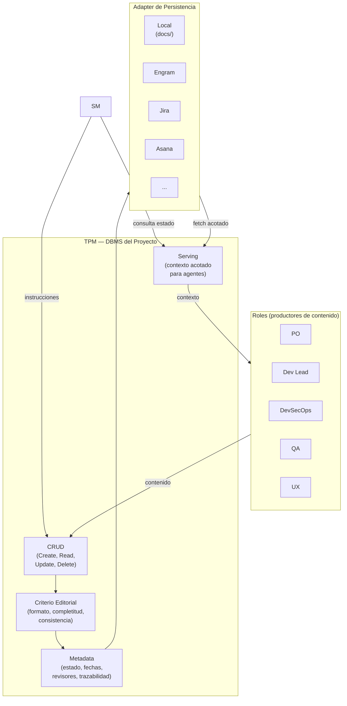
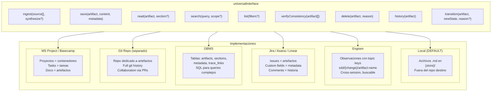
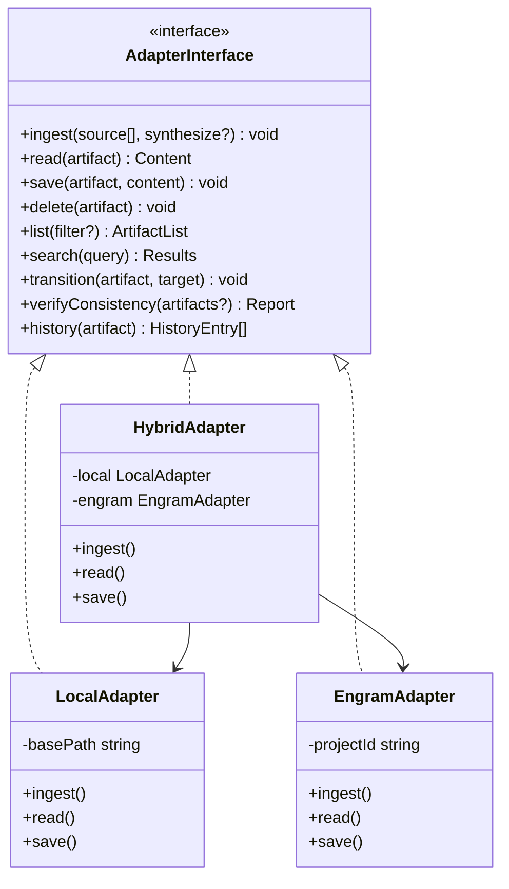
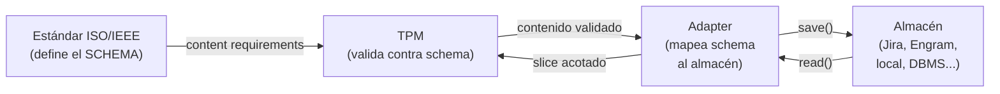

# TPM y universalInterface

← [Índice principal](../../README.md) | [Planning](../README.md) | [Artifacts](README.md)

## El TPM como DBMS del Modelo de Artefactos

El TPM (Technical Program Manager) es al modelo de artefactos lo que un
DBMS es a los datos: no decide qué datos crear (eso lo hacen los roles),
pero sí decide CÓMO se almacenan, valida integridad, y sirve consultas.



### Estándares de escritura del TPM

**Estándares de escritura del TPM** (checklist concreto):

1. Cada requisito o tarea es una oración única y completa (no listas
   anidadas de fragmentos).
2. Sin TODOs, TBDs, o placeholders sin resolver en artefactos en estado
   `approved`.
3. Referencias cruzadas entre artefactos usan IDs trazables (no "ver
   arriba" o "como se dijo").
4. Formato Markdown consistente con el schema del artefacto definido
   en este documento.

**Regla anti-drift**: las ediciones del TPM se clasifican en dos niveles:

- **Nivel 1 — formato**: whitespace, Markdown, renumeracion, ordenamiento.
  El TPM las aplica sin notificar. No cambian semantica.
- **Nivel 2 — estructura/contenido**: reescritura de oraciones, eliminacion
  de secciones, reorganizacion de requisitos, cambio de IDs. El TPM
  DEBE notificar al productor original antes de aplicar. Si el productor
  no esta disponible (sesion cerrada), el TPM registra la edicion pendiente
  como metadata y la presenta al productor en la proxima sesion.

El SM verifica en el ECHO del PDC: si el TPM reporta ediciones nivel 2,
el SM confirma con el productor antes de marcar el artefacto como
completo.

### Operaciones del TPM sobre el modelo

| Operación | Qué hace | Quién la invoca | Ejemplo |
|-----------|----------|-----------------|---------|
| **ingest** | Incorpora material fuente al store (sintetizado o verbatim), con citaciones a la fuente original. **Precondición**: `source` es un array no vacío. | SM (instrucción), vía TPM | "Ingesta los 3 archivos del challenge" |
| **save** | Crea o actualiza un artefacto con su contenido y metadata (upsert). **Precondición**: verifica que todos los artefactos upstream estén aprobados antes de crear uno nuevo. Si un upstream falta o no está aprobado, rechaza y reporta al SM. | SM (instrucción) | "Guarda idea.md para el proyecto X" |
| **read** | Retorna un slice acotado del artefacto | SM, Roles | "Dame la sección de ACs de spec.md" |
| **search** | Busca contenido por query dentro de uno o más artefactos | SM, Roles | "Busca 'JWT' en todo el store" |
| **list** | Lista artefactos con filtros (estado, productor, fecha) | SM, Roles | "Lista los artefactos en estado `review`" |
| **delete** | Elimina contenido obsoleto (raro, con justificación) | SM (instrucción) | "Elimina la tarea T-07, fue descartada" |
| **verifyConsistency** | Verifica integridad referencial y semántica entre artefactos | SM (pre-gate) | "¿Todos los ACs de spec trazan a ideas?" |
| **history** | Retorna el historial de versiones y acciones de un artefacto | SM (recovery, auditoría) | "¿Qué pasó con design.md en Fase 3?" |
| **transition** | Cambia el estado del artefacto en la state machine (`draft` → `review` → `approved`/`rejected`). Lo que antes era "marcar completo" ahora es `transition(artifact, "approved", "gate passed")`. | SM (vía gate) | "spec.md pasó el gate: `transition('spec', 'approved', 'QA + SM gate passed')`" |

Ver [Máquina de Estados y Transiciones](state-machine.md) para el detalle
de la operación `transition`.

### Optimizacion: batch writes por fase

Para reducir dispatches del TPM en proyectos con timebox (challenges,
spikes), el SM puede agrupar operaciones por fase:

| Tier | Dispatches por fase | Cuando aplica |
|------|---------------------|---------------|
| Normal | 1 Create + N Updates + 1 Transition | Proyectos sin timebox. Cada interaccion es un dispatch. |
| Comprimido | 1 Create-with-content + 1 Transition | Challenges con timebox. El subAgent produce el artefacto completo en una delegacion; el TPM lo recibe y persiste en un solo dispatch. |
| Ultra-comprimido | 1 transaction (Create + Transition) | Artefactos triviales o fastForward con alta certeza. Una sola transaccion atomica. |

**Regla para patternB + batch**: cuando el subAgent lee directo del
RAG (patternB) y produce un artefacto completo, el dispatch al TPM es
solo el write final. No hay dispatches intermedios de read. Esto reduce
el overhead a ~2 dispatches por fase en el tier comprimido.

**Threshold para artefactos pequenos** (M14): si el artefacto tiene
menos de ~500 tokens, el overhead de reasoning del agente para decidir
queries (patternB) puede dominar el costo. En ese caso, patternA
(SM inyecta directo) es mas eficiente. El SM decide automaticamente:
artefacto < 500 tokens → patternA, >= 500 tokens → patternB. Ver
[Estrategia de Retrieval](retrieval.md) para el detalle completo de
patternA vs. patternB.

---

## Adapters de Persistencia — universalInterface

Porque el modelo de artefactos sigue estándares internacionales, los
*information items* son portables. Cualquier sistema que pueda almacenar
y servir estos items puede ser un adapter.



Complemento visual: el class diagram muestra la universalInterface
como un contrato de tipos — cada implementación (`LocalAdapter`,
`EngramAdapter`, `HybridAdapter`) cumple la misma interfaz.



### Mapeo de artefactos por adapter

| Artefacto | Local (default) | Engram | Jira | DBMS | Git Repo |
|-----------|----------------|--------|------|------|----------|
| `idea.md` | archivo .md | observation `sdd/{name}/idea` | Epic description | row en `artifacts` | `ideas/name.md` |
| `spec.md` | archivo .md | observation `sdd/{name}/spec` | Epic + child stories (ACs) | row + child rows | `specs/name.md` |
| `design.md` | archivo .md | observation `sdd/{name}/design` | Confluence page linked | row + JSON content | `designs/name.md` |
| `tasks.md` | archivo .md | observation `sdd/{name}/tasks` | Child issues del Epic | rows en `tasks` | `tasks/name.md` |
| `handoff.md` | archivo .md | observation `sdd/{name}/handoff` | Release ticket | row en `handoffs` | `handoffs/name.md` |
| `ops-runbook.md` | archivo .md | observation `sdd/{name}/ops` | Runbook page | row en `runbooks` | `runbooks/name.md` |

### Por qué los estándares habilitan los adapters

Sin el respaldo de estándares, cada adapter tendría que inventar su
propia estructura. Con estándares:

1. **`spec.md` sigue 29148** → un adapter de Jira sabe que "Requisitos
   funcionales" mapea a Stories con ACs, "No funcionales" a Labels, y
   "Trazabilidad" a Links entre issues.

2. **`design.md` sigue 42010** → un adapter de Confluence sabe que
   cada *viewpoint* es una sección con diagrama, y cada ADR es una
   *decision page*.

3. **`handoff.md` sigue 15289 transition** → cualquier adapter sabe
   que debe incluir: resumen, stack, tareas, estrategia de pruebas, y
   criterios de aceptación. Si falta uno, el artefacto está incompleto.



### Adapter por defecto: archivos locales como RAG

- **Path por defecto**: `~/.idea-to-mvp/projects/{nombre}/docs/` — **fuera**
  del repositorio destino. Esto garantiza que el modo planificación nunca
  contamine el working tree del repo con artefactos de proceso.
- **Formato**: archivos markdown, uno por artefacto
- **Ventajas**: cero dependencias, legible por humanos, opcionalmente
  versionable con git (el directorio del store puede ser un repo separado)
- **Desventaja**: sin búsqueda semántica, sin acceso cross-machine
- **Suficiente para**: proyectos individuales, challenges, MVPs — que es el
  caso de uso default del framework
- **Concurrencia**: sesion activa unica asumida. Last-write-wins.
  Adapters con concurrencia (DBMS, Jira, Git repo) implementan
  ACID completo (ver seccion "Garantias transversales"). El contrato
  del adapter define CONFLICT error en `save` cuando otro writer
  modifico desde el ultimo `read` — esto aplica a TODOS los adapters
  con soporte de aislamiento, no solo "futuros."

Los demás adapters son **TBD**. El modelo de artefactos los habilita
por diseño, pero la implementación es futura. El adapter local es el
MVP de persistencia.

### Contrato de Comportamiento del Adapter

> **TODO: refinar este contrato con tipos concretos del lenguaje de
> implementacion, codigos de error exhaustivos, y tests de conformance
> para cada adapter. Lo que sigue es el borrador de requisitos
> comportamentales — suficiente para disenar, no para implementar.**

#### ingest(source[], synthesize?)

| Aspecto | Contrato |
|---------|----------|
| Precondicion | `source` es un array no vacio. Cada source tiene `type` (file, url, text, image) y `content` o `path`. |
| Postcondicion | El material fuente esta disponible en el store, sintetizado y con citaciones a la fuente original (path, linea, URL, seccion). Queryable via `search()`. |
| Idempotencia | Si — ingestar el mismo material dos veces no duplica contenido. |
| `synthesize` | Default `true`. Si `true`, el TPM extrae y condensa el contenido relevante con citaciones. Si `false`, almacena verbatim (para materiales cortos o ya estructurados). |
| Given | MIM proporciona 3 archivos de un tech challenge |
| When | `ingest([{type: "file", path: "challenge/rules.md"}, {type: "file", path: "challenge/rubric.md"}, {type: "file", path: "challenge/starter.zip"}])` |
| Then | El store contiene el contenido sintetizado con citas: "Timebox: 4h [rules.md:12]", "Criterio: test coverage > 80% [rubric.md:5]". Cualquier rol puede `search("timebox")` y obtener el dato con su fuente. |
| Given | MIM pega un screenshot de un wireframe |
| When | `ingest([{type: "image", content: <base64>}])` |
| Then | El store contiene una descripcion sintetizada del wireframe. Si el adapter no soporta imagenes, retorna UNSUPPORTED_SOURCE. |
| Error: EMPTY_SOURCE | El array esta vacio o todas las fuentes tienen contenido vacio. |
| Error: UNSUPPORTED_SOURCE | El tipo de fuente no es soportado por este adapter. |

> **Nota**: `ingest` es la puerta de entrada del material del MIM al
> artifactStore. El SM NUNCA lee fuentes directamente — instruye al
> TPM para ingestar. El TPM sintetiza y cita. Cualquier rol accede al
> resultado via `search()` o `read()`.

#### save(artifact, content, metadata)

| Aspecto | Contrato |
|---------|----------|
| Precondicion | `artifact` es un slug valido (idea, spec, design, tasks, handoff, ops-runbook). `content` no es vacio. `metadata` incluye al menos `producer` y `timestamp`. |
| Postcondicion | El artefacto existe en el store con el contenido y metadata proporcionados. Si ya existia, se reemplaza (upsert). |
| Idempotencia | Si — llamar dos veces con los mismos argumentos produce el mismo estado. |
| Given | Un adapter con `idea` ya guardado |
| When | `save("idea", nuevo_contenido, {producer: "PO", timestamp: T2})` |
| Then | El contenido de `idea` es `nuevo_contenido`, metadata actualizada, version anterior accesible via `history()`. |
| Error: INVALID_ARTIFACT | El slug no pertenece al set de artefactos validos. |
| Error: EMPTY_CONTENT | El contenido es vacio o solo whitespace. |
| Error: CONFLICT | (Solo adapters con concurrencia) Otro writer modifico el artefacto desde la ultima lectura. Retorna ambas versiones. |

#### read(artifact, section?)

| Aspecto | Contrato |
|---------|----------|
| Precondicion | `artifact` es un slug valido. |
| Postcondicion | Retorna el contenido completo, o la seccion solicitada si `section` se proporciona. |
| Idempotencia | Si — read puro, sin efectos secundarios. |
| Given | `spec` existe con secciones "Requisitos funcionales" y "No funcionales" |
| When | `read("spec", "Requisitos funcionales")` |
| Then | Retorna solo el contenido de esa seccion. |
| Given | `design` no existe |
| When | `read("design")` |
| Then | Error NOT_FOUND. |
| Error: NOT_FOUND | El artefacto no existe en el store. |
| Error: SECTION_NOT_FOUND | El artefacto existe pero la seccion solicitada no. |

#### search(query, scope?)

| Aspecto | Contrato |
|---------|----------|
| Precondicion | `query` es un string no vacio. `scope` es opcional (default: todos los artefactos). |
| Postcondicion | Retorna lista de matches con: `artifact`, `section`, `snippet`, `relevance_score`. Lista vacia si no hay matches (NO es error). |
| Idempotencia | Si. |
| Given | `spec` contiene "autenticacion JWT con refresh tokens" |
| When | `search("JWT")` |
| Then | Retorna al menos un match en `spec` con snippet relevante. |
| Given | Scope limitado a `["design"]` |
| When | `search("JWT", {scope: ["design"]})` |
| Then | Solo busca en `design`. Si no hay match, retorna lista vacia. |

#### list(filters?)

| Aspecto | Contrato |
|---------|----------|
| Precondicion | Ninguna (lista vacia es valida). |
| Postcondicion | Retorna lista de artefactos con: `artifact`, `status` (draft/review/approved/rejected/cancelled), `last_modified`, `producer`. |
| Filtros | `status`, `producer`, `modified_after`, `modified_before`. |
| Given | Store con `idea` (approved) y `spec` (draft) |
| When | `list({status: "approved"})` |
| Then | Retorna solo `idea`. |

#### verifyConsistency(artifact[])

| Aspecto | Contrato |
|---------|----------|
| Precondicion | Al menos un artefacto en el array. Todos deben existir. |
| Postcondicion | Retorna lista de inconsistencias: `{source, target, type, description}`. Lista vacia = consistente. |
| Tipos de inconsistencia | `MISSING_TRACE` (referencia rota), `STALE_DEPENDENCY` (upstream modificado despues del downstream), `SCHEMA_VIOLATION` (seccion requerida faltante), `SEMANTIC_DRIFT_CRITICAL` (contradiccion semantica con upstream — ver [Detección de semanticDrift](state-machine.md#detección-de-semanticdrift)), `SEMANTIC_DRIFT_MINOR` (contenido nuevo sin trazabilidad a upstream). |
| Given | `spec` referencia `idea` requisito R1, pero R1 fue eliminado de `idea` |
| When | `verifyConsistency(["idea", "spec"])` |
| Then | Retorna `{source: "spec", target: "idea", type: "MISSING_TRACE", description: "R1 referenciado en spec no existe en idea"}`. |

> **Trazabilidad semantica vs. estructural**: la verificacion
> estructural pregunta "¿existe la referencia?" La verificacion
> semantica pregunta "¿el significado es compatible?" Ambas son
> necesarias. Un artefacto puede pasar la verificacion estructural
> (todas las secciones existen, todas las referencias apuntan a
> artefactos reales) y fallar la semantica (una decision contradice
> una restriccion upstream). Ver el detalle completo en
> [Detección de semanticDrift](state-machine.md#detección-de-semanticdrift).

#### delete(artifact, reason)

| Aspecto | Contrato |
|---------|----------|
| Precondicion | `artifact` existe. `reason` no es vacio (audit trail obligatorio). |
| Postcondicion | El artefacto deja de aparecer en `list()` y `read()`. `history()` conserva el registro con la razon de eliminacion. |
| Idempotencia | No — eliminar un artefacto inexistente es NOT_FOUND. |
| Given | `ops-runbook` existe |
| When | `delete("ops-runbook", "proyecto cancelado")` |
| Then | `read("ops-runbook")` retorna NOT_FOUND. `history("ops-runbook")` muestra el registro con razon. |

#### history(artifact)

| Aspecto | Contrato |
|---------|----------|
| Precondicion | `artifact` es un slug valido (puede o no existir actualmente). |
| Postcondicion | Retorna lista ordenada (mas reciente primero) de: `{version, timestamp, producer, action, content_hash}`. Entradas con `action: "failure"` incluyen campos adicionales (`type`, `phase`, y metadata del tipo). Lista vacia si el artefacto nunca existio. |
| Acciones | `created`, `updated`, `transitioned`, `deleted`, `read`, `failure`. |
| Failure metadata | Tipos de fallo: `pdc_rejection` (step, role, reason), `circuit_breaker` (role, consecutive), `escalation` (role, description, resolution), `redelegation` (role, reason, contract_delta). Ver [SM Behavior](../behavior/README.md) sección Historial de Fallos. |
| Given | `idea` fue creado, actualizado 2 veces, y aprobado via transition |
| When | `history("idea")` |
| Then | Retorna 4 entradas: transitioned(→approved) → updated → updated → created. |
| Given | `design` tuvo 2 rechazos PDC en step VERIFY durante Fase 3 |
| When | `history("design")` |
| Then | Incluye entradas `{action: "failure", type: "pdc_rejection", step: "VERIFY", role: "Dev Lead", phase: 3}`. El SM las consulta en recovery para ajustar estrategia. |

Ver [Máquina de Estados y Transiciones](state-machine.md) para el
contrato completo de la operación `transition(artifact, newState, reason?)`,
la state machine configurable, la operación retirada `markComplete`, y
la detección de semanticDrift.

#### Garantias transversales — ACID

El artifactStore es la **fuente de la verdad** del proceso. Las
operaciones deben cumplir garantias ACID:

| Garantia | Descripcion | Ejemplo |
|----------|-------------|---------|
| **Atomicidad** | Una transaccion multi-operacion se aplica completa o no se aplica. No hay estado intermedio visible. | `save(spec) + transition(spec, "approved") + verifyConsistency([idea, spec])` — si verify falla, spec no se aprueba y el save se revierte. |
| **Consistencia** | El store siempre esta en un estado valido. No existen referencias rotas, artefactos sin metadata, ni estados invalidos. | No se puede `transition(design, "approved")` si `spec` no esta en `approved` (cadena de dependencias). |
| **Aislamiento** | Operaciones concurrentes no producen estados corruptos. Nivel minimo: read-committed. | Dos agentes leyendo `spec` simultaneamente ven la misma version. Un `save` en progreso no es visible hasta commit. |
| **Durabilidad** | Despues de un commit exitoso, el contenido sobrevive a crash, compaction, o perdida de sesion. | Para local: flush a disco. Para DBMS: commit SQL. Para engram: observation persistida. |

**Transacciones**: el TPM puede agrupar operaciones en una transaccion.
Si cualquier operacion falla, todas se revierten.

```plaintext
transaction {
  save("spec", contenido, metadata)
  verifyConsistency(["idea", "spec"])
  transition("spec", "approved", "gate passed")
}
// Si verifyConsistency detecta inconsistencias → rollback del save
// Si transition falla (precondicion/transicion invalida) → rollback del save + verify
```

**Nivel de soporte por adapter**:

| Adapter | Atomicidad | Consistencia | Aislamiento | Durabilidad |
|-----------|-----------|--------------|-------------|-------------|
| Local (files) | Operacion individual | Validacion pre-write | Sesion unica (sin concurrencia) | Flush a disco |
| Engram | Operacion individual | Validacion pre-save | Backend-dependent | Persistido cross-session |
| DBMS | Transacciones SQL nativas | Constraints + triggers | Read-committed o superior | WAL + commit |
| Jira/Asana | API-level (eventual consistency) | Webhooks + validacion | Optimistic locking | Cloud-managed |
| Git Repo | Commit atomico | Pre-commit hooks | Branch isolation | Git objects |

> **TODO**: definir transaccion como primitiva de la interfaz del
> adapter (`begin()`, `commit()`, `rollback()`). Para adapters sin
> soporte nativo de transacciones (local, engram), implementar como
> write-ahead log o copy-on-write.
>
> **TODO**: definir tests de conformance que un adapter debe pasar
> para ser considerado compatible. Formato sugerido: suite ejecutable
> con los given/when/then de arriba como casos de prueba.
