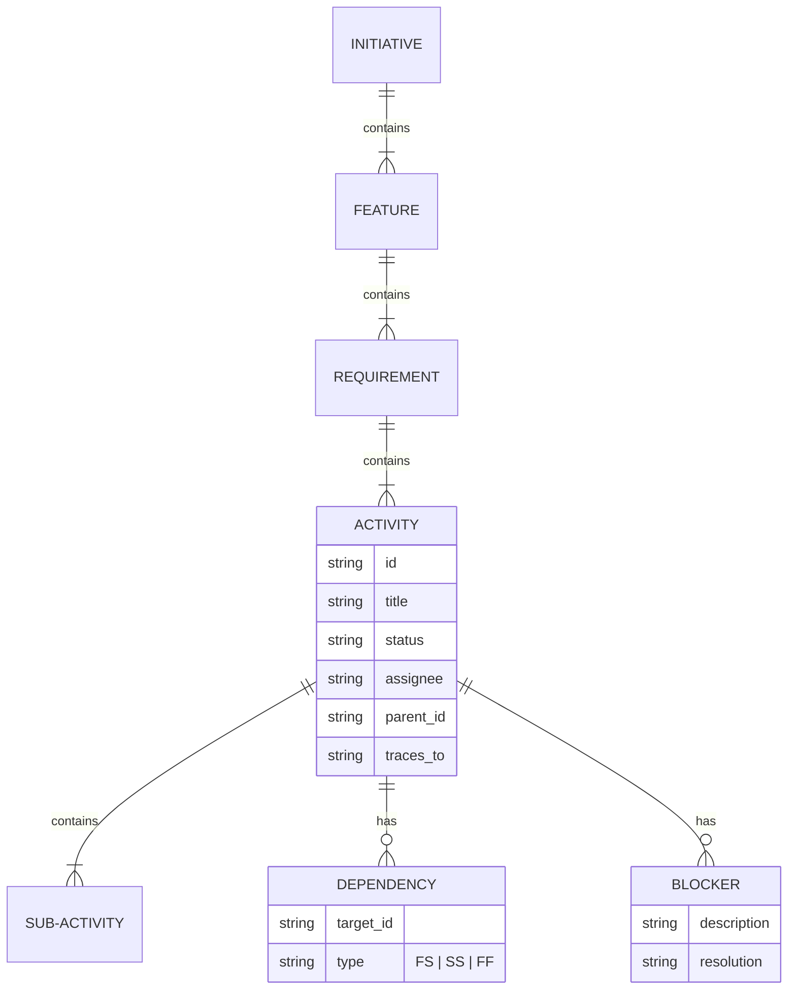
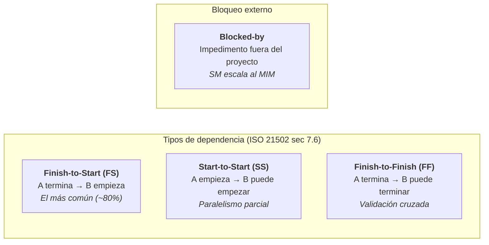
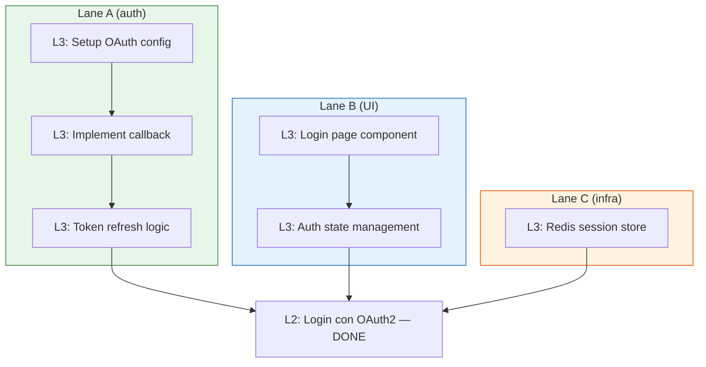
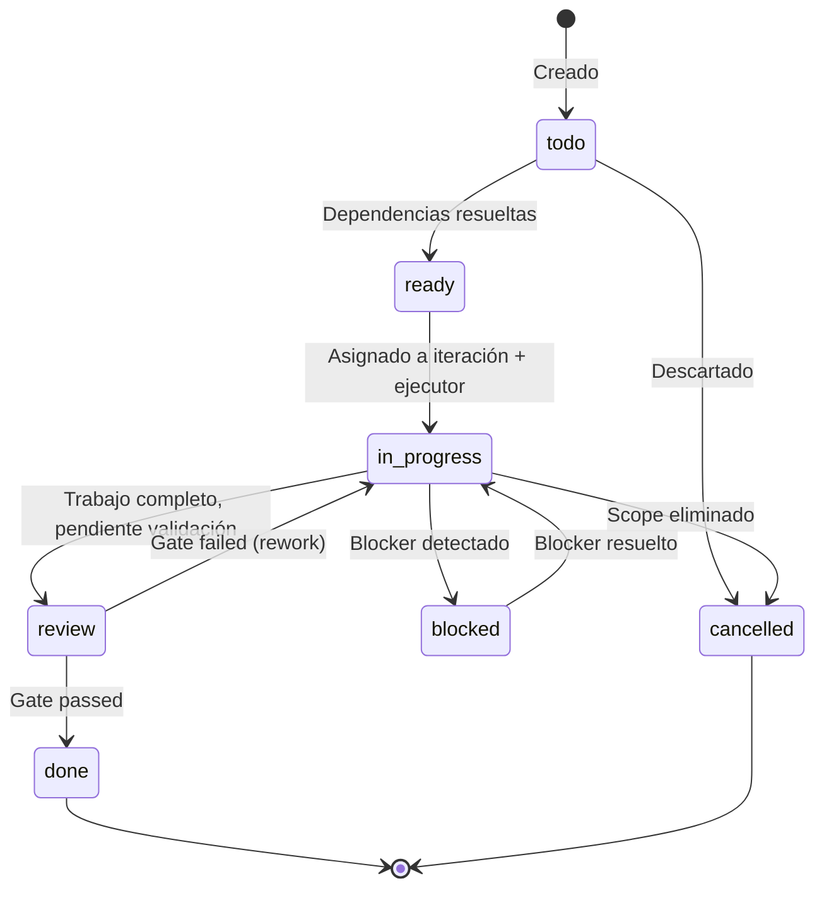

# Jerarquía de workItems

← [Índice principal](../../README.md) | [Planning](../README.md) | [Artifacts](README.md)

## Jerarquía de workItems — Sprints, Epics, Stories, Tasks

Los 6 artefactos producen **unidades de trabajo** a diferentes niveles de
granularidad. Esta sección define la jerarquía universal de workItems, sus
dependencias, y cómo habilitan el paralelismo en modo ejecución.

### Por qué es necesario

Sin jerarquía explícita, los equipos (humanos o IA) enfrentan tres
problemas recurrentes:

1. **No hay paralelismo** — sin dependencias formales, todo se ejecuta en
   serie porque no se sabe qué es seguro paralelizar.
2. **No hay visibilidad de bloqueos** — los impedimentos se descubren tarde,
   cuando ya bloquearon la ruta crítica.
3. **No hay trazabilidad vertical** — no se puede responder "¿qué tareas
   implementan este requisito?" ni "¿qué épica cubre esta idea de negocio?"

### Niveles universales

La jerarquía tiene 5 niveles. La metodología determina los **nombres** y las
**ceremonias**, pero los niveles son constantes:

| Nivel | Nombre universal | Scrum | Kanban | Shape Up | SAFe |
|-------|-----------------|-------|--------|----------|------|
| L0 | **Initiative** | Theme / Initiative | — | Bet (appetite) | Epic |
| L1 | **Feature** | Epic | Category | Scope | Feature |
| L2 | **Requirement** | User Story | Card | Task (Shape Up) | Story |
| L3 | **Activity** | Task | Sub-card | Sub-task | Task |
| L4 | **Sub-activity** | Subtask | — | — | Subtask |

> **Respaldo**: la jerarquía L0→L4 refleja la descomposición progresiva
> de ISO 21502 sec 7.6 (Schedule Management) y el WBS Dictionary de
> PMBOK/ISO 21511. L0-L1 son deliverable-oriented (WBS), L2 es el puente
> requisito→trabajo, L3-L4 son activity-oriented (Define Activities).

### Quién produce qué nivel

| Nivel | Artefacto origen | Rol productor | Ejemplo |
|-------|-----------------|---------------|---------|
| L0 Initiative | `idea.md` | PO | "Sistema de autenticación" |
| L1 Feature | `idea.md` / `spec.md` | PO | "Login con OAuth2" |
| L2 Requirement | `spec.md` | PO + QA (ACs) | "Como usuario puedo logearme con Google" |
| L3 Activity | `tasks.md` | Dev Lead | "Implementar callback handler OAuth2" |
| L4 Sub-activity | `tasks.md` | Dev Lead | "Parsear token JWT del provider" |

### Schema universal de workItem

Cada workItem, independientemente de su nivel, tiene este schema:

```yaml
work_item:
  id: string          # Único. Formato: {nivel}-{secuencial}. Ej: L2-003
  type: L0|L1|L2|L3|L4
  title: string
  description: string
  parent_id: string?  # Referencia al item padre (jerarquía). null para L0
  artifact_source: string  # Artefacto que lo produjo (idea.md, spec.md, etc.)
  lane: string          # Agrupación por feature/skill (auth, UI, infra). Asignado por Dev Lead.

  # — Dependencias y bloqueos —
  depends_on:         # Otros workItems que deben completarse ANTES
    - item_id: string
      type: FS|SS|FF  # Finish-to-Start, Start-to-Start, Finish-to-Finish
  blocked_by:         # Impedimentos EXTERNOS (no son workItems)
    - id: string
      description: string
      owner: string   # Quién puede resolverlo
      since: date

  # — Estado —
  state: todo|ready|in_progress|review|blocked|done|cancelled
  iteration: string?  # Sprint N, Cycle N, PI N (según metodología)

  # — Criterios —
  acceptance_criteria:
    - given: string
      when: string
      then: string
  complexity: XS|S|M|L|XL

  # — Trazabilidad —
  traces_to: string[] # IDs de items en otros niveles (trazabilidad vertical)
  files:                    # Opcional. Archivos que esta tarea modifica.
    - src/auth/login.ts     # Usado por el Orquestador para detectar solapamiento
    - src/auth/login.spec.ts # entre lanes y decidir paralelismo vs serialización.
  methodology_stamp:
    name: string
    iteration: string
```

> **Campo `files`**: Opcional pero recomendado. El Dev Lead lo asigna en
> Fase 4 para que el executionOrchestrator pueda detectar solapamiento
> de archivos entre lanes y decidir si ejecutar en paralelo (worktrees) o
> en serie. Si está ausente, el Orquestador asume solapamiento y serializa.

Complemento visual: el ER diagram muestra la misma jerarquía como entidades
y relaciones, útil para visualizar cardinalidad de un vistazo.



### Tipos de dependencia



**Reglas de dependencia**:

1. Las dependencias pueden ser **cross-level** — un L3 puede depender de un L1 completo.
2. Las dependencias **circulares son un error** — el SM debe detectarlas al
   construir el grafo y escalar al MIM.
3. Un **blocker** es un impedimento externo (API de tercero caída, decisión
   pendiente del stakeholder, licencia). No es un workItem — es metadata
   que congela el item hasta resolverse.
4. Las dependencias de tipo SS habilitan **paralelismo parcial** — B puede
   empezar cuando A empieza, no cuando A termina.

### Detección de paralelismo — la regla

El Dev Lead produce el grafo de dependencias como parte de `tasks.md`
(Fase 4). El orquestador en modo ejecución usa ese grafo para determinar
**lanes paralelos**:



Vista alternativa: el diagrama de Gantt muestra los mismos lanes con una
lectura temporal — útil para identificar la ruta crítica (Lane A, la más
larga) a simple vista.

```mermaid
gantt
    title Visualización de Lanes y Ruta Crítica
    dateFormat X
    axisFormat %s
    section Lane A
        Setup OAuth     :a1, 0, 2
        Implement callback :a2, after a1, 3
        Token refresh   :a3, after a2, 2
    section Lane B
        Login UI        :b1, 0, 2
        Auth state mgmt :b2, after b1, 3
    section Lane C
        Redis sessions  :c1, 0, 2
```



**Algoritmo de paralelismo**:

1. Construir el DAG (Directed Acyclic Graph) de todos los workItems con
   estado `ready` o `todo`.
2. Identificar items sin dependencias pendientes → **ejecutables ahora**.
3. Agrupar por campo `lane` del workItem (asignado por Dev Lead en
   Fase 4) → **lanes**.
4. Calcular **ruta crítica** (la cadena más larga de dependencias FS).
5. Items fuera de la ruta crítica tienen **holgura** — pueden retrasarse sin
   afectar la fecha de entrega.

> **Respaldo**: Critical Path Method (CPM) — ISO 21502 sec 7.6, PMBOK
> "Develop Schedule." El DAG + CPM es estándar en gestión de proyectos
> desde 1957 (DuPont/PERT). Lo que el framework aporta es hacerlo
> EJECUTABLE por agentes IA.

### Estado de un workItem — máquina de estados



**Transiciones automáticas del SM**:

| Evento | Transición | Quién decide |
|--------|-----------|-------------|
| Todas las dependencias FS de un item están `done` | `todo` → `ready` | SM (automático) |
| Item `ready` asignado a iteración activa | `ready` → `in_progress` | SM |
| subAgent reporta trabajo completo | `in_progress` → `review` | SM (vía Status Report) |
| Blocker reportado por subAgent o MIM | `in_progress` → `blocked` | SM |
| Gate de QA/UX/DevSecOps aprueba | `review` → `done` | SM (vía PDC) |
| Gate rechaza | `review` → `in_progress` | SM (con feedback) |
| MIM cancela scope | cualquier estado → `cancelled` | MIM → SM |

### Trazabilidad vertical

La trazabilidad vertical conecta niveles y permite responder preguntas como:

- "¿Qué tareas implementan la story L2-003?" → `traces_to` de L3 items
- "¿Está completa la feature L1-001?" → verificar que TODOS sus hijos
  estén `done`
- "¿Cuál es el progreso del initiative L0-001?" → porcentaje de
  descendientes `done` / total

```plaintext
L0-001: Sistema de autenticación
├── L1-001: Login con OAuth2
│   ├── L2-001: Como usuario puedo logearme con Google
│   │   ├── L3-001: Setup OAuth config ✓
│   │   ├── L3-002: Implement callback handler [in_progress]
│   │   └── L3-003: Token refresh logic [ready]
│   └── L2-002: Como usuario puedo logearme con GitHub
│       ├── L3-004: GitHub OAuth provider [todo]
│       └── L3-005: Unify token handling [todo] (depends_on: L3-003)
└── L1-002: Gestión de sesiones
    └── L2-003: Como usuario mi sesión persiste 30 días
        ├── L3-006: Redis session store [ready]
        └── L3-007: Session refresh middleware [todo] (depends_on: L3-006)
```

### Iteraciones — el contenedor temporal

Las iteraciones son el **contenedor temporal** donde se asignan workItems.
El nombre y la duración dependen de la metodología:

| Metodología | Contenedor | Duración | Capacidad |
|------------|-----------|----------|-----------|
| Scrum | Sprint | Fija (1-4 semanas) | Velocity-based |
| Kanban | — (flujo continuo) | — | WIP limits |
| Shape Up | Cycle | Fija (6 semanas) | Appetite-based |
| SAFe | PI / Iteration | PI: 8-12 semanas, Iteration: 2 semanas | Capacity allocation |

**Lo que el framework trackea por iteración**:

```yaml
iteration:
  id: string          # sprint-1, cycle-2, pi-1-iter-3
  methodology: string # La que esté vigente (locked per iteration)
  state: planning|active|review|closed
  work_items: string[] # IDs asignados
  capacity: string    # Methodology-specific (story points, appetite, slots)
  goal: string        # Objetivo de la iteración
  start_date: date?
  end_date: date?
```

> En Kanban no hay iteración formal — el framework usa un pseudo-contenedor
> "continuous" que agrupa items por período de reporte (semanal, quincenal).
> Las métricas (cycle time, throughput) reemplazan velocity.

### Impacto en `tasks.md` — evolución del artefacto

Con la jerarquía definida, `tasks.md` evoluciona de "lista plana de tareas"
a "vista materializada del DAG de actividades (L3-L4)":

```markdown
# Tasks: {nombre del proyecto}

## workItems (L3-L4)
Cada item con schema universal: id, type, parent_id, depends_on,
blocked_by, state, iteration, acceptance_criteria, complexity.

## Dependency Graph
DAG completo con tipos (FS/SS/FF).
Parallelism lanes identificados.
Ruta crítica marcada.

## Blockers activos
Items bloqueados con impedimento, owner, antigüedad.

## Resumen de iteración
Items por estado. Progreso de features padre.
Lanes paralelos disponibles para ejecución.

## Metadata
- Fecha de creación
- Total items por nivel y estado
- Iteración y metodología vigente
```

### Impacto en `idea.md` y `spec.md`

- `idea.md` produce items L0 (initiatives) y opcionalmente L1 (features)
  cuando el MIM los identifica desde el input inicial.
- `spec.md` produce items L2 (requirements/stories) con acceptance criteria
  formales. Cada L2 traza a su L1 padre.

Estos items se crean DENTRO de los artefactos respectivos y se referencian
en `tasks.md` mediante `traces_to`.

### Impacto en `handoff.md`

El handoff incluye:

- El DAG completo de workItems con sus dependencias
- Los lanes paralelos pre-calculados
- La ruta crítica identificada
- Los blockers conocidos (para que el modo ejecución sepa qué evitar)

Esto permite al executionOrchestrator iniciar trabajo en paralelo desde
el primer momento, sin tener que analizar dependencias en runtime.
