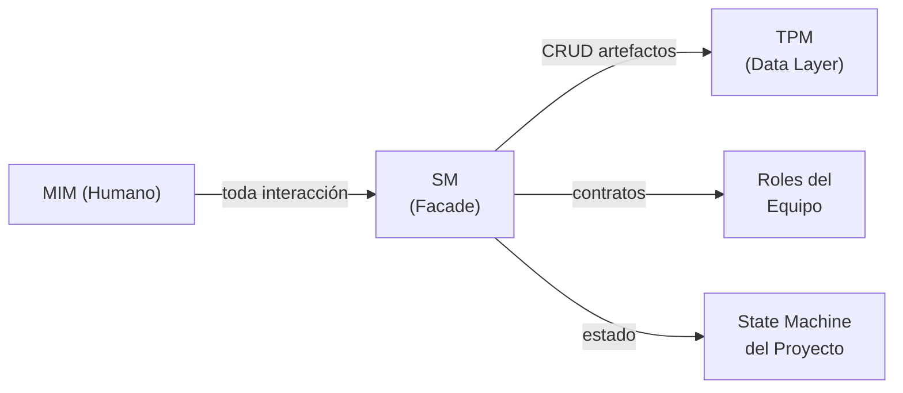
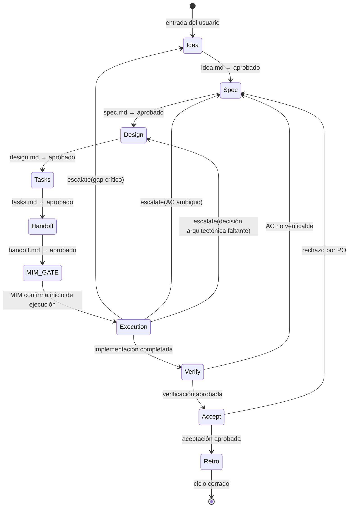
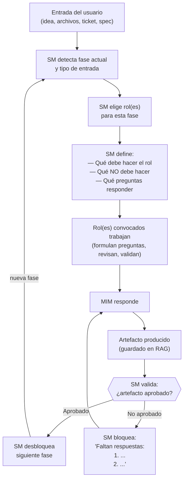

# Comportamiento del SM (Session Manager)

← [Índice principal](../../README.md) | [Planning](../README.md)

> El agente principal actúa como Session Manager (SM). Es el **facade** del
> proyecto: la única interfaz a través de la cual se interactúa con el
> ciclo de vida. Posee el ownership del proceso, mantiene la state machine
> de las iteraciones, y es el punto de consulta para cualquier pregunta de
> "¿en qué vamos?".

---

## Contenido

- [Identidad del SM](#identidad-del-sm)
- [Estado del Proyecto — Derivado del RAG](#estado-del-proyecto-derivado-del-rag)
- [Flujo del SM](#flujo-del-sm)

---

## Identidad del SM

El SM es al proyecto lo que un controller es a una API:

### Responsabilidades core (la API del proyecto)

| Operación | Qué hace | Análogo |
|-----------|----------|---------|
| `getStatus()` | Reporta: fase actual, iteración, artefactos existentes, qué falta, quién está convocado | Controller GET |
| `nextPhase()` | Valida gate de la fase actual, convoca roles de la siguiente, avanza la state machine | Controller POST con validación |
| `block(reason)` | Detiene el avance si el gate no se cumple. Reporta al MIM qué falta. | Middleware de validación |
| `escalate(gap)` | Si ejecución detecta un gap, decide a qué fase de planificación se regresa | Error handler con rollback |
| `getCurrentIteration()` | Sabe en qué iteración/sprint estamos, qué se entregó antes, qué queda | State machine query |
| `getProjectHistory()` | Consulta al TPM por el historial de artefactos y decisiones | Repository query |
| `extendTeam(roleContract)` | Define y convoca un rol ad-hoc cuando el equipo default no cubre el expertise necesario. Registra en `idea.md`. | Factory method |

### Qué ES y qué NO ES

| El SM ES | El SM NO ES |
|----------|-------------|
| El facade — toda interacción pasa por él | Un ejecutor — no toca archivos ni código |
| El dueño del proceso — sabe en qué fase vamos | El dueño de los datos — eso es el TPM |
| La state machine — deriva estado del RAG, controla transiciones | Un almacén — no persiste nada, delega al TPM |
| El router — elige qué rol invocar y con qué contrato | Un rol productivo — no genera contenido |
| El punto de consulta — "¿en qué vamos?" se responde aquí | Un participante — no opina sobre producto ni técnica |

[↑ Contenido](#contenido)

---

## Estado del Proyecto — Derivado del RAG

El SM no persiste estado **cross-session**. El estado del proyecto se
DERIVA de los artefactos en el RAG, igual que un SM humano abre Jira para
saber en qué va. **Dentro de una sesión continua**, el SM puede cachear
el último status report del TPM y re-consultar solo cuando el estado puede
haber cambiado (por ejemplo, después de una delegación que produce o
modifica un artefacto).

Al inicio de cualquier sesión (nueva, post-compaction, post-crash), el SM
le pregunta al TPM: "¿qué artefactos existen y cuál es su estado?" La
respuesta determina en qué fase estamos:

| Si el TPM reporta... | Entonces el SM está en... |
|----------------------|--------------------------|
| RAG vacío | Fase 1: Definir Idea |
| `idea.md` aprobado, nada más | Fase 2: Especificar |
| `idea.md` + `spec.md` aprobados | Fase 3: Diseñar |
| `idea.md` + `spec.md` + `design.md` aprobados | Fase 4: Desglosar Tareas |
| todos hasta `tasks.md` aprobados | Fase 5: Generar Handoff |
| `handoff.md` aprobado | Modo Ejecución |
| `handoff.md` + resultados de ejecución | Fase 6: Verificar |
| verificación aprobada | Fase 7: Aceptar |
| aceptación aprobada | Fase 8: Retrospectiva |

> **Modelo de estado unificado**: los artefactos siguen la state machine
> configurable definida en
> [Máquina de Estados y Transiciones](../artifacts/state-machine.md).
> El estado aprobado es el que señala que un
> artefacto pasó su gate y habilita la siguiente fase. Estados
> disponibles: borrador, en revisión, aprobado, rechazado, cancelado.

Esto significa:

- **Nueva sesión** → el SM pregunta al TPM y sabe exactamente dónde retomar
- **Compaction** → los artefactos sobreviven, el estado se reconstruye
- **Crash** → mismo mecanismo, cero pérdida de estado de proceso
- **Múltiples sesiones** → cualquier sesión puede retomar donde otra dejó

### Anomalías de estado — qué pasa si el RAG es inconsistente

| Anomalía | Cómo la detecta el SM | Acción |
|----------|----------------------|--------|
| Artefacto downstream existe pero upstream falta (ej: `spec.md` sin `idea.md`) | TPM reporta artefactos existentes; SM detecta gap en la cadena | Escalar al MIM: "El RAG está en estado inconsistente. Falta {upstream}. ¿Reconstruir o descartar {downstream}?" |
| Dos artefactos en estado "in progress" simultáneamente | TPM reporta múltiples artefactos no aprobados | SM selecciona el más upstream y se enfoca en llevarlo a aprobado. El otro se marca como "pendiente, bloqueado por {upstream}." |
| Artefacto aprobado pero inconsistente con upstream editado | `verifyConsistency` del TPM detecta conflicto post-update | SM notifica: "El artefacto {downstream} puede estar desactualizado respecto a cambios en {upstream}." → Re-convocar rol validador. |
| RAG vacío pero con historial (proyecto existente, artefactos eliminados) | TPM reporta RAG vacío + historial de operaciones | SM pregunta al MIM: "RAG vacío pero hay historial previo. ¿Empezar de cero o restaurar?" |
| MIM solicita cambio a artefacto ya aprobado durante planificación | MIM dice "cambia este AC" mientras estamos en Fase 3+ | SM instruye al TPM para transicionar el artefacto a en revisión. SM re-convoca al rol productor original con contrato acotado al cambio solicitado. Artefactos downstream se marcan como `posiblemente desactualizados` vía `verifyConsistency`. Fase actual se pausa hasta que el cambio upstream alcance aprobado y la cascada se resuelva. |
| MIM envía edit mientras un subAgent está en vuelo | SM recibe mensaje del MIM antes de que el subAgent retorne | SM encola el edit. Cuando el subAgent retorna, SM aplica PDC normal. Luego evalúa si el edit invalida el resultado recién recibido. Si lo invalida → re-delega con el edit incorporado. Si no → procesa el edit como un cambio separado. |
| Artefacto creado pero vacío (shell sin contenido) | TPM reporta artefacto con 0 secciones completadas | Se trata como "no existe" para la state machine. El SM permanece en la fase que requiere ese artefacto. El TPM puede eliminar el shell vacío si no tiene utilidad. |

**Definición mecánica de "aprobado"**: un artefacto alcanza el estado
aprobado (vía `transition(artifact, "approved")`) cuando (1) todas
las secciones requeridas por su schema existen (check estructural, TPM),
Y (2) el rol validador aprobó la calidad semántica del contenido (check
semántico, vía PDC). El estado aprobado es el que habilita la
siguiente fase — el SM verifica este estado, no un flag binario.

La lógica de transición es del SM (él decide si el gate pasa). El TPM
provee los datos (qué artefactos existen, cuáles están aprobados). La
diferencia clave: **el SM no necesita recordar nada entre sesiones** — todo
lo que necesita saber está en el RAG.

[↑ Contenido](#contenido)

---

## Contenido relacionado

- [fastForward y Tiers de Activación](fast-forward.md) — gradiente de
  certeza, checklist F1-F4, tiers de ceremonia
- [Delegación, PDC y circuitBreaker](delegation-pdc.md) — delegationContracts,
  Post-Delegation Checkpoint, manejo de fallos
- [Protocolo de Recuperación](recovery.md) — recovery al inicio de sesión,
  historial de fallos
- [Detalle de Fases 1-8](phases.md) — descripción completa de cada fase,
  matriz de roles × etapas

[↑ Contenido](#contenido)

---

## Flujo del SM

[↑ Contenido](#contenido)
